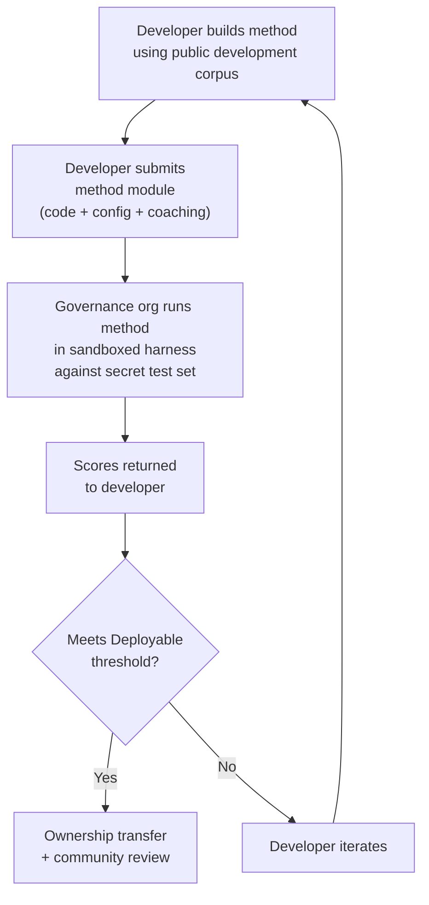

# Benchmark Specification

> **Executive Summary.** This is the single source of truth for the Rosetta evaluation ecosystem. It defines the corpus format (§2), run card schema (§3), automated metrics and composite scoring (§4), quality tiers (§5), benchmark protocol (§6), human validation requirements (§7), sovereignty mechanisms (§8), leaderboard and submission model (§9), cost framework (§10), and extensibility to new languages (§11). All other documentation — harness docs, arena pages, API specs — references this document. When they conflict, this document is authoritative.
>
> Last updated: 2026-05-25

---

## 1. Principles

### 1.1 Automated Metrics Are Proxies

Every metric defined in this document is machine-computed. chrF++, FST acceptance, morphological accuracy, semantic similarity — all of them are automated proxies for translation quality. They are useful for rapid iteration, systematic comparison, and detecting regressions. They are **not substitutes for human judgment**.

The evaluation hierarchy:

```
Automated metrics (run cards, benchmarks)
    ↓ proxy for
Human review (bilingual speakers validate output)
    ↓ proxy for
Actual utility (does this help a language community?)
```

No automated score, no matter how high, can replace a fluent speaker reading the output and confirming it is correct, natural, and culturally appropriate. The quality tiers defined in §5 are heuristic labels on automated composite scores — useful for tracking progress, but never sufficient on their own.

### 1.2 Methods, Not Models

We benchmark **methods**, not models. A model is one component. A method is the full recipe: model selection, prompt design, tool usage, pre/post-processing, coaching data, retry strategies, everything. Two teams using the same model with different methods will get different scores. That's the point.

### 1.3 Reproducibility

Every benchmark result must be reproducible. The run card (§3) captures the complete configuration of an experiment. The fingerprint (§3.5) identifies the experimental setup. The run card hash (§3.6) verifies the integrity of the result. Anyone with the same method, corpus, and configuration should achieve scores within ±2% (accounting for LLM sampling non-determinism at temperature > 0).

---

## 2. Corpus Schema

A corpus is a curated set of parallel text pairs with structured metadata. It is the ground truth against which all methods are measured.

### 2.1 Dataset Envelope

The top-level structure of a corpus file:

```json
{
  "dataset": {
    "id": "edtekla-dev-v1",
    "version": "1.0",
    "language_pair": "EN→CRK",
    "source_language": "en",
    "target_language": "crk",
    "created": "2026-05-01",
    "license": "CC-BY-NC-SA-4.0",
    "provenance": ["gold_standard", "textbook"]
  },
  "entries": [ ... ]
}
```

| Field | Type | Required | Description |
|-------|------|----------|-------------|
| `id` | string | ✅ | Unique dataset identifier, used in run cards and leaderboard |
| `version` | string | ✅ | Semantic version. Incrementing invalidates prior run card comparisons |
| `language_pair` | string | ✅ | Display label (e.g., `EN→CRK`) |
| `source_language` | string | ✅ | BCP 47 source language code |
| `target_language` | string | ✅ | BCP 47 target language code |
| `created` | string | ✅ | ISO 8601 creation date |
| `license` | string | ✅ | SPDX license identifier |
| `provenance` | string[] | ✅ | List of provenance tags used across entries |

### 2.2 Entry Schema

Each entry in the corpus represents one translation challenge:

```json
{
  "id": 42,
  "source": "I see the dog",
  "reference": "niwâpamâw atim",
  "segment": "gold_standard",
  "difficulty": 2,
  "provenance": "gold_standard",
  "register": "conversational",
  "context": "declaration",
  "morphological_analysis": "ni-wâpam-âw atim | 1sg-see.TA-3sg.DIR dog.AN",
  "notes": "Animate noun (atim); direct form because speaker is proximate",
  "variant_class": "simple-ta-direct"
}
```

| Field | Type | Required | Description |
|-------|------|----------|-------------|
| `id` | integer | ✅ | Unique identifier within the corpus |
| `source` | string | ✅ | Source text in the source language |
| `reference` | string | ✅ | Gold-standard reference translation in the target language |
| `segment` | string | ✅ | Corpus partition: `gold_standard`, `held_out`, `development`, or `diagnostic` |
| `difficulty` | integer | ✅ | Difficulty rating 1–5 (see §2.4) |
| `provenance` | string | ✅ | Origin of this entry (see §2.5) |
| `register` | string | ✅ | Register/formality level (see §2.6) |
| `context` | string | ✅ | Communicative function (see §2.6) |
| `morphological_analysis` | string | ❌ | Gold-standard morphological breakdown |
| `notes` | string | ❌ | Translator notes, dialectal variants, ambiguity flags |
| `variant_class` | string | ❌ | Class label grouping acceptable translation variants |

> **Implementation note (2026-05):** The current harness uses `index` for `id`, `source_text` for `source`, and `target_expected` for `reference`. The harness also uses three string difficulty tiers (`easy`, `medium`, `hard`) instead of the five integer tiers defined here. These will be aligned to this spec in a future harness version. The mapping is:
>
> | This spec | Current harness |
> |-----------|----------------|
> | `id` | `index` |
> | `source` | `source_text` |
> | `reference` | `target_expected` |
> | `difficulty` 1–2 | `easy` |
> | `difficulty` 3 | `medium` |
> | `difficulty` 4–5 | `hard` |

### 2.3 Corpus Segments

The corpus is divided into segments with different access levels:

| Segment | Purpose | Access | Minimum Size |
|---------|---------|--------|-------------|
| `development` | Method development and iteration. Developers use these freely. | **Public** | 30 entries |
| `diagnostic` | Targeted tests for specific linguistic phenomena. | **Public** | 10 entries |
| `gold_standard` | Official benchmark evaluation. Leaderboard scores come from here. | **Secret** — held by governance org | 50 entries |
| `held_out` | Reserved for future evaluation. Never used until activated. | **Secret** — held by governance org | 10 entries |

The `gold_standard` and `held_out` segments are fully secret. Both the source sentences and the reference translations are held on governance-controlled infrastructure. Method developers never see the questions or the answers. See §8 for the sovereignty mechanism.

### 2.4 Difficulty Tiers

| Tier | Description | Examples |
|------|-------------|----------|
| 1 — Basic vocabulary | Single words, common greetings, numbers | "hello" → "tânisi", "dog" → "atim" |
| 2 — Simple sentences | Subject-verb or SVO, present tense | "I see the dog" → "niwâpamâw atim" |
| 3 — Moderate complexity | Past/future tense, possessives, animacy | "I saw his dog yesterday" |
| 4 — Complex morphology | Obviation, passive voice, conjunct order, relative clauses | "the woman whose son went to the store" |
| 5 — Advanced | Multi-clause, formal register, ceremonial, idiomatic | Full paragraph with register-appropriate tone |

A well-constructed corpus should include entries across all five difficulty tiers, weighted toward tiers 2–4 where most real-world translation challenges fall.

### 2.5 Provenance Tags

Every entry must indicate its origin:

| Tag | Meaning |
|-----|---------|
| `gold_standard` | Verified by fluent speakers |
| `textbook` | From published educational materials |
| `elicited` | Produced through structured elicitation sessions |
| `corpus` | Extracted from a parallel corpus |

### 2.6 Register and Context

**Register** describes the formality and social context:

| Register | Description |
|----------|-------------|
| `conversational` | Everyday speech between equals |
| `formal` | Official or institutional language |
| `technical` | Domain-specific vocabulary |
| `ceremonial` | Traditional or sacred language use |
| `educational` | Language teaching materials |

**Context** describes the communicative function:

| Context | Description |
|---------|-------------|
| `greeting` | Social greeting or leave-taking |
| `declaration` | Statement of fact |
| `question` | Interrogative |
| `instruction` | Command or directive |
| `narrative` | Storytelling or description |
| `label` | UI label, button text, or heading |
| `error` | Error message or warning |

---

## 3. Run Card Schema

The run card is the atomic unit of evaluation. It is a self-contained JSON document that records the complete configuration and results of a single evaluation run: one method, one model, one configuration, one dataset.

Every run card captures three dimensions:
- **Quality** — how good are the translations?
- **Cost** — how much did it cost to produce them?
- **Speed** — how long did it take?

### 3.1 Top-Level Fields

| Field | Type | Description |
|-------|------|-------------|
| `run_id` | string | UUID v4 generated at the start of the run |
| `harness_version` | string | Semantic version of the harness (e.g., `2.0`) |
| `timestamp` | string | ISO 8601 UTC timestamp when the run started |
| `elapsed_seconds` | number | Wall-clock duration of the entire run |

### 3.2 Method Configuration

These fields define the experimental setup — what was tested and how.

| Field | Type | Required | Description |
|-------|------|----------|-------------|
| `model_slug` | string | ✅ | Model identifier (e.g., `google/gemini-2.5-flash`) |
| `model_id` | string | ❌ | Resolved model identifier returned by the API |
| `condition` | string | ✅ | Experiment label (e.g., `baseline`, `coached-v3`, `few-shot`) |
| `temperature` | number | ✅ | Sampling temperature |
| `system_prompt_sha256` | string | ✅ | SHA-256 hash of the full system prompt |
| `system_prompt_used` | string | ✅ | The full system prompt text |
| `coaching_data_sha256` | string | ❌ | SHA-256 hash of coaching data file, if used |
| `fst_version` | string | ❌ | Version of FST analyzer, if used |
| `tools_enabled` | string[] | ❌ | List of tools available to the method |
| `batch_size` | number | ❌ | Entries per concurrent API batch |
| `max_retries` | number | ❌ | Maximum retries for FST rejection, if applicable |

### 3.3 Dataset Reference

| Field | Type | Description |
|-------|------|-------------|
| `dataset.id` | string | Dataset identifier |
| `dataset.version` | string | Dataset version |
| `dataset.language_pair` | string | Display label |
| `dataset.sha256` | string | SHA-256 hash of the dataset file contents |
| `dataset.entry_count` | number | Number of entries evaluated |

The dataset SHA-256 pins the result to a specific version of the data. If the dataset changes, old run cards are not comparable.

### 3.4 Scores (Quality)

Aggregate metrics for the entire run. All quality metrics are **automated** — see §1.1.

| Field | Type | Description |
|-------|------|-------------|
| `scores.total` | number | Total entries evaluated |
| `scores.exact_matches` | number | Entries where output exactly matched reference |
| `scores.exact_match_rate` | number | 0.0–1.0 |
| `scores.equivalent_matches` | number | Entries matching an acceptable variant |
| `scores.equivalent_match_rate` | number | 0.0–1.0 |
| `scores.fst_accepted` | number | Entries accepted by FST analyzer |
| `scores.fst_acceptance_rate` | number | 0.0–1.0, `null` if no FST configured |
| `scores.morphological_accuracy` | number | 0.0–1.0, `null` if no gold-standard analysis |
| `scores.chrf_plus_plus` | number | Corpus-level chrF++ score (0–100) |
| `scores.semantic_score` | number | Embedding-based semantic similarity (0.0–1.0) |
| `scores.composite` | number | Weighted composite score (0.0–1.0). See §4.2 |
| `scores.errors` | number | Entries that failed (API error, timeout, etc.) |
| `scores.by_difficulty` | object | Scores broken down by difficulty tier |
| `scores.by_provenance` | object | Scores broken down by provenance tag |

### 3.5 Totals (Cost)

| Field | Type | Description |
|-------|------|-------------|
| `totals.prompt_tokens` | number | Total input tokens across all API calls |
| `totals.completion_tokens` | number | Total output tokens |
| `totals.reasoning_tokens` | number | Tokens used for chain-of-thought (0 for most models) |
| `totals.cached_tokens` | number | Tokens served from provider's prompt cache |
| `totals.total_cost_usd` | number | Total cost in USD |
| `totals.cost_per_entry_usd` | number | `total_cost_usd / entry_count` |

### 3.6 Timing (Speed)

| Field | Type | Description |
|-------|------|-------------|
| `elapsed_seconds` | number | Wall-clock duration of the full run (top-level) |
| `scores.avg_latency_seconds` | number | Mean response time per entry |
| `scores.median_latency_seconds` | number | Median response time per entry |
| `scores.p95_latency_seconds` | number | 95th percentile response time per entry |

### 3.7 Per-Entry Results

Each entry in the `results[]` array records one translation:

| Field | Type | Description |
|-------|------|-------------|
| `entry_id` | number | Matches `entries[].id` in the corpus |
| `source` | string | Source text that was translated |
| `reference` | string | Gold-standard reference |
| `predicted` | string | Method's actual output |
| `exact_match` | boolean | Whether output exactly matched reference |
| `entry_chrf` | number | Sentence-level chrF++ (0–100) |
| `fst_accepted` | boolean \| null | FST acceptance, `null` if no analyzer |
| `fst_analysis` | string[] | FST analysis strings for the output |
| `difficulty` | integer | Difficulty tier from the corpus |
| `provenance` | string | Provenance tag from the corpus |
| `latency_seconds` | number | Response time for this entry |
| `usage` | object | `{ prompt_tokens, completion_tokens, reasoning_tokens }` |
| `error` | string \| null | Error message if this entry failed |


### 3.8 Fingerprint

A reproducibility identifier. Two runs with identical fingerprints used the same experimental setup.

The fingerprint is the SHA-256 hash of the sorted concatenation of:
- `dataset.sha256`
- `model_slug`
- `condition`
- `system_prompt_sha256`
- `temperature`
- `harness_version`

Two runs with identical fingerprints should produce comparable results. Differences are due to API non-determinism (temperature > 0) or provider-side model updates.

### 3.9 Run Card Hash

The SHA-256 hash of the entire run card JSON (with the `run_card_hash` field itself set to `""` during hashing). This is the tamper-detection seal. If any field changes, the hash breaks.

---

## 4. Automated Metrics

All metrics in this section are machine-computed. See §1.1.

### 4.1 Metric Definitions

| Metric | Status | What It Measures | Range |
|--------|--------|-----------------|-------|
| **chrF++** | ✅ Implemented | Character n-gram F-score. Operates at the character level, making it more robust than word-level metrics (BLEU) for morphologically rich languages where words are long and highly inflected. Computed by sacrebleu. | 0–100 (native scale). Divided by 100 when used in composite. |
| **FST acceptance rate** | ✅ Implemented | Fraction of predicted words accepted by the morphological analyzer (GiellaLT HFST) as valid forms in the target language. A word the FST accepts is a real, structurally valid word — not a hallucination. | 0.0–1.0 |
| **Exact match** | ✅ Implemented | Fraction of predictions that exactly match the reference after Unicode normalization. Strict but unambiguous — useful as a ceiling check. | 0.0–1.0 |
| **Morphological accuracy** | 🔲 Planned | For entries with gold-standard morphological analysis: fraction of morphemes correctly generated. More granular than FST acceptance — a word can be FST-valid but have the wrong morpheme structure (right root, wrong tense). | 0.0–1.0 |
| **Equivalent match** | 🔲 Planned | Fraction matching an acceptable variant of the reference. Accounts for word order variation, dialectal differences, and orthographic conventions. Requires `variant_class` definitions in the corpus (§2.2). | 0.0–1.0 |
| **Semantic score** | 🔲 Planned | Embedding-based semantic similarity between prediction and reference. Captures meaning preservation regardless of surface form. Uses multilingual sentence embeddings (e.g., LaBSE, SONAR). | 0.0–1.0 |

### 4.2 Composite Score

The composite score is a weighted average of all *available* metrics:

```
composite = Σ (weight_i × metric_i)   for all available metrics
             ─────────────────────
             Σ weight_i              (renormalized to sum to 1.0)
```

When a metric is unavailable (no FST configured, no variant classes defined, no embedding model), its weight is redistributed proportionally across the remaining metrics. This means the composite is always comparable within a language — it uses whatever metrics are available for that language and normalizes accordingly.

**For languages with FST coverage (target weights):**

| Metric | Weight | Rationale |
|--------|--------|-----------|
| FST acceptance rate | 0.30 | **Highest weight.** For polysynthetic languages, this is the strongest signal. If the FST rejects a word, it's not a valid form in the language — regardless of what other metrics say. This is a binary, structurally grounded check that no surface-level metric can replace. |
| Morphological accuracy | 0.20 | A word can be FST-valid but morphologically wrong (right root, wrong inflection). This metric catches that. Together with FST acceptance, morphological metrics carry **50%** of the composite — reflecting the primacy of structural correctness for morphologically rich languages. |
| chrF++ | 0.20 | Character n-gram overlap is the best surface-level proxy for translation quality. It catches partial matches (correct root, wrong suffix) that exact match misses, and handles agglutinative morphology better than word-level metrics. |
| Semantic score | 0.15 | Captures meaning preservation when surface form diverges. Important for catching translations that are morphologically valid but semantically wrong ("I see the dog" translated as "I see the cat" — FST accepts both). |
| Equivalent match | 0.10 | Rewards methods that produce acceptable variants, not just the one reference translation. Important for languages with flexible word order or dialectal variation. |
| Exact match | 0.05 | **Lowest weight.** Exact match is too strict for most polysynthetic languages — multiple correct translations exist for any given input. Kept at 5% as a ceiling check, not a quality signal. |

**For languages without FST coverage (target weights):**

| Metric | Weight | Rationale |
|--------|--------|-----------|
| Semantic score | 0.35 | **Highest weight.** Without morphological validation, meaning preservation is the strongest available signal. |
| chrF++ | 0.35 | Without FST, character-level overlap becomes the primary surface-level check. |
| Equivalent match | 0.15 | Variant matching provides structured quality assessment without requiring morphological tools. |
| Exact match | 0.15 | Without FST, exact match carries more weight because there's no other structural validation. |

> **Why not BLEU?** BLEU operates at the word level and penalizes morphological variation. For polysynthetic languages, a single word can be an entire clause — BLEU would treat minor inflectional differences as complete misses. chrF++ handles this better by operating at the character level. BLEU is excluded from both weight tables.


### 4.3 Cost-Adjusted Score

For methods using paid APIs, we also report:

```
cost_adjusted = composite / log2(1 + cost_per_entry_usd × 1000)
```

This is a **secondary ranking** — the primary leaderboard ranks by composite score. Cost-adjusted score rewards methods that achieve good scores efficiently.

---

## 5. Quality Tiers

These tiers are heuristic labels on automated composite scores. They describe what the scores tend to mean in practice, based on human review of outputs at each level. **They are not validated quality judgments** — only human review (§6) can confirm actual usability.

| Tier | Composite | What a speaker typically sees at this level |
|------|-----------|-------------------------------------------|
| **Baseline** | 0.00–0.30 | Raw LLM output with no language-specific support. Morphology is mostly hallucinated. |
| **Emerging** | 0.30–0.50 | Some correct patterns appearing. Coaching is helping, but output is not reliable. |
| **Functional** | 0.50–0.70 | Output is recognizable to a speaker. Major grammatical categories usually correct. Frequent morphological errors. |
| **Deployable** | 0.70–0.85 | Suitable for draft translation with human review. Most morphology is correct. |
| **Fluent** | 0.85–1.00 | Approaching competent human translation. Errors are rare and minor. |

These tiers are provisional. They will be recalibrated as human validation data accumulates and we learn where the actual "a speaker finds this useful" threshold falls for each language. The tier boundaries may differ across languages.

No method can claim **Deployable** or above without community review confirming that bilingual speakers agree the output is usable.

---

## 6. Benchmark Protocol

A **benchmark** is the systematic production of run cards across a declared parameter space on a given dataset. It is not a single run — it is a structured exploration of how different configurations perform.

### 6.1 What a Benchmark Produces

A benchmark produces a **matrix of run cards** — one for each combination of parameter values. The matrix enables multifaceted comparison across:

- **Quality** — composite score, individual metric breakdowns
- **Cost** — total and per-entry cost for each configuration
- **Speed** — wall-clock time and per-entry latency

There is no single "benchmark score." The benchmark is the full matrix. Different stakeholders will care about different facets: a researcher optimizes for composite score, a deployment engineer optimizes for cost-per-entry, a community reviews quality.

### 6.2 Parameter Space

A benchmark declares which parameters are permuted:

| Axis | Typical Values | Purpose |
|------|---------------|---------|
| `model` | 4–12 models (frontier + mid-tier + budget) | How much does model capability matter? |
| `temperature` | 0.0, 0.3, 0.7 | Does sampling randomness help or hurt? |
| `prompt_version` | 2–3 prompt strategies | How sensitive is the method to prompt design? |
| `coaching_config` | with/without coaching data | Does injecting linguistic knowledge improve output? |
| `tool_config` | with/without FST, with/without dictionary | Do linguistic tools improve output? |

The full permutation space:
```
runs = |models| × |temperatures| × |prompts| × |coaching| × |tools|
```

A typical initial benchmark: 12 models × 3 temperatures × 2 prompts × 2 coaching = 144 runs.

### 6.3 Baseline vs. Method Evaluation

A benchmark serves two distinct purposes:

**Baselining** — mapping the landscape with naive approaches. "What can existing models do for this language without any language-specific engineering?" This establishes the bar. The baseline matrix tells you: which models hallucinate least, which temperatures produce the most consistent output, whether coaching data helps at all, where all models fail uniformly (which reveals hard linguistic problems).

**Method evaluation** — testing a specific engineered method. "Does my FST-gated coached pipeline beat the baselines?" The method's run card is compared against the baseline matrix. A method is interesting when it outperforms the best baseline — when engineering adds value over naive model calls.

Both activities produce run cards with the same schema. The distinction is in the intent and the parameter space: baselines permute across models and configs; method evaluation tests one method against the best configurations.

### 6.4 Dev vs. Gold-Standard Evaluation

Method developers iterate freely against `development` and `diagnostic` corpus segments. This is informal — no limits, no submissions, no governance involvement. The developer is learning what works.

Official leaderboard scores come from `gold_standard` evaluation only. This is formal:
1. Developer submits their complete, runnable method (code + config + coaching data)
2. Governance org runs it in a sandboxed harness against the secret test set
3. Only scores come back

See §8 for the full sovereignty mechanism.

---

## 7. Human Validation

Automated metrics are proxies. Human validation is the ground truth.

### 7.1 What Human Review Catches That Metrics Miss

- **Morphologically valid but semantically wrong** — the FST accepts the word, chrF++ is high, but the translation means something different
- **Culturally inappropriate** — the translation is technically correct but uses register or framing that a community would reject
- **Hallucinated plausibility** — the output looks like the target language to a non-speaker but is gibberish to a fluent speaker
- **Acceptable but unmarked variation** — the output is correct but the automated metrics mark it wrong because it uses a dialectal variant not in the reference

### 7.2 The Validation Gate

No method can advance from **Functional** to **Deployable** tier without human validation confirming that bilingual speakers agree the output is usable. This is not a formality — it is the point. The automated metrics exist to reduce the volume of output that needs human review. They cannot replace it.

### 7.3 Community Review Protocol

> 🔲 **Planned**: The community review interface is not yet live. This section describes the intended process.

1. A method reaches the Deployable threshold on automated metrics
2. A sample of outputs (stratified by difficulty tier) is presented to bilingual speakers
3. Speakers rate each translation on a scale: **reject**, **gist** (meaning is clear but phrasing is wrong), **acceptable** (correct with minor issues), **excellent** (indistinguishable from human translation)
4. The governance org reviews the aggregate ratings
5. If the community accepts the method, it proceeds to ownership transfer and deployment

---

## 8. Sovereignty

Evaluation datasets contain curated linguistic knowledge that belongs to the language community. This section defines the technical and legal framework for protecting that data.

### 8.1 The Problem

Conventional benchmarks publish test sets openly. Once published, the data cannot be un-published. For Indigenous and minority language communities, this creates an extractive dynamic — linguistic data is used without ongoing consent. Following Dhein's pragmatic view of biodata sovereignty, we treat linguistic data as a "mercurial resource with unknowable potential" requiring dynamic, relational governance.

### 8.2 Sandboxed Execution

The primary enforcement mechanism: the developer hands over their method module, the governance org runs it against the fully secret test set on their own infrastructure, and only scores are returned. The developer never sees the source sentences or the reference translations.



The flow:
1. **Development corpus is public.** No restrictions on `development` and `diagnostic` segments.
2. **Gold-standard test set is fully secret.** Both source sentences and reference translations live on governance-controlled infrastructure.
3. **To get an official score, you hand over your method.** The governance org runs it in a sandbox. Only scores come back.
4. **The governance org already has the method.** The submission IS the method code. If it reaches the Deployable threshold, ownership transfer is already in progress.
5. **Submission requires agreement to terms.** Including the ownership transfer clause (§8.3).
6. **The governance org controls access entirely.** They can refuse or revoke evaluation at any time. Dynamic consent.
7. **Encryption at rest is defense-in-depth.** Primary enforcement is architectural.

### 8.3 Ownership Transfer

Methods that achieve a composite score at or above the Deployable threshold (0.70) against gold-standard evaluation, **and** that pass human validation (§7), are subject to ownership transfer.

**The developer retains:**
- Attribution and credit (name stays on the leaderboard)
- Right to publish about the method
- Right to use the method for other language pairs

**The governance org gains:**
- Right to use, modify, distribute, and monetize the method for their language
- Right to sublicense
- Physical possession of the method code (already held from evaluation submission)

### 8.4 Governance Organization Requirements

To serve as key custodian for a language benchmark:

1. **Represent the language community** — demonstrable relationship with speakers and cultural authorities
2. **Capacity for key management** — technical ability to manage cryptographic keys
3. **Commit to evaluation availability** — the benchmark must remain evaluable
4. **Publish terms of participation** — clear documentation of what developers agree to
5. **Operate under recognized sovereignty principles** — OCAP®, CARE, or equivalent

### 8.5 OCAP® and CARE Alignment

| Principle | Implementation |
|-----------|---------------|
| **Ownership** (OCAP) | Linguistic data belongs to the community. Governance org controls the evaluation infrastructure. |
| **Control** (OCAP) | Governance org controls evaluation via sandboxed execution. They decide who submits and on what terms. |
| **Access** (OCAP) | Community has unrestricted access to their own data, results, and methods developed against it. |
| **Possession** (OCAP) | Test set never leaves governance infrastructure. Encryption at rest as backup. |
| **Collective Benefit** (CARE) | Ownership transfer ensures methods benefit the community. Revenue model (90/10) sustains this. |
| **Authority to Control** (CARE) | Sandboxed execution is the technical implementation. |
| **Responsibility** (CARE) | Developers accept responsibility through terms of participation. |
| **Ethics** (CARE) | Community rights over researcher convenience. |

---

## 9. Leaderboard & Submission

### 9.1 Submission Requirements

A valid leaderboard submission must include:

1. A complete run card (§3) with all required fields
2. The method code — fully runnable, with installation instructions
3. All dependencies — coaching data, dictionaries, FST binaries, prompts
4. A cost report
5. A README describing the method's approach and limitations

### 9.2 Legitimacy Criteria

1. **No training on evaluation data.** Methods must not have been exposed to `gold_standard` or `held_out` entries. (Architecturally enforced — you can't train on data you've never seen.)
2. **Declare development data usage.** Using `development` entries for few-shot prompting is allowed but must be declared.
3. **Reproducibility.** Governance org must be able to re-run and achieve scores within ±2%.
4. **Generalization.** Methods must work on unseen entries, not just memorized examples.

### 9.3 Anti-Gaming

1. **Variant-class linting** — suspiciously perfect performance on entries with known variants is flagged
2. **Corpus rotation** — governance org can rotate entries between segments without notice
3. **Community review** — the human validation gate (§7) catches methods that game metrics but produce bad output

### 9.4 Verification Tiers

Verification tiers describe **who validated the result** — orthogonal to quality tiers (§5), which describe what the automated score means.

| Tier | Meaning | How Achieved |
|------|---------|--------------|
| **Self-benchmarked** | Developer ran the harness and submitted the run card | PR or `--submit` flag against `development` segment |
| **GDS Verified** | Maintainers reproduced the result independently | Submit method as installable plugin; maintainers re-run |
| **Community Validated** | Governance org ran against `gold_standard` + community review | Submit method code to governance org (§8.2); pass human validation (§7) |

A method can be Self-benchmarked at a Functional quality tier. Quality tier and verification tier are independent axes on the leaderboard.

### 9.5 Layered Submission Model

The submission mechanism depends on which corpus segment you're evaluating against:

| Segment | Submission Path | Verification | Method Code Required? |
|---------|----------------|-------------|----------------------|
| `development` | Self-serve: run harness, submit run card via PR or API | Self-benchmarked | No — you keep your code |
| `development` | Maintainer re-run: submit method as plugin | GDS Verified | Yes — method must be installable |
| `gold_standard` | Submit method to governance org; they run in sandbox | Community Validated | Yes — method is submitted and held |

The self-serve path (development segment) has no restrictions. The sovereign path (gold-standard segment) requires full method submission because (a) the developer never sees the test set, and (b) methods that reach Deployable are subject to ownership transfer (§8.3).

### 9.6 Method Classes

Methods are classified by type. The canonical enum is defined in the harness codebase (`VALID_METHOD_CLASSES` in `config.py`):

| Class | Description |
|-------|-------------|
| `raw-llm` | Direct LLM call with no language-specific engineering |
| `coached-llm` | LLM with coaching data (examples, grammar notes, dictionary entries) |
| `pipeline` | Multi-step pipeline (e.g., translate → FST validate → retry) |
| `custom-plugin` | Custom `TranslationProcess` plugin |
| `api` | External translation API (Google Translate, DeepL, etc.) |
| `human` | Human translator baseline |

### 9.7 Leaderboard Fields

| Field | Description |
|-------|-------------|
| Rank | Position by composite score |
| Method name | Developer-chosen identifier |
| Composite score | Weighted average of available metrics (§4.2) |
| chrF++ | Character n-gram score (0–100) |
| FST acceptance | Morphological validity rate (0.0–1.0) |
| Exact match | Strict match rate (0.0–1.0) |
| Semantic score | Meaning preservation (0.0–1.0) — 🔲 when available |
| Cost per entry | USD per corpus entry |
| Speed | Avg latency per entry (seconds) |
| Cost-adjusted score | Secondary ranking (§4.3) |
| Method class | From §9.6 enum |
| Model | LLM/engine used |
| Quality tier | Automated composite range (§5) |
| Verification tier | Who validated (§9.4) |
| Date | When evaluated |


---

## 10. Cost Framework

### 10.1 Per-Run Cost

```
run_cost = entries × api_calls_per_entry × cost_per_api_call
```

Typical per-run costs for a 150-entry corpus:

| Method | Model | Estimated Cost |
|--------|-------|---------------|
| Naive LLM | Gemini 2.5 Flash | $0.15–0.30 |
| Coached LLM | Gemini 2.5 Flash | $0.30–0.60 |
| FST-gated (3 retries) | Gemini 2.5 Flash | $0.45–1.20 |
| Naive LLM | Claude Sonnet 4 | $0.45–0.90 |
| Coached LLM | GPT-4.1 | $0.60–1.50 |

### 10.2 Benchmark (Sweep) Cost

```
sweep_cost = Σ run_cost(i)   for each parameter combination i
```

Typical sweep: 12 models × 3 temps × 2 prompts × 2 coaching = 144 runs at ~$0.50 avg = **~$72 per sweep**.

### 10.3 Per-Language Establishment

| Component | Cost Range | Notes |
|-----------|-----------|-------|
| Speaker compensation (corpus) | $2,500–6,000 | 50–150 entries at $50–65/hr |
| Speaker compensation (review) | $500–1,500 | Reviewing method output |
| Compute (benchmark sweeps) | $100–500 | Multiple sweeps during development |
| Compute (ongoing leaderboard) | $50–200/year | Running submitted methods |
| Infrastructure (sandbox) | $200–500/year | Governance org's eval infra |
| **Total establishment** | **$3,350–8,500** | |

### 10.4 Program Scale

| Scale | Annual Cost | Notes |
|-------|------------|-------|
| 1 language (maintenance) | $1,000–3,000 | After establishment |
| 5 languages (establishment + maintenance) | $25,000–65,000 | First year |
| 10 languages (steady state) | $15,000–40,000 | Per year after establishment |

---

## 11. Extending to New Languages

### 11.1 Minimum Requirements

1. **50+ entries** in the `gold_standard` segment
2. **30+ entries** in the `development` segment
3. **10+ entries** in the `diagnostic` segment targeting specific linguistic phenomena
4. **Provenance** for every entry
5. **Difficulty distribution** — at least 3 of 5 tiers
6. **Register distribution** — at least 2 registers
7. **Community consent** — documented agreement from the language community

### 11.2 Optional but Valuable

- **FST morphological analyzer** — enables the most powerful metric for polysynthetic languages
- **Bilingual dictionary** — enables dictionary-based methods, reduces hallucination
- **Gold-standard morphological analysis** — enables morphological accuracy metric
- **Variant classes** — enables equivalent match metric and anti-gaming linting
- **Governance organization** — enables cryptographic sovereignty and ownership transfer

### 11.3 The Agent-Assisted Path

> 🔲 **Planned**: Agent-assisted corpus creation is a future capability.

For languages without extensive existing resources:

1. An agent generates candidate source sentences across difficulty tiers and registers
2. A bilingual speaker translates them (this step is always human)
3. The agent proposes morphological analysis (validated by FST if available, otherwise by speaker)
4. The agent formats everything into the corpus schema
5. A linguist or speaker reviews the final corpus

This reduces speaker time from ~80 hours to ~30–40 hours per language.

---

*This spec is a living document. As we establish benchmarks for more languages, we'll learn what works and refine accordingly. The goal is rigorous enough to be credible, flexible enough to be useful, and open enough that anyone can participate — on the community's terms.*
