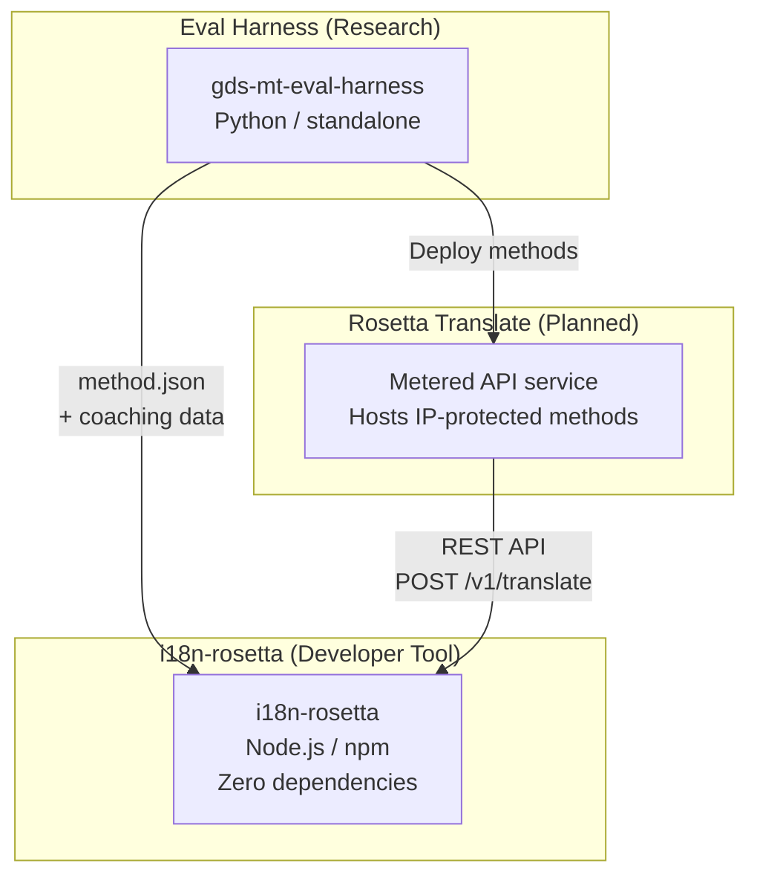
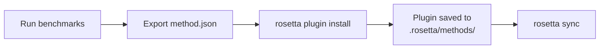
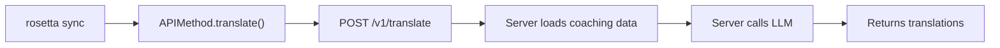
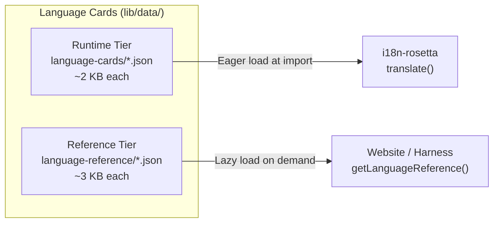

# Architecture

The Rosetta translation ecosystem is three independent tools that work together through well-defined contracts. None of them depend on each other at build time. They communicate through a shared **method plugin format** and a **REST API contract**.

## The Three Pieces



### i18n-rosetta (this project)

The open-source developer tool. Translates locale files using pluggable methods. Zero dependencies, config-optional, works out of the box.

**Built-in methods:**
- `llm` → OpenRouter / any LLM (200+ models)
- `llm-coached` → LLM + grammar/dictionary coaching
- `openai` → Direct OpenAI API (GPT-4o, GPT-4o-mini)
- `anthropic` → Direct Anthropic API (Claude Sonnet, Haiku, Opus)
- `gemini` → Direct Google Gemini API (Flash, Pro — free tier available)
- `google-translate` → Google Cloud Translation API v2
- `deepl` → DeepL API with glossary support
- `microsoft-translator` → Azure Cognitive Services Translator
- `libretranslate` → Self-hosted LibreTranslate (AGPL, free)
- `api` → Thin pipe to any remote REST endpoint

### Eval Harness (companion project)

A research tool for developing, testing, and benchmarking translation methods. When a method reaches acceptable quality, the harness exports a **method plugin** — a `method.json` manifest and optional coaching data files.

The harness never runs inside rosetta. It's a separate tool that produces static output (JSON files). Rosetta just reads those files.

[→ Eval Harness on GitHub](https://github.com/gamedaysuits/gds-mt-eval-harness)

### Rosetta Translate (planned)

A metered API service that hosts proprietary translation methods server-side — the prompts, coaching data, and linguistic pipelines never leave the server.

## How They Connect

### Eval Harness → i18n-rosetta (one-way export)



**Contract**: [Plugin Specification](/docs/reference/plugin-spec)

### Rosetta Translate → i18n-rosetta (API at runtime)



Rosetta's `APIMethod` is a **dumb pipe**. It sends keys out and receives translations back. It contains zero translation logic and zero proprietary content.

## What Each Piece Knows About the Others

| Tool | Knows about rosetta? | Knows about Rosetta Translate? | Knows about harness? |
|------|---------------------|-------------------------------|---------------------|
| **i18n-rosetta** | *(is rosetta)* | Yes — `api` method calls it | No — just reads plugin exports |
| **Rosetta Translate** | Yes — serves its requests | *(is Rosetta Translate)* | No — receives deployed methods |
| **Eval Harness** | Yes — exports plugin format | No — methods deployed separately | *(is the harness)* |

## User Scenarios

### Scenario 1: Free, zero-config (most users)

```bash
export OPENROUTER_API_KEY=sk-...
npx i18n-rosetta sync
```

Uses built-in `llm` method. No plugins, no Rosetta Translate, no harness.

### Scenario 2: Google Translate baseline

```bash
export GOOGLE_TRANSLATE_API_KEY=AIza...
npx i18n-rosetta sync
```

Uses built-in `google-translate` method. No plugins needed.

### Scenario 3: Open plugin with bundled coaching

```bash
rosetta plugin install ./french-formal-v1/
rosetta sync
```

Plugin has `type: "llm-coached"` → rosetta uses user's own OpenRouter key. Coaching data is local (no server call).

### Scenario 4: DIY coaching (no plugin, no harness)

```json title="i18n-rosetta.config.json"
{
  "pairs": {
    "en:fr": { "method": "llm-coached" }
  }
}
```

User maintains their own grammar rules and dictionary in `.rosetta/coaching/fr.json`.

## Language Cards

Each language in rosetta is configured through a **Language Card** — a JSON file containing register presets, formality rules, method support flags, and typography conventions. Language cards are the per-language configuration that drives register-steered translation.



Cards are split into two tiers for performance at scale (targeting 700+ languages):

- **Runtime tier** (`language-cards/`): Loaded eagerly — the fields the translation engine needs (registers, formality, method support, typography rules).
- **Reference tier** (`language-reference/`): Loaded lazily — developer documentation (linguistic challenges, language family, NLP resources).

Both tiers are generated from authoritative sources (IANA, CLDR, Glottolog) using `scripts/generate-language-card.mjs`, then human-curated for linguistic accuracy.

## Design Principles

1. **No circular dependencies.** The bridges are one-way.
2. **Rosetta is the lightweight core.** Zero dependencies, config-optional. Plugins and API are additive.
3. **IP protection is architectural.** Proprietary techniques stay server-side. The npm package ships nothing proprietary.
4. **The plugin format is the contract.** Everything flows through `method.json`.
5. **Each tool has one job.** Harness → develop methods. Rosetta Translate → host methods. Rosetta → translate files.

---

## See Also

- [Translation Methods](/docs/guides/translation-methods) — how each built-in method works
- [Plugin Specification](/docs/reference/plugin-spec) — the method.json manifest format
- [Eval Harness](/docs/eval/harness) — the companion research tool
- [Serving a Method via API](/docs/guides/serving-a-method) — hosting custom translation pipelines
- [Support a Low-Resource Language](/docs/guides/low-resource-languages) — the use case that drove this architecture
