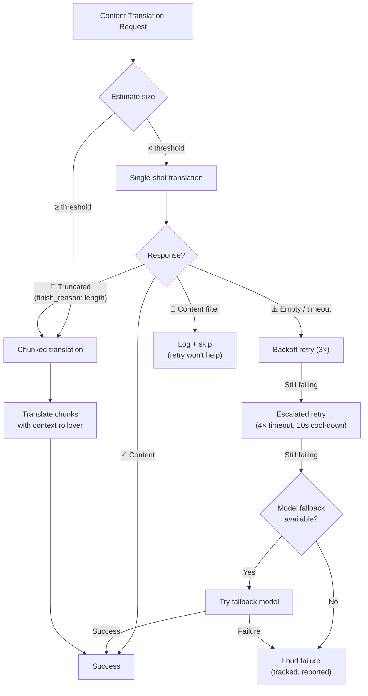

# Content Translation Resilience

Rosetta's content translation pipeline (Markdown/MDX documents) uses a multi-layered resilience system to handle failures gracefully. Unlike key-value translation — where each batch is small and retries are cheap — content translation involves large prompts and long outputs that can fail for structural reasons, not just transient ones.

## The Problem

Content translation has fundamentally different failure modes from key-value translation:

| Failure Mode | Key-Value | Content |
|---|---|---|
| Rate limit (429) | Common, transient | Common, transient |
| Timeout | Rare (small batches) | Common (long output) |
| Empty response | Rare | Common (output limits, filters) |
| Output truncation | N/A (JSON validated) | Happens silently |
| Content filter | Extremely rare | Possible (CLI docs, security docs) |
| Model limitation | Retry fixes it | Retrying won't fix it |

The key insight: **retrying the same failing request is not redundancy, it's stubbornness.** A proper resilience system identifies *why* something failed and changes its approach accordingly.

## Architecture Overview



## Layer 1: Diagnostic-First Retry

Before deciding *how* to retry, the system inspects the API response to understand *what* failed.

### Finish Reason Analysis

Every LLM API returns a `finish_reason` alongside the generated text. Rosetta uses this to make intelligent retry decisions:

| `finish_reason` | Meaning | Action |
|---|---|---|
| `stop` + content | Model completed normally | ✅ Accept result |
| `stop` + empty | Model generated nothing | ⚠️ Retry same request (transient) |
| `length` | Output hit token limit | 🔶 Auto-chunk the document |
| `content_filter` | Safety filter blocked output | 🔴 Log and skip (retry won't help) |
| `null` / missing | Malformed response | ⚠️ Retry same request (transient) |

This replaces the current approach of treating every failure identically with backoff retries.

### Retry Budget

The standard retry budget for transient failures:

| Round | Attempts | Timeout | Backoff |
|---|---|---|---|
| Standard | 4 (0→3) | 60s | 1s → 2s → 4s |
| Escalated | 4 (0→3) | 120s | 1s → 2s → 4s |
| **Total** | **8** | — | **~3.5 min worst case** |

Between rounds, a 10-second cool-down allows transient issues to resolve.

## Layer 2: Content Chunking

When a document exceeds a size threshold — or when Layer 1 signals output truncation — the system splits the document into translation-sized chunks.

See [Context Rollover](/docs/concepts/context-rollover#content-chunking) for detailed chunking configuration. The key points:

### Splitting Strategy

1. **Heading boundaries** — `##` and `###` are natural translation unit boundaries. Each section is self-contained enough for independent translation.
2. **Paragraph fallback** — if a single heading section exceeds the chunk size, split at double newlines.
3. **Hard split** — last resort for extremely long paragraphs (e.g., tables). Split at sentence boundaries.

### Context Between Chunks

Each chunk receives the last 2-3 paragraphs of the *previous chunk's translation* as context. This prevents:
- **Terminology drift** — the model sees what it called "tableau de bord" in the previous chunk
- **Pronoun resolution** — antecedents from the previous section carry forward
- **Register consistency** — the tone established in chunk 1 persists through chunk N

### Auto-Chunking Triggers

| Trigger | Behavior |
|---|---|
| `contentChunkSize` set in config | Always chunk docs exceeding that size |
| `finish_reason: "length"` returned | Auto-chunk as fallback (even without config) |
| Input > ~12KB (auto-detect) | Log suggestion, but don't force |

## Layer 3: Model Fallback Chain

When the configured model fails consistently — not transiently, but structurally — the system tries alternative models. Different models have different context windows, output limits, safety filters, and multilingual strengths.

### Default Fallback Chain

```json title="i18n-rosetta.config.json"
{
  "contentFallbackChain": [
    "google/gemini-2.5-flash",
    "anthropic/claude-sonnet-4"
  ]
}
```

The configured model is always tried first. Fallback models are only used after all retry rounds (standard + escalated) are exhausted.

### Why Multiple Architectures

| Scenario | Primary Model Fails | Fallback Model Succeeds |
|---|---|---|
| Vietnamese CLI docs | Gemini returns empty | Claude handles it fine |
| Safety-filtered content | OpenAI blocks it | Gemini has different filter thresholds |
| Long structured tables | Model A truncates | Model B has larger output window |

The value of fallback is architectural diversity — different model families have different failure modes. A failure that's structural for one model may be trivial for another.

### Scope

> Model fallback is **content-only**. Key-value batches are small and almost never fail structurally. Adding fallback complexity there would be over-engineering.

## Layer 4: Failure Accounting

When failures do occur, the system tracks and reports them properly instead of silently continuing.

### During Sync

- Failed items show `[FAIL]` in progress output
- Each failure logs the specific reason (timeout, empty response, content filter, truncation)
- Completed items are saved to the manifest immediately (incremental persistence)

### After Sync

A failure summary prints at the end:

```
  ┌─ Content Translation Failures ─────────────────────────────────────┐
  │                                                                     │
  │  2 of 24 content translations failed:                              │
  │                                                                     │
  │  ✗ docs/reference/cli.md → vi                                      │
  │    Reason: empty response after 8 attempts + 1 fallback model      │
  │    Models tried: google/gemini-3.1-pro-preview, gemini-2.5-flash   │
  │                                                                     │
  │  ✗ docs/guides/troubleshooting.md → ar                             │
  │    Reason: content_filter (no retry — blocked by safety filter)    │
  │                                                                     │
  │  Re-run: npx i18n-rosetta@latest sync                              │
  │  (22 completed translations are cached and won't re-run)           │
  └─────────────────────────────────────────────────────────────────────┘
```

### Retry Manifest

Failed files are written to `.i18n-rosetta-retry.json`:

```json
{
  "failedAt": "2026-05-27T21:45:00Z",
  "files": [
    {
      "source": "docs/reference/cli.md",
      "locale": "vi",
      "reason": "empty_response",
      "attempts": 8,
      "modelsTried": ["google/gemini-3.1-pro-preview", "google/gemini-2.5-flash"]
    }
  ]
}
```

On the next `sync` run, only these files are re-processed. Completed files are preserved via the content hash manifest (`.i18n-rosetta-content.lock`).

### Exit Codes

| Code | Meaning |
|---|---|
| 0 | All translations succeeded |
| 1 | Configuration error, missing API key, etc. |
| 2 | Partial failure — some content translations failed |

## Configuration

```json title="i18n-rosetta.config.json"
{
  "contentChunkSize": 4000,
  "contentOverlap": 200,
  "contentFallbackChain": [
    "google/gemini-2.5-flash",
    "anthropic/claude-sonnet-4"
  ]
}
```

| Field | Type | Default | Description |
|---|---|---|---|
| `contentChunkSize` | `number \| null` | `null` | Max tokens per content chunk. `null` = no chunking (auto-chunks on truncation only) |
| `contentOverlap` | `number` | `200` | Overlap tokens between content chunks for context continuity |
| `contentFallbackChain` | `string[]` | `[]` | Fallback models to try when the configured model fails structurally |

## Implementation Status

| Feature | Status |
|---|---|
| Diagnostic-first retry (finish_reason parsing) | 🔲 Planned |
| Content chunking (heading/paragraph split) | 🔲 Planned |
| Context rollover between chunks | 🔲 Planned |
| Model fallback chain | 🔲 Planned |
| Failure summary report | 🔲 Planned |
| Retry manifest (.i18n-rosetta-retry.json) | 🔲 Planned |
| Exit code 2 for partial failures | 🔲 Planned |
| Escalation retry (extended timeout) | ✅ Implemented (v3.3.3) |
| Attempt-numbered retry messages | ✅ Implemented (v3.3.3) |
| Loud failure on content errors | ✅ Implemented (v3.3.3) |

## See Also

- [Context Rollover](/docs/concepts/context-rollover) — batching consistency and content chunking configuration
- [How Sync Works](/docs/concepts/how-sync-works) — the full sync pipeline
- [Translation Methods](/docs/guides/translation-methods) — available methods and their characteristics
