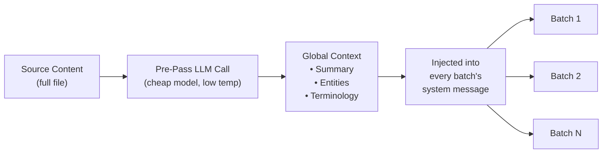

# Context Rollover Batching

Context rollover is a document-level translation consistency feature that carries forward a window of previous translations into subsequent batches, giving the LLM "short-term memory" across batch boundaries.

## Why It Exists

When translating large files (100+ keys or long Markdown documents), rosetta splits the work into batches. Without rollover, each batch is translated independently — the LLM has no memory of what it translated in the previous batch. This causes:

- **Terminology drift**: The same English term gets translated differently across batches (e.g., "dashboard" → "tableau de bord" in batch 1, "panneau" in batch 3)
- **Coreference failure**: Pronouns and references that span batch boundaries lose their antecedent
- **Register inconsistency**: The tone can shift between batches (formal → informal → formal)

This is a well-documented problem in the MT literature. The sliding window approach is validated by research in document-level machine translation (ACL, WMT workshops).

## How It Works

### The Sliding Window

When `contextRollover` is enabled, the translation pipeline maintains a window of recently translated key-value pairs. After each batch completes, a portion of its output (default: 20% of `batchSize`) is carried forward into the next batch's prompt as "reference translations."

```
Batch 1: Translate keys 1-80         → LLM sees: system prompt + keys 1-80
Batch 2: Translate keys 81-160       → LLM sees: system prompt + [16 reference translations from batch 1] + keys 81-160
Batch 3: Translate keys 161-240      → LLM sees: system prompt + [16 reference translations from batch 2] + keys 161-240
```

The reference translations are injected into the user message with a clear label:

```
--- Previous translations for context (do NOT re-translate these) ---
"nav.dashboard": "Tableau de bord"
"nav.settings": "Paramètres"
"header.welcome": "Bienvenue sur la plateforme"
---

{
  "content.main_heading": "Getting Started with Your Dashboard",
  ...
}
```

### Selection Strategy

Two modes for choosing which translations to carry forward:

| Strategy | Behavior | Best For |
|----------|----------|----------|
| `tail` (default) | Last N translations from the previous batch | Sequential documents, Markdown content |
| `diverse` | Picks entries covering different key types (buttons, headings, descriptions) | Large JSON files with mixed UI element types |

### Token Budget

The rollover window consumes input tokens. Rosetta calculates the approximate token cost and warns if the window exceeds 15% of the model's estimated context window. The warning includes a suggested reduction:

```
[WARN] Rollover window is ~2400 tokens (18% of model context).
       Consider reducing rolloverSize to 0.15 or lowering batchSize.
```

## Global Context Pre-Pass

An optional first-pass LLM call that runs **before** translation begins. The LLM analyzes the full source content and produces:

1. **Document Summary** — 2-3 sentence description of what's being translated
2. **Named Entities** — Product names, technical terms, and proper nouns with suggested handling
3. **Terminology Consistency List** — Key terms the LLM identified as requiring consistent translation

This global context is injected into the **system message** of every batch, giving each batch awareness of the full document even though it only sees a slice.



### Pre-Pass Model

The global context extraction uses a separate, cheap LLM call (default: `google/gemini-3.5-flash` at temperature 0.1) regardless of the user's configured translation model. This is a metadata extraction task, not a translation task — speed and cost matter more than creative output.

## Content Chunking

For long Markdown documents (content translation), the body may exceed the LLM's effective context window, or the model may truncate its output. Content chunking splits the document into overlapping segments that are each translated independently, then reassembled.

### Splitting Strategy

Chunking follows a priority cascade — it tries the most semantically meaningful split point first:

1. **Heading boundaries** — `##` and `###` markers create natural translation units. Each section is self-contained enough for independent translation, and headings give the LLM structural context about what it's translating.
2. **Paragraph boundaries** — if a single heading section exceeds the chunk size, split at double newlines (`\n\n`). Paragraphs are the next-best boundary because they represent complete thoughts.
3. **Sentence boundaries** — last resort for extremely long paragraphs (e.g., large tables, dense prose). Splits at period-space boundaries while respecting abbreviations.

Protected blocks (code fences, shortcodes — see [How Sync Works](/docs/concepts/how-sync-works)) are never split across chunks. If a protected block would be cut, the split point moves before or after it.

### Auto-Chunking Triggers

Chunking activates in two ways:

| Trigger | Behavior |
|---------|----------|
| `contentChunkSize` set in config | Proactively chunks all docs exceeding that token count |
| Model returns `finish_reason: "length"` | Auto-chunks as fallback, even without config |

The fallback trigger means chunking works as a safety net even if you don't configure it — if the model truncates, rosetta automatically retries with chunks.

### Configuration

- **`contentChunkSize`**: Maximum tokens per chunk (default: null = send full body; set to e.g., 4000 for long documents)
- **`contentOverlap`**: Overlap in tokens between chunks (default: 200). The overlap ensures smooth transitions at chunk boundaries.

When chunking is active, context rollover automatically applies between chunks — the translated output of the previous chunk's last paragraph is prepended to the next chunk's prompt.

```json title="i18n-rosetta.config.json"
{
  "contentChunkSize": 4000,
  "contentOverlap": 200
}
```

> For the full content translation resilience system (diagnostic retry, model fallback, failure accounting), see [Content Resilience](/docs/concepts/content-resilience).

## Configuration

### Quick Start

```json title="i18n-rosetta.config.json"
{
  "contextRollover": true,
  "globalContext": true,
  "contentChunkSize": 4000,
  "contentOverlap": 200
}
```

### Full Options

```json title="i18n-rosetta.config.json (advanced)"
{
  "contextRollover": {
    "size": 0.2,
    "strategy": "tail",
    "maxTokens": null
  },
  "globalContext": {
    "model": "google/gemini-3.5-flash",
    "maxEntities": 20,
    "temperature": 0.1
  },
  "contentChunkSize": 4000,
  "contentOverlap": 200,
  "contentFallbackChain": [
    "google/gemini-2.5-flash",
    "anthropic/claude-sonnet-4"
  ]
}
```

| Field | Type | Default | Description |
|-------|------|---------|-------------|
| `contextRollover` | `boolean \| object` | `false` | Enable sliding window rollover |
| `contextRollover.size` | `number` | `0.2` | Fraction of `batchSize` to carry forward (0.0–1.0) |
| `contextRollover.strategy` | `string` | `"tail"` | Selection strategy: `"tail"` or `"diverse"` |
| `contextRollover.maxTokens` | `number \| null` | `null` | Hard cap on rollover token budget |
| `globalContext` | `boolean \| object` | `false` | Enable global context pre-pass |
| `globalContext.model` | `string` | `"google/gemini-3.5-flash"` | Model for the pre-pass call |
| `globalContext.maxEntities` | `number` | `20` | Maximum named entities to extract |
| `globalContext.temperature` | `number` | `0.1` | Temperature for the pre-pass call |
| `contentChunkSize` | `number \| null` | `null` | Max tokens per content chunk (null = no chunking) |
| `contentOverlap` | `number` | `200` | Overlap tokens between content chunks |
| `contentFallbackChain` | `string[]` | `[]` | Fallback models for content translation when configured model fails structurally |

## When to Use It

| Scenario | Recommendation |
|----------|---------------|
| Small JSON files (< 50 keys) | Not needed — single batch, no boundary issues |
| Large JSON files (100+ keys) | Enable `contextRollover` for terminology consistency |
| Long Markdown documents | Enable `contextRollover` + `contentChunkSize` + `globalContext` |
| Technical documentation | Enable `globalContext` for entity extraction |
| UI strings with mixed register | Use `contextRollover` with `strategy: "diverse"` |

## Implementation Status

| Feature | Status |
|---------|--------|
| Sliding window rollover (key-value) | 🔲 Planned |
| Sliding window rollover (content) | 🔲 Planned |
| Global context pre-pass | 🔲 Planned |
| Content chunking | 🔲 Planned |
| Auto-chunking on truncation | 🔲 Planned |
| `diverse` selection strategy | 🔲 Planned |

## Literature

This feature is grounded in published research on document-level machine translation:

- **Sliding window approach**: Validated for improving BLEU, chrF, and COMET scores when using LLMs for translation (ACL 2023–2025 workshops on document-level MT)
- **Multi-knowledge fusion**: Injecting document summaries and entity lists as global context improves terminology consistency across long documents
- **Context-Aware Prompting (CAP)**: Selecting relevant context via attention scores or semantic similarity for in-context learning

## See Also

- [Content Resilience](/docs/concepts/content-resilience) — diagnostic retry, model fallback, and failure accounting
- [How Sync Works](/docs/concepts/how-sync-works) — the batch pipeline that rollover augments
- [Coaching Data](/docs/concepts/coaching-data) — complementary feature for grammar/dictionary injection
- [Translation Memory](/docs/concepts/translation-memory) — the TM cache that works alongside rollover
