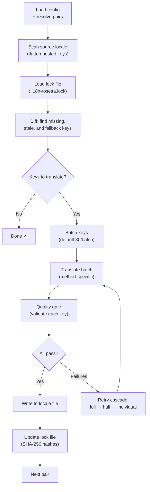

# How Sync Works

The `sync` command is rosetta's core operation. Here's what happens when you run `npx i18n-rosetta sync`.

## Pipeline Overview



## Step by Step

### 1. Config Resolution

Rosetta loads `i18n-rosetta.config.json` (or auto-detects settings). It resolves:
- Source locale and target locales
- The pair graph (which source→target combinations to process)
- Per-pair method, model, and quality settings

### 2. Source Scanning

The source locale file is loaded and flattened into a key→value map:

```json
// Input (nested)
{ "hero": { "title": "Welcome", "subtitle": "Build" } }

// Flattened
{ "hero.title": "Welcome", "hero.subtitle": "Build" }
```

### 3. Change Detection

Rosetta reads `.i18n-rosetta.lock`, which stores SHA-256 hashes of previously translated source values. For each key, it checks:

| Condition | Action |
|-----------|--------|
| Key missing from target | **Translate** |
| Source hash changed since last sync | **Re-translate** (stale) |
| Target value starts with `[EN]` | **Re-translate** (fallback placeholder) |
| Source hash unchanged, key exists | **Skip** |

This is why rosetta only translates what changed — it's not re-translating your entire file on every sync.

### 4. Batching

Keys are grouped into batches (default: 30 keys/batch for LLM, 128 for Google Translate). Batching reduces API round trips while keeping prompts manageable.

### 5. Translation

Each batch is sent to the configured translation method:

- **`llm`**: Structured prompt to OpenRouter with register instructions
- **`llm-coached`**: Same, but with grammar rules, dictionary, and style notes injected
- **`google-translate`**: Google Cloud Translation API v2 batch request
- **`api`**: HTTP POST to a remote endpoint

The system message (register, rules) is identical across batches for a given locale, enabling **prompt caching** — providers like Anthropic and Google cache repeated system messages, reducing token costs.

### 6. Quality Gate

Every translation is validated before it's written to disk. Five checks run:

| Check | What it catches | Example |
|-------|----------------|---------|
| **Empty/blank** | Model returned nothing | `""` |
| **Source echo** | Model returned the English input | `"Welcome"` for Japanese |
| **Hallucination loop** | Repeated trigrams | `"Qo' Qo' Qo' Qo'"` |
| **Length inflation** | Output is 4×+ longer than source | 10-char source → 50-char output |
| **Script compliance** | Wrong script for the locale | Latin text for Arabic locale |

Failures are logged with a `[GATE]` prefix. No silent fallbacks.

See [Quality Gate](/docs/concepts/quality-gate) for details.

### 7. Retry Cascade

On JSON parse failure or batch-level errors, rosetta retries with progressively smaller batches:

```
Full batch (30 keys) → Failed
Half batch (15 keys) → Failed
Individual keys (1 each) → Isolates the problem key
```

The retry budget is capped by `maxRetries` (default: 3) to prevent runaway token spend.

### 8. Write & Lock

Passing translations are written to the target locale file, preserving the original nesting structure. The lock file is updated with new SHA-256 hashes.

## Partial Success

One failed batch doesn't block the rest. If 9 out of 10 batches succeed, those 9 are written. The failed batch is logged, and you can re-run `sync` to retry.

## Dry Run

Preview what would change without writing any files:

```bash
npx i18n-rosetta sync --dry
```

## Force Re-translate

Force specific keys to be re-translated even if unchanged:

```bash
npx i18n-rosetta sync --force-keys "hero.title,nav.about"
```

## Cost Estimation

Before translating, rosetta generates a **pre-sync cost report** showing estimated costs per pair. This runs automatically during every `sync` — you see it before any API calls are made.

```
╔══════════════════════════════════════════════════════════╗
║  Cost Estimate                                          ║
╠════════════╦═══════╦════════════╦════════════════════════╣
║ Pair       ║ Keys  ║ Est. Cost  ║ Method                 ║
╠════════════╬═══════╬════════════╬════════════════════════╣
║ en → fr    ║   142 ║ $0.07      ║ google-translate       ║
║ en → ja    ║    38 ║   —        ║ llm (model-dependent)  ║
║ en → crk   ║    38 ║   —        ║ llm-coached            ║
╚════════════╩═══════╩════════════╩════════════════════════╝
```

### What Gets Estimated

Each translation method provides its own cost estimate:

| Method | Cost Basis | Precision |
|--------|-----------|-----------|
| `google-translate` | Google's published rate ($20/million chars) | Accurate |
| `llm` | Varies by OpenRouter model | Model-dependent — check [OpenRouter pricing](https://openrouter.ai/models) |
| `llm-coached` | Same as `llm` plus coaching context tokens | Model-dependent |
| `api` | Server-determined | Unknown — cannot estimate without querying the endpoint |

When a method can't determine cost (LLM methods, remote APIs), rosetta reports `—` rather than guessing. Use `--dry` to see cost estimates without actually translating.

---

## See Also

- [CLI Reference — sync](/docs/reference/cli#sync) — command flags and options
- [Quality Gate](/docs/concepts/quality-gate) — how translations are validated
- [Translation Methods](/docs/guides/translation-methods) — how each method works
- [Configuration](/docs/getting-started/configuration) — config reference
- [CI/CD Guide](/docs/guides/ci-cd) — automating syncs in your pipeline

