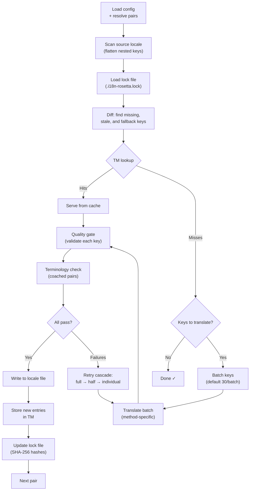

# How Sync Works

The `sync` command is rosetta's core operation. Here's what happens when you run `npx i18n-rosetta sync`.

## Pipeline Overview



## Step by Step

### 1. Config Resolution

Rosetta loads `i18n-rosetta.config.json` (or auto-detects settings). It resolves:
- Source locale and target locales
- The pair graph (which source→target combinations to process)
- Per-pair method, model, and quality settings

### 2. Source Scanning

The source locale file is loaded and flattened into a key→value map:

```json
// Input (nested)
{ "hero": { "title": "Welcome", "subtitle": "Build" } }

// Flattened
{ "hero.title": "Welcome", "hero.subtitle": "Build" }
```

### 3. Change Detection

Rosetta reads `.i18n-rosetta.lock`, which stores SHA-256 hashes of previously translated source values. For each key, it checks:

| Condition | Action |
|-----------|--------|
| Key missing from target | **Translate** |
| Source hash changed since last sync | **Re-translate** (stale) |
| Target value starts with `[EN]` | **Re-translate** (fallback placeholder) |
| Source hash unchanged, key exists | **Skip** |

This is why rosetta only translates what changed — it's not re-translating your entire file on every sync.

### 4. Batching

Keys are grouped into batches (default: 30 keys/batch for LLM, 128 for Google Translate). Batching reduces API round trips while keeping prompts manageable.

### 4b. Translation Memory

Before batching, rosetta checks the Translation Memory cache (`.rosetta/tm.json`). Keys whose source text + locale + method match a previous translation are served instantly from cache — no API call needed.

```
  [TM] 142 key(s) served from cache
  Translating 3 key(s) to French (llm)... [OK]
```

TM is the primary cost-saving mechanism. Re-running sync after a single key change only translates that one key, not the entire file. See [Translation Memory](/docs/concepts/translation-memory) for details.

To bypass the cache for a single run: `i18n-rosetta sync --no-tm`

### 5. Translation

Each batch is sent to the configured translation method:

- **`llm`**: Structured prompt to OpenRouter with register and gender guidance instructions
- **`llm-coached`**: Same, but with grammar rules, dictionary, and style notes injected
- **`google-translate`**: Google Cloud Translation API v2 batch request
- **`api`**: HTTP POST to a remote endpoint

The system message (register, gender guidance, rules) is identical across batches for a given locale, enabling **prompt caching** — providers like Anthropic and Google cache repeated system messages, reducing token costs.

### 6. Quality Gate

Every translation is validated before it's written to disk. Five checks run:

| Check | What it catches | Example |
|-------|----------------|---------|
| **Empty/blank** | Model returned nothing | `""` |
| **Source echo** | Model returned the English input | `"Welcome"` for Japanese |
| **Hallucination loop** | Repeated trigrams | `"Qo' Qo' Qo' Qo'"` |
| **Length inflation** | Output is 4×+ longer than source | 10-char source → 50-char output |
| **Script compliance** | Wrong script for the locale | Latin text for Arabic locale |

Failures are logged with a `[GATE]` prefix. No silent fallbacks.

See [Quality Gate](/docs/concepts/quality-gate) for details.

### 6b. Terminology Verification

For coached pairs with a dictionary, rosetta checks whether the LLM actually used the required terminology after translation. Violations are logged as `[TERM]` warnings:

```
[TERM] en→fr: 2 term violation(s)
  • "dashboard" → expected "tableau de bord" but got "panneau"
```

These are warnings, not blocking errors — the translation is still written.

### 7. Retry Cascade

On JSON parse failure or batch-level errors, rosetta retries with progressively smaller batches:

```
Full batch (30 keys) → Failed
Half batch (15 keys) → Failed
Individual keys (1 each) → Isolates the problem key
```

The retry budget is capped by `maxRetries` (default: 3) to prevent runaway token spend.

### 8. Write & Lock

Passing translations are written to the target locale file, preserving the original nesting structure. The lock file is updated with new SHA-256 hashes.

## Content Translation (Phase 2)

For Docusaurus and Hugo projects, `sync` runs a second phase after JSON key translation. This phase translates Markdown and MDX files (docs, blog posts, tutorials) using the same methods and quality gate.

### How it works

1. Rosetta discovers all source content files (`.md`, `.mdx`) by walking the content/docs directory
2. For each file × locale pair, it checks a separate content lock file (`.i18n-rosetta-content.lock`) for SHA-256 hash changes
3. Changed or missing files are collected into a flat work-item pool
4. The pool is processed with **parallel concurrency** (default: 12 simultaneous API calls)

```
Phase 2: content (79 translations to process, 341 skipped, concurrency: 12)

    [1/79] (1%)  docs/concepts/security.md → ja [RE-TRANSLATE] (~3328s left)
    [2/79] (3%)  docs/concepts/security.md → th [RE-TRANSLATE] (~1821s left)
    ...
    [79/79] (100%) blog/v3-2-quality.md → de [OK]

  [OK] Created 79 content file(s), 341 unchanged
```

### Flat-pool parallelism

Unlike Phase 1 (JSON keys, sequential per locale), Phase 2 processes all file×locale combinations as a flat list. This means different files and different locales are translated simultaneously:

- `docs/configuration.md → fr` and `docs/cli.md → ja` run at the same time
- A 420-translation corpus completes in ~11 minutes at concurrency 12
- Incremental manifest writes every 10 completions prevent lost progress if the process is killed

Control parallelism with `--concurrency` or the `concurrency` config field:

```bash
# Faster (more parallel calls, higher API load)
npx i18n-rosetta sync --concurrency 20

# Slower (gentler on rate limits)
npx i18n-rosetta sync --concurrency 4
```

### Content protection

During translation, rosetta shields non-translatable content:

- **Code blocks** (fenced and indented) are replaced with placeholders
- **Frontmatter** fields not in the `translatableFields` list are preserved as-is
- **Links**, image paths, and HTML tags are protected
- **Shortcodes** and interpolation variables (e.g., `{count}`, `{{.Params.title}}`) are shielded

After translation, all placeholders are restored and validated. If any are missing or corrupt, the translation is rejected and retried.

## Partial Success

One failed batch doesn't block the rest. If 9 out of 10 batches succeed, those 9 are written. The failed batch is logged, and you can re-run `sync` to retry.

## Dry Run

Preview what would change without writing any files:

```bash
npx i18n-rosetta sync --dry-run
```

## Force Re-translate

Force specific keys to be re-translated even if unchanged:

```bash
npx i18n-rosetta sync --force-keys "hero.title,nav.about"
```

## Cost Estimation

Before translating, rosetta generates a **pre-sync cost report** showing estimated costs per pair. This runs automatically during every `sync` — you see it before any API calls are made.

```
╔══════════════════════════════════════════════════════════╗
║  Cost Estimate                                          ║
╠════════════╦═══════╦════════════╦════════════════════════╣
║ Pair       ║ Keys  ║ Est. Cost  ║ Method                 ║
╠════════════╬═══════╬════════════╬════════════════════════╣
║ en → fr    ║   142 ║ $0.07      ║ google-translate       ║
║ en → ja    ║    38 ║   —        ║ llm (model-dependent)  ║
║ en → crk   ║    38 ║   —        ║ llm-coached            ║
╚════════════╩═══════╩════════════╩════════════════════════╝
```

### What Gets Estimated

Each translation method provides its own cost estimate:

| Method | Cost Basis | Precision |
|--------|-----------|-----------|
| `google-translate` | Google's published rate ($20/million chars) | Accurate |
| `llm` | Varies by OpenRouter model | Model-dependent — check [OpenRouter pricing](https://openrouter.ai/models) |
| `llm-coached` | Same as `llm` plus coaching context tokens | Model-dependent |
| `api` | Server-determined | Unknown — cannot estimate without querying the endpoint |

When a method can't determine cost (LLM methods, remote APIs), rosetta reports `—` rather than guessing. Use `--dry` to see cost estimates without actually translating.

---

## See Also

- [CLI Reference — sync](/docs/reference/cli#sync) — command flags and options
- [Translation Memory](/docs/concepts/translation-memory) — caching and cost savings
- [Quality Gate](/docs/concepts/quality-gate) — how translations are validated
- [Translation Methods](/docs/guides/translation-methods) — how each method works
- [Working with Professional Translators](/docs/guides/professional-translators) — XLIFF workflow
- [Configuration](/docs/getting-started/configuration) — config reference
- [CI/CD Guide](/docs/guides/ci-cd) — automating syncs in your pipeline

