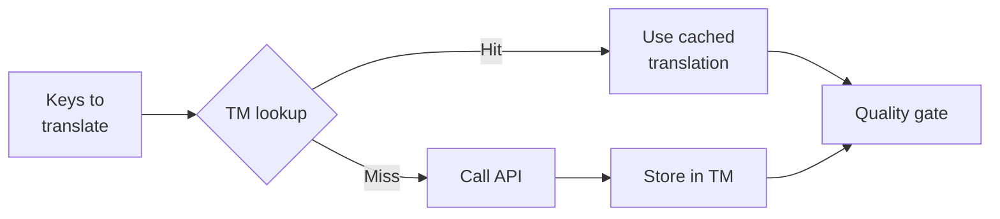

# Translation Memory

Translation Memory (TM) is rosetta's built-in caching layer. It stores every translation keyed by source text + locale + method, so re-running `sync` only calls the API for keys that have genuinely changed.

## Why TM Exists

Without TM, every `sync` re-translates every modified key — even if you've already translated the exact same English text for the same locale on a previous run. Common scenarios where this wastes money:

| Scenario | Without TM | With TM |
|----------|-----------|---------|
| Re-run sync after 1 key change (500 keys × 10 locales) | 5,000 API calls | 10 API calls |
| Revert a key to a previous English value | Full API call | Instant cache hit |
| Same phrase appears in 3 locale files | 3 × API calls | 1 API call + 2 cache hits |
| Dry-run → real sync | Full API calls on both | First run caches, second reuses |

TM is **enabled by default** and requires no configuration. Translations are cached automatically during every `sync` and served on subsequent runs.

## How It Works

### Cache Key

Each TM entry is keyed by a SHA-256 hash of three values:

```
SHA-256( sourceValue + '\x00' + locale + '\x00' + method )
```

| Component | Why it's in the key |
|-----------|-------------------|
| `sourceValue` | Different English text → different translation |
| `locale` | "Hello" translates differently to French vs Japanese |
| `method` | Google Translate output ≠ GPT-4o output |

The null byte separator (`\x00`) prevents collision between `"ab" + "c"` and `"a" + "bc"`.

### During Sync



1. Before calling the translation API, rosetta partitions keys into **TM hits** and **TM misses**
2. Hits are served instantly from cache — no API call, no latency, no cost
3. Misses go through the normal translation pipeline
4. New translations from the API are stored in TM for future runs
5. All translations (cached + fresh) pass through the quality gate

### Storage

TM is stored at `.rosetta/tm.json` in your project root. The file uses compact JSON (no pretty-printing) to keep size manageable. Each entry stores:

| Field | Description |
|-------|-------------|
| `t` | The translated text |
| `ts` | ISO-8601 timestamp of when it was cached |
| `l` | Target locale code (for stats/filtering) |
| `m` | Translation method name (for stats/filtering) |

At 50 languages × 500 keys = 25,000 entries, the file should be ~2-3 MB.

## Managing the Cache

### View Statistics

```bash
i18n-rosetta tm stats
```

Shows entry count, file size, and a per-locale breakdown:

```
  Translation Memory — .rosetta/tm.json

  Entries:      2,847
  File size:    1.2 MB
  Created:      2026-05-20
  Last entry:   2026-05-24

  By locale:
    fr       482 entries  (llm: 380, llm-coached: 102)
    de       471 entries  (llm: 471)
    ja       465 entries  (llm: 465)
```

### Clear the Cache

```bash
# Clear everything (with confirmation prompt)
i18n-rosetta tm clear

# Clear without prompt (CI environments)
i18n-rosetta tm clear --yes

# Clear only one locale
i18n-rosetta tm clear --locale fr
```

### Skip TM for One Run

```bash
# Force fresh API calls for all keys (useful when switching providers)
i18n-rosetta sync --no-tm
```

This doesn't delete the cache — it just ignores it for this run and doesn't store new results.

## When TM Doesn't Help

TM won't produce a cache hit when:

- **Source text changed** — the hash changes, so it's a miss
- **Method changed** — switching from `llm` to `google-translate` means different cache keys
- **First run** — cold start, no entries yet
- **`--no-tm` flag** — explicitly bypasses the cache

## Should You Commit `.rosetta/tm.json`?

**Generally no.** TM is local developer optimization. It's populated automatically during sync and only helps when re-running sync on the same machine. However, you might consider committing it if:

- Your team shares a single CI runner that syncs translations
- You want reproducible builds without API calls
- You're archiving translations for compliance

Add `.rosetta/tm.json` to `.gitignore` for typical usage.

---

## See Also

- [How Sync Works](/docs/concepts/how-sync-works) — where TM fits in the pipeline
- [CLI Reference — tm](/docs/reference/cli#tm) — command reference
- [CLI Reference — sync --no-tm](/docs/reference/cli#sync) — bypassing TM
