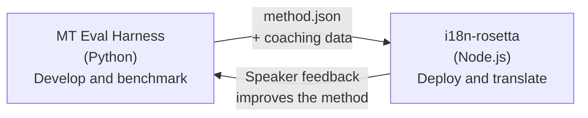

# The Eval Harness Bridge

i18n-rosetta and the MT Eval Harness are two separate tools that form one ecosystem. The harness is where translation methods are **proven**. Rosetta is where proven methods are **deployed**. They connect through a shared plugin format.



## The Flow: Research → Production

### 1. Build a method in the harness

Any Python class that implements `async translate(entries, config) → [{id, predicted}]` can plug into the harness. The harness doesn't care what happens inside — prompted LLM, custom-trained model, deterministic rules, anything.

### 2. Benchmark it

The harness scores your method against a standardized corpus with reproducible metrics: chrF++, FST acceptance (for morphologically rich languages), morphological accuracy, and semantic scoring.

### 3. Export as a plugin

When your method reaches acceptable quality, package it as a rosetta plugin — a `method.json` manifest with optional coaching data.

:::info Export CLI is planned
Currently, you create the method.json manifest manually. The `mt-eval export` command will automate this. See the [Method Interface](https://mtevalarena.org/docs/specifications/methods) for the full plugin format.
:::

### 4. Install in rosetta

```bash
i18n-rosetta plugin install ./my-method-plugin/
```

### 5. Translate real content

```bash
i18n-rosetta sync
```

Your benchmarked method is now producing real translations in production.

## The Flow: Production → Research

Deployed translations get reviewed by bilingual speakers. Their feedback identifies systematic errors (wrong tense patterns, missing vocabulary, unnatural phrasing). The researcher updates the method in the harness, re-benchmarks, re-exports, and redeploys. The system learns from use.

## The Plugin Format

The `method.json` manifest is the contract between the two tools:

```json
{
  "name": "crk-coached-v3",
  "type": "llm-coached",
  "version": "3.0.0",
  "description": "Coached LLM translation for Plains Cree",
  "locales": ["crk"],
  "config": {
    "model": "google/gemini-3.5-flash",
    "temperature": 0.3
  },
  "benchmarks": {
    "crk": {
      "composite_score": 0.67,
      "fst_acceptance": 0.82,
      "corpus_size": 150
    }
  }
}
```

See the [Plugin Specification](/docs/reference/plugin-spec) for the full format.

## What's Built vs. Planned

| Component | Status |
|-----------|--------|
| TranslationProcess protocol | ✅ Built |
| Harness benchmark runner | ✅ Built |
| method.json plugin format | ✅ Built |
| `rosetta plugin install/remove/list` | ✅ Built |
| Coaching data loading | ✅ Built |
| `mt-eval export` CLI | 🔲 Planned |
| Community review interface | 🔲 Planned |
| Cryptographic test set evaluation | 🔲 Planned |

## Further Reading

- [Translation Methods](/docs/guides/translation-methods) — all available methods and how they work
- [Plugin Specification](/docs/reference/plugin-spec) — the method.json format
- [Serving a Method via API](/docs/guides/serving-a-method) — hosting a method server-side
- [Data Sovereignty](https://mtevalarena.org/docs/sovereignty/data-sovereignty) — OCAP, CARE, and cryptographic protection
- [For MT Researchers](https://mtevalarena.org/docs/leaderboard/rules) — the eval harness documentation
