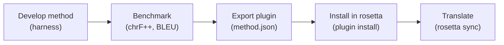

# Low-Resource Languages

Rosetta was built for this. When no off-the-shelf API supports your target language, you build a translation method from scratch — grammar rules, dictionaries, and morphological coaching — and deploy it as a plugin.

> This isn't theoretical. i18n-rosetta was born from translating a production website into Plains Cree, where Google Translate returns nothing useful and no commercial API exists.

## The Problem

Google Translate supports ~130 languages. There are over 7,000. For the thousands of languages without API coverage, you need:

1. **Linguistic knowledge** — grammar rules, morphology patterns, orthographic conventions
2. **Terminology** — domain-specific dictionaries (what does "dashboard" mean in Plains Cree?)
3. **Quality benchmarks** — how do you know the translations are any good?

## The Solution: Coached Translation

Rosetta's `llm-coached` method injects grammar rules, term dictionaries, and style notes into every LLM prompt. Modern LLMs have surprising capacity for low-resource languages when given the right context.

### Step 1: Create Coaching Data

Create a coaching file for your target locale:

```json title=".rosetta/coaching/crk.json"
{
  "grammar_rules": [
    "Plains Cree is polysynthetic — a single word can express what English needs a full sentence for",
    "Animate/inanimate noun distinction affects verb conjugation",
    "Use SRO (Standard Roman Orthography) unless script converter handles conversion"
  ],
  "dictionary": {
    "home": "kīwēwin",
    "settings": "isi-nākatohkēwin",
    "search": "nānātawāpahtam",
    "welcome": "tānisi"
  },
  "style_notes": "Use formal register. Preserve English technical terms in parentheses when no Cree equivalent exists."
}
```

### Step 2: Configure the Pair

```json title="i18n-rosetta.config.json"
{
  "version": 3,
  "pairs": {
    "en:crk": {
      "method": "llm-coached",
      "model": "google/gemini-2.5-pro",
      "batchSize": 5
    }
  },
  "languages": {
    "crk": {
      "name": "Plains Cree",
      "register": "SRO syllabics with grammatical precision.",
      "script": "cans",
      "maxRetries": 5
    }
  }
}
```

Key settings:
- **`batchSize: 5`** — Smaller batches give the LLM more attention per key
- **`maxRetries: 5`** — More generous retry budget for difficult translations
- **`script: "cans"`** — Triggers script validation (rejects Latin-only output for Cree)

### Step 3: Sync

```bash
npx i18n-rosetta sync
```

The quality gate will validate each translation:
- Rejects source echoes (model just returned the English)
- Rejects wrong-script output (Latin text for a Syllabics locale)
- Rejects hallucination loops (repeated trigrams)
- Retries failed batches with progressively smaller batch sizes

### Step 4: Script Conversion (Optional)

If your language uses a non-Latin script but the LLM outputs in Latin transliteration, Rosetta can run a deterministic script converter after translation:

```
Plains Cree SRO → Syllabics
Serbian Latin → Cyrillic
```

Script converters run automatically in the sync pipeline for locales with registered converters. They're deterministic (no LLM involved) and cost nothing.

## The Eval Harness

For serious method development, the companion [MT Eval Harness](https://github.com/gamedaysuits/gds-mt-eval-harness) provides:

- **Benchmarking** — chrF++, BLEU, exact-match scoring against reference translations
- **A/B comparison** — test different models, prompts, and coaching data side by side
- **Plugin export** — package a validated method as a rosetta plugin with benchmarks

The workflow:



## Quality Tiers

When you run `i18n-rosetta status`, each pair shows its quality tier:

| Tier | Method Type | Description |
|------|------------|-------------|
| `standard` | `llm` | Direct LLM prompting, no post-processing |
| `high` | `llm-coached` | LLM + grammar/dictionary coaching |
| `research` | `fst-gated` | LLM + deterministic morphological gate |
| `verified` | `human-review` | LLM draft flagged for human review |

Plugins include benchmark scores that are displayed alongside the quality tier.
