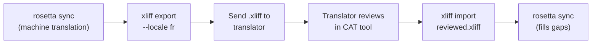

# Working with Professional Translators

Rosetta generates machine translations, but some projects need human review — regulatory content, brand-sensitive copy, or high-stakes UI. The XLIFF workflow lets you export translations for professional review and import them back seamlessly.

## What is XLIFF?

XLIFF (XML Localization Interchange File Format) is the industry-standard exchange format for translation tools. Every professional CAT (Computer-Assisted Translation) tool supports it:

- **memoQ** — import XLIFF, review in-context, export reviewed file
- **SDL Trados Studio** — native XLIFF support
- **Phrase (Memsource)** — upload XLIFF jobs for translator teams
- **Smartling** — XLIFF ingestion pipeline
- **OmegaT** — free/open-source CAT tool with XLIFF support

Rosetta generates XLIFF 1.2 (the universally supported version) rather than 2.0+ for maximum tool compatibility.

## The Workflow



### Step 1: Generate Machine Translations

Run `sync` first to get a baseline machine translation:

```bash
i18n-rosetta sync
```

### Step 2: Export XLIFF

Export the source + target pair as XLIFF:

```bash
i18n-rosetta xliff export --locale fr
```

This writes `.rosetta/xliff/fr.xliff` containing:
- Every source key with its English value
- The current machine translation (if any) as the `<target>`
- Keys without translations marked as `state="new"`

```xml
<trans-unit id="hero.title" xml:space="preserve">
  <source>Welcome to our platform</source>
  <target state="translated">Bienvenue sur notre plateforme</target>
</trans-unit>
```

### Step 3: Send to Translator

Send the `.xliff` file to your translator or upload it to your CAT platform. The translator sees source and target side-by-side, and can:

- Edit machine translations
- Fill in missing translations
- Flag quality issues
- Apply their own translation memory and termbases

### Step 4: Import Reviewed File

When the translator returns the reviewed `.xliff`, import it:

```bash
# Preview what will change
i18n-rosetta xliff import .rosetta/xliff/fr.xliff --dry

# Apply changes
i18n-rosetta xliff import .rosetta/xliff/fr.xliff
```

Output:
```
  ✓ Imported 142 translations for fr
    Updated:    23 (changed from existing)
    Added:      0 (new keys)
    Unchanged:  119
    Written to: locales/fr.json
```

### Step 5: Fill Gaps

If new keys were added after the XLIFF was exported, run `sync` to translate them:

```bash
i18n-rosetta sync
```

Rosetta only translates keys that are still missing — reviewed translations from the XLIFF import are preserved.

## Tips

### Export Custom Paths

```bash
# Export to a specific directory
i18n-rosetta xliff export --locale ja --out ./for-review/

# Export with a specific filename
i18n-rosetta xliff export --locale de --out ./review/german.xliff
```

### Multiple Locales

Export each locale separately:

```bash
for locale in fr de ja ko; do
  i18n-rosetta xliff export --locale $locale
done
```

### Version Control

Add `.rosetta/xliff/` to `.gitignore` — XLIFF files are transient artifacts, not project source:

```gitignore
.rosetta/xliff/
```

### When to Use XLIFF vs. Just `sync`

| Scenario | Recommendation |
|----------|---------------|
| Internal app, 90%+ quality acceptable | Just `sync` — machine translation is fine |
| User-facing marketing copy | Export XLIFF for human review |
| Legal/regulatory content | Export XLIFF — human review required |
| 50+ locales, tight deadline | `sync` first, XLIFF export for top 5 locales only |
| Translator already uses a CAT tool | XLIFF is the natural handoff format |

---

## See Also

- [CLI Reference — xliff](/docs/reference/cli#xliff) — command reference
- [Translation Memory](/docs/concepts/translation-memory) — caching reviewed translations
- [Translation Methods](/docs/guides/translation-methods) — machine translation options
