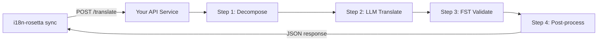

# Serving a Custom Method as an API

i18n-rosetta's **`api` method** lets you point any translation pair at an external HTTP endpoint. This is how you integrate pipelines that are too complex for a single LLM prompt — morphological analyzers, finite-state transducers (FSTs), multi-step LLM chains, or any custom research method you've built.

## Why an API Service?

Some translation pipelines can't run inside a simple prompt-response cycle:

| Pipeline step | Example |
|---|---|
| **Morphological decomposition** | Split polysynthetic words into morphemes before translation |
| **FST validation** | Reject outputs that violate phonological or morphological rules |
| **Multi-step LLM chains** | Generate → verify → correct cycles with different models |
| **Dictionary lookup** | Cross-reference a curated bilingual dictionary mid-pipeline |
| **Human-in-the-loop** | Queue uncertain translations for expert review |

The `api` method treats your pipeline as a black box — i18n-rosetta sends source strings, your service returns translations. What happens inside is entirely up to you.

## Architecture



## Setting Up Your Service

Your API service must implement a single endpoint that accepts and returns JSON:

### Request Format

```json
POST /translate
Content-Type: application/json

{
  "keys": ["greeting", "farewell"],
  "sourceStrings": {
    "greeting": "Hello, welcome to our app",
    "farewell": "Goodbye and thanks"
  },
  "sourceLocale": "en",
  "targetLocale": "crk",
  "context": {
    "register": "Formal Plains Cree. Use SRO (Standard Roman Orthography)."
  }
}
```

### Response Format

```json
{
  "translations": {
    "greeting": "tânisi, pê-kîwêw ôta",
    "farewell": "ekosi mâka, kinanâskomitin"
  },
  "metadata": {
    "model": "gds-mt-eval-harness/crk-pipeline-v2",
    "method": "decompose-translate-validate",
    "confidence": 0.87
  }
}
```

### Minimal Express Server

```javascript
import express from 'express';

const app = express();
app.use(express.json());

app.post('/translate', async (req, res) => {
  const { keys, sourceStrings, sourceLocale, targetLocale, context } = req.body;

  const translations = {};

  for (const key of keys) {
    const source = sourceStrings[key];

    // --- Your pipeline goes here ---
    // Step 1: Morphological decomposition
    const morphemes = await decompose(source, sourceLocale);

    // Step 2: LLM translation with context
    const draft = await llmTranslate(morphemes, targetLocale, context);

    // Step 3: FST validation
    const validated = await fstValidate(draft, targetLocale);

    // Step 4: Post-processing (orthography normalization, etc.)
    translations[key] = await postProcess(validated);
  }

  res.json({
    translations,
    metadata: {
      model: 'my-custom-pipeline/v1',
      method: 'decompose-translate-validate',
    },
  });
});

app.listen(3001, () => {
  console.log('Translation API running on http://localhost:3001');
});
```

## Configuring i18n-rosetta

Point a translation pair at your running service in `i18n-rosetta.config.json`:

```json
{
  "inputLocale": "en",
  "pairs": {
    "en:crk": {
      "method": "api",
      "endpoint": "http://localhost:3001/translate",
      "register": "Formal Plains Cree. Use SRO orthography."
    }
  }
}
```

Then run sync as usual:

```bash
npx i18n-rosetta sync
```

i18n-rosetta will POST your source strings to the endpoint and write the returned translations to `crk.json`.

## Case Study: Plains Cree Pipeline

The **gds-mt-eval-harness** project demonstrates this pattern in production. Its Plains Cree pipeline uses:

1. **Morphological decomposition** — Break polysynthetic Cree words into translatable morpheme chains
2. **LLM translation** — Context-enriched GPT-4o translation with coaching data (SRO orthography rules, register instructions)
3. **FST validation** — Finite-state transducer checks that outputs conform to Cree phonological rules
4. **Confidence scoring** — Each translation gets a confidence score based on FST pass rate and dictionary coverage

The entire pipeline runs as a single HTTP endpoint that i18n-rosetta calls via the `api` method.

### Running Evaluations

The harness provides structured evaluation tooling via the `mt-eval` CLI. After translating, you can evaluate output quality:

```bash
# Install the harness
pip install mt-eval-harness

# Run the evaluation against your translations
mt-eval run --corpus data/corpus.json --model openai/gpt-4o

# Analyze the results
mt-eval test eval/logs/run_*.json
```

This produces structured evaluation records with chrF++, BLEU, and exact match scores that can be used as regression baselines.

## Authentication

If your API requires authentication, set the `apiKey` field or use an environment variable:

```json
{
  "pairs": {
    "en:crk": {
      "method": "api",
      "endpoint": "https://my-mt-service.example.com/translate",
      "apiKey": "${CRK_API_KEY}"
    }
  }
}
```

## Cost Estimation

The `api` method returns `null` for cost estimation by default — your service controls pricing. If you want to provide cost transparency, have your API return a `cost` field in the metadata:

```json
{
  "translations": { "...": "..." },
  "metadata": {
    "cost": {
      "estimatedCost": 0.0042,
      "currency": "USD",
      "source": "my-service-pricing"
    }
  }
}
```

## Best Practices

1. **Return empty strings for failures** — Don't return the source string as a "translation." Return `""` and let i18n-rosetta's fallback prefix mechanism handle it.
2. **Include confidence scores** — If your pipeline can estimate quality, return it in metadata. This helps with quality auditing.
3. **Implement health checks** — Add a `GET /health` endpoint so i18n-rosetta can verify connectivity before starting a large sync.
4. **Rate limit gracefully** — If your pipeline has throughput limits, return `429` status codes. i18n-rosetta's batch system will back off.
5. **Log everything** — Multi-step pipelines can fail silently. Log each step's input/output for debugging.

## Licensing

The `api` method pattern is fully open — there are no licensing restrictions on wrapping your own translation pipeline as an HTTP service. The `gds-mt-eval-harness` is available under MIT license for reference implementations.
