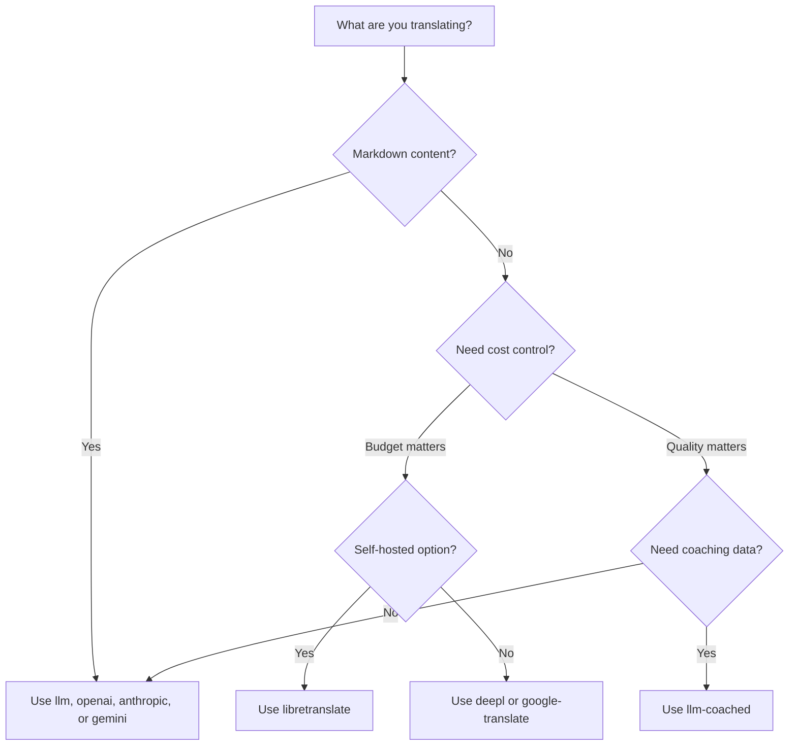

# Translation Methods

Rosetta supports ten translation methods. Each language pair can use a different method — you're not locked into one approach for your entire project.

## Method Comparison

### LLM Providers

Quality-focused, Markdown-aware, coaching-compatible. Best for content-heavy projects.

| Method | Key | What It Does |
|--------|-----|-------------|
| `llm` (default) | `OPENROUTER_API_KEY` | LLM via OpenRouter — 200+ models, auto-routing |
| `llm-coached` | `OPENROUTER_API_KEY` | LLM + grammar rules, dictionaries, style notes |
| `openai` | `OPENAI_API_KEY` | Direct OpenAI API (gpt-4o, gpt-4o-mini) |
| `anthropic` | `ANTHROPIC_API_KEY` | Direct Anthropic API (Claude Sonnet, Haiku, Opus) |
| `gemini` | `GEMINI_API_KEY` | Direct Google Gemini API (Flash, Pro) — free tier |

### Traditional MT

Speed and cost-focused. Best for high-volume key-value pairs.

| Method | Key | What It Does |
|--------|-----|-------------|
| `google-translate` | `GOOGLE_TRANSLATE_API_KEY` | Google Cloud Translation API v2 (130+ languages) |
| `deepl` | `DEEPL_API_KEY` | DeepL API with glossary support (30+ languages) |
| `microsoft-translator` | `MICROSOFT_TRANSLATOR_API_KEY` | Azure Cognitive Services Translator (100+ languages) |
| `libretranslate` | *(self-hosted)* | Self-hosted LibreTranslate (AGPL, free) |

### Infrastructure

| Method | Key | What It Does |
|--------|-----|-------------|
| `api` | *(per provider)* | Thin HTTP client for any REST translation endpoint |

## Decision Tree



---

## `llm` — LLM Translation (Default)

Translates via any LLM on [OpenRouter](https://openrouter.ai). This is the default method and the most versatile.

**How it works:**
1. Batches keys (default 30/batch) with register and context instructions
2. Sends to OpenRouter as a structured prompt
3. Parses the JSON response
4. Validates each translation through the [quality gate](/docs/concepts/quality-gate)
5. Writes passing translations, retries or rejects failures

**When to use:** Most projects. Especially content-heavy sites with Markdown, where code blocks and shortcodes need to be shielded.

**Configuration:**

```json
{
  "defaultMethod": "llm",
  "model": "google/gemini-3.5-flash"
}
```

## `llm-coached` — Coached LLM Translation

Same as `llm`, but with grammar rules, term dictionaries, and style notes injected into every prompt.

**How it works:**
1. Loads coaching data from `.rosetta/coaching/<locale>.json` or a plugin's `coaching/` directory
2. Injects grammar rules, dictionary terms, and style notes into the system prompt
3. Dictionary terms matching source keys are included as required terminology
4. Translation proceeds as with `llm`, with coaching data adding precision

**When to use:** Low-resource languages, domain-specific terminology (legal, medical), formal registers, or any case where the generic LLM output isn't precise enough.

**Coaching data format:**

```json title=".rosetta/coaching/fr.json"
{
  "grammar_rules": [
    "French adjectives agree in gender and number with the noun they modify",
    "Use 'vous' for formal contexts, 'tu' for informal"
  ],
  "dictionary": {
    "dashboard": "tableau de bord",
    "deployment": "déploiement",
    "settings": "paramètres"
  },
  "style_notes": "Prefer active voice. Avoid anglicisms where a native French term exists."
}
```

See also: [Low-Resource Languages Guide](https://mtevalarena.org/docs/community/low-resource-languages)

---

## `openai` — Direct OpenAI API

Translates directly via the OpenAI Chat Completions API. No OpenRouter middleman — your key, your account, your usage dashboard.

**Models:** `gpt-4o` (default), `gpt-4o-mini`

**Features:**
- ✅ Markdown-aware (content translation)
- ✅ Coaching support (grammar rules, dictionary overrides, style notes)
- ✅ JSON mode for structured key-value output
- ✅ Exponential backoff with retry

**Configuration:**

```json
{
  "pairs": {
    "en:fr": { "method": "openai", "model": "gpt-4o-mini" }
  }
}
```

```bash
export OPENAI_API_KEY=sk-proj-...
```

Get your key at [platform.openai.com/api-keys](https://platform.openai.com/api-keys).

## `anthropic` — Direct Anthropic API

Translates directly via the Anthropic Messages API. Uses the `system` parameter for coaching data, enabling Anthropic's prompt caching.

**Models:** `claude-sonnet-4-6` (default), `claude-haiku-4-5`, `claude-opus-4-7`

**Features:**
- ✅ Markdown-aware (content translation)
- ✅ Coaching support (grammar rules, dictionary overrides, style notes)
- ✅ System prompt caching (amortizes coaching cost across batches)
- ✅ Exponential backoff with retry

**Configuration:**

```json
{
  "pairs": {
    "en:ja": { "method": "anthropic", "model": "claude-haiku-4-5" }
  }
}
```

```bash
export ANTHROPIC_API_KEY=sk-ant-...
```

Get your key at [console.anthropic.com](https://console.anthropic.com/settings/keys).

## `gemini` — Direct Google Gemini API

Translates directly via the Google Gemini `generateContent` API. **Free tier available** — best zero-cost starting point.

**Models:** `gemini-2.5-flash` (default), `gemini-2.5-pro`

**Features:**
- ✅ Markdown-aware (content translation)
- ✅ Coaching support (grammar rules, dictionary overrides, style notes)
- ✅ JSON response mode via `responseMimeType`
- ✅ Free tier (generous daily quota)
- ✅ Exponential backoff with retry

**Configuration:**

```json
{
  "pairs": {
    "en:ko": { "method": "gemini", "model": "gemini-2.5-pro" }
  }
}
```

```bash
export GEMINI_API_KEY=AI...
```

Get your key at [aistudio.google.com/apikey](https://aistudio.google.com/apikey).

### Model Validation

The direct LLM providers (`openai`, `anthropic`, `gemini`) validate your model string on first use. This catches three categories of mistakes:

**Wrong method format** — Using an OpenRouter-style model path with a direct provider:

```
[WARN] OpenAI: model "google/gemini-3.5-flash" looks like an OpenRouter path.
       Direct providers use bare model names (e.g., "gpt-4o").
       To use OpenRouter models, set method to 'llm' instead.
```

**Wrong provider** — Using a model from a different provider entirely:

```
[WARN] Gemini: model "claude-sonnet-4-6" is an Anthropic model.
       This provider (gemini) cannot serve Anthropic models.
       Use --method anthropic or set "method": "anthropic" in config.
```

**Deprecated or misspelled model** — On first API call, rosetta fetches the provider's live model list and checks your model against it:

```
[WARN] Gemini: model "gemini-1.5-flash" not found in available models.
       Similar models: gemini-2.0-flash, gemini-2.5-flash, gemini-2.5-pro
       The API call will proceed — the provider will give the final verdict.
```

:::note These are warnings, not errors
Model validation logs warnings but does not block the API call. The provider API gives the final verdict — a future model name could match a different pattern, and we don't want to gate on heuristics.
:::

---

## `google-translate` — Google Cloud Translation API

Direct integration with Google Cloud Translation API v2. Uses the REST API — no SDK, no service account. Just the API key.

**When to use:** High-volume key-value string pairs where speed and cost matter more than nuance. Supports 130+ languages out of the box.

**Limitations:**
- ⚠️ **No Markdown awareness.** Will corrupt code blocks, shortcodes, and interpolation variables.
- No register/tone control
- No coaching or terminology enforcement

```bash
npx i18n-rosetta sync --method google-translate
```

:::tip Auto-detection
If only `GOOGLE_TRANSLATE_API_KEY` is set (no OpenRouter key), rosetta auto-switches to Google Translate. No config change needed.
:::

## `deepl` — DeepL API

Direct integration with the DeepL translation API. Supports glossaries for consistent terminology.

**When to use:** European languages where DeepL excels (German, French, Spanish, Dutch, Polish, etc.). Glossary support enforces consistent terminology without coaching data.

**Features:**
- ✅ Automatic free/pro endpoint detection (`:fx` suffix on free keys)
- ✅ Glossary creation and management
- ✅ Formality level control
- ⚠️ **No Markdown awareness** — key-value pairs only

**Configuration:**

```json
{
  "pairs": {
    "en:de": { "method": "deepl" }
  }
}
```

```bash
export DEEPL_API_KEY=your-key-here
```

Get your key at [deepl.com/pro-api](https://www.deepl.com/pro-api).

## `microsoft-translator` — Azure Cognitive Services

Direct integration with Microsoft Translator Text API v3.

**When to use:** Enterprise environments with existing Azure infrastructure. Supports 100+ languages including many that Google Translate doesn't cover.

**Features:**
- ✅ Up to 100 segments per request (high throughput)
- ✅ Optional region parameter for latency optimization
- ⚠️ **No Markdown awareness** — key-value pairs only
- ⚠️ **No content translation** — key-value pairs only

**Configuration:**

```json
{
  "pairs": {
    "en:ar": { "method": "microsoft-translator" }
  }
}
```

```bash
export MICROSOFT_TRANSLATOR_API_KEY=your-key
export MICROSOFT_TRANSLATOR_REGION=global  # optional
```

Get your key from the [Azure Portal](https://portal.azure.com) → Cognitive Services → Translator.

## `libretranslate` — Self-Hosted Translation

Self-hosted open-source translation using LibreTranslate. Runs locally or on your own infrastructure — zero API costs, full data sovereignty.

**When to use:** Projects that require offline translation, data privacy compliance (GDPR), or zero-cost operation. Especially useful for CI pipelines that shouldn't depend on external APIs.

**Features:**
- ✅ Self-hosted — no external API calls
- ✅ Free and open source (AGPL-3.0)
- ✅ Docker deployment available
- ⚠️ **No Markdown awareness** — key-value pairs only
- ⚠️ **No content translation** — key-value pairs only
- ⚠️ Quality varies by language pair

**Setup:**

```bash
# Run LibreTranslate locally with Docker
docker run -d -p 5000:5000 libretranslate/libretranslate

# Configure (optional — defaults to localhost:5000)
export LIBRETRANSLATE_API_URL=http://localhost:5000/translate
```

```json
{
  "pairs": {
    "en:es": { "method": "libretranslate" }
  }
}
```

---

## `api` — Remote Translation API

A thin HTTP client for community-hosted or IP-protected translation endpoints. Rosetta sends keys out and receives translations back — it contains zero translation logic.

**When to use:** When translation methods are hosted server-side (e.g., proprietary coaching data, fine-tuned models, FST pipelines that can't be distributed).

```json
{
  "pairs": {
    "en:crk": {
      "method": "api",
      "endpoint": "https://api.example.com/v1/translate",
      "apiKey": "your-key"
    }
  }
}
```

:::note OCAP-Compatible Community Translation
The `api` method is the bridge to **OCAP-compatible community-hosted translation**. Indigenous and minority-language communities can host their own translation endpoints — keeping coaching data, fine-tuned models, and linguistic IP under community control — while Rosetta connects to them as a thin client.

See [Support a Low-Resource Language](https://mtevalarena.org/docs/community/low-resource-languages) for the full community-hosting walkthrough, and [Serving a Method via API](/docs/guides/serving-a-method) for endpoint requirements.
:::

---

## Per-Pair Configuration

The real power is mixing methods per language pair:

```json title="i18n-rosetta.config.json"
{
  "version": 3,
  "pairs": {
    "en:fr": { "method": "deepl" },
    "en:ja": { "method": "openai", "model": "gpt-4o" },
    "en:ko": { "method": "gemini" },
    "en:ar": { "method": "microsoft-translator" },
    "en:crk": { "methodPlugin": "crk-coached-v1" }
  }
}
```

This translates French via DeepL (glossary support), Japanese via OpenAI (quality), Korean via Gemini (free tier), Arabic via Microsoft Translator (coverage), and Plains Cree via a coached plugin (specialized).

## Plugins

Plugins are pre-packaged translation recipes for specific language pairs. They're JSON manifests — not code — that tell rosetta which method to use, with what settings, and what quality has been benchmarked.

:::tip From eval harness to production in one command
Plugins developed and proven in the [eval harness](https://mtevalarena.org/docs/specifications/harness) can be installed directly — the method you validate there deploys here with a single `plugin install` command. See [MT Evaluation](https://mtevalarena.org/docs/leaderboard/rules) for the full evaluation workflow.
:::

```bash
i18n-rosetta plugin install ./french-formal-v1/
i18n-rosetta plugin list
i18n-rosetta plugin remove french-formal-v1
```

See the [Plugin Specification](/docs/reference/plugin-spec) for the full manifest format.

---

## Switching Providers

Moving between methods? The model format and env var change — here's the map:

### OpenRouter → Direct Provider

```diff title="i18n-rosetta.config.json"
 {
   "pairs": {
     "en:fr": {
-      "method": "llm",
-      "model": "openai/gpt-4o"
+      "method": "openai",
+      "model": "gpt-4o"
     }
   }
 }
```

```diff title="Environment variables"
- export OPENROUTER_API_KEY=sk-or-v1-...
+ export OPENAI_API_KEY=sk-proj-...
```

**Key differences:**
- OpenRouter uses `provider/model` format (e.g., `openai/gpt-4o`). Direct providers use bare model names (e.g., `gpt-4o`).
- Each direct provider has its own env var (`OPENAI_API_KEY`, `ANTHROPIC_API_KEY`, `GEMINI_API_KEY`).
- If you use the wrong model format, rosetta will warn you — see [Model Validation](#model-validation).

### Direct Provider → OpenRouter

```diff title="i18n-rosetta.config.json"
 {
   "pairs": {
     "en:ja": {
-      "method": "anthropic",
-      "model": "claude-sonnet-4-6"
+      "method": "llm",
+      "model": "anthropic/claude-sonnet-4-6"
     }
   }
 }
```

:::tip When to use OpenRouter vs Direct
**Use OpenRouter** when you want to switch between models without changing env vars, or when you want access to 200+ models from a single key. **Use direct providers** when you want simpler billing, lower latency (no middleman), or access to provider-specific features like Anthropic's prompt caching.
:::

---

## Cost Comparison

Approximate cost per 1,000 translated keys (assumes ~10 tokens per key, 30 keys per batch):

| Method | Cost / 1K Keys | Speed | Quality | Best For |
|--------|----------------|-------|---------|----------|
| `gemini` (Flash) | **Free** (within tier) | Fast | Good | Getting started, personal projects |
| `google-translate` | ~$0.02 | Fastest | Adequate | High-volume, European languages |
| `deepl` | ~$0.02 | Fast | Good | European languages, terminology |
| `microsoft-translator` | ~$0.01 | Fast | Adequate | Azure shops, broad language coverage |
| `libretranslate` | **Free** (self-hosted) | Varies | Fair | Air-gapped, GDPR, CI pipelines |
| `gemini` (Pro) | ~$0.07 | Medium | Very good | Quality-sensitive, free quota |
| `openai` (GPT-4o-mini) | ~$0.01 | Fast | Good | Budget LLM |
| `openai` (GPT-4o) | ~$0.10 | Medium | Very good | Quality-sensitive |
| `anthropic` (Haiku) | ~$0.01 | Fast | Good | Budget LLM |
| `anthropic` (Sonnet) | ~$0.10 | Medium | Very good | Quality-sensitive |
| `anthropic` (Opus) | ~$0.50 | Slow | Excellent | Maximum quality |
| `llm` (OpenRouter) | Varies by model | Varies | Varies | Model comparison, experimentation |

:::note These are estimates
Actual costs depend on your source text length, batch size, and provider pricing changes. Check each provider's current pricing page for exact rates.
:::

---

## See Also

- [Supported Languages](/docs/reference/supported-languages)
- [Coaching Data](/docs/concepts/coaching-data)
- [Support a Low-Resource Language](https://mtevalarena.org/docs/community/low-resource-languages)
- [Plugin Specification](/docs/reference/plugin-spec)
- [Serving a Method via API](/docs/guides/serving-a-method)
- [Quality Gate](/docs/concepts/quality-gate)
- [Architecture](/docs/concepts/architecture)
- [Troubleshooting](/docs/guides/troubleshooting) — model errors, API issues

