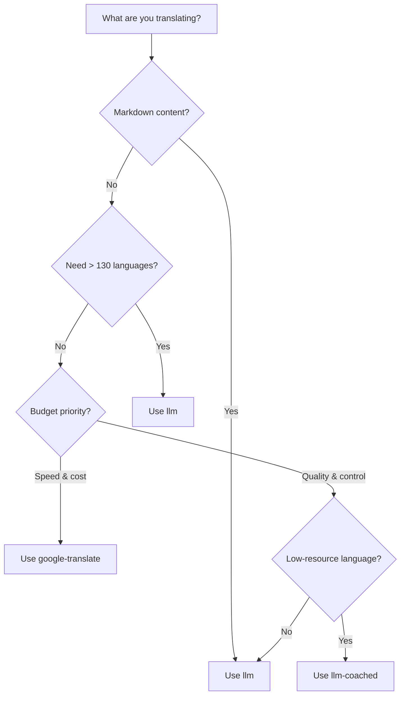

# Translation Methods

Rosetta supports four translation methods. Each language pair can use a different method — you're not locked into one approach for your entire project.

## Method Comparison

| Method | Key | What It Does | Best For |
|--------|-----|-------------|----------|
| `llm` (default) | `OPENROUTER_API_KEY` | LLM translation via OpenRouter | General purpose, content-heavy projects |
| `llm-coached` | `OPENROUTER_API_KEY` | LLM + grammar rules & dictionaries | Low-resource languages, specialized domains |
| `google-translate` | `GOOGLE_TRANSLATE_API_KEY` | Google Cloud Translation API v2 | High-volume key-value pairs (130+ languages) |
| `api` | *(per provider)* | Remote translation API | IP-protected or community-hosted models |

## Decision Tree



## `llm` — LLM Translation (Default)

Translates via any LLM on [OpenRouter](https://openrouter.ai). This is the default method and the most versatile.

**How it works:**
1. Batches keys (default 30/batch) with register and context instructions
2. Sends to OpenRouter as a structured prompt
3. Parses the JSON response
4. Validates each translation through the [quality gate](/docs/concepts/quality-gate)
5. Writes passing translations, retries or rejects failures

**When to use:** Most projects. Especially content-heavy sites with Markdown, where code blocks and shortcodes need to be shielded.

**Configuration:**

```json
{
  "defaultMethod": "llm",
  "model": "openai/gpt-4o-mini"
}
```

## `llm-coached` — Coached LLM Translation

Same as `llm`, but with grammar rules, term dictionaries, and style notes injected into every prompt.

**How it works:**
1. Loads coaching data from `.rosetta/coaching/<locale>.json` or a plugin's `coaching/` directory
2. Injects grammar rules, dictionary terms, and style notes into the system prompt
3. Dictionary terms matching source keys are included as required terminology
4. Translation proceeds as with `llm`, with coaching data adding precision

**When to use:** Low-resource languages, domain-specific terminology (legal, medical), formal registers, or any case where the generic LLM output isn't precise enough.

**Coaching data format:**

```json title=".rosetta/coaching/fr.json"
{
  "grammar_rules": [
    "French adjectives agree in gender and number with the noun they modify",
    "Use 'vous' for formal contexts, 'tu' for informal"
  ],
  "dictionary": {
    "dashboard": "tableau de bord",
    "deployment": "déploiement",
    "settings": "paramètres"
  },
  "style_notes": "Prefer active voice. Avoid anglicisms where a native French term exists."
}
```

See also: [Low-Resource Languages Guide](/docs/guides/low-resource-languages)

## `google-translate` — Google Cloud Translation API

Direct integration with Google Cloud Translation API v2. Uses the REST API — no SDK, no service account, no `pip install`. Just the API key.

**When to use:** High-volume key-value string pairs where speed and cost matter more than nuance. Supports 130+ languages out of the box.

**Limitations:**
- ⚠️ **No Markdown awareness.** Google Translate has no concept of code blocks, shortcodes, or interpolation variables. It *will* corrupt structured content.
- No register/tone control
- No coaching or terminology enforcement

```bash
# Force Google Translate
npx i18n-rosetta sync --method google-translate
```

:::tip Auto-detection
If only `GOOGLE_TRANSLATE_API_KEY` is set (no OpenRouter key), rosetta auto-switches to Google Translate. No config change needed.
:::

## `api` — Remote Translation API

A thin HTTP client for community-hosted or IP-protected translation endpoints. Rosetta sends keys out and receives translations back — it contains zero translation logic.

**When to use:** When translation methods are hosted server-side (e.g., proprietary coaching data, fine-tuned models, FST pipelines that can't be distributed).

```json
{
  "pairs": {
    "en:crk": {
      "method": "api",
      "endpoint": "https://api.example.com/v1/translate",
      "apiKey": "your-key"
    }
  }
}
```

:::note OCAP-Compatible Community Translation
The `api` method is the bridge to **OCAP-compatible community-hosted translation**. Indigenous and minority-language communities can host their own translation endpoints — keeping coaching data, fine-tuned models, and linguistic IP under community control — while Rosetta connects to them as a thin client.

See [Support a Low-Resource Language](/docs/guides/low-resource-languages) for the full community-hosting walkthrough, and [Serving a Method via API](/docs/guides/serving-a-method) for endpoint requirements.
:::

## Per-Pair Configuration

The real power is mixing methods per language pair:

```json title="i18n-rosetta.config.json"
{
  "version": 3,
  "pairs": {
    "en:fr": { "method": "google-translate" },
    "en:ja": { "method": "llm", "model": "google/gemini-2.5-pro" },
    "en:crk": { "methodPlugin": "crk-coached-v1" }
  }
}
```

This translates French via Google Translate (fast, cheap), Japanese via a premium LLM (quality), and Plains Cree via a coached plugin (specialized).

## Plugins

Plugins are pre-packaged translation recipes for specific language pairs. They're JSON manifests — not code — that tell rosetta which method to use, with what settings, and what quality has been benchmarked.

:::tip From eval harness to production in one command
Plugins developed and proven in the [eval harness](/docs/eval/harness) can be installed directly — the method you validate there deploys here with a single `plugin install` command. See [MT Evaluation](/docs/eval/) for the full evaluation workflow.
:::

```bash
i18n-rosetta plugin install ./french-formal-v1/
i18n-rosetta plugin list
i18n-rosetta plugin remove french-formal-v1
```

See the [Plugin Specification](/docs/reference/plugin-spec) for the full manifest format.

---

## See Also

- [Supported Languages](/docs/reference/supported-languages)
- [Coaching Data](/docs/concepts/coaching-data)
- [Support a Low-Resource Language](/docs/guides/low-resource-languages)
- [Plugin Specification](/docs/reference/plugin-spec)
- [Serving a Method via API](/docs/guides/serving-a-method)
- [Quality Gate](/docs/concepts/quality-gate)
- [Architecture](/docs/concepts/architecture)
