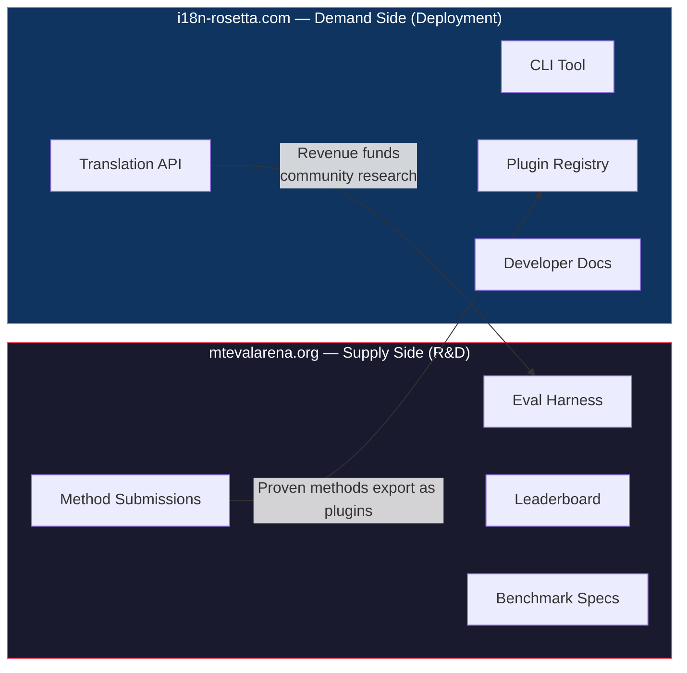
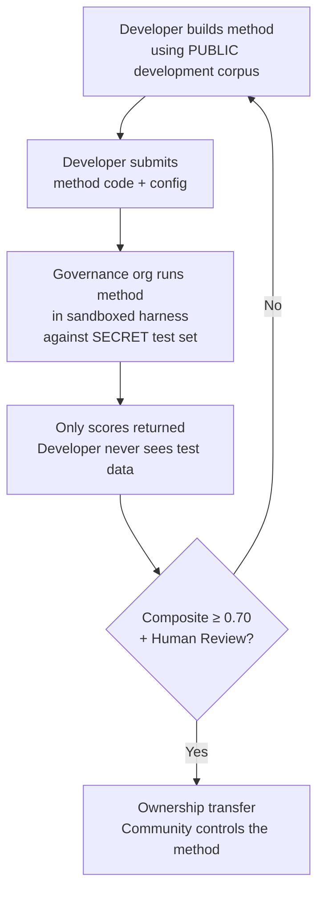

> **Executive Summary.** Machine translation for the world's 6,800+ underserved languages is not a model-training problem — it is an *infrastructure* problem. No single model, lab, or company will solve it. This document describes a platform architecture that turns the global community of ML engineers, linguists, and language speakers into a distributed research lab: anyone builds a translation method, the platform proves whether it works against sovereign evaluation data, and proven methods deploy to production with revenue flowing to the communities whose languages they serve. The mechanism is competitive crowdsourcing with cryptographic sovereignty — a combination that has not been attempted before.

---

## 1. The Problem: Machine Translation ≠ Machine Learning

Machine translation for low-resource languages (LRLs) is commonly framed as a machine learning problem: collect data, train a model, deploy. This framing is wrong, and the error is consequential — it directs funding, talent, and infrastructure toward an approach that structurally cannot work for the majority of the world's languages.

### 1.1 Why the ML Framing Fails

The standard ML pipeline for MT requires three things: large parallel corpora, validated evaluation benchmarks, and a deployment path. For the ~130 languages served by Google Translate, all three exist. For the remaining 6,800+, none do.

| Requirement | High-Resource Languages | Low-Resource Languages |
|-------------|------------------------|----------------------|
| **Parallel corpora** | Millions of sentence pairs (Europarl, UN Corpus, OpenSubtitles) | Hundreds to low thousands, if any |
| **Evaluation benchmarks** | WMT, FLORES, NTREX — standardized, reproducible | No standard benchmarks; ad hoc evaluation |
| **Deployment path** | Google Translate, DeepL, Azure — commercial APIs | Nothing. No API, no product, no market. |

The ML approach works when the data exists to train on and the market exists to deploy into. When neither condition holds, the problem isn't "we need a better model" — it's "we need a different mechanism entirely."

### 1.2 What MT for LRLs Actually Requires

Translation for underserved languages is not primarily a training problem. It is a **method engineering** problem — the challenge of assembling available resources (LLMs, morphological tools, community knowledge, linguistic rules) into working translation pipelines, then proving they work with rigorous evaluation.

The distinction matters:

| Dimension | ML Approach | Method Engineering Approach |
|-----------|------------|---------------------------|
| **Core activity** | Train a model on data | Combine tools, prompts, and linguistic knowledge into a pipeline |
| **Bottleneck** | Parallel data volume | Engineering creativity + evaluation infrastructure |
| **Who can contribute** | Teams with GPU clusters and datasets | Anyone with an API key, a dictionary, and an idea |
| **Evaluation** | BLEU/chrF on held-out test sets | Morphological validation + human review + automated metrics |
| **Deployment** | Serve the model | Package the method as a plugin |

Modern LLMs already contain latent knowledge of many low-resource languages — enough to produce output that *looks* plausible. The problem is that this output is often morphologically invalid (the model hallucinates word forms that don't exist in the language). The engineering challenge is: how do you extract what the LLM knows, validate it against linguistic reality, and package the result for production use?

This is why we benchmark **methods**, not models. A method is the full recipe: model selection + prompt engineering + tool usage + pre/post-processing + coaching data + retry strategies. Two teams using the same model with different methods will get different scores. That's the point.

### 1.3 Why Polysynthetic Languages Break Everything

Many of the world's most underserved languages are **polysynthetic** — they encode entire sentences into single words through productive morphological processes. Consider the Plains Cree word:

> **ê-kî-nitawi-kîskinwahamâkosiyân**
> *"when I had gone to school"*

One word. It encodes tense (past), direction (going to), the root (learn), voice (passive/reflexive), and person (first singular). English needs six words for what Cree expresses in one.

This breaks standard MT at every level:

- **Tokenization** — BPE and SentencePiece shred polysynthetic words into meaningless fragments, because they were designed for concatenative morphology.
- **Hallucination** — LLMs produce plausible-looking strings that are not valid words. A non-speaker cannot tell the difference. Without morphological validation, hallucinations are invisible.
- **Evaluation** — Word-level metrics (BLEU) penalize the natural inflectional variation that is fundamental to how these languages work. Character-level metrics (chrF++) are better but still insufficient without structural validation.

The solution isn't a bigger model or more training data. It's **infrastructure that catches hallucinations before they reach users** — morphological analyzers (FSTs) that can definitively say "this is not a word in this language."

---

## 2. Why Existing Approaches Don't Work

### 2.1 Commercial MT

Commercial translation services optimize for market volume. If a language has fewer than a million internet-connected speakers, the engineering investment doesn't justify the revenue. This is a structural incentive problem: the languages most in need of technology are precisely those the market will never serve.

### 2.2 Academic Research

Academic MT research focuses overwhelmingly on high-resource language pairs because that's where the training data, shared tasks, and publication venues are. Researchers who work on low-resource pairs struggle to publish, struggle to fund compute, and struggle to deploy — because deployment infrastructure for LRLs doesn't exist.

### 2.3 One-Off Competitions

You could run a Kaggle competition: "English→Plains Cree, best chrF++ wins $10,000." Here's what happens:

1. Someone wins, submits a notebook, collects the prize, goes home.
2. The notebook rots in Kaggle's archive. Nobody deploys it. Nobody maintains it.
3. The test set is eventually published — contaminated forever.
4. The governance organization uploaded their linguistic data to Google's infrastructure under Google's terms of service, with no real control over the lifecycle.
5. No deployment bridge. A winning notebook is not a working API.

A one-time bounty attracts bounty hunters. An ongoing leaderboard with community governance creates sustained engagement.

### 2.4 Fine-Tuning

Fine-tuning an open model on parallel text is the obvious ML approach. But for most LRLs, the parallel corpus needed for fine-tuning is exactly the data that doesn't exist — and creating it requires the same bilingual speakers and community engagement that the fine-tuning is meant to replace. You can't bootstrap your way out of a data scarcity problem with a technique that requires data.

---

## 3. The Solution: Competitive Crowdsourcing with Sovereign Evaluation

The platform inverts the traditional approach: instead of one team building one model, **the global community competes to build the best translation method**, the platform proves whether it works, and proven methods deploy to production with the language community retaining ownership and control.

### 3.1 The Full Loop

```
  ┌─────────────────────────────────────────────────────────────────────┐
  │                                                                     │
  │   1. DEVELOP                          2. BENCHMARK                  │
  │   ─────────                           ────────────                  │
  │   Anyone builds a translation         Eval harness scores it.       │
  │   method — coached LLM, FST           Automated metrics: chrF++,    │
  │   pipeline, hybrid, anything.         FST acceptance, exact match.  │
  │                                                                     │
  │           │                                    │                     │
  │           ▼                                    ▼                     │
  │                                                                     │
  │   3. PROVE                            4. TRANSFER                   │
  │   ────────                            ───────────                   │
  │   Leaderboard ranks methods.          Code ownership → governance   │
  │   Reproducible, fingerprinted,        org. Community controls the   │
  │   comparable.                         method.                       │
  │                                                                     │
  │           │                                    │                     │
  │           ▼                                    ▼                     │
  │                                                                     │
  │   5. DEPLOY                           6. SUSTAIN                    │
  │   ─────────                           ──────────                    │
  │   Method exported as rosetta          90% revenue → community.      │
  │   plugin. Developers consume          10% → infrastructure.         │
  │   via API.                            Funds more research. ──┐      │
  │                                                              │      │
  └──────────────────────────────────────────────────────────────┘      │
                                                                        │
  ┌─ Meets deployable threshold? ───────────────────────────────────────┘
  │  YES + Human Review → TRANSFER → DEPLOY → SUSTAIN → loops back
  │  NOT YET → back to DEVELOP
  └─────────────────────────────────────────────────────────────────────
```

Each stage has a specific function:

| Stage | What Happens | Who Benefits |
|-------|-------------|--------------|
| **Develop** | A researcher, student, or hobbyist builds a translation method using whatever tools they want — LLM prompting, FST pipelines, dictionaries, fine-tuned models, rule-based systems, or hybrids | The contributor learns, experiments, publishes |
| **Benchmark** | The eval harness scores the method against a standardized corpus with reproducible metrics. Every run produces a [run card](https://mtevalarena.org/docs/specifications/benchmark#3-run-card-schema) — a complete record of what was tested and how it performed | Researchers get reproducible, comparable results |
| **Prove** | Results appear on the public leaderboard. Methods are ranked, compared, and scrutinized. The community sees what works and what doesn't | Everyone gains visibility into the state of the art |
| **Transfer** | For Indigenous languages, methods that reach the Deployable threshold (composite ≥ 0.70) AND pass human validation have their code ownership transferred to the language community's governance organization | Community gains a revenue-generating asset |
| **Deploy** | The method is exported as an [i18n-rosetta](https://github.com/gamedaysuits/i18n-rosetta) plugin and served via API. Developers consume translations without needing to understand the underlying method | Developers get translation for languages commercial APIs don't serve |
| **Sustain** | API revenue is split: 90% to the community, 10% to infrastructure. Revenue funds more linguistic research, corpus development, and community programs | The flywheel sustains itself after initial establishment |

### 3.2 Why Competitive Dynamics Work

Competition is not incidental — it is the mechanism. Here's why:

**Diversity of approaches.** The best method for English→Plains Cree might be an FST-gated coached LLM. The best for English→Quechua might be a dictionary-augmented pipeline. The best for English→Inuktitut might be a fine-tuned model bootstrapped from the Nunavut Hansard corpus. No single team or approach will dominate across all languages. The leaderboard reveals which *kinds* of approaches work for which *kinds* of languages — a meta-result that is itself a research contribution.

**Sustained engagement.** A leaderboard is never finished. Someone always wants to beat the top score. Every submission donates compute and intellectual effort to the problem. Unlike a one-time grant, the competitive dynamic generates ongoing research investment from the global community.

**Low barrier to entry.** You need an API key, a dictionary, and an idea. The eval harness is open source. The corpus format is simple JSON. A linguistics student can compete with a well-resourced lab — and sometimes win, because domain knowledge (understanding the language) can outweigh compute resources.

**Deployment bridge.** The same method that scores well in the harness deploys to production with one config change. "Prove it here, deploy it there." This is the gap that Kaggle, WMT shared tasks, and academic publications don't bridge.

### 3.3 The Platform Architecture

The ecosystem is physically split into two sites serving two audiences:



**[mtevalarena.org](https://mtevalarena.org)** is the R&D proving ground. Its audience is ML engineers, linguists, and researchers. Everything here is about building, testing, and proving translation methods.

**[i18n-rosetta.com](https://i18n-rosetta.com)** is the deployment platform. Its audience is developers who need translation for their apps. They don't need to understand how the methods work — they just call the API.

The bridge between them is the **method plugin**: a proven method, packaged for deployment, owned by the community.

---

## 4. Sovereign Evaluation: Why the Infrastructure Matters

The evaluation infrastructure is not a technical detail — it is the core of the sovereignty model. Standard evaluation (upload your test set to a shared platform) doesn't work for Indigenous languages because it surrenders control over the linguistic data.

### 4.1 The Sovereignty Mechanism



The developer never sees the gold-standard evaluation data. They develop against a public development corpus, then submit their method code to the governance organization, which runs it in a sandbox against the secret test set. Only scores come back. This is not just security — it is a direct implementation of the **OCAP® principles** (Ownership, Control, Access, Possession) that Indigenous data governance requires.

### 4.2 Why This Can't Run on Someone Else's Platform

On Kaggle, the governance organization uploads their linguistic data to Google's infrastructure under Google's terms of service. They can't revoke access on their own timeline. They can't attach custom legal terms (like ownership transfer) to submissions. They have no cryptographic guarantee the data won't be used for other purposes. Data sovereignty means the community controls the evaluation endpoint, holds the keys, and can shut it down.

---

## 5. Who This Serves

### For ML Engineers & Researchers

An open leaderboard with standardized benchmarks for language pairs that no shared task covers. Reproduce any result with the eval harness. Publish your method. Beat the top score. Every submission is fingerprinted to a specific configuration and dataset version — no ambiguity about what was tested.

### For Language Communities

Ownership and control over translation technology built for your language. The competitive dynamic means multiple teams are working on your language simultaneously — you benefit from all of them and own the result. Revenue from API usage funds community programs on your terms.

### For Funders & Grant Reviewers

Transparent, reproducible metrics to evaluate translation research proposals. Measurable outcomes beyond publications: API usage, revenue generated, quality metrics over time, language coverage. A single successful method creates a self-sustaining revenue stream — the grant's impact compounds rather than ending when the funding does.

### For Developers

Translation for languages no commercial API serves. One CLI command (`npx i18n-rosetta sync`) translates your locale files using community-proven methods. Use Google Translate for French, a coached LLM for Plains Cree, and a community API for Quechua — all in the same project, all with the same interface.

### For Students

An open challenge with real-world impact. Build a translation method for an underserved language, benchmark it, and publish your results. The infrastructure is free, the datasets are open, and the leaderboard doesn't care whether you're at a top-10 university or working from a library terminal.

---

## 6. Social and Technical Context

### 6.1 Language Revitalization Is Accelerating

Language revitalization efforts are growing worldwide. Immersion schools, community language nests, and digital archiving projects are expanding across Indigenous communities in Canada, the United States, Australia, New Zealand, and Northern Europe. These efforts need technology — specifically, translation technology that respects community sovereignty over linguistic data.

### 6.2 LLMs Changed the Baseline

Before 2023, building any MT capability for a polysynthetic language required significant NLP expertise, custom model training, and large compute budgets. Modern LLMs have changed the baseline: a well-crafted prompt with coaching data and morphological validation can produce usable translations for some language pairs — no training required. This dramatically lowers the barrier to entry for method development. The problem has shifted from "how do we build a model?" to "how do we build a pipeline that validates and corrects what the model produces?"

### 6.3 The Open-Source Benchmarking Culture

AI benchmarking has become its own culture. Leaderboards drive innovation. Competitions attract talent. The Chatbot Arena, LMSYS, Hugging Face Open LLM Leaderboard — these platforms demonstrate that competitive evaluation drives rapid progress. We take that energy and point it at translation for the 6,800+ languages that commercial MT will never serve.

### 6.4 Indigenous Data Sovereignty Is Non-Negotiable

The OCAP® principles (Ownership, Control, Access, Possession), the CARE principles (Collective Benefit, Authority to Control, Responsibility, Ethics), and frameworks like Te Mana Raraunga (Māori Data Sovereignty) are not optional add-ons — they are structural requirements for any technology that touches Indigenous linguistic resources. Our evaluation infrastructure implements these principles architecturally, not just as policy statements.

---

## 7. Current State

### What Exists Today

- **i18n-rosetta** — Production-ready CLI tool. 10 translation methods, per-pair configuration, quality gates, 5 file formats. [Published on npm](https://www.npmjs.com/package/i18n-rosetta).
- **MT Eval Harness** — Working evaluation framework. chrF++, FST acceptance, and exact match metrics implemented. Run card schema finalized. Fingerprinting and integrity verification working.
- **EDTeKLA Dev v1** — 124-entry Plains Cree evaluation corpus (CC BY-NC-SA 4.0), sourced from the University of Alberta's EdTeKLA research group.
- **FLORES+ Devtest** — 1,012 sentences × 39 languages (CC BY-SA 4.0).
- **Arena website** — Docusaurus-based documentation site with leaderboard, specifications, tutorials, and sovereignty framework.
- **Benchmark Specification** — [Canonical spec](https://mtevalarena.org/docs/specifications/benchmark) defining corpus schema, run card format, metrics, composite weights, and evaluation protocol.

### What's Next

| Phase | What | Status |
|-------|------|--------|
| Baseline sweep | 12 models × 3 temperatures × 2 coaching configs on EDTeKLA | 🔲 Planned |
| Composite score | Weighted metric implementation in harness | ✅ Done |
| Semantic score | Verdict-weighted score from CrkSemanticMetric plugin | ✅ Done |
| Morphological accuracy | Per-morpheme scoring against gold-standard analysis | 🔲 Planned |
| Equivalent match | Variant-class matching via CrkLinterMetric plugin | ✅ Done |
| Rosetta API | Metered API for community-owned methods | 🔲 Planned |
| Second language | Expand to a second language pair (Inuktitut, Quechua, or Sámi) | 🔲 Planned |

---

## 8. Getting Started

**Build a method:** Clone the [eval harness](https://github.com/gamedaysuits/gds-mt-eval-harness), run a baseline experiment, and see where you land on the leaderboard.

**Contribute a corpus:** If you speak an underserved language, even 50 curated translation pairs are enough to open a new leaderboard track. See [For Language Communities](https://mtevalarena.org/docs/community/for-language-communities).

**Deploy translations:** Install [i18n-rosetta](https://github.com/gamedaysuits/i18n-rosetta) and translate your app with `npx i18n-rosetta sync`.

**Fund the effort:** See [The Economic Model](https://mtevalarena.org/docs/sovereignty/economic-model) for cost frameworks and sustainability projections.

---

## See Also

- **[Benchmark Specification](https://mtevalarena.org/docs/specifications/benchmark)** — the canonical technical spec for evaluation, metrics, and sovereignty
- **[MT Eval Arena](https://mtevalarena.org)** — the R&D proving ground
- **[i18n-rosetta](https://github.com/gamedaysuits/i18n-rosetta)** — the deployment platform
- **[Support a Low-Resource Language](https://mtevalarena.org/docs/community/low-resource-languages)** — deep dive into polysynthetic MT challenges and approaches

---

*This document is the entry point for anyone encountering the project for the first time. For the full technical specification, see the [Benchmark Specification](https://mtevalarena.org/docs/specifications/benchmark). For agent-optimized navigation, see [AGENTS.md](https://github.com/gamedaysuits/i18n-rosetta/blob/main/AGENTS.md).*
