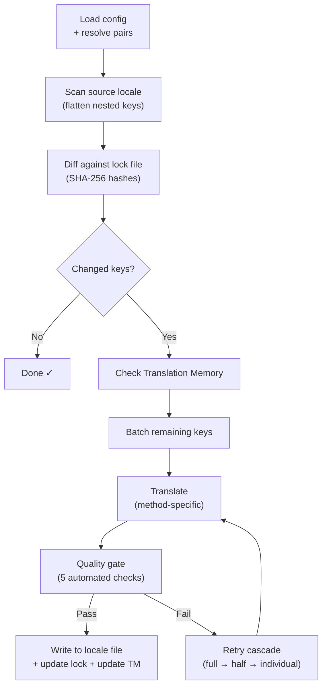

# How i18n-rosetta Works

i18n-rosetta translates your app's locale files with one command. Here's what happens under the hood.

## The Pipeline

When you run `npx i18n-rosetta sync`, rosetta executes a six-stage pipeline:



**Key design decisions:**

- **Change detection via SHA-256 hashes.** Rosetta tracks every source value with a hash in `.i18n-rosetta.lock`. When you update an English string, only that key gets re-translated. This is why `sync` is fast on repeat runs — it does minimal work.

- **Translation Memory caching.** Before making any API call, rosetta checks `.rosetta/tm.json` for cached translations (keyed by source text + locale + method). On a typical re-sync after changing one key, 142 keys come from cache and 1 key hits the API.

- **Quality gate before write.** Every translation passes five automated checks (empty, source echo, hallucination loop, length inflation, script compliance) before it touches your files. Failures are logged, never silently accepted.

- **Retry cascade on failure.** If a batch fails (JSON parse error, API timeout), rosetta retries with progressively smaller batches: full → half → individual. This isolates the problem key without blocking the rest.

## Translation Methods

Rosetta supports four translation methods, each suitable for different scenarios:

| Method | How it works | Best for |
|--------|-------------|----------|
| **`llm`** | Structured prompt to any OpenRouter model | Well-resourced languages |
| **`llm-coached`** | Same prompt + grammar rules, dictionary, and style notes | Languages where LLMs make predictable errors |
| **`google-translate`** | Google Cloud Translation API batch request | High-resource languages with good GT support |
| **`api`** | HTTP POST to your own endpoint | Custom pipelines, community-controlled models |

Methods are configured per language pair. You might use `google-translate` for French but `llm-coached` for Plains Cree — each pair gets the method that works best for it.

## Coaching Data

For `llm-coached` pairs, coaching data gives the LLM explicit linguistic knowledge: grammar rules, forced terminology, and style preferences. This is injected into every prompt as structured context.

```json title="coaching/crk.json"
{
  "grammar_rules": ["Animate nouns take different plural forms than inanimate nouns"],
  "dictionary": {"welcome": "ᑕᓂᓯ", "settings": "ᐃᑕᐢᑌᐘᐃᓇ"},
  "style_notes": "Use Standard Roman Orthography (SRO) unless explicitly configured otherwise."
}
```

Coaching data is the primary mechanism for improving translation quality without fine-tuning a model. Change the rules → re-run sync → see if it helps. Iteration is instant.

## Plugins

Plugins are pre-packaged translation recipes for specific language pairs. They're JSON manifests — not code — that tell rosetta which method to use, with what settings, and what quality has been benchmarked.

```bash
i18n-rosetta plugin install ./crk-coached-v3/
i18n-rosetta sync   # uses the installed plugin for en→crk
```

Plugins bridge the gap between research and production: a method that scores well in the [MT Eval Arena](https://mtevalarena.org) can be packaged as a plugin and deployed here.

## The Bigger Picture

i18n-rosetta is one half of a two-part ecosystem:

- **[MT Eval Arena](https://mtevalarena.org)** — where translation methods are **developed and proven** with reproducible benchmarking
- **i18n-rosetta** — where proven methods are **deployed** to translate real content

The [Eval Harness Bridge](/docs/guides/bridge) connects the two. A method that proves itself in the Arena deploys here. Speaker feedback from production improves the next version.

---

## Dive Deeper

- [How Sync Works](/docs/concepts/how-sync-works) — detailed step-by-step pipeline walkthrough
- [Quality Gate](/docs/concepts/quality-gate) — the five automated checks
- [Translation Memory](/docs/concepts/translation-memory) — caching and cost savings
- [Translation Methods](/docs/guides/translation-methods) — detailed method comparison
- [Architecture](/docs/concepts/architecture) — system design overview
