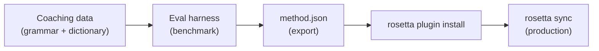

# Tutorial: Build a Translation Plugin

Build a custom translation method from scratch, benchmark it, and deploy it as a rosetta plugin. This is the complete workflow for adding a new language pair that no off-the-shelf API supports.

**What you'll build:** A coached translation plugin for formal French with enforced terminology, grammar rules, and benchmark scores.

**Time:** 30–45 minutes

**Prerequisites:**
- i18n-rosetta installed (`npm install --save-dev i18n-rosetta`)
- An OpenRouter API key (`OPENROUTER_API_KEY`)
- Python 3.10+ (for the eval harness)

---

## Step 1: Identify the Problem

You're translating a SaaS dashboard into French. The default `llm` method produces correct but inconsistent translations:

- Sometimes "dashboard" becomes "tableau de bord," other times "panneau de contrôle"
- The tone alternates between `tu` and `vous` forms
- Technical terms get anglicized inconsistently

You need **terminology enforcement** and **register control** that the generic LLM prompt doesn't provide.

## Step 2: Create Coaching Data

Create a coaching file that encodes your linguistic requirements:

```bash
mkdir -p .rosetta/coaching
```

```json title=".rosetta/coaching/fr.json"
{
  "grammar_rules": [
    "Always use the 'vous' form for formal register",
    "French adjectives agree in gender and number with their noun",
    "Use the present tense for UI instructions, not the imperative",
    "Preserve sentence-final punctuation style from the source"
  ],
  "dictionary": {
    "dashboard": "tableau de bord",
    "deployment": "déploiement",
    "settings": "paramètres",
    "environment variable": "variable d'environnement",
    "webhook": "webhook",
    "API key": "clé API",
    "sign in": "se connecter",
    "sign out": "se déconnecter",
    "repository": "dépôt",
    "pull request": "demande de tirage"
  },
  "style_notes": "Formal technical French. Prefer native French terms over anglicisms where established equivalents exist. Keep UI labels concise — 3 words maximum where possible."
}
```

**What each field does:**
- **`grammar_rules`** — Injected into the LLM system prompt as explicit constraints
- **`dictionary`** — Matched against source keys; when a dictionary term appears, it's injected as "required terminology" in the prompt
- **`style_notes`** — Appended to the system prompt as general style guidance

## Step 3: Configure the Pair

Tell rosetta to use `llm-coached` for French:

```json title="i18n-rosetta.config.json"
{
  "version": 3,
  "inputLocale": "en",
  "localesDir": "./locales",
  "pairs": {
    "en:fr": {
      "method": "llm-coached",
      "model": "openai/gpt-4o-mini"
    }
  },
  "languages": {
    "fr": {
      "register": "Formal technical French (vous-form)",
      "name": "French"
    }
  }
}
```

## Step 4: Test It

```bash
npx i18n-rosetta sync --dry
```

Review the dry-run output. Check that:
- ✅ Dictionary terms are used consistently ("tableau de bord," not "panneau de contrôle")
- ✅ `vous` form is used throughout
- ✅ Technical terms match your dictionary

Then run the real sync:

```bash
npx i18n-rosetta sync
```

## Step 5: Benchmark with the Eval Harness (Optional)

If you want quality scores — and you do, because plugins ship with benchmark data — use the companion eval harness.

### Install the Harness

```bash
git clone https://github.com/gamedaysuits/gds-mt-eval-harness.git
cd gds-mt-eval-harness
pip install -r requirements.txt
```

### Create a Reference Corpus

Create a file with source strings and known-good translations:

```json title="corpus/french-formal.json"
[
  {
    "source": "Dashboard",
    "reference": "Tableau de bord"
  },
  {
    "source": "Sign in to your account",
    "reference": "Connectez-vous à votre compte"
  },
  {
    "source": "Your deployment is ready",
    "reference": "Votre déploiement est prêt"
  },
  {
    "source": "Environment variables",
    "reference": "Variables d'environnement"
  }
]
```

### Run the Benchmark

```bash
python harness.py eval \
  --corpus corpus/french-formal.json \
  --source en \
  --target fr \
  --method llm-coached \
  --model openai/gpt-4o-mini
```

The harness outputs:
- **chrF++** — Character-level F-score (0–100). Above 70 is strong.
- **BLEU** — N-gram overlap (0–100). Above 40 is solid for coached translation.
- **Exact match rate** — Proportion of translations matching the reference exactly.

### Export the Plugin

Once you're satisfied with the scores:

```bash
python harness.py export \
  --name french-formal-v1 \
  --output ./french-formal-v1/
```

This creates:

```
french-formal-v1/
├── method.json          # Manifest with config + benchmarks
└── coaching/
    └── fr.json          # Your coaching data
```

## Step 6: Install the Plugin in Rosetta

```bash
npx i18n-rosetta plugin install ./french-formal-v1/
```

This copies the plugin to `.rosetta/methods/french-formal-v1/`.

Update your config to use it:

```json title="i18n-rosetta.config.json"
{
  "pairs": {
    "en:fr": {
      "methodPlugin": "french-formal-v1"
    }
  }
}
```

## Step 7: Verify

```bash
# Check plugin is installed and shows benchmark scores
npx i18n-rosetta status

# Run a sync with the plugin
npx i18n-rosetta sync

# Audit licensing status
npx i18n-rosetta provenance
```

The `status` output will show:

```
en → fr
  Method:    french-formal-v1 (llm-coached)
  Model:     openai/gpt-4o-mini
  Quality:   high
  chrF++:    74.2
  BLEU:      46.8
  Exact:     42%
```

## What You've Built



You now have:
1. **Coaching data** — Grammar rules and terminology that enforce consistency
2. **Benchmark scores** — Quantified quality that ships with the plugin
3. **A portable plugin** — `method.json` + coaching data, installable on any machine
4. **Production deployment** — Integrated into your sync pipeline

## Next Steps

- **[Plugin Specification](/docs/reference/plugin-spec)** — Full manifest format reference
- **[Translation Methods](/docs/guides/translation-methods)** — Compare all four methods
- **[Low-Resource Languages](/docs/guides/low-resource-languages)** — Apply this pattern to languages without API coverage
- **[Translate 30 Languages](/docs/tutorials/translate-30-languages)** — Scale your project to a global audience
