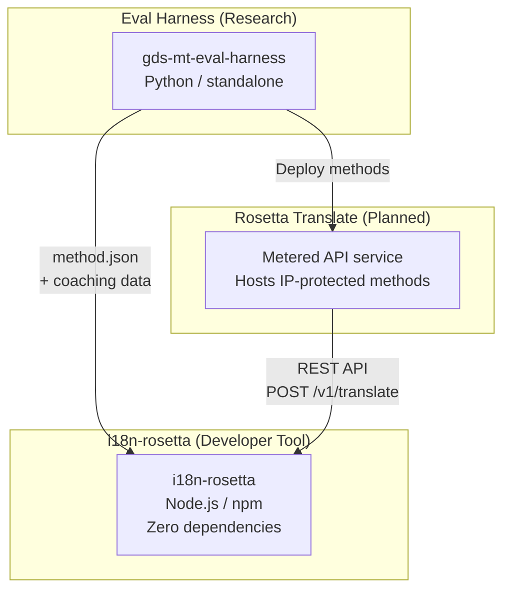
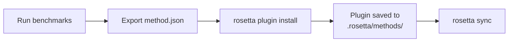
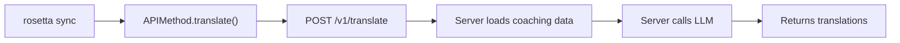
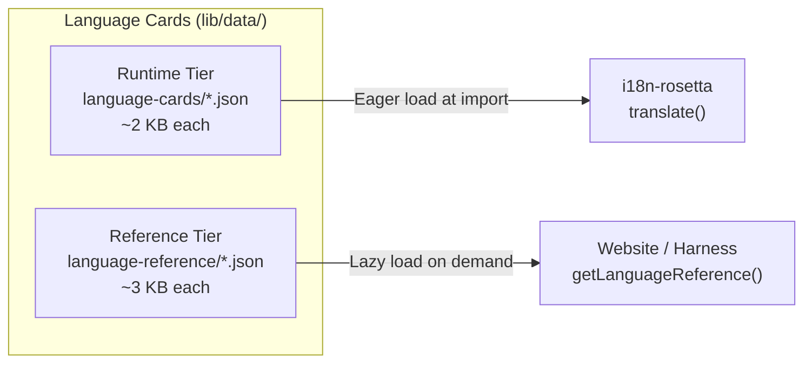

# البنية

يتكون النظام البيئي لترجمة Rosetta من ثلاث أدوات مستقلة تعمل معًا من خلال عقود محددة بوضوح. لا تعتمد أي منها على الأخرى في وقت البناء. تتواصل هذه الأدوات من خلال **تنسيق مشترك للمكونات الإضافية للطرق (method plugin format)** و**عقد واجهة برمجة تطبيقات REST**.

## الأجزاء الثلاثة



### i18n-rosetta (هذا المشروع)

أداة المطورين مفتوحة المصدر. تترجم ملفات اللغة باستخدام طرق قابلة للتوصيل (pluggable methods). خالية من التبعيات، اختيارية التكوين، وجاهزة للعمل مباشرة.

**الطرق المدمجة:**
- `llm` ← OpenRouter / أي نموذج لغوي كبير (LLM) (أكثر من 200 نموذج)
- `llm-coached` ← نموذج لغوي كبير (LLM) + توجيه للقواعد والقاموس
- `openai` ← واجهة برمجة تطبيقات OpenAI المباشرة (GPT-4o، GPT-4o-mini)
- `anthropic` ← واجهة برمجة تطبيقات Anthropic المباشرة (Claude Sonnet، Haiku، Opus)
- `gemini` ← واجهة برمجة تطبيقات Google Gemini المباشرة (Flash، Pro — تتوفر فئة مجانية)
- `google-translate` ← واجهة برمجة تطبيقات Google Cloud Translation v2
- `deepl` ← واجهة برمجة تطبيقات DeepL مع دعم المسرد
- `microsoft-translator` ← Azure Cognitive Services Translator
- `libretranslate` ← LibreTranslate ذاتي الاستضافة (AGPL، مجاني)
- `api` ← اتصال بسيط (Thin pipe) بأي نقطة نهاية REST بعيدة

### Eval Harness (المشروع المرافق)

أداة بحثية لتطوير واختبار وقياس أداء طرق الترجمة. عندما تصل طريقة ما إلى جودة مقبولة، تقوم الأداة (harness) بتصدير **مكون إضافي للطريقة (method plugin)** — وهو عبارة عن بيان (manifest) `method.json` وملفات بيانات توجيه اختيارية.

لا تعمل أداة harness أبدًا داخل rosetta. إنها أداة منفصلة تنتج مخرجات ثابتة (ملفات JSON). تقتصر مهمة Rosetta على قراءة هذه الملفات.

[← Eval Harness على GitHub](https://github.com/gamedaysuits/gds-mt-eval-harness)

### Rosetta Translate (مخطط له)

خدمة واجهة برمجة تطبيقات (API) مدفوعة الاستخدام تستضيف طرق ترجمة مملوكة على جانب الخادم — حيث لا تغادر المطالبات (prompts) وبيانات التوجيه ومسارات المعالجة اللغوية الخادم أبدًا.

## كيفية اتصالها

### Eval Harness ← i18n-rosetta (تصدير أحادي الاتجاه)



**العقد**: [مواصفات المكون الإضافي](/docs/reference/plugin-spec)

### Rosetta Translate ← i18n-rosetta (واجهة برمجة التطبيقات في وقت التشغيل)



تعتبر `APIMethod` في Rosetta بمثابة **قناة اتصال بسيطة (dumb pipe)**. فهي ترسل المفاتيح وتتلقى الترجمات. ولا تحتوي على أي منطق ترجمة أو أي محتوى مملوك.

## ماذا يعرف كل جزء عن الأجزاء الأخرى

| الأداة | هل تعرف عن rosetta؟ | هل تعرف عن Rosetta Translate؟ | هل تعرف عن harness؟ |
|------|---------------------|-------------------------------|---------------------|
| **i18n-rosetta** | *(هي rosetta)* | نعم — طريقة `api` تستدعيها | لا — تقرأ فقط صادرات المكون الإضافي |
| **Rosetta Translate** | نعم — تخدم طلباتها | *(هي Rosetta Translate)* | لا — تتلقى الطرق المنشورة |
| **Eval Harness** | نعم — تصدر تنسيق المكون الإضافي | لا — يتم نشر الطرق بشكل منفصل | *(هي أداة harness)* |

## سيناريوهات المستخدم

### السيناريو 1: مجاني، بدون تكوين (معظم المستخدمين)

```bash
export OPENROUTER_API_KEY=sk-...
npx i18n-rosetta sync
```

يستخدم طريقة `llm` المدمجة. بدون مكونات إضافية، وبدون Rosetta Translate، وبدون harness.

### السيناريو 2: خط الأساس لترجمة Google

```bash
export GOOGLE_TRANSLATE_API_KEY=AIza...
npx i18n-rosetta sync
```

يستخدم طريقة `google-translate` المدمجة. لا حاجة لمكونات إضافية.

### السيناريو 3: مكون إضافي مفتوح مع توجيه مدمج

```bash
rosetta plugin install ./french-formal-v1/
rosetta sync
```

يحتوي المكون الإضافي على `type: "llm-coached"` ← تستخدم rosetta مفتاح OpenRouter الخاص بالمستخدم. بيانات التوجيه محلية (بدون استدعاء للخادم).

### السيناريو 4: توجيه ذاتي (بدون مكون إضافي، بدون harness)

```json title="i18n-rosetta.config.json"
{
  "pairs": {
    "en:fr": { "method": "llm-coached" }
  }
}
```

يحتفظ المستخدم بقواعد النحو والقاموس الخاص به في `.rosetta/coaching/fr.json`.

## بطاقات اللغة (Language Cards)

يتم تكوين كل لغة في rosetta من خلال **بطاقة لغة (Language Card)** — وهي عبارة عن ملف JSON يحتوي على إعدادات مسبقة للأسلوب (register presets)، وقواعد الرسمية، وعلامات دعم الطرق، واصطلاحات الطباعة. بطاقات اللغة هي التكوين الخاص بكل لغة والذي يوجه الترجمة الموجهة بالأسلوب (register-steered translation).



تنقسم البطاقات إلى مستويين لضمان الأداء على نطاق واسع (تستهدف أكثر من 700 لغة):

- **مستوى وقت التشغيل (Runtime tier)** (`language-cards/`): يتم تحميله مبكرًا — الحقول التي يحتاجها محرك الترجمة (الأساليب، الرسمية، دعم الطرق، قواعد الطباعة).
- **المستوى المرجعي (Reference tier)** (`language-reference/`): يتم تحميله عند الحاجة — وثائق المطورين (التحديات اللغوية، عائلة اللغة، موارد معالجة اللغات الطبيعية NLP).

يتم إنشاء كلا المستويين من مصادر موثوقة (IANA، CLDR، Glottolog) باستخدام `scripts/generate-language-card.mjs`، ثم يتم تنقيحها بشريًا لضمان الدقة اللغوية.

## مبادئ التصميم

1. **لا توجد تبعيات دائرية.** الجسور أحادية الاتجاه.
2. **Rosetta هي النواة خفيفة الوزن.** خالية من التبعيات، والتكوين اختياري. المكونات الإضافية وواجهة برمجة التطبيقات (API) هي إضافات.
3. **حماية الملكية الفكرية (IP) هي جزء من البنية.** تبقى التقنيات المملوكة على جانب الخادم. لا تتضمن حزمة npm أي شيء مملوك.
4. **تنسيق المكون الإضافي هو العقد.** يتدفق كل شيء من خلال `method.json`.
5. **لكل أداة وظيفة واحدة.** أداة Harness ← تطوير الطرق. Rosetta Translate ← استضافة الطرق. Rosetta ← ترجمة الملفات.

---

## انظر أيضًا

- [طرق الترجمة](/docs/guides/translation-methods) — كيف تعمل كل طريقة مدمجة
- [مواصفات المكون الإضافي](/docs/reference/plugin-spec) — تنسيق البيان method.json
- [Eval Harness](https://mtevalarena.org/docs/specifications/harness) — الأداة البحثية المرافقة
- [تقديم طريقة عبر واجهة برمجة التطبيقات (API)](/docs/guides/serving-a-method) — استضافة مسارات ترجمة مخصصة
- [دعم لغة قليلة الموارد](https://mtevalarena.org/docs/community/low-resource-languages) — حالة الاستخدام التي قادت هذه البنية