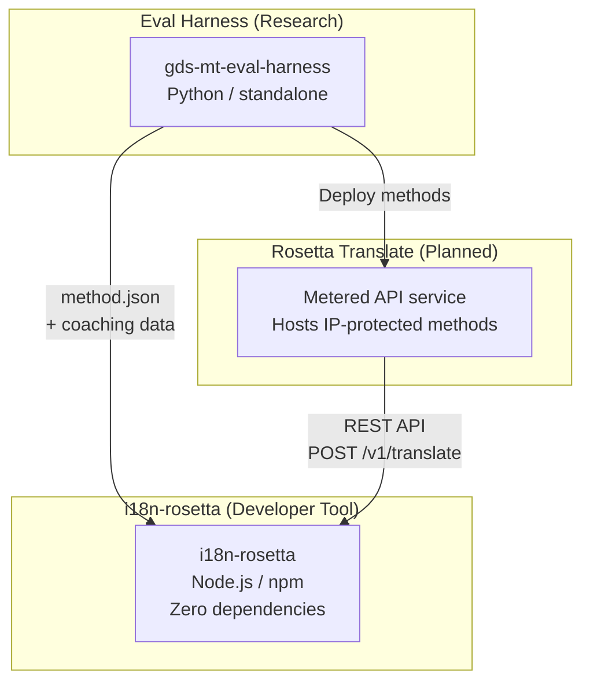
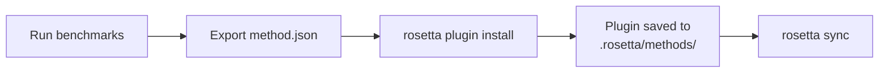
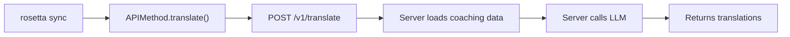

# البنية

تتكون بيئة الترجمة Rosetta من ثلاث أدوات مستقلة تعمل معًا من خلال عقود محددة بوضوح. لا تعتمد أي منها على الأخرى في وقت البناء. وتتواصل فيما بينها من خلال **تنسيق مكون إضافي للطريقة** مشترك و**عقد واجهة برمجة تطبيقات REST**.

## الأجزاء الثلاثة



### i18n-rosetta (هذا المشروع)

أداة المطورين مفتوحة المصدر. تقوم بترجمة ملفات اللغات باستخدام طرق قابلة للإدراج. خالية من التبعيات، والإعدادات فيها اختيارية، وتعمل مباشرة فور تثبيتها.

**الطرق المدمجة:**
- `llm` ← OpenRouter / أي نموذج لغوي كبير (LLM) (أكثر من 200 نموذج)
- `llm-coached` ← نموذج لغوي كبير (LLM) + توجيه للقواعد/القاموس
- `openai` ← واجهة برمجة تطبيقات OpenAI المباشرة (GPT-4o، GPT-4o-mini)
- `anthropic` ← واجهة برمجة تطبيقات Anthropic المباشرة (Claude Sonnet، Haiku، Opus)
- `gemini` ← واجهة برمجة تطبيقات Google Gemini المباشرة (Flash، Pro — تتوفر باقة مجانية)
- `google-translate` ← واجهة برمجة تطبيقات Google Cloud Translation الإصدار الثاني (v2)
- `deepl` ← واجهة برمجة تطبيقات DeepL مع دعم المسرد
- `microsoft-translator` ← Azure Cognitive Services Translator
- `libretranslate` ← LibreTranslate ذاتي الاستضافة (AGPL، مجاني)
- `api` ← قناة اتصال خفيفة لأي نقطة نهاية REST عن بُعد

### Eval Harness (المشروع المرافق)

أداة بحثية لتطوير واختبار وتقييم أداء طرق الترجمة. عندما تصل طريقة ما إلى جودة مقبولة، تقوم الأداة بتصدير **مكون إضافي للطريقة** — وهو عبارة عن ملف بيان `method.json` وملفات بيانات توجيهية اختيارية.

لا تعمل أداة Eval Harness أبدًا داخل rosetta. إنها أداة منفصلة تنتج مخرجات ثابتة (ملفات JSON). وتقوم Rosetta ببساطة بقراءة تلك الملفات.

[← Eval Harness على GitHub](https://github.com/gamedaysuits/gds-mt-eval-harness)

### Rosetta Translate (مخطط له)

خدمة واجهة برمجة تطبيقات (API) مدفوعة حسب الاستخدام تستضيف طرق ترجمة مملوكة على جانب الخادم — حيث لا تغادر التلقينات وبيانات التوجيه ومسارات المعالجة اللغوية الخادم أبدًا.

## كيفية اتصالها

### Eval Harness ← i18n-rosetta (تصدير في اتجاه واحد)



**العقد**: [مواصفات المكون الإضافي](/docs/reference/plugin-spec)

### Rosetta Translate ← i18n-rosetta (واجهة برمجة التطبيقات في وقت التشغيل)



تُعد `APIMethod` الخاصة بـ Rosetta **قناة اتصال بسيطة**. فهي ترسل المفاتيح وتتلقى الترجمات في المقابل. ولا تحتوي على أي منطق للترجمة أو أي محتوى مملوك.

## ماذا يعرف كل جزء عن الأجزاء الأخرى

| الأداة | هل تعرف عن rosetta؟ | هل تعرف عن Rosetta Translate؟ | هل تعرف عن harness؟ |
|------|---------------------|-------------------------------|---------------------|
| **i18n-rosetta** | *(هي rosetta)* | نعم — تقوم طريقة `api` باستدعائها | لا — تقرأ فقط صادرات المكون الإضافي |
| **Rosetta Translate** | نعم — تخدم طلباتها | *(هي Rosetta Translate)* | لا — تتلقى الطرق المنشورة |
| **Eval Harness** | نعم — تصدر تنسيق المكون الإضافي | لا — يتم نشر الطرق بشكل منفصل | *(هي harness)* |

## سيناريوهات المستخدم

### السيناريو 1: مجاني، بدون إعدادات (معظم المستخدمين)

```bash
export OPENROUTER_API_KEY=sk-...
npx i18n-rosetta sync
```

يستخدم طريقة `llm` المدمجة. لا توجد مكونات إضافية، ولا Rosetta Translate، ولا harness.

### السيناريو 2: خط الأساس لـ Google Translate

```bash
export GOOGLE_TRANSLATE_API_KEY=AIza...
npx i18n-rosetta sync
```

يستخدم طريقة `google-translate` المدمجة. لا حاجة لمكونات إضافية.

### السيناريو 3: مكون إضافي مفتوح مع توجيه مدمج

```bash
rosetta plugin install ./french-formal-v1/
rosetta sync
```

يحتوي المكون الإضافي على `type: "llm-coached"` ← تستخدم rosetta مفتاح OpenRouter الخاص بالمستخدم. بيانات التوجيه محلية (لا يوجد استدعاء للخادم).

### السيناريو 4: توجيه ذاتي (بدون مكون إضافي، بدون harness)

```json title="i18n-rosetta.config.json"
{
  "pairs": {
    "en:fr": { "method": "llm-coached" }
  }
}
```

يحتفظ المستخدم بقواعد النحو والقاموس الخاصين به في `.rosetta/coaching/fr.json`.

## مبادئ التصميم

1. **لا توجد تبعيات دائرية.** الجسور تعمل في اتجاه واحد.
2. **Rosetta هي النواة الخفيفة.** خالية من التبعيات، والإعدادات اختيارية. المكونات الإضافية وواجهة برمجة التطبيقات (API) هي إضافات تكميلية.
3. **حماية الملكية الفكرية (IP) جزء من البنية.** تظل التقنيات المملوكة على جانب الخادم. لا تتضمن حزمة npm أي محتوى مملوك.
4. **تنسيق المكون الإضافي هو العقد.** يتدفق كل شيء من خلال `method.json`.
5. **لكل أداة وظيفة واحدة.** Harness ← تطوير الطرق. Rosetta Translate ← استضافة الطرق. Rosetta ← ترجمة الملفات.

---

## انظر أيضًا

- [طرق الترجمة](/docs/guides/translation-methods) — كيف تعمل كل طريقة مدمجة
- [مواصفات المكون الإضافي](/docs/reference/plugin-spec) — تنسيق ملف البيان method.json
- [Eval Harness](https://mtevalarena.org/docs/specifications/harness) — الأداة البحثية المرافقة
- [تقديم طريقة عبر واجهة برمجة التطبيقات (API)](/docs/guides/serving-a-method) — استضافة مسارات ترجمة مخصصة
- [دعم لغة منخفضة الموارد](https://mtevalarena.org/docs/community/low-resource-languages) — حالة الاستخدام التي قادت إلى هذه البنية