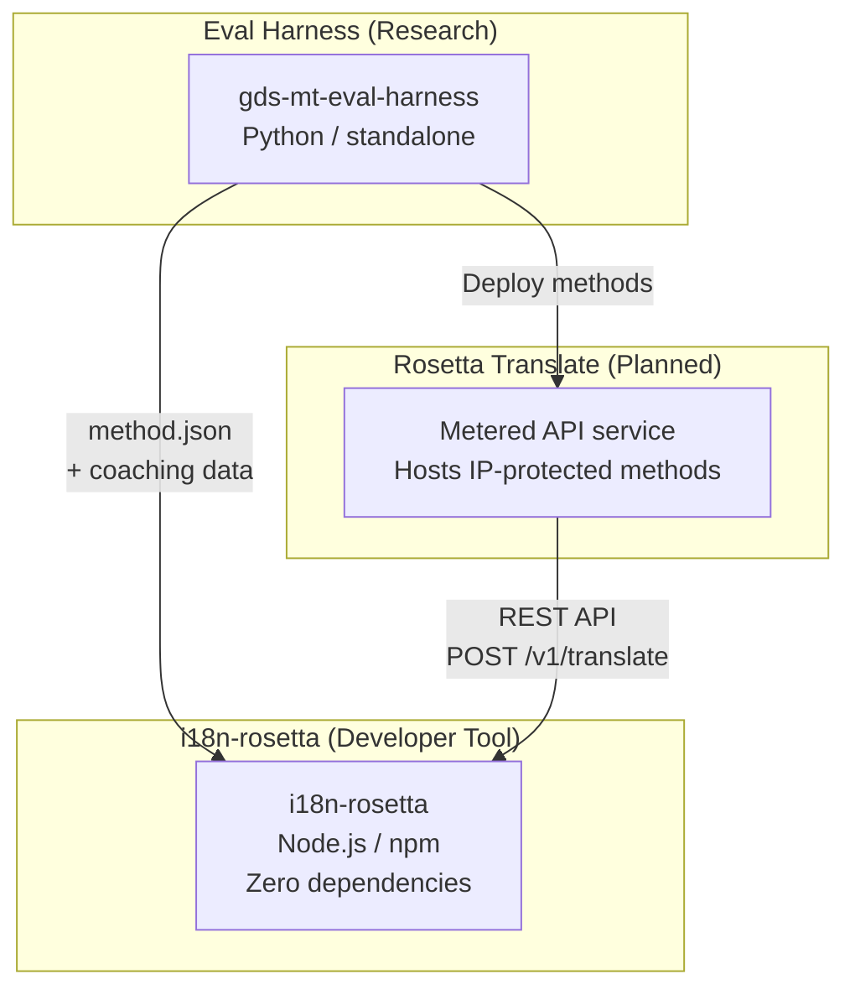
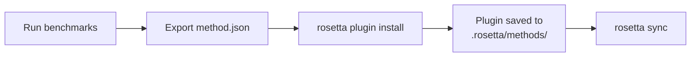
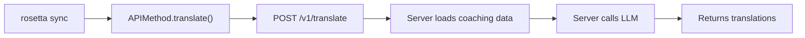

# البنية الهندسية

تتكون منظومة الترجمة Rosetta من ثلاث أدوات مستقلة تعمل معًا من خلال عقود محددة بوضوح. لا تعتمد أي منها على الأخرى في وقت البناء (build time). وتتواصل فيما بينها من خلال **تنسيق method plugin** مشترك و**عقد REST API**.

## الأجزاء الثلاثة



### i18n-rosetta (هذا المشروع)

أداة المطورين مفتوحة المصدر. تقوم بترجمة ملفات اللغات (locale files) باستخدام طرق قابلة للتوصيل (pluggable methods). خالية من التبعيات (Zero dependencies)، اختيارية التكوين (config-optional)، وتعمل مباشرة دون إعداد مسبق (works out of the box).

**الطرق المدمجة:**
- `llm` ← OpenRouter / أي LLM
- `llm-coached` ← LLM + توجيه للقواعد/القاموس (coaching)
- `google-translate` ← Google Cloud Translation API
- `api` ← قناة اتصال بسيطة (Thin pipe) لأي واجهة برمجة تطبيقات (API) عن بُعد

### Eval Harness (المشروع المرافق)

أداة بحثية لتطوير واختبار وقياس أداء طرق الترجمة. عندما تصل طريقة ما إلى جودة مقبولة، تقوم الأداة (harness) بتصدير **method plugin** — وهو عبارة عن بيان (manifest) `method.json` وملفات بيانات توجيهية (coaching data) اختيارية.

لا تعمل أداة harness أبدًا داخل rosetta. إنها أداة منفصلة تنتج مخرجات ثابتة (ملفات JSON). وتقوم Rosetta بمجرد قراءة هذه الملفات.

[← Eval Harness على GitHub](https://github.com/gamedaysuits/gds-mt-eval-harness)

### Rosetta Translate (مخطط له)

خدمة واجهة برمجة تطبيقات (API) مدفوعة الاستخدام تستضيف طرق ترجمة مملوكة (proprietary) على جانب الخادم (server-side) — حيث لا تغادر المطالبات (prompts) وبيانات التوجيه (coaching data) ومسارات المعالجة اللغوية (linguistic pipelines) الخادم أبدًا.

## كيفية اتصالها ببعضها

### Eval Harness ← i18n-rosetta (تصدير في اتجاه واحد)



**العقد**: [مواصفات المكون الإضافي (Plugin Specification)](/docs/reference/plugin-spec)

### Rosetta Translate ← i18n-rosetta (واجهة برمجة التطبيقات في وقت التشغيل)



تُعد `APIMethod` الخاصة بـ Rosetta بمثابة **قناة صماء (dumb pipe)**. فهي ترسل المفاتيح وتستقبل الترجمات. ولا تحتوي على أي منطق ترجمة أو أي محتوى مملوك.

## ما يعرفه كل جزء عن الأجزاء الأخرى

| الأداة | هل تعرف عن rosetta؟ | هل تعرف عن Rosetta Translate؟ | هل تعرف عن harness؟ |
|------|---------------------|-------------------------------|---------------------|
| **i18n-rosetta** | *(هي rosetta)* | نعم — طريقة `api` تستدعيها | لا — تقرأ فقط صادرات الـ plugin |
| **Rosetta Translate** | نعم — تخدم طلباتها | *(هي Rosetta Translate)* | لا — تتلقى الطرق المنشورة |
| **Eval Harness** | نعم — تصدر تنسيق الـ plugin | لا — يتم نشر الطرق بشكل منفصل | *(هي الـ harness)* |

## سيناريوهات المستخدم

### السيناريو 1: مجاني، بدون تكوين (معظم المستخدمين)

```bash
export OPENROUTER_API_KEY=sk-...
npx i18n-rosetta sync
```

يستخدم طريقة `llm` المدمجة. لا توجد مكونات إضافية (plugins)، ولا Rosetta Translate، ولا harness.

### السيناريو 2: خط الأساس لـ Google Translate

```bash
export GOOGLE_TRANSLATE_API_KEY=AIza...
npx i18n-rosetta sync
```

يستخدم طريقة `google-translate` المدمجة. لا حاجة لمكونات إضافية.

### السيناريو 3: مكون إضافي مفتوح مع توجيه مدمج

```bash
rosetta plugin install ./french-formal-v1/
rosetta sync
```

يحتوي المكون الإضافي على `type: "llm-coached"` ← تستخدم rosetta مفتاح OpenRouter الخاص بالمستخدم. بيانات التوجيه محلية (لا يوجد استدعاء للخادم).

### السيناريو 4: توجيه ذاتي (بدون مكون إضافي، بدون harness)

```json title="i18n-rosetta.config.json"
{
  "pairs": {
    "en:fr": { "method": "llm-coached" }
  }
}
```

يحتفظ المستخدم بقواعد النحو والقاموس الخاص به في `.rosetta/coaching/fr.json`.

## مبادئ التصميم

1. **لا توجد تبعيات دائرية (circular dependencies).** الجسور تعمل في اتجاه واحد.
2. **Rosetta هي النواة خفيفة الوزن.** خالية من التبعيات، والتكوين فيها اختياري. المكونات الإضافية وواجهة برمجة التطبيقات (API) هي إضافات تكميلية.
3. **حماية الملكية الفكرية (IP) هي جزء من البنية الهندسية.** التقنيات المملوكة تبقى على جانب الخادم. لا تتضمن حزمة npm أي شيء مملوك.
4. **تنسيق المكون الإضافي هو العقد.** كل شيء يتدفق من خلال `method.json`.
5. **لكل أداة وظيفة واحدة.** أداة Harness ← تطوير الطرق. خدمة Rosetta Translate ← استضافة الطرق. أداة Rosetta ← ترجمة الملفات.