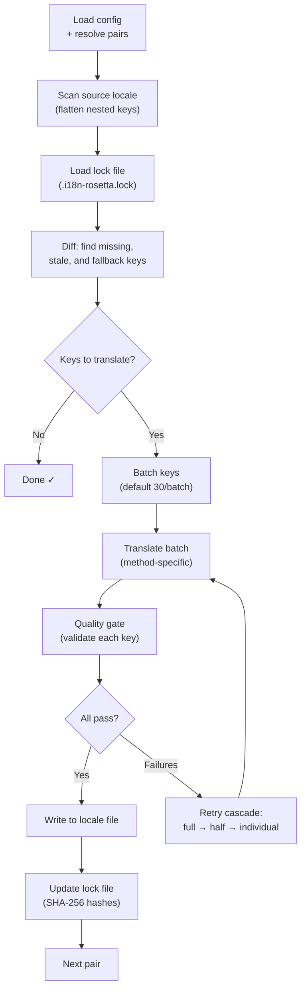

# كيف تعمل المزامنة

يُعد الأمر `sync` العملية الأساسية في rosetta. إليك ما يحدث عند تشغيل `npx i18n-rosetta sync`.

## نظرة عامة على مسار العمل



## خطوة بخطوة

### 1. تحديد الإعدادات

يقوم rosetta بتحميل `i18n-rosetta.config.json` (أو يكتشف الإعدادات تلقائيًا). ويقوم بتحديد:
- اللغة المصدر واللغات المستهدفة
- مخطط الأزواج (أي مجموعات المصدر←الهدف سيتم معالجتها)
- إعدادات الطريقة، والنموذج، والجودة لكل زوج

### 2. فحص المصدر

يتم تحميل ملف اللغة المصدر وتسطيحه (flattened) إلى خريطة مفتاح←قيمة:

```json
// Input (nested)
{ "hero": { "title": "Welcome", "subtitle": "Build" } }

// Flattened
{ "hero.title": "Welcome", "hero.subtitle": "Build" }
```

### 3. اكتشاف التغييرات

يقرأ rosetta ملف `.i18n-rosetta.lock`، الذي يخزن تجزئات SHA-256 لقيم المصدر المترجمة مسبقًا. لكل مفتاح، يتحقق مما يلي:

| الحالة | الإجراء |
|-----------|--------|
| المفتاح مفقود من الهدف | **ترجمة** |
| تغيرت تجزئة المصدر منذ آخر مزامنة | **إعادة ترجمة** (قديم) |
| تبدأ القيمة المستهدفة بـ `[EN]` | **إعادة ترجمة** (عنصر نائب احتياطي) |
| تجزئة المصدر لم تتغير، والمفتاح موجود | **تخطي** |

لهذا السبب يقوم rosetta بترجمة ما تغير فقط — فهو لا يعيد ترجمة ملفك بالكامل في كل عملية مزامنة.

### 4. التجميع في دفعات

يتم تجميع المفاتيح في دفعات (الافتراضي: 30 مفتاحًا/دفعة لـ LLM، و128 لـ Google Translate). يقلل التجميع من رحلات الذهاب والإياب لواجهة برمجة التطبيقات (API) مع إبقاء المطالبات (prompts) قابلة للإدارة.

### 5. الترجمة

يتم إرسال كل دفعة إلى طريقة الترجمة المكونة:

- **`llm`**: مطالبة مهيكلة (Structured prompt) إلى OpenRouter مع تعليمات توجيهية للأسلوب (register) والجنس
- **`llm-coached`**: نفس الشيء، ولكن مع إدراج القواعد النحوية، والقاموس، وملاحظات الأسلوب
- **`google-translate`**: طلب دفعة عبر Google Cloud Translation API v2
- **`api`**: طلب HTTP POST إلى نقطة نهاية (endpoint) بعيدة

رسالة النظام (الأسلوب، توجيهات الجنس، القواعد) متطابقة عبر الدفعات للغة معينة، مما يتيح **التخزين المؤقت للمطالبات (prompt caching)** — يقوم مزودون مثل Anthropic و Google بتخزين رسائل النظام المتكررة مؤقتًا، مما يقلل من تكاليف الرموز (tokens).

### 6. بوابة الجودة

يتم التحقق من صحة كل ترجمة قبل كتابتها على القرص. يتم تشغيل خمسة فحوصات:

| الفحص | ما يكتشفه | مثال |
|-------|----------------|---------|
| **فارغ/خالٍ** | لم يُرجع النموذج شيئًا | `""` |
| **صدى المصدر** | أرجع النموذج الإدخال الإنجليزي | `"Welcome"` للغة اليابانية |
| **حلقة هلوسة** | تكرار الثلاثيات (trigrams) | `"Qo' Qo' Qo' Qo'"` |
| **تضخم الطول** | المخرجات أطول بـ 4 أضعاف أو أكثر من المصدر | مصدر من 10 أحرف ← مخرجات من 50 حرفًا |
| **التوافق مع نظام الكتابة** | نظام كتابة خاطئ للغة | نص لاتيني للغة العربية |

يتم تسجيل حالات الفشل ببادئة `[GATE]`. لا توجد إجراءات احتياطية صامتة.

راجع [بوابة الجودة](/docs/concepts/quality-gate) للحصول على التفاصيل.

### 7. سلسلة إعادة المحاولة

عند فشل تحليل JSON أو حدوث أخطاء على مستوى الدفعة، يعيد rosetta المحاولة بدفعات أصغر تدريجيًا:

```
Full batch (30 keys) → Failed
Half batch (15 keys) → Failed
Individual keys (1 each) → Isolates the problem key
```

يتم تحديد سقف ميزانية إعادة المحاولة بواسطة `maxRetries` (الافتراضي: 3) لمنع الإنفاق المفرط للرموز.

### 8. الكتابة والقفل

تُكتب الترجمات الناجحة في ملف اللغة المستهدفة، مع الحفاظ على بنية التداخل (nesting) الأصلية. يتم تحديث ملف القفل بتجزئات SHA-256 الجديدة.

## نجاح جزئي

لا تؤدي دفعة واحدة فاشلة إلى حظر الباقي. إذا نجحت 9 دفعات من أصل 10، فسيتم كتابة هذه الـ 9. يتم تسجيل الدفعة الفاشلة، ويمكنك إعادة تشغيل `sync` لإعادة المحاولة.

## التشغيل التجريبي

معاينة ما سيتغير دون كتابة أي ملفات:

```bash
npx i18n-rosetta sync --dry
```

## فرض إعادة الترجمة

فرض إعادة ترجمة مفاتيح معينة حتى لو لم تتغير:

```bash
npx i18n-rosetta sync --force-keys "hero.title,nav.about"
```

## تقدير التكلفة

قبل الترجمة، يُنشئ rosetta **تقرير تكلفة ما قبل المزامنة** يوضح التكاليف المقدرة لكل زوج. يتم تشغيل هذا تلقائيًا خلال كل `sync` — تراه قبل إجراء أي استدعاءات لواجهة برمجة التطبيقات (API).

```
╔══════════════════════════════════════════════════════════╗
║  Cost Estimate                                          ║
╠════════════╦═══════╦════════════╦════════════════════════╣
║ Pair       ║ Keys  ║ Est. Cost  ║ Method                 ║
╠════════════╬═══════╬════════════╬════════════════════════╣
║ en → fr    ║   142 ║ $0.07      ║ google-translate       ║
║ en → ja    ║    38 ║   —        ║ llm (model-dependent)  ║
║ en → crk   ║    38 ║   —        ║ llm-coached            ║
╚════════════╩═══════╩════════════╩════════════════════════╝
```

### ما يتم تقديره

توفر كل طريقة ترجمة تقدير التكلفة الخاص بها:

| الطريقة | أساس التكلفة | الدقة |
|--------|-----------|-----------|
| `google-translate` | السعر المعلن من Google (20 دولارًا/مليون حرف) | دقيق |
| `llm` | يختلف حسب نموذج OpenRouter | يعتمد على النموذج — راجع [أسعار OpenRouter](https://openrouter.ai/models) |
| `llm-coached` | نفس `llm` بالإضافة إلى رموز سياق التوجيه | يعتمد على النموذج |
| `api` | يحدده الخادم | غير معروف — لا يمكن التقدير دون الاستعلام من نقطة النهاية |

عندما لا تتمكن طريقة ما من تحديد التكلفة (طرق LLM، واجهات برمجة التطبيقات البعيدة)، يُبلغ rosetta بـ `—` بدلاً من التخمين. استخدم `--dry` لرؤية تقديرات التكلفة دون إجراء الترجمة فعليًا.

---

## انظر أيضًا

- [مرجع واجهة سطر الأوامر (CLI) — sync](/docs/reference/cli#sync) — علامات وخيارات الأمر
- [بوابة الجودة](/docs/concepts/quality-gate) — كيف يتم التحقق من صحة الترجمات
- [طرق الترجمة](/docs/guides/translation-methods) — كيف تعمل كل طريقة
- [الإعدادات](/docs/getting-started/configuration) — مرجع الإعدادات
- [دليل CI/CD](/docs/guides/ci-cd) — أتمتة عمليات المزامنة في مسار عملك