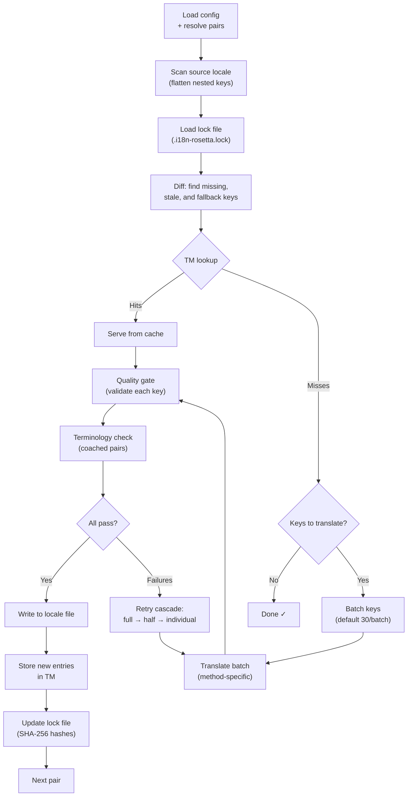

# كيف تعمل المزامنة

يُعد الأمر `sync` العملية الأساسية في rosetta. إليك ما يحدث عند تشغيل `npx i18n-rosetta sync`.

## نظرة عامة على مسار العمل



## خطوة بخطوة

### 1. تحديد الإعدادات

يقوم Rosetta بتحميل `i18n-rosetta.config.json` (أو يكتشف الإعدادات تلقائيًا). ويقوم بتحديد:
- اللغة المصدر واللغات المستهدفة
- مخطط الأزواج (أي مجموعات المصدر ← الهدف التي ستتم معالجتها)
- إعدادات الطريقة، والنموذج، والجودة لكل زوج

### 2. فحص المصدر

يتم تحميل ملف اللغة المصدر وتسطيحه (flattened) إلى خريطة مفتاح ← قيمة:

```json
// Input (nested)
{ "hero": { "title": "Welcome", "subtitle": "Build" } }

// Flattened
{ "hero.title": "Welcome", "hero.subtitle": "Build" }
```

### 3. اكتشاف التغييرات

يقرأ Rosetta ملف `.i18n-rosetta.lock`، والذي يخزن تجزئات SHA-256 لقيم المصدر المترجمة سابقًا. لكل مفتاح، يتحقق مما يلي:

| الحالة | الإجراء |
|-----------|--------|
| المفتاح مفقود من الهدف | **ترجمة** |
| تغيرت تجزئة المصدر منذ آخر مزامنة | **إعادة ترجمة** (قديم) |
| تبدأ القيمة المستهدفة بـ `[EN]` | **إعادة ترجمة** (عنصر نائب احتياطي) |
| لم تتغير تجزئة المصدر، والمفتاح موجود | **تخطي** |

لهذا السبب يترجم rosetta ما تغير فقط — فهو لا يعيد ترجمة ملفك بالكامل في كل عملية مزامنة.

### 4. التجميع في دفعات

يتم تجميع المفاتيح في دفعات (الافتراضي: 30 مفتاحًا/دفعة للنماذج اللغوية الكبيرة LLM، و128 لخدمة Google Translate). يقلل تجميع الدفعات من رحلات الذهاب والإياب لواجهة برمجة التطبيقات (API) مع الحفاظ على إمكانية إدارة المطالبات (prompts).

### 4ب. ذاكرة الترجمة

قبل تجميع الدفعات، يتحقق rosetta من ذاكرة التخزين المؤقت لذاكرة الترجمة (`.rosetta/tm.json`). المفاتيح التي يتطابق نصها المصدر + اللغة + الطريقة مع ترجمة سابقة يتم تقديمها فورًا من ذاكرة التخزين المؤقت — دون الحاجة إلى استدعاء واجهة برمجة التطبيقات.

```
  [TM] 142 key(s) served from cache
  Translating 3 key(s) to French (llm)... [OK]
```

تُعد ذاكرة الترجمة (TM) الآلية الأساسية لتوفير التكاليف. إعادة تشغيل المزامنة بعد تغيير مفتاح واحد تؤدي إلى ترجمة هذا المفتاح فقط، وليس الملف بأكمله. راجع [ذاكرة الترجمة](/docs/concepts/translation-memory) للحصول على التفاصيل.

لتخطي ذاكرة التخزين المؤقت لتشغيل واحد: `i18n-rosetta sync --no-tm`

### 5. الترجمة

يتم إرسال كل دفعة إلى طريقة الترجمة المكونة:

- **`llm`**: مطالبة منظمة إلى OpenRouter مع تعليمات توجيهية حول مستوى اللغة (register) والجنس
- **`llm-coached`**: نفس الشيء، ولكن مع إدراج القواعد النحوية، والقاموس، وملاحظات الأسلوب
- **`google-translate`**: طلب دفعة لواجهة برمجة تطبيقات Google Cloud Translation الإصدار الثاني (v2)
- **`api`**: طلب HTTP POST إلى نقطة نهاية بعيدة

تكون رسالة النظام (مستوى اللغة، توجيهات الجنس، القواعد) متطابقة عبر الدفعات للغة معينة، مما يتيح **التخزين المؤقت للمطالبات (prompt caching)** — حيث يقوم مزودون مثل Anthropic وGoogle بتخزين رسائل النظام المتكررة مؤقتًا، مما يقلل من تكاليف الرموز (tokens).

### 6. بوابة الجودة

يتم التحقق من صحة كل ترجمة قبل كتابتها على القرص. يتم تشغيل خمسة فحوصات:

| الفحص | ما يكتشفه | مثال |
|-------|----------------|---------|
| **فارغ/خالٍ** | لم يُرجع النموذج شيئًا | `""` |
| **صدى المصدر** | أرجع النموذج الإدخال الإنجليزي | `"Welcome"` للغة اليابانية |
| **حلقة الهلوسة** | تكرار الثلاثيات (trigrams) | `"Qo' Qo' Qo' Qo'"` |
| **تضخم الطول** | المخرجات أطول بـ 4 أضعاف أو أكثر من المصدر | مصدر بـ 10 أحرف ← مخرجات بـ 50 حرفًا |
| **التوافق مع نظام الكتابة** | نظام كتابة خاطئ للغة | نص لاتيني للغة العربية |

يتم تسجيل حالات الفشل ببادئة `[GATE]`. لا توجد إجراءات احتياطية صامتة.

راجع [بوابة الجودة](/docs/concepts/quality-gate) للحصول على التفاصيل.

### 6ب. التحقق من المصطلحات

بالنسبة للأزواج الموجهة (coached pairs) التي تحتوي على قاموس، يتحقق rosetta مما إذا كان النموذج اللغوي الكبير (LLM) قد استخدم بالفعل المصطلحات المطلوبة بعد الترجمة. يتم تسجيل الانتهاكات كتحذيرات `[TERM]`:

```
[TERM] en→fr: 2 term violation(s)
  • "dashboard" → expected "tableau de bord" but got "panneau"
```

هذه مجرد تحذيرات، وليست أخطاء حظر — لا يزال يتم كتابة الترجمة.

### 7. تسلسل إعادة المحاولة

عند فشل تحليل JSON أو حدوث أخطاء على مستوى الدفعة، يعيد rosetta المحاولة باستخدام دفعات أصغر تدريجيًا:

```
Full batch (30 keys) → Failed
Half batch (15 keys) → Failed
Individual keys (1 each) → Isolates the problem key
```

يتم تقييد ميزانية إعادة المحاولة بواسطة `maxRetries` (الافتراضي: 3) لمنع الإنفاق المفرط للرموز.

### 8. الكتابة والقفل

تُكتب الترجمات الناجحة في ملف اللغة المستهدفة، مع الحفاظ على بنية التداخل الأصلية. يتم تحديث ملف القفل بتجزئات SHA-256 الجديدة.

## ترجمة المحتوى (المرحلة 2)

بالنسبة لمشاريع Docusaurus وHugo، يُشغل `sync` مرحلة ثانية بعد ترجمة مفاتيح JSON. تترجم هذه المرحلة ملفات Markdown وMDX (المستندات، منشورات المدونة، البرامج التعليمية) باستخدام نفس الطرق وبوابة الجودة.

### كيف تعمل

1. يكتشف Rosetta جميع ملفات المحتوى المصدر (`.md`، `.mdx`) عن طريق تصفح دليل content/docs
2. لكل زوج من الملفات × اللغات، يتحقق من ملف قفل محتوى منفصل (`.i18n-rosetta-content.lock`) بحثًا عن تغييرات في تجزئة SHA-256
3. يتم جمع الملفات المتغيرة أو المفقودة في تجمع عناصر عمل مسطح (flat work-item pool)
4. تتم معالجة التجمع باستخدام **التزامن المتوازي** (الافتراضي: 12 استدعاءً متزامنًا لواجهة برمجة التطبيقات)

```
Phase 2: content (79 translations to process, 341 skipped, concurrency: 12)

    [1/79] (1%)  docs/concepts/security.md → ja [RE-TRANSLATE] (~3328s left)
    [2/79] (3%)  docs/concepts/security.md → th [RE-TRANSLATE] (~1821s left)
    ...
    [79/79] (100%) blog/v3-2-quality.md → de [OK]

  [OK] Created 79 content file(s), 341 unchanged
```

### التوازي في التجمع المسطح

على عكس المرحلة الأولى (مفاتيح JSON، تسلسلية لكل لغة)، تعالج المرحلة الثانية جميع مجموعات الملفات × اللغات كقائمة مسطحة. هذا يعني أن الملفات المختلفة واللغات المختلفة تتم ترجمتها في وقت واحد:

- يتم تشغيل `docs/configuration.md → fr` و `docs/cli.md → ja` في نفس الوقت
- تكتمل مجموعة نصوص مكونة من 420 ترجمة في حوالي 11 دقيقة عند مستوى تزامن 12
- تمنع عمليات الكتابة التزايدية للبيان (manifest) كل 10 عمليات مكتملة فقدان التقدم في حالة إيقاف العملية

تحكم في التوازي باستخدام `--concurrency` أو حقل الإعدادات `concurrency`:

```bash
# Faster (more parallel calls, higher API load)
npx i18n-rosetta sync --concurrency 20

# Slower (gentler on rate limits)
npx i18n-rosetta sync --concurrency 4
```

### حماية المحتوى

أثناء الترجمة، يحمي rosetta المحتوى غير القابل للترجمة:

- **كتل التعليمات البرمجية** (المحاطة بعلامات والمسافة البادئة) يتم استبدالها بعناصر نائبة
- **حقول الواجهة (Frontmatter)** غير الموجودة في قائمة `translatableFields` يتم الاحتفاظ بها كما هي
- **الروابط**، ومسارات الصور، وعلامات HTML يتم حمايتها
- **الرموز القصيرة (Shortcodes)** ومتغيرات الاستيفاء (مثل `{count}`، `{{.Params.title}}`) يتم حمايتها

بعد الترجمة، تتم استعادة جميع العناصر النائبة والتحقق من صحتها. إذا كان أي منها مفقودًا أو تالفًا، يتم رفض الترجمة وإعادة المحاولة.

## النجاح الجزئي

لا تؤدي دفعة واحدة فاشلة إلى حظر الباقي. إذا نجحت 9 دفعات من أصل 10، فسيتم كتابة هذه الـ 9. يتم تسجيل الدفعة الفاشلة، ويمكنك إعادة تشغيل `sync` لإعادة المحاولة.

## التشغيل التجريبي (Dry Run)

قم بمعاينة ما سيتغير دون كتابة أي ملفات:

```bash
npx i18n-rosetta sync --dry-run
```

## فرض إعادة الترجمة

فرض إعادة ترجمة مفاتيح معينة حتى لو لم تتغير:

```bash
npx i18n-rosetta sync --force-keys "hero.title,nav.about"
```

## تقدير التكلفة

قبل الترجمة، يُنشئ rosetta **تقرير تكلفة ما قبل المزامنة** يوضح التكاليف المقدرة لكل زوج. يتم تشغيل هذا تلقائيًا خلال كل `sync` — حيث تراه قبل إجراء أي استدعاءات لواجهة برمجة التطبيقات.

```
╔══════════════════════════════════════════════════════════╗
║  Cost Estimate                                          ║
╠════════════╦═══════╦════════════╦════════════════════════╣
║ Pair       ║ Keys  ║ Est. Cost  ║ Method                 ║
╠════════════╬═══════╬════════════╬════════════════════════╣
║ en → fr    ║   142 ║ $0.07      ║ google-translate       ║
║ en → ja    ║    38 ║   —        ║ llm (model-dependent)  ║
║ en → crk   ║    38 ║   —        ║ llm-coached            ║
╚════════════╩═══════╩════════════╩════════════════════════╝
```

### ما يتم تقديره

توفر كل طريقة ترجمة تقدير التكلفة الخاص بها:

| الطريقة | أساس التكلفة | الدقة |
|--------|-----------|-----------|
| `google-translate` | السعر المعلن من Google (20 دولارًا/مليون حرف) | دقيق |
| `llm` | يختلف حسب نموذج OpenRouter | يعتمد على النموذج — تحقق من [أسعار OpenRouter](https://openrouter.ai/models) |
| `llm-coached` | نفس `llm` بالإضافة إلى رموز سياق التوجيه (coaching context tokens) | يعتمد على النموذج |
| `api` | يحدده الخادم | غير معروف — لا يمكن التقدير دون الاستعلام من نقطة النهاية |

عندما لا تتمكن طريقة ما من تحديد التكلفة (طرق النماذج اللغوية الكبيرة LLM، واجهات برمجة التطبيقات البعيدة)، يُبلغ rosetta بـ `—` بدلاً من التخمين. استخدم `--dry` لرؤية تقديرات التكلفة دون الترجمة فعليًا.

---

## انظر أيضًا

- [مرجع واجهة سطر الأوامر (CLI) — sync](/docs/reference/cli#sync) — علامات وخيارات الأوامر
- [ذاكرة الترجمة](/docs/concepts/translation-memory) — التخزين المؤقت وتوفير التكاليف
- [بوابة الجودة](/docs/concepts/quality-gate) — كيف يتم التحقق من صحة الترجمات
- [طرق الترجمة](/docs/guides/translation-methods) — كيف تعمل كل طريقة
- [العمل مع المترجمين المحترفين](/docs/guides/professional-translators) — سير عمل XLIFF
- [الإعدادات](/docs/getting-started/configuration) — مرجع الإعدادات
- [دليل CI/CD](/docs/guides/ci-cd) — أتمتة عمليات المزامنة في مسار عملك