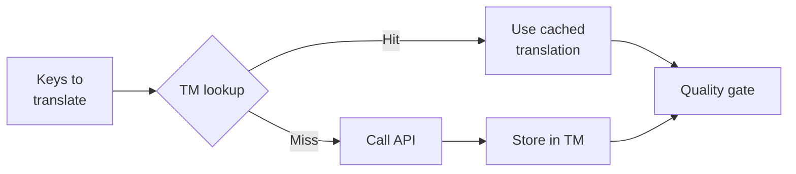

# ذاكرة الترجمة

تُعد ذاكرة الترجمة (TM) طبقة التخزين المؤقت (caching layer) المدمجة في rosetta. فهي تخزن كل ترجمة مفهرسة بمفتاح يتكون من النص المصدر + اللغة المحلية (locale) + الطريقة (method)، لذا فإن إعادة تشغيل `sync` تستدعي واجهة برمجة التطبيقات (API) فقط للمفاتيح التي تغيرت بالفعل.

## لماذا توجد ذاكرة الترجمة (TM)

بدون ذاكرة الترجمة (TM)، تقوم كل عملية `sync` بإعادة ترجمة كل مفتاح معدل — حتى لو كنت قد ترجمت نفس النص الإنجليزي تمامًا لنفس اللغة المحلية في عملية تشغيل سابقة. السيناريوهات الشائعة التي يؤدي فيها ذلك إلى إهدار المال:

| السيناريو | بدون TM | مع TM |
|----------|-----------|---------|
| إعادة تشغيل المزامنة (sync) بعد تغيير مفتاح واحد (500 مفتاح × 10 لغات محلية) | 5,000 استدعاء لـ API | 10 استدعاءات لـ API |
| إعادة مفتاح إلى قيمة إنجليزية سابقة | استدعاء كامل لـ API | استرجاع فوري من ذاكرة التخزين المؤقت (cache hit) |
| ظهور نفس العبارة في 3 ملفات للغات محلية | 3 × استدعاءات لـ API | استدعاء واحد لـ API + استرجاعان من ذاكرة التخزين المؤقت |
| تشغيل تجريبي (Dry-run) ← مزامنة حقيقية | استدعاءات كاملة لـ API في كليهما | التشغيل الأول يُخزن، والثاني يعيد الاستخدام |

تكون ذاكرة الترجمة (TM) **مفعلة افتراضيًا** ولا تتطلب أي إعدادات. يتم تخزين الترجمات مؤقتًا بشكل تلقائي خلال كل `sync` ويتم تقديمها في عمليات التشغيل اللاحقة.

## كيف تعمل

### مفتاح ذاكرة التخزين المؤقت (Cache Key)

تُفهرس كل مدخلة في ذاكرة الترجمة (TM) باستخدام تجزئة SHA-256 لثلاث قيم:

```
SHA-256( sourceValue + '\x00' + locale + '\x00' + method )
```

| المكون | سبب وجوده في المفتاح |
|-----------|-------------------|
| `sourceValue` | نص إنجليزي مختلف ← ترجمة مختلفة |
| `locale` | تترجم كلمة "Hello" بشكل مختلف إلى الفرنسية مقارنة باليابانية |
| `method` | مخرجات Google Translate ≠ مخرجات GPT-4o |

يمنع الفاصل البايت الصفري (null byte separator) (`\x00`) حدوث تداخل (collision) بين `"ab" + "c"` و `"a" + "bc"`.

### أثناء المزامنة (Sync)



1. قبل استدعاء API الخاص بالترجمة، تقوم rosetta بتقسيم المفاتيح إلى **مفاتيح موجودة في TM (TM hits)** و **مفاتيح غير موجودة في TM (TM misses)**
2. يتم تقديم المفاتيح الموجودة (Hits) فورًا من ذاكرة التخزين المؤقت — بدون استدعاء لـ API، وبدون تأخير، وبدون تكلفة
3. تمر المفاتيح غير الموجودة (Misses) عبر مسار الترجمة (pipeline) العادي
4. يتم تخزين الترجمات الجديدة الواردة من API في ذاكرة الترجمة (TM) لعمليات التشغيل المستقبلية
5. تمر جميع الترجمات (المخزنة مؤقتًا + الجديدة) عبر بوابة الجودة (quality gate)

### التخزين

يتم تخزين ذاكرة الترجمة (TM) في `.rosetta/tm.json` في المجلد الجذري لمشروعك. يستخدم الملف تنسيق JSON مضغوط (بدون تنسيق طباعي جميل - pretty-printing) لإبقاء الحجم قابلاً للإدارة. تُخزن كل مدخلة:

| الحقل | الوصف |
|-------|-------------|
| `t` | النص المترجم |
| `ts` | طابع زمني بتنسيق ISO-8601 لوقت التخزين المؤقت |
| `l` | رمز اللغة المحلية المستهدفة (للإحصائيات/التصفية) |
| `m` | اسم طريقة الترجمة (للإحصائيات/التصفية) |

عند 50 لغة × 500 مفتاح = 25,000 مدخلة، يجب أن يكون حجم الملف حوالي 2-3 ميغابايت.

## إدارة ذاكرة التخزين المؤقت

### عرض الإحصائيات

```bash
i18n-rosetta tm stats
```

يعرض عدد المدخلات، وحجم الملف، وتفصيلاً لكل لغة محلية:

```
  Translation Memory — .rosetta/tm.json

  Entries:      2,847
  File size:    1.2 MB
  Created:      2026-05-20
  Last entry:   2026-05-24

  By locale:
    fr       482 entries  (llm: 380, llm-coached: 102)
    de       471 entries  (llm: 471)
    ja       465 entries  (llm: 465)
```

### مسح ذاكرة التخزين المؤقت

```bash
# Clear everything (with confirmation prompt)
i18n-rosetta tm clear

# Clear without prompt (CI environments)
i18n-rosetta tm clear --yes

# Clear only one locale
i18n-rosetta tm clear --locale fr
```

### تخطي TM لعملية تشغيل واحدة

```bash
# Force fresh API calls for all keys (useful when switching providers)
i18n-rosetta sync --no-tm
```

هذا لا يحذف ذاكرة التخزين المؤقت — بل يتجاهلها فقط في عملية التشغيل هذه ولا يخزن النتائج الجديدة.

## متى لا تفيد ذاكرة الترجمة (TM)

لن تنتج ذاكرة الترجمة (TM) استرجاعًا من ذاكرة التخزين المؤقت (cache hit) في الحالات التالية:

- **تغير النص المصدر** — تتغير التجزئة (hash)، لذا تعتبر غير موجودة (miss)
- **تغيرت الطريقة** — التبديل من `llm` إلى `google-translate` يعني مفاتيح تخزين مؤقت مختلفة
- **التشغيل الأول** — بداية باردة (cold start)، لا توجد مدخلات بعد
- **علامة `--no-tm`** — تتجاوز ذاكرة التخزين المؤقت صراحةً

## هل يجب عليك إيداع (Commit) `.rosetta/tm.json`؟

**بشكل عام لا.** تُعد ذاكرة الترجمة (TM) بمثابة تحسين محلي للمطور. يتم ملؤها تلقائيًا أثناء المزامنة وتُفيد فقط عند إعادة تشغيل المزامنة على نفس الجهاز. ومع ذلك، قد تفكر في إيداعها (committing it) في الحالات التالية:

- يشارك فريقك مشغل تكامل مستمر (CI runner) واحد يقوم بمزامنة الترجمات
- تريد عمليات بناء (builds) قابلة لإعادة الإنتاج بدون استدعاءات لـ API
- تقوم بأرشفة الترجمات لأغراض الامتثال (compliance)

أضف `.rosetta/tm.json` إلى `.gitignore` للاستخدام المعتاد.

---

## انظر أيضًا

- [كيف تعمل المزامنة](/docs/concepts/how-sync-works) — أين تتناسب ذاكرة الترجمة (TM) في مسار العمل (pipeline)
- [مرجع واجهة سطر الأوامر (CLI) — tm](/docs/reference/cli#tm) — مرجع الأوامر
- [مرجع واجهة سطر الأوامر (CLI) — sync --no-tm](/docs/reference/cli#sync) — تجاوز ذاكرة الترجمة (TM)