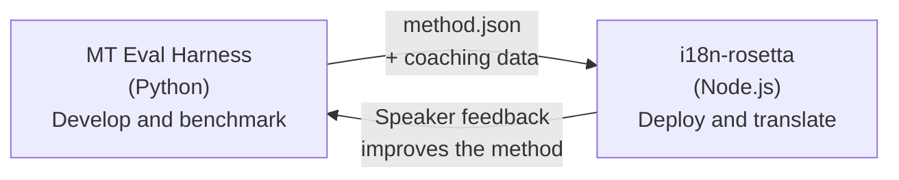

# جسر Eval Harness

يُعد i18n-rosetta و MT Eval Harness أداتين منفصلتين تشكلان نظاماً بيئياً واحداً. يُعتبر harness المكان الذي يتم فيه **إثبات** طرق الترجمة. بينما Rosetta هو المكان الذي يتم فيه **نشر** الطرق المُثبتة. ويتصلان ببعضهما من خلال تنسيق plugin مشترك.



## سير العمل: من البحث → إلى الإنتاج

### 1. بناء طريقة في harness

يمكن لأي فئة Python تنفذ `async translate(entries, config) → [{id, predicted}]` أن تتصل بـ harness. لا يهتم harness بما يحدث بالداخل — سواء كان LLM موجهاً، أو نموذجاً مدرباً خصيصاً، أو قواعد حتمية، أو أي شيء آخر.

### 2. قياس الأداء

يُقيّم harness طريقتك مقابل مجموعة نصوص موحدة باستخدام مقاييس قابلة للتكرار: chrF++، وقبول FST (للغات الغنية صرفياً)، والدقة الصرفية، والتقييم الدلالي.

### 3. التصدير كـ plugin

عندما تصل طريقتك إلى جودة مقبولة، قم بحزمها كـ plugin لـ rosetta — وهو بيان `method.json` مع بيانات توجيه اختيارية.

:::info من المخطط توفير Export CLI
حالياً، تقوم بإنشاء بيان method.json يدوياً. سيقوم الأمر `mt-eval export` بأتمتة ذلك. راجع [Method Interface](https://mtevalarena.org/docs/specifications/methods) للحصول على التنسيق الكامل لـ plugin.
:::

### 4. التثبيت في rosetta

```bash
i18n-rosetta plugin install ./my-method-plugin/
```

### 5. ترجمة محتوى حقيقي

```bash
i18n-rosetta sync
```

طريقتك التي تم قياس أدائها تنتج الآن ترجمات حقيقية في بيئة الإنتاج.

## سير العمل: من الإنتاج → إلى البحث

تتم مراجعة الترجمات المنشورة من قبل متحدثين ثنائيي اللغة. وتحدد ملاحظاتهم الأخطاء المنهجية (أنماط الأزمنة الخاطئة، المفردات المفقودة، الصياغة غير الطبيعية). يقوم الباحث بتحديث الطريقة في harness، وإعادة قياس الأداء، وإعادة التصدير، وإعادة النشر. يتعلم النظام من الاستخدام.

## تنسيق Plugin

يُعد بيان `method.json` بمثابة العقد بين الأداتين:

```json
{
  "name": "crk-coached-v3",
  "type": "llm-coached",
  "version": "3.0.0",
  "description": "Coached LLM translation for Plains Cree",
  "locales": ["crk"],
  "config": {
    "model": "google/gemini-3.5-flash",
    "temperature": 0.3
  },
  "benchmarks": {
    "crk": {
      "composite_score": 0.67,
      "fst_acceptance": 0.82,
      "corpus_size": 150
    }
  }
}
```

راجع [Plugin Specification](/docs/reference/plugin-spec) للحصول على التنسيق الكامل.

## ما تم بناؤه مقابل ما هو مخطط له

| المكون | الحالة |
|-----------|--------|
| بروتوكول TranslationProcess | ✅ تم بناؤه |
| مشغل قياس الأداء Harness | ✅ تم بناؤه |
| تنسيق plugin لـ method.json | ✅ تم بناؤه |
| `rosetta plugin install/remove/list` | ✅ تم بناؤه |
| تحميل بيانات التوجيه | ✅ تم بناؤه |
| `mt-eval export` CLI | 🔲 مخطط له |
| واجهة المراجعة المجتمعية | 🔲 مخطط له |
| تقييم مجموعة الاختبار المشفرة | 🔲 مخطط له |

## قراءات إضافية

- [Translation Methods](/docs/guides/translation-methods) — جميع الطرق المتاحة وكيفية عملها
- [Plugin Specification](/docs/reference/plugin-spec) — تنسيق method.json
- [Serving a Method via API](/docs/guides/serving-a-method) — استضافة طريقة على جانب الخادم
- [Data Sovereignty](https://mtevalarena.org/docs/sovereignty/data-sovereignty) — OCAP و CARE والحماية التشفيرية
- [For MT Researchers](https://mtevalarena.org/docs/leaderboard/rules) — وثائق eval harness