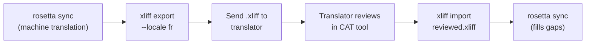

# العمل مع المترجمين المحترفين

تُنشئ Rosetta ترجمات آلية، ولكن بعض المشاريع تحتاج إلى مراجعة بشرية — مثل المحتوى التنظيمي، أو النصوص الحساسة للعلامة التجارية، أو واجهات المستخدم (UI) عالية الأهمية. يتيح لك سير عمل XLIFF تصدير الترجمات للمراجعة الاحترافية واستيرادها مرة أخرى بسلاسة.

## ما هو XLIFF؟

يُعد XLIFF (XML Localization Interchange File Format) تنسيق التبادل القياسي في الصناعة لأدوات الترجمة. تدعمه كل أداة احترافية من أدوات CAT (الترجمة بمساعدة الحاسوب):

- **memoQ** — استيراد XLIFF، والمراجعة في السياق، وتصدير الملف المراجع
- **SDL Trados Studio** — دعم أصلي لتنسيق XLIFF
- **Phrase (Memsource)** — رفع مهام XLIFF لفرق المترجمين
- **Smartling** — مسار استيعاب XLIFF
- **OmegaT** — أداة CAT مجانية/مفتوحة المصدر مع دعم XLIFF

تُنشئ Rosetta إصدار XLIFF 1.2 (الإصدار المدعوم عالميًا) بدلاً من 2.0+ لضمان أقصى قدر من التوافق مع الأدوات.

## سير العمل



### الخطوة 1: إنشاء الترجمات الآلية

قم بتشغيل `sync` أولاً للحصول على ترجمة آلية أساسية:

```bash
i18n-rosetta sync
```

### الخطوة 2: تصدير XLIFF

قم بتصدير زوج المصدر + الهدف بتنسيق XLIFF:

```bash
i18n-rosetta xliff export --locale fr
```

يؤدي هذا إلى كتابة `.rosetta/xliff/fr.xliff` والذي يحتوي على:
- كل مفتاح مصدر مع قيمته باللغة الإنجليزية
- الترجمة الآلية الحالية (إن وجدت) كـ `<target>`
- المفاتيح التي ليس لها ترجمات مميزة كـ `state="new"`

```xml
<trans-unit id="hero.title" xml:space="preserve">
  <source>Welcome to our platform</source>
  <target state="translated">Bienvenue sur notre plateforme</target>
</trans-unit>
```

### الخطوة 3: الإرسال إلى المترجم

أرسل ملف `.xliff` إلى المترجم أو قم برفعه إلى منصة CAT الخاصة بك. يرى المترجم المصدر والهدف جنبًا إلى جنب، ويمكنه:

- تعديل الترجمات الآلية
- ملء الترجمات المفقودة
- الإبلاغ عن مشكلات الجودة
- تطبيق ذاكرة الترجمة وقواعد المصطلحات الخاصة بهم

### الخطوة 4: استيراد الملف المراجع

عندما يعيد المترجم ملف `.xliff` المُراجع، قم باستيراده:

```bash
# Preview what will change
i18n-rosetta xliff import .rosetta/xliff/fr.xliff --dry

# Apply changes
i18n-rosetta xliff import .rosetta/xliff/fr.xliff
```

المخرجات:
```
  ✓ Imported 142 translations for fr
    Updated:    23 (changed from existing)
    Added:      0 (new keys)
    Unchanged:  119
    Written to: locales/fr.json
```

### الخطوة 5: سد الفجوات

إذا تمت إضافة مفاتيح جديدة بعد تصدير XLIFF، فقم بتشغيل `sync` لترجمتها:

```bash
i18n-rosetta sync
```

تترجم Rosetta فقط المفاتيح التي لا تزال مفقودة — يتم الاحتفاظ بالترجمات المُراجعة من استيراد XLIFF.

## نصائح

### تصدير مسارات مخصصة

```bash
# Export to a specific directory
i18n-rosetta xliff export --locale ja --out ./for-review/

# Export with a specific filename
i18n-rosetta xliff export --locale de --out ./review/german.xliff
```

### إعدادات محلية متعددة

قم بتصدير كل إعداد محلي بشكل منفصل:

```bash
for locale in fr de ja ko; do
  i18n-rosetta xliff export --locale $locale
done
```

### التحكم في الإصدار

أضف `.rosetta/xliff/` إلى `.gitignore` — ملفات XLIFF هي عناصر مؤقتة، وليست من ملفات المصدر للمشروع:

```gitignore
.rosetta/xliff/
```

### متى تستخدم XLIFF مقابل `sync` فقط

| السيناريو | التوصية |
|----------|---------------|
| تطبيق داخلي، جودة 90%+ مقبولة | `sync` فقط — الترجمة الآلية تفي بالغرض |
| نصوص تسويقية موجهة للمستخدم | تصدير XLIFF للمراجعة البشرية |
| محتوى قانوني/تنظيمي | تصدير XLIFF — المراجعة البشرية مطلوبة |
| أكثر من 50 إعدادًا محليًا، وموعد نهائي ضيق | `sync` أولاً، وتصدير XLIFF لأهم 5 إعدادات محلية فقط |
| المترجم يستخدم بالفعل أداة CAT | XLIFF هو تنسيق التسليم الطبيعي |

---

## انظر أيضًا

- [مرجع واجهة سطر الأوامر (CLI) — xliff](/docs/reference/cli#xliff) — مرجع الأوامر
- [ذاكرة الترجمة](/docs/concepts/translation-memory) — التخزين المؤقت للترجمات المُراجعة
- [طرق الترجمة](/docs/guides/translation-methods) — خيارات الترجمة الآلية