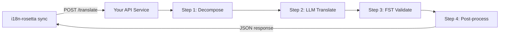

# تقديم طريقة مخصصة كواجهة برمجة تطبيقات (API)

تتيح لك **طريقة `api`** في i18n-rosetta توجيه أي زوج ترجمة إلى نقطة نهاية HTTP خارجية (HTTP endpoint). هكذا يمكنك دمج مسارات العمل (pipelines) المعقدة جداً على أن تُنفذ عبر مطالبة نموذج لغوي كبير (LLM prompt) واحدة — مثل المحللات الصرفية (morphological analyzers)، أو محولات الحالة المحدودة (FSTs)، أو سلاسل النماذج اللغوية الكبيرة متعددة الخطوات (multi-step LLM chains)، أو أي طريقة بحث مخصصة قمت ببنائها.

## لماذا خدمة API؟

بعض مسارات الترجمة لا يمكن تشغيلها داخل دورة بسيطة من المطالبة والاستجابة (prompt-response cycle):

| خطوة مسار العمل | مثال |
|---|---|
| **التحليل الصرفي (Morphological decomposition)** | تقسيم الكلمات متعددة التركيب إلى مقاطع صرفية (morphemes) قبل الترجمة |
| **التحقق باستخدام FST** | رفض المخرجات التي تنتهك القواعد الصوتية أو الصرفية |
| **سلاسل LLM متعددة الخطوات** | دورات التوليد ← التحقق ← التصحيح باستخدام نماذج مختلفة |
| **البحث في القاموس** | الإسناد الترافقي لقاموس ثنائي اللغة منسق في منتصف مسار العمل |
| **التدخل البشري (Human-in-the-loop)** | وضع الترجمات غير المؤكدة في قائمة انتظار لمراجعتها من قبل الخبراء |

تتعامل طريقة `api` مع مسار العمل الخاص بك كصندوق أسود (black box) — حيث يرسل i18n-rosetta السلاسل النصية المصدر، وتُرجع خدمتك الترجمات. ما يحدث بالداخل متروك لك تماماً.

## البنية (Architecture)



## إعداد خدمتك

يجب أن تنفذ خدمة API الخاصة بك نقطة نهاية (endpoint) واحدة تقبل وتُرجع بيانات بتنسيق JSON:

### تنسيق الطلب

يرسل rosetta هيكل JSON هذا بالضبط (انظر [api.js](https://github.com/gamedaysuits/i18n-rosetta/blob/main/lib/methods/api.js)):

```json
POST /translate
Content-Type: application/json
Authorization: Bearer <ROSETTA_API_KEY>

{
  "source_locale": "en",
  "target_locale": "crk",
  "method": "crk-coached-v1",
  "keys": {
    "greeting": "Hello, welcome to our app",
    "farewell": "Goodbye and thanks"
  }
}
```

| الحقل | النوع | الوصف |
|-------|------|-------------|
| `source_locale` | string | رمز لغة المصدر بتنسيق BCP 47 |
| `target_locale` | string | رمز اللغة الهدف بتنسيق BCP 47 |
| `method` | string | اسم المكون الإضافي (Plugin) أو `"default"` |
| `keys` | object | خريطة للمفتاح ← السلسلة النصية المصدر المراد ترجمتها |
```

### Response Format

Your service must return a `translations` object. An optional `meta` object can include cost and diagnostic info:

```json
{
  "translations": {
    "greeting": "tânisi, pê-kîwêw ôta",
    "farewell": "ekosi mâka, kinanâskomitin"
  },
  "meta": {
    "model": "my-custom-pipeline/v1",
    "cost_usd": 0.0042,
    "method": "decompose-translate-validate"
  }
}
```

| Field | Type | Required | Description |
|-------|------|----------|-------------|
| `translations` | object | ✅ | Map of key → translated string |
| `meta` | object | — | Optional metadata |
| `meta.cost_usd` | number | — | If present, displayed in rosetta's output |
| `errors` | object | — | For partial success (HTTP 207): map of key → `{ message }` |

### Minimal Express Server

```javascript
import express from 'express';

const app = express();
app.use(express.json());

/**
 * عقد واجهة برمجة تطبيقات rosetta:
 *
 * الطلب:  { source_locale, target_locale, method, keys: { "key": "source" } }
 * الاستجابة: { translations: { "key": "translated" }, meta: { ... } }
 */
app.post('/translate', async (req, res) => {
  const { source_locale, target_locale, method, keys } = req.body;

  const translations = {};

  for (const [key, source] of Object.entries(keys)) {
    // --- مسار العمل الخاص بك يوضع هنا ---
    // الخطوة 1: التحليل الصرفي
    const morphemes = await decompose(source, source_locale);

    // الخطوة 2: الترجمة باستخدام LLM مع السياق
    const draft = await llmTranslate(morphemes, target_locale);

    // الخطوة 3: التحقق باستخدام FST
    const validated = await fstValidate(draft, target_locale);

    // الخطوة 4: المعالجة اللاحقة (توحيد الإملاء، إلخ)
    translations[key] = await postProcess(validated);
  }

  res.json({
    translations,
    meta: {
      model: 'my-custom-pipeline/v1',
      method: 'decompose-translate-validate',
    },
  });
});

app.listen(3001, () => {
  console.log('Translation API running on http://localhost:3001');
});
```

## Configuring i18n-rosetta

Point a translation pair at your running service in `i18n-rosetta.config.json`:

```json
{
  "inputLocale": "en",
  "pairs": {
    "en:crk": {
      "method": "api",
      "endpoint": "http://localhost:3001/translate",
      "register": "Formal Plains Cree. Use SRO orthography."
    }
  }
}
```

Then run sync as usual:

```bash
npx i18n-rosetta sync
```

i18n-rosetta will POST your source strings to the endpoint and write the returned translations to `crk.json`.

## Case Study: Plains Cree Pipeline

:::info Under Development
The Plains Cree pipeline described below is **under active development** and is not yet running in production. Details here reflect the current design direction and may change as the project evolves.
:::

The **gds-mt-eval-harness** project demonstrates this pattern. Its Plains Cree pipeline uses:

1. **Morphological decomposition** — Break polysynthetic Cree words into translatable morpheme chains
2. **LLM translation** — Context-enriched GPT-4o translation with coaching data (SRO orthography rules, register instructions)
3. **FST validation** — Finite-state transducer checks that outputs conform to Cree phonological rules
4. **Confidence scoring** — Each translation gets a confidence score based on FST pass rate and dictionary coverage

The entire pipeline runs as a single HTTP endpoint that i18n-rosetta calls via the `api` method.

### Running Evaluations

After translating, you can evaluate output quality using the harness directly:

```bash
# استنساخ بيئة الاختبار (harness)
git clone https://github.com/gamedaysuits/gds-mt-eval-harness.git
cd gds-mt-eval-harness
pip install -e .

# تشغيل التقييم على مخرجات طريقتك
python eval/baseline_experiment.py --dataset data/edtekla-dev-v1.json --submit
```

This produces structured evaluation records with chrF++, BLEU, and exact match scores that can be used as regression baselines.

## Authentication

If your API requires authentication, set the `apiKey` field or use an environment variable:

```json
{
  "pairs": {
    "en:crk": {
      "method": "api",
      "endpoint": "https://my-mt-service.example.com/translate",
      "apiKey": "${CRK_API_KEY}"
    }
  }
}
```

## Data Sovereignty & OCAP Principles

The `api` method is particularly important for **Indigenous language communities**. By self-hosting the translation pipeline, a community keeps full control over:

- **Proprietary coaching data** — register instructions, orthography rules, and domain glossaries never leave community infrastructure.
- **Linguistic resources** — curated dictionaries, FST grammars, and elder-verified translations remain under community ownership.
- **Access policies** — the community decides who can call the endpoint and under what terms.

This aligns with [OCAP® principles](https://mtevalarena.org/docs/community/low-resource-languages#ocap-principles) (Ownership, Control, Access, Possession), ensuring that sensitive language data is governed by the community rather than a third-party platform.

:::tip
Combine the `api` method with a private deployment (e.g., a community-hosted VM or on-prem server) for the strongest data-sovereignty posture. See [Support a Low-Resource Language](https://mtevalarena.org/docs/community/low-resource-languages) for a full walkthrough.
:::

## Cost Estimation

The `api` method returns `null` for cost estimation by default — your service controls pricing. If you want to provide cost transparency, have your API return a `cost` field in the metadata:

```json
{
  "translations": { "...": "..." },
  "metadata": {
    "cost": {
      "estimatedCost": 0.0042,
      "currency": "USD",
      "source": "my-service-pricing"
    }
  }
}
```

## أفضل الممارسات

1. **إرجاع سلاسل نصية فارغة عند الفشل** — لا تُرجع السلسلة النصية المصدر كـ "ترجمة". قم بإرجاع `""` وسوف تلتقطها بوابة الجودة الخاصة بـ i18n-rosetta. سيتم تخطي المفتاح وإعادة المحاولة في المزامنة التالية.
2. **تضمين درجات الثقة (Confidence scores)** — إذا كان مسار العمل الخاص بك قادراً على تقدير الجودة، فقم بإرجاعها في البيانات الوصفية (metadata). يساعد هذا في تدقيق الجودة.
3. **تنفيذ فحوصات السلامة (Health checks)** — أضف نقطة نهاية `GET /health` حتى يتمكن i18n-rosetta من التحقق من الاتصال قبل بدء مزامنة كبيرة.
4. **التعامل مع حدود المعدل (Rate limit) بسلاسة** — إذا كان مسار العمل الخاص بك يحتوي على حدود للإنتاجية، فقم بإرجاع رموز الحالة `429`. سيتراجع نظام الدفعات (batch system) في i18n-rosetta تلقائياً.
5. **تسجيل كل شيء (Log everything)** — يمكن أن تفشل مسارات العمل متعددة الخطوات بصمت. قم بتسجيل المدخلات/المخرجات لكل خطوة لأغراض تصحيح الأخطاء (debugging).

## الترخيص

نمط طريقة `api` مفتوح بالكامل — لا توجد قيود ترخيص على تغليف مسار الترجمة الخاص بك كخدمة HTTP. يتوفر `gds-mt-eval-harness` بموجب ترخيص MIT للتطبيقات المرجعية (reference implementations).

## انظر أيضاً

- [طرق الترجمة (Translation Methods)](/docs/guides/translation-methods) — نظرة عامة على كل طريقة مدمجة (`openai`، `google`، `api`، إلخ.)
- [مواصفات المكون الإضافي (Plugin Specification)](/docs/reference/plugin-spec) — المخطط الكامل لـ `i18n-rosetta.config.json` بما في ذلك حقول طريقة `api`
- [دعم لغة منخفضة الموارد (Support a Low-Resource Language)](https://mtevalarena.org/docs/community/low-resource-languages) — دليل شامل للغات ذات الموارد المحدودة، بما في ذلك مبادئ OCAP
- [البنية (Architecture)](/docs/concepts/architecture) — كيف تعمل حلقة المزامنة، وتجميع الدفعات (batching)، وإرسال الطرق في i18n-rosetta
- [تقييم الترجمة الآلية (MT Evaluation)](https://mtevalarena.org/docs/leaderboard/rules) — منهجية التقييم، والمقاييس، وعملية التقديم إلى لوحة الصدارة (leaderboard)
- [لوحة صدارة الطرق (Method Leaderboard)](/leaderboard) — تصنيفات الجودة المباشرة عبر الطرق وأزواج اللغات