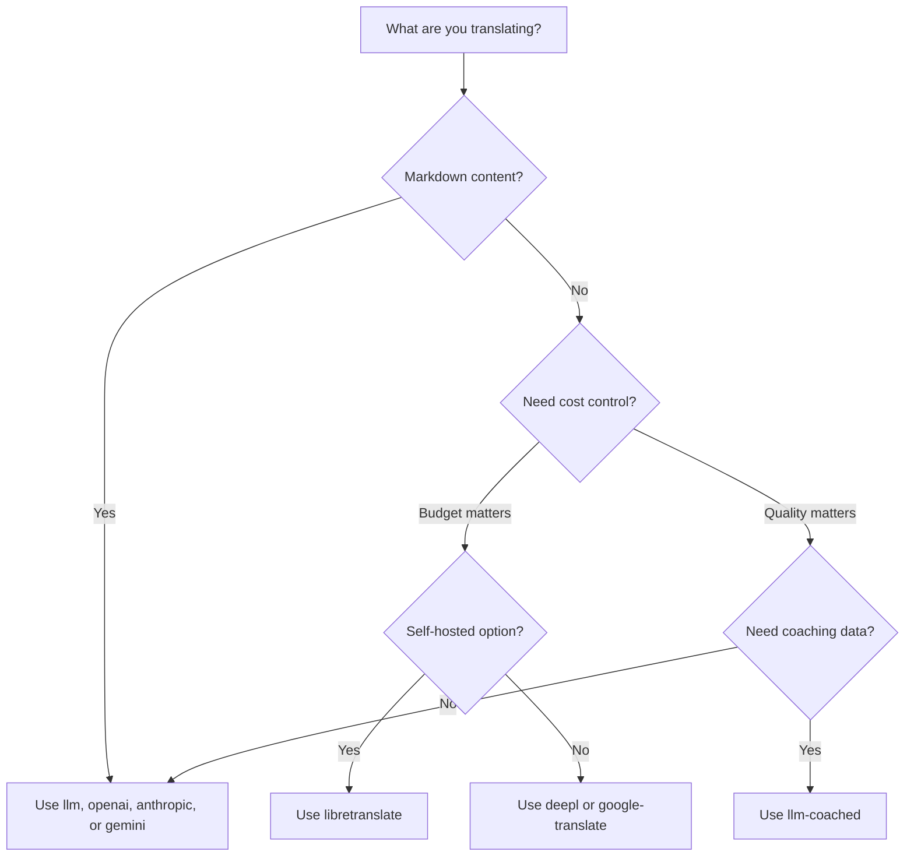

# طرق الترجمة

تدعم Rosetta عشر طرق للترجمة. يمكن لكل زوج لغوي استخدام طريقة مختلفة — لست مقيداً بنهج واحد لمشروعك بأكمله.

## مقارنة الطرق

### مزودو النماذج اللغوية الكبيرة (LLM)

تركز على الجودة، وتدعم Markdown، ومتوافقة مع التوجيه (coaching). الأفضل للمشاريع المليئة بالمحتوى.

| الطريقة | المفتاح | الوظيفة |
|--------|-----|-------------|
| `llm` (الافتراضية) | `OPENROUTER_API_KEY` | نموذج لغوي كبير (LLM) عبر OpenRouter — أكثر من 200 نموذج، توجيه تلقائي |
| `llm-coached` | `OPENROUTER_API_KEY` | نموذج لغوي كبير (LLM) + قواعد نحوية، قواميس، ملاحظات الأسلوب |
| `openai` | `OPENAI_API_KEY` | واجهة برمجة تطبيقات (API) مباشرة من OpenAI (gpt-4o, gpt-4o-mini) |
| `anthropic` | `ANTHROPIC_API_KEY` | واجهة برمجة تطبيقات (API) مباشرة من Anthropic (Claude Sonnet, Haiku, Opus) |
| `gemini` | `GEMINI_API_KEY` | واجهة برمجة تطبيقات (API) مباشرة من Google Gemini (Flash, Pro) — باقة مجانية |

### الترجمة الآلية التقليدية (Traditional MT)

تركز على السرعة والتكلفة. الأفضل لأزواج المفتاح-القيمة (key-value) ذات الحجم الكبير.

| الطريقة | المفتاح | الوظيفة |
|--------|-----|-------------|
| `google-translate` | `GOOGLE_TRANSLATE_API_KEY` | واجهة برمجة تطبيقات (API) Google Cloud Translation الإصدار 2 (أكثر من 130 لغة) |
| `deepl` | `DEEPL_API_KEY` | واجهة برمجة تطبيقات (API) DeepL مع دعم المسارد (أكثر من 30 لغة) |
| `microsoft-translator` | `MICROSOFT_TRANSLATOR_API_KEY` | مترجم Azure Cognitive Services (أكثر من 100 لغة) |
| `libretranslate` | *(استضافة ذاتية)* | LibreTranslate باستضافة ذاتية (AGPL، مجاني) |

### البنية التحتية

| الطريقة | المفتاح | الوظيفة |
|--------|-----|-------------|
| `api` | *(حسب المزود)* | عميل HTTP خفيف لأي نقطة نهاية (endpoint) لترجمة REST |

## شجرة اتخاذ القرار



---

## `llm` — ترجمة النماذج اللغوية الكبيرة (الافتراضية)

تترجم عبر أي نموذج لغوي كبير (LLM) على [OpenRouter](https://openrouter.ai). هذه هي الطريقة الافتراضية والأكثر تنوعاً.

**كيفية العمل:**
1. تجمع المفاتيح في دفعات (الافتراضي 80/دفعة) مع تعليمات السياق ومستوى اللغة (register)
2. ترسلها إلى OpenRouter كموجه (prompt) منظم
3. تحلل استجابة JSON
4. تتحقق من صحة كل ترجمة من خلال [بوابة الجودة](/docs/concepts/quality-gate)
5. تكتب الترجمات الناجحة، وتعيد المحاولة أو ترفض الترجمات الفاشلة

**متى تستخدمها:** في معظم المشاريع. خاصة المواقع المليئة بالمحتوى التي تستخدم Markdown، حيث تحتاج كتل التعليمات البرمجية (code blocks) والرموز القصيرة (shortcodes) إلى الحماية.

**الإعدادات:**

```json
{
  "defaultMethod": "llm",
  "model": "google/gemini-3.5-flash"
}
```

## `llm-coached` — ترجمة النماذج اللغوية الكبيرة الموجهة (Coached LLM)

نفس طريقة `llm`، ولكن مع إدراج القواعد النحوية، وقواميس المصطلحات، وملاحظات الأسلوب في كل موجه (prompt).

**كيفية العمل:**
1. تحمل بيانات التوجيه من `.rosetta/coaching/<locale>.json` أو من دليل `coaching/` الخاص بالإضافة (plugin)
2. تدرج القواعد النحوية، ومصطلحات القاموس، وملاحظات الأسلوب في موجه النظام (system prompt)
3. يتم تضمين مصطلحات القاموس المطابقة لمفاتيح المصدر كمصطلحات مطلوبة
4. تستمر الترجمة كما هو الحال مع `llm`، مع إضافة بيانات التوجيه لمزيد من الدقة

**متى تستخدمها:** مع اللغات ذات الموارد المحدودة (low-resource languages)، أو المصطلحات الخاصة بمجال معين (قانوني، طبي)، أو مستويات اللغة الرسمية، أو أي حالة لا تكون فيها مخرجات النموذج اللغوي الكبير (LLM) العامة دقيقة بما يكفي.

**تنسيق بيانات التوجيه:**

```json title=".rosetta/coaching/fr.json"
{
  "grammar_rules": [
    "French adjectives agree in gender and number with the noun they modify",
    "Use 'vous' for formal contexts, 'tu' for informal"
  ],
  "dictionary": {
    "dashboard": "tableau de bord",
    "deployment": "déploiement",
    "settings": "paramètres"
  },
  "style_notes": "Prefer active voice. Avoid anglicisms where a native French term exists."
}
```

انظر أيضاً: [دليل اللغات ذات الموارد المحدودة](https://mtevalarena.org/docs/community/low-resource-languages)

---

## `openai` — واجهة برمجة تطبيقات (API) مباشرة من OpenAI

تترجم مباشرة عبر واجهة برمجة تطبيقات Chat Completions من OpenAI. بدون وسيط OpenRouter — مفتاحك، حسابك، ولوحة معلومات الاستخدام الخاصة بك.

**النماذج:** `gpt-4o` (الافتراضي)، `gpt-4o-mini`

**الميزات:**
- ✅ تدعم Markdown (ترجمة المحتوى)
- ✅ دعم التوجيه (القواعد النحوية، تجاوزات القاموس، ملاحظات الأسلوب)
- ✅ وضع JSON لمخرجات المفتاح-القيمة (key-value) المنظمة
- ✅ التراجع الأسي (Exponential backoff) مع إعادة المحاولة

**الإعدادات:**

```json
{
  "pairs": {
    "en:fr": { "method": "openai", "model": "gpt-4o-mini" }
  }
}
```

```bash
export OPENAI_API_KEY=sk-proj-...
```

احصل على مفتاحك من [platform.openai.com/api-keys](https://platform.openai.com/api-keys).

## `anthropic` — واجهة برمجة تطبيقات (API) مباشرة من Anthropic

تترجم مباشرة عبر واجهة برمجة تطبيقات Messages من Anthropic. تستخدم المعلمة `system` لبيانات التوجيه، مما يتيح التخزين المؤقت للموجهات (prompt caching) الخاص بـ Anthropic.

**النماذج:** `claude-sonnet-4-6` (الافتراضي)، `claude-haiku-4-5`، `claude-opus-4-7`

**الميزات:**
- ✅ تدعم Markdown (ترجمة المحتوى)
- ✅ دعم التوجيه (القواعد النحوية، تجاوزات القاموس، ملاحظات الأسلوب)
- ✅ التخزين المؤقت لموجه النظام (يوزع تكلفة التوجيه عبر الدفعات)
- ✅ التراجع الأسي (Exponential backoff) مع إعادة المحاولة

**الإعدادات:**

```json
{
  "pairs": {
    "en:ja": { "method": "anthropic", "model": "claude-haiku-4-5" }
  }
}
```

```bash
export ANTHROPIC_API_KEY=sk-ant-...
```

احصل على مفتاحك من [console.anthropic.com](https://console.anthropic.com/settings/keys).

## `gemini` — واجهة برمجة تطبيقات (API) مباشرة من Google Gemini

تترجم مباشرة عبر واجهة برمجة تطبيقات `generateContent` من Google Gemini. **تتوفر باقة مجانية** — أفضل نقطة انطلاق بدون تكلفة.

**النماذج:** `gemini-2.5-flash` (الافتراضي)، `gemini-2.5-pro`

**الميزات:**
- ✅ تدعم Markdown (ترجمة المحتوى)
- ✅ دعم التوجيه (القواعد النحوية، تجاوزات القاموس، ملاحظات الأسلوب)
- ✅ وضع استجابة JSON عبر `responseMimeType`
- ✅ باقة مجانية (حصة يومية سخية)
- ✅ التراجع الأسي (Exponential backoff) مع إعادة المحاولة

**الإعدادات:**

```json
{
  "pairs": {
    "en:ko": { "method": "gemini", "model": "gemini-2.5-pro" }
  }
}
```

```bash
export GEMINI_API_KEY=AI...
```

احصل على مفتاحك من [aistudio.google.com/apikey](https://aistudio.google.com/apikey).

### التحقق من صحة النموذج

يتحقق مزودو النماذج اللغوية الكبيرة (LLM) المباشرون (`openai`، `anthropic`، `gemini`) من صحة سلسلة النموذج (model string) عند الاستخدام الأول. يكتشف هذا ثلاث فئات من الأخطاء:

**تنسيق الطريقة خاطئ** — استخدام مسار نموذج بأسلوب OpenRouter مع مزود مباشر:

```
[WARN] OpenAI: model "google/gemini-3.5-flash" looks like an OpenRouter path.
       Direct providers use bare model names (e.g., "gpt-4o").
       To use OpenRouter models, set method to 'llm' instead.
```

**مزود خاطئ** — استخدام نموذج من مزود مختلف تماماً:

```
[WARN] Gemini: model "claude-sonnet-4-6" is an Anthropic model.
       This provider (gemini) cannot serve Anthropic models.
       Use --method anthropic or set "method": "anthropic" in config.
```

**نموذج مهمل أو مكتوب بشكل خاطئ** — عند أول استدعاء لواجهة برمجة التطبيقات (API)، تجلب rosetta قائمة النماذج الحية للمزود وتتحقق من نموذجك مقابلها:

```
[WARN] Gemini: model "gemini-1.5-flash" not found in available models.
       Similar models: gemini-2.0-flash, gemini-2.5-flash, gemini-2.5-pro
       The API call will proceed — the provider will give the final verdict.
```

:::note هذه تحذيرات وليست أخطاء
يسجل التحقق من صحة النموذج تحذيرات ولكنه لا يحظر استدعاء واجهة برمجة التطبيقات (API). تعطي واجهة برمجة تطبيقات المزود الحكم النهائي — قد يتطابق اسم نموذج مستقبلي مع نمط مختلف، ولا نريد وضع قيود بناءً على الاستدلالات (heuristics).
:::

---

## `google-translate` — واجهة برمجة تطبيقات Google Cloud Translation

تكامل مباشر مع واجهة برمجة تطبيقات Google Cloud Translation الإصدار 2. تستخدم واجهة برمجة تطبيقات REST — بدون حزمة تطوير برمجيات (SDK)، وبدون حساب خدمة. فقط مفتاح API.

**متى تستخدمها:** لأزواج سلاسل المفتاح-القيمة (key-value) ذات الحجم الكبير حيث تكون السرعة والتكلفة أكثر أهمية من الفروق الدقيقة. تدعم أكثر من 130 لغة جاهزة للاستخدام.

**القيود:**
- ⚠️ **لا تدعم Markdown.** ستؤدي إلى إتلاف كتل التعليمات البرمجية، والرموز القصيرة، ومتغيرات الاستيفاء (interpolation variables).
- لا يوجد تحكم في مستوى اللغة/النبرة (register/tone)
- لا يوجد توجيه أو فرض للمصطلحات

```bash
npx i18n-rosetta sync --method google-translate
```

:::tip اكتشاف تلقائي
إذا تم تعيين `GOOGLE_TRANSLATE_API_KEY` فقط (بدون مفتاح OpenRouter)، تنتقل rosetta تلقائياً إلى Google Translate. لا حاجة لتغيير الإعدادات.
:::

## `deepl` — واجهة برمجة تطبيقات DeepL

تكامل مباشر مع واجهة برمجة تطبيقات الترجمة من DeepL. تدعم المسارد (glossaries) للحفاظ على اتساق المصطلحات.

**متى تستخدمها:** مع اللغات الأوروبية التي تتفوق فيها DeepL (الألمانية، الفرنسية، الإسبانية، الهولندية، البولندية، إلخ). يفرض دعم المسارد مصطلحات متسقة بدون الحاجة إلى بيانات توجيه.

**الميزات:**
- ✅ اكتشاف تلقائي لنقطة النهاية المجانية/الاحترافية (لاحقة `:fx` في المفاتيح المجانية)
- ✅ إنشاء وإدارة المسارد
- ✅ التحكم في مستوى الرسمية
- ⚠️ **لا تدعم Markdown** — أزواج المفتاح-القيمة (key-value) فقط

**الإعدادات:**

```json
{
  "pairs": {
    "en:de": { "method": "deepl" }
  }
}
```

```bash
export DEEPL_API_KEY=your-key-here
```

احصل على مفتاحك من [deepl.com/pro-api](https://www.deepl.com/pro-api).

## `microsoft-translator` — Azure Cognitive Services

تكامل مباشر مع واجهة برمجة تطبيقات Microsoft Translator Text الإصدار 3.

**متى تستخدمها:** في بيئات المؤسسات التي تمتلك بنية تحتية حالية من Azure. تدعم أكثر من 100 لغة بما في ذلك العديد من اللغات التي لا يغطيها Google Translate.

**الميزات:**
- ✅ ما يصل إلى 100 مقطع لكل طلب (إنتاجية عالية)
- ✅ معلمة منطقة (region) اختيارية لتحسين زمن الوصول (latency)
- ⚠️ **لا تدعم Markdown** — أزواج المفتاح-القيمة (key-value) فقط
- ⚠️ **لا توجد ترجمة للمحتوى** — أزواج المفتاح-القيمة (key-value) فقط

**الإعدادات:**

```json
{
  "pairs": {
    "en:ar": { "method": "microsoft-translator" }
  }
}
```

```bash
export MICROSOFT_TRANSLATOR_API_KEY=your-key
export MICROSOFT_TRANSLATOR_REGION=global  # optional
```

احصل على مفتاحك من [بوابة Azure](https://portal.azure.com) → Cognitive Services → Translator.

## `libretranslate` — الترجمة ذاتية الاستضافة

ترجمة مفتوحة المصدر ذاتية الاستضافة باستخدام LibreTranslate. تعمل محلياً أو على بنيتك التحتية الخاصة — بدون تكاليف لواجهة برمجة التطبيقات (API)، مع سيادة كاملة على البيانات.

**متى تستخدمها:** في المشاريع التي تتطلب ترجمة دون اتصال بالإنترنت، أو الامتثال لخصوصية البيانات (GDPR)، أو التشغيل بدون تكلفة. مفيدة بشكل خاص لمسارات التكامل المستمر (CI pipelines) التي لا ينبغي أن تعتمد على واجهات برمجة تطبيقات (APIs) خارجية.

**الميزات:**
- ✅ استضافة ذاتية — لا توجد استدعاءات خارجية لواجهة برمجة التطبيقات (API)
- ✅ مجانية ومفتوحة المصدر (AGPL-3.0)
- ✅ يتوفر النشر عبر Docker
- ⚠️ **لا تدعم Markdown** — أزواج المفتاح-القيمة (key-value) فقط
- ⚠️ **لا توجد ترجمة للمحتوى** — أزواج المفتاح-القيمة (key-value) فقط
- ⚠️ تختلف الجودة حسب الزوج اللغوي

**الإعداد:**

```bash
# Run LibreTranslate locally with Docker
docker run -d -p 5000:5000 libretranslate/libretranslate

# Configure (optional — defaults to localhost:5000)
export LIBRETRANSLATE_API_URL=http://localhost:5000/translate
```

```json
{
  "pairs": {
    "en:es": { "method": "libretranslate" }
  }
}
```

---

## `api` — واجهة برمجة تطبيقات (API) للترجمة عن بُعد

عميل HTTP خفيف لنقاط نهاية الترجمة المستضافة مجتمعياً أو المحمية بحقوق الملكية الفكرية (IP). ترسل Rosetta المفاتيح وتتلقى الترجمات — ولا تحتوي على أي منطق ترجمة بداخلها.

**متى تستخدمها:** عندما تتم استضافة طرق الترجمة من جانب الخادم (على سبيل المثال، بيانات التوجيه المملوكة، النماذج المضبوطة بدقة (fine-tuned)، مسارات FST التي لا يمكن توزيعها).

```json
{
  "pairs": {
    "en:crk": {
      "method": "api",
      "endpoint": "https://api.example.com/v1/translate",
      "apiKey": "your-key"
    }
  }
}
```

:::note ترجمة مجتمعية متوافقة مع مبادئ OCAP
تُعد طريقة `api` بمثابة الجسر إلى **الترجمة المستضافة مجتمعياً والمتوافقة مع مبادئ OCAP**. يمكن لمجتمعات الشعوب الأصلية والأقليات اللغوية استضافة نقاط نهاية الترجمة الخاصة بهم — مع إبقاء بيانات التوجيه، والنماذج المضبوطة بدقة، والملكية الفكرية اللغوية تحت سيطرة المجتمع — بينما تتصل Rosetta بها كعميل خفيف.

راجع [دعم لغة ذات موارد محدودة](https://mtevalarena.org/docs/community/low-resource-languages) للحصول على إرشادات الاستضافة المجتمعية الكاملة، و [تقديم طريقة عبر واجهة برمجة التطبيقات (API)](/docs/guides/serving-a-method) لمعرفة متطلبات نقطة النهاية.
:::

---

## الإعدادات لكل زوج لغوي

تكمن القوة الحقيقية في مزج الطرق لكل زوج لغوي:

```json title="i18n-rosetta.config.json"
{
  "version": 3,
  "pairs": {
    "en:fr": { "method": "deepl" },
    "en:ja": { "method": "openai", "model": "gpt-4o" },
    "en:ko": { "method": "gemini" },
    "en:ar": { "method": "microsoft-translator" },
    "en:crk": { "methodPlugin": "crk-coached-v1" }
  }
}
```

هذا يترجم الفرنسية عبر DeepL (دعم المسارد)، واليابانية عبر OpenAI (للجودة)، والكورية عبر Gemini (الباقة المجانية)، والعربية عبر Microsoft Translator (للتغطية)، ولغة Plains Cree عبر إضافة موجهة (متخصصة).

## الإضافات (Plugins)

الإضافات هي وصفات ترجمة مجهزة مسبقاً لأزواج لغوية محددة. إنها عبارة عن ملفات بيان (manifests) بتنسيق JSON — وليست تعليمات برمجية — تخبر rosetta بالطريقة التي يجب استخدامها، والإعدادات المطلوبة، ومستوى الجودة الذي تم قياسه.

:::tip من بيئة التقييم (eval harness) إلى الإنتاج بأمر واحد
يمكن تثبيت الإضافات التي تم تطويرها وإثبات كفاءتها في [بيئة التقييم](https://mtevalarena.org/docs/specifications/harness) مباشرة — الطريقة التي تتحقق من صحتها هناك يتم نشرها هنا بأمر `plugin install` واحد. راجع [تقييم الترجمة الآلية (MT Evaluation)](https://mtevalarena.org/docs/leaderboard/rules) لسير عمل التقييم بالكامل.
:::

```bash
i18n-rosetta plugin install ./french-formal-v1/
i18n-rosetta plugin list
i18n-rosetta plugin remove french-formal-v1
```

راجع [مواصفات الإضافة](/docs/reference/plugin-spec) للحصول على تنسيق ملف البيان (manifest) بالكامل.

---

## التبديل بين المزودين

هل تنتقل بين الطرق؟ يتغير تنسيق النموذج ومتغير البيئة (env var) — إليك الخريطة:

### OpenRouter ← مزود مباشر

```diff title="i18n-rosetta.config.json"
 {
   "pairs": {
     "en:fr": {
-      "method": "llm",
-      "model": "openai/gpt-4o"
+      "method": "openai",
+      "model": "gpt-4o"
     }
   }
 }
```

```diff title="Environment variables"
- export OPENROUTER_API_KEY=sk-or-v1-...
+ export OPENAI_API_KEY=sk-proj-...
```

**الاختلافات الرئيسية:**
- يستخدم OpenRouter تنسيق `provider/model` (مثل `openai/gpt-4o`). يستخدم المزودون المباشرون أسماء النماذج المجردة (مثل `gpt-4o`).
- لكل مزود مباشر متغير بيئة (env var) خاص به (`OPENAI_API_KEY`، `ANTHROPIC_API_KEY`، `GEMINI_API_KEY`).
- إذا استخدمت تنسيق نموذج خاطئ، ستقوم rosetta بتحذيرك — راجع [التحقق من صحة النموذج](#model-validation).

### مزود مباشر ← OpenRouter

```diff title="i18n-rosetta.config.json"
 {
   "pairs": {
     "en:ja": {
-      "method": "anthropic",
-      "model": "claude-sonnet-4-6"
+      "method": "llm",
+      "model": "anthropic/claude-sonnet-4-6"
     }
   }
 }
```

:::tip متى تستخدم OpenRouter مقابل المزود المباشر
**استخدم OpenRouter** عندما تريد التبديل بين النماذج دون تغيير متغيرات البيئة (env vars)، أو عندما تريد الوصول إلى أكثر من 200 نموذج من مفتاح واحد. **استخدم المزودين المباشرين** عندما تريد فوترة أبسط، أو زمن وصول أقل (بدون وسيط)، أو الوصول إلى ميزات خاصة بالمزود مثل التخزين المؤقت للموجهات (prompt caching) من Anthropic.
:::

---

## مقارنة التكاليف

التكلفة التقريبية لكل 1,000 مفتاح مترجم (بافتراض ~10 رموز (tokens) لكل مفتاح، 80 مفتاحاً لكل دفعة):

| الطريقة | التكلفة / 1000 مفتاح | السرعة | الجودة | الأفضل لـ |
|--------|----------------|-------|---------|----------|
| `gemini` (Flash) | **مجاني** (ضمن الباقة) | سريع | جيدة | البدء، المشاريع الشخصية |
| `google-translate` | ~$0.02 | الأسرع | مقبولة | الحجم الكبير، اللغات الأوروبية |
| `deepl` | ~$0.02 | سريع | جيدة | اللغات الأوروبية، المصطلحات |
| `microsoft-translator` | ~$0.01 | سريع | مقبولة | مستخدمو Azure، التغطية اللغوية الواسعة |
| `libretranslate` | **مجاني** (استضافة ذاتية) | متفاوتة | معقولة | الشبكات المعزولة (Air-gapped)، الامتثال لـ GDPR، مسارات CI |
| `gemini` (Pro) | ~$0.07 | متوسط | جيدة جداً | الحساسة للجودة، الحصة المجانية |
| `openai` (GPT-4o-mini) | ~$0.01 | سريع | جيدة | نموذج لغوي كبير (LLM) اقتصادي |
| `openai` (GPT-4o) | ~$0.10 | متوسط | جيدة جداً | الحساسة للجودة |
| `anthropic` (Haiku) | ~$0.01 | سريع | جيدة | نموذج لغوي كبير (LLM) اقتصادي |
| `anthropic` (Sonnet) | ~$0.10 | متوسط | جيدة جداً | الحساسة للجودة |
| `anthropic` (Opus) | ~$0.50 | بطيء | ممتازة | أقصى جودة |
| `llm` (OpenRouter) | تختلف حسب النموذج | متفاوتة | متفاوتة | مقارنة النماذج، التجارب |

:::note هذه تقديرات
تعتمد التكاليف الفعلية على طول النص المصدر، وحجم الدفعة، وتغييرات أسعار المزود. تحقق من صفحة التسعير الحالية لكل مزود لمعرفة الأسعار الدقيقة.
:::

---

## انظر أيضاً

- [اللغات المدعومة](/docs/reference/supported-languages)
- [بيانات التوجيه (Coaching Data)](/docs/concepts/coaching-data)
- [دعم لغة ذات موارد محدودة](https://mtevalarena.org/docs/community/low-resource-languages)
- [مواصفات الإضافة](/docs/reference/plugin-spec)
- [تقديم طريقة عبر واجهة برمجة التطبيقات (API)](/docs/guides/serving-a-method)
- [بوابة الجودة (Quality Gate)](/docs/concepts/quality-gate)
- [البنية (Architecture)](/docs/concepts/architecture)
- [استكشاف الأخطاء وإصلاحها](/docs/guides/troubleshooting) — أخطاء النماذج، مشكلات واجهة برمجة التطبيقات (API)