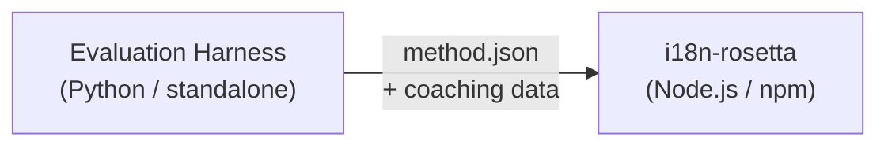

# مواصفات المكون الإضافي للطريقة

> **الإصدار**: 1.1  
> **الجمهور**: مطورو المكونات الإضافية  
> **المخطط الأساسي**: [`schemas/rosetta-plugin.schema.json`](https://github.com/gamedaysuits/i18n-rosetta/blob/main/schemas/rosetta-plugin.schema.json)

## نظرة عامة

يستخدم i18n-rosetta **نظام طرق يعتمد على المكونات الإضافية**. يمكن لكل زوج لغوي استخدام طريقة ترجمة مختلفة (نموذج لغوي كبير (LLM)، موجهة، محول نصوص، إلخ). تُسجل الطرق في `lib/translate.js` ويتم تحديدها لكل زوج لغوي عبر `lib/pairs.js`.

تتمثل وظيفة بيئة التقييم (eval harness) في **تطوير واختبار وتصدير** طرق الترجمة. بينما تتمثل وظيفة i18n-rosetta في **استهلاكها وتنفيذها**. لا تعمل بيئة التقييم أبدًا داخل rosetta.

### تدفق البيانات



---

## تنسيق المكون الإضافي للطريقة

المكون الإضافي للطريقة عبارة عن ملف JSON واحد (`method.json`) مع ملفات بيانات توجيه (coaching data) اختيارية.

### `method.json` — مطلوب

```json
{
  "name": "french-formal-v1",
  "type": "llm-coached",
  "version": "1.0.0",
  "description": "Formally-tuned French with terminology enforcement and grammar coaching",
  "author": "Plugin Author",

  "config": {
    "model": "google/gemini-3.5-flash",
    "register": "formal",
    "batchSize": 30,
    "temperature": 0.2
  },

  "locales": ["fr"],

  "benchmarks": {
    "fr": {
      "date": "2026-05-11T00:00:00Z",
      "corpus_size": 500,
      "exact_match_rate": 0.42,
      "corpus_chrf": 72.3,
      "corpus_bleu": 45.1,
      "model": "google/gemini-3.5-flash",
      "harness_version": "1.0.0"
    }
  },

  "provenance": {
    "resources": [],
    "commercialReady": false,
    "flags": ["license-unclear"]
  },

  "coaching": {
    "dir": "coaching"
  }
}
```

### مرجع الحقول

| الحقل | النوع | مطلوب | الوصف |
|-------|------|----------|-------------|
| `name` | string | ✅ | معرف فريد للطريقة (kebab-case) |
| `type` | string | ✅ | نوع طريقة Rosetta: `llm`, `llm-coached`, `api`, `google-translate`, `deepl`, `microsoft-translator`, `libretranslate`, `openai`, `anthropic`, `gemini` |
| `version` | string | ✅ | إصدار Semver (مثل `1.0.0`) |
| `locales` | string[] | ✅ | رموز اللغات (locale codes) التي تستهدفها هذه الطريقة (1 كحد أدنى) |
| `description` | string | — | وصف مقروء للبشر |
| `author` | string | — | من قام بتطوير/اختبار هذه الطريقة |
| `config.model` | string | — | معرف نموذج OpenRouter |
| `config.register` | string | — | أسلوب/نبرة اللغة المستهدفة |
| `config.batchSize` | number | — | عدد المفاتيح لكل دفعة API (1–200، الافتراضي: 30) |
| `config.temperature` | number | — | درجة حرارة النموذج اللغوي الكبير (LLM temperature) (0.0–2.0، الافتراضي: 0.3) |
| `benchmarks` | object | — | نتائج التقييم لكل لغة |
| `provenance` | object | — | التراخيص وتبعيات الموارد |
| `coaching.dir` | string | — | المسار النسبي لدليل بيانات التوجيه |

### كائن التقييم (لكل لغة)

| الحقل | النوع | مطلوب | الوصف |
|-------|------|----------|-------------|
| `date` | string | ✅ | طابع زمني بتنسيق ISO 8601 لتشغيل التقييم |
| `corpus_size` | number | ✅ | عدد الإدخالات التي تم تقييمها |
| `exact_match_rate` | number | ✅ | 0.0–1.0، نسبة التطابقات التامة |
| `corpus_chrf` | number | — | نتيجة chrF++ (0–100) |
| `corpus_bleu` | number | — | نتيجة BLEU (0–100) |
| `model` | string | ✅ | النموذج المستخدم أثناء التقييم |
| `harness_version` | string | ✅ | إصدار بيئة التقييم المستخدمة |

:::info ما هي المقاييس التي يتم عرضها؟
يعرض الأمر `rosetta status` **chrF++** و**معدل التطابق التام** من كتلة التقييم. يُقبل `corpus_bleu` في البيان (manifest) ولكنه لا يُعرض حاليًا أو يُستخدم بواسطة أي أمر في rosetta. تتتبع [لوحة صدارة الطرق](/leaderboard) مقاييس chrF++، والتطابق التام، ومعدل قبول FST.
:::

---

### كائن المصدر (Provenance)

توضح كتلة المصدر حالة ترخيص الموارد المجمعة في المكون الإضافي.

| الحقل | النوع | الافتراضي | الوصف |
|-------|------|---------|-------------|
| `resources` | object[] | `[]` | قائمة بالموارد المجمعة مع `name` و `license` و `type` |
| `commercialReady` | boolean | `false` | ما إذا كان المكون الإضافي مصرحًا له بالتوزيع التجاري |
| `flags` | string[] | `["license-unclear"]` | علامات الحالة المقروءة آليًا |

**الحالة الافتراضية** — يتم شحن المكونات الإضافية المصدرة مع `commercialReady: false` و `flags: ["license-unclear"]`.

**الحالة المصرح بها** — عند التحقق من الترخيص: قم بتعيين `commercialReady: true` وامسح العلامات.

---

## تنسيق بيانات التوجيه

إذا كان `type` هو `llm-coached`، يجب أن يتضمن المكون الإضافي ملفات بيانات التوجيه في الدليل الفرعي `coaching/`.

### `coaching/<locale>.json`

```json
{
  "grammar_rules": [
    "French adjectives agree in gender and number with the noun they modify",
    "Use 'vous' for formal contexts, 'tu' for informal"
  ],
  "dictionary": {
    "dashboard": "tableau de bord",
    "deployment": "déploiement",
    "settings": "paramètres"
  },
  "style_notes": "Prefer active voice. Avoid anglicisms where a native French term exists."
}
```

| الحقل | النوع | مطلوب | الوصف |
|-------|------|----------|-------------|
| `grammar_rules` | string[] | — | القواعد التي يتم حقنها في كل مطالبة (prompt) للنموذج اللغوي الكبير لهذه اللغة |
| `dictionary` | object | — | خريطة المصطلح → الترجمة. يتم حقن المصطلحات المتطابقة كمصطلحات مطلوبة. |
| `style_notes` | string | — | تعليمات أسلوب حرة تُلحق بالمطالبة |

---

## بنية الدليل

```
french-formal-v1/
  method.json                 # Method manifest with benchmarks
  coaching/
    fr.json                   # Coaching data for French
```

للطرق متعددة اللغات:

```
european-formal-v2/
  method.json                 # locales: ["fr", "de", "es", "it"]
  coaching/
    fr.json
    de.json
    es.json
    it.json
```

---

## كيف تستهلك Rosetta المكونات الإضافية

### التثبيت

```bash
i18n-rosetta plugin install ./french-formal-v1/
```

يُحفظ في `.rosetta/methods/french-formal-v1/`.

### التكوين

```json title="i18n-rosetta.config.json"
{
  "pairs": {
    "en:fr": {
      "methodPlugin": "french-formal-v1"
    }
  }
}
```

:::info دلالات الدمج (Merge semantics)
يحدد المكون الإضافي *ما هي* الطريقة التي يجب استخدامها (`type`). بينما يضبط تكوين الزوج اللغوي *كيفية* تشغيلها (`model`، `register`، `batchSize`). إذا قام الزوج بتعيين `model`، فإنه يتجاوز الإعداد الافتراضي للمكون الإضافي.
:::

### وقت التشغيل

1. تقرأ Rosetta `method.json` من `.rosetta/methods/french-formal-v1/`
2. يحدد حقل `type` في المكون الإضافي طريقة الترجمة (مثل `llm-coached`)
3. يتم تحميل بيانات التوجيه من دليل `coaching/` الخاص بالمكون الإضافي
4. تُستخدم كتلة `config` لسد الفجوات في النموذج/الأسلوب/درجة الحرارة
5. تُعرض كتلة `benchmarks` في مخرجات `rosetta status`
6. يتم فحص كتلة `provenance` بواسطة `rosetta provenance` للبحث عن علامات الترخيص

---

## التحقق من صحة المخطط

يتم التحقق من صحة بيانات المكونات الإضافية (manifests) وقت التثبيت مقابل [`schemas/rosetta-plugin.schema.json`](https://github.com/gamedaysuits/i18n-rosetta/blob/main/schemas/rosetta-plugin.schema.json).

قم بالإشارة إلى المخطط في `method.json` الخاص بك للحصول على الإكمال التلقائي في بيئة التطوير المتكاملة (IDE):

```json
{
  "$schema": "./node_modules/i18n-rosetta/schemas/rosetta-plugin.schema.json",
  "name": "my-method-v1"
}
```

---

## ما لا يجب تضمينه

- ❌ لا يوجد كود Python أو تبعيات لبيئة التقييم
- ❌ لا توجد بيانات مجموعة نصوص (corpus) خام أو سجلات تشغيل
- ❌ لا توجد مفاتيح API أو بيانات اعتماد
- ❌ لا يوجد تكوين لبيئة التقييم
- ❌ لا توجد قوالب مطالبات داخلية (هذه موجودة في تطبيقات طرق rosetta)

المكون الإضافي عبارة عن **بيانات فقط**: التكوين، ومحتوى التوجيه، ونتائج التقييم.

---

## انظر أيضًا

- [طرق الترجمة](/docs/guides/translation-methods) — كيف تعمل كل طريقة مدمجة
- [التكوين](/docs/getting-started/configuration) — التكوين لكل زوج لغوي ولكل لغة
- [تقديم طريقة عبر API](/docs/guides/serving-a-method) — استضافة الطرق كخدمات HTTP
- [كتاب الوصفات: مسار FST-Gated](https://mtevalarena.org/docs/tutorials/fst-gated-pipeline) — بناء وتعبئة مسار العمل
- [تقييم الترجمة الآلية (MT Evaluation)](https://mtevalarena.org/docs/leaderboard/rules) — تقييم الطرق لتقديمها إلى لوحة الصدارة
- [دعم لغة منخفضة الموارد](https://mtevalarena.org/docs/community/low-resource-languages) — حالة الاستخدام للمكونات الإضافية المجتمعية