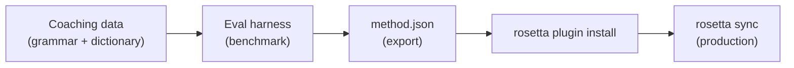

# درس تعليمي: بناء إضافة ترجمة

قم ببناء طريقة ترجمة مخصصة من الصفر، وقياس أدائها، ونشرها كإضافة rosetta. يمثل هذا سير العمل الكامل لإضافة زوج لغوي جديد لا تدعمه أي واجهة برمجة تطبيقات (API) جاهزة.

**ما ستقوم ببنائه:** إضافة ترجمة موجهة (coached) للغة الفرنسية الرسمية مع فرض المصطلحات، والقواعد النحوية، ودرجات قياس الأداء.

**الوقت:** 30–45 دقيقة

**المتطلبات الأساسية:**
- تثبيت i18n-rosetta (`npm install --save-dev i18n-rosetta`)
- مفتاح واجهة برمجة تطبيقات OpenRouter (`OPENROUTER_API_KEY`)
- Python 3.10+ (لأداة التقييم)

---

## الخطوة 1: تحديد المشكلة

أنت تقوم بترجمة لوحة تحكم SaaS إلى اللغة الفرنسية. تُنتج طريقة `llm` الافتراضية ترجمات صحيحة ولكنها غير متسقة:

- أحيانًا تُترجم "dashboard" إلى "tableau de bord"، وفي أحيان أخرى إلى "panneau de contrôle"
- تتأرجح النبرة بين صيغتي `tu` و `vous`
- تُستخدم المصطلحات التقنية بطابع إنجليزي بشكل غير متسق

أنت بحاجة إلى **فرض المصطلحات** و**التحكم في مستوى اللغة** وهو ما لا توفره المطالبة (prompt) العامة لنموذج LLM.

## الخطوة 2: إنشاء بيانات التوجيه

قم بإنشاء ملف توجيه يضم متطلباتك اللغوية:

```bash
mkdir -p .rosetta/coaching
```

```json title=".rosetta/coaching/fr.json"
{
  "grammar_rules": [
    "Always use the 'vous' form for formal register",
    "French adjectives agree in gender and number with their noun",
    "Use the present tense for UI instructions, not the imperative",
    "Preserve sentence-final punctuation style from the source"
  ],
  "dictionary": {
    "dashboard": "tableau de bord",
    "deployment": "déploiement",
    "settings": "paramètres",
    "environment variable": "variable d'environnement",
    "webhook": "webhook",
    "API key": "clé API",
    "sign in": "se connecter",
    "sign out": "se déconnecter",
    "repository": "dépôt",
    "pull request": "demande de tirage"
  },
  "style_notes": "Formal technical French. Prefer native French terms over anglicisms where established equivalents exist. Keep UI labels concise — 3 words maximum where possible."
}
```

**وظيفة كل حقل:**
- **`grammar_rules`** — يتم حقنها في مطالبة النظام (system prompt) لنموذج LLM كقيود صريحة
- **`dictionary`** — تتم مطابقتها مع المفاتيح المصدرية؛ وعند ظهور مصطلح من القاموس، يتم حقنه كـ "مصطلحات مطلوبة" في المطالبة
- **`style_notes`** — تُلحق بمطالبة النظام كإرشادات عامة للأسلوب

## الخطوة 3: تكوين الزوج اللغوي

أخبر rosetta باستخدام `llm-coached` للغة الفرنسية:

```json title="i18n-rosetta.config.json"
{
  "version": 3,
  "inputLocale": "en",
  "localesDir": "./locales",
  "pairs": {
    "en:fr": {
      "method": "llm-coached",
      "model": "google/gemini-3.5-flash"
    }
  },
  "languages": {
    "fr": {
      "register": "Formal technical French (vous-form)",
      "name": "French"
    }
  }
}
```

## الخطوة 4: الاختبار

```bash
npx i18n-rosetta sync --dry
```

راجع مخرجات التشغيل التجريبي (dry-run). تحقق مما يلي:
- ✅ استخدام مصطلحات القاموس بشكل متسق ("tableau de bord" وليس "panneau de contrôle")
- ✅ استخدام صيغة `vous` في جميع الأنحاء
- ✅ تطابق المصطلحات التقنية مع قاموسك

ثم قم بتشغيل المزامنة الفعلية:

```bash
npx i18n-rosetta sync
```

## الخطوة 5: قياس الأداء باستخدام أداة التقييم (اختياري)

إذا كنت تريد الحصول على درجات الجودة — وأنت بالتأكيد تريد ذلك، لأن الإضافات تُرفق ببيانات قياس الأداء — فاستخدم أداة التقييم المرافقة.

### تثبيت أداة التقييم

```bash
git clone https://github.com/gamedaysuits/gds-mt-eval-harness.git
cd gds-mt-eval-harness
pip install -r requirements.txt
```

### إنشاء مجموعة نصوص مرجعية

قم بإنشاء ملف يحتوي على السلاسل المصدرية والترجمات الموثوقة:

```json title="corpus/french-formal.json"
[
  {
    "source": "Dashboard",
    "reference": "Tableau de bord"
  },
  {
    "source": "Sign in to your account",
    "reference": "Connectez-vous à votre compte"
  },
  {
    "source": "Your deployment is ready",
    "reference": "Votre déploiement est prêt"
  },
  {
    "source": "Environment variables",
    "reference": "Variables d'environnement"
  }
]
```

### تشغيل قياس الأداء

```bash
python harness.py eval \
  --corpus corpus/french-formal.json \
  --source en \
  --target fr \
  --method llm-coached \
  --model google/gemini-3.5-flash
```

مخرجات أداة التقييم:
- **chrF++** — درجة F على مستوى الحرف (0–100). أعلى من 70 يُعتبر قويًا.
- **BLEU** — تداخل N-gram (0–100). أعلى من 40 يُعتبر صلبًا للترجمة الموجهة.
- **معدل التطابق التام** — نسبة الترجمات التي تتطابق مع المرجع تمامًا.

### تصدير الإضافة

بمجرد أن تكون راضيًا عن الدرجات:

```bash
python harness.py export \
  --name french-formal-v1 \
  --output ./french-formal-v1/
```

سيؤدي هذا إلى إنشاء:

```
french-formal-v1/
├── method.json          # Manifest with config + benchmarks
└── coaching/
    └── fr.json          # Your coaching data
```

## الخطوة 6: تثبيت الإضافة في Rosetta

```bash
npx i18n-rosetta plugin install ./french-formal-v1/
```

سيقوم هذا بنسخ الإضافة إلى `.rosetta/methods/french-formal-v1/`.

قم بتحديث ملف التكوين الخاص بك لاستخدامها:

```json title="i18n-rosetta.config.json"
{
  "pairs": {
    "en:fr": {
      "methodPlugin": "french-formal-v1"
    }
  }
}
```

## الخطوة 7: التحقق

```bash
# Check plugin is installed and shows benchmark scores
npx i18n-rosetta status

# Run a sync with the plugin
npx i18n-rosetta sync

# Audit licensing status
npx i18n-rosetta provenance
```

ستُظهر مخرجات `status` ما يلي:

```
en → fr
  Method:    french-formal-v1 (llm-coached)
  Model:     google/gemini-3.5-flash
  Quality:   high
  chrF++:    74.2
  BLEU:      46.8
  Exact:     42%
```

## ما قمت ببنائه



لديك الآن:
1. **بيانات التوجيه** — القواعد النحوية والمصطلحات التي تفرض الاتساق
2. **درجات قياس الأداء** — جودة كمية تُرفق مع الإضافة
3. **إضافة محمولة** — `method.json` + بيانات التوجيه، قابلة للتثبيت على أي جهاز
4. **نشر في بيئة الإنتاج** — مدمجة في مسار المزامنة الخاص بك

## الخطوات التالية

- **[مواصفات الإضافة](/docs/reference/plugin-spec)** — مرجع كامل لتنسيق البيان (manifest)
- **[طرق الترجمة](/docs/guides/translation-methods)** — مقارنة بين الطرق الأربع جميعها
- **[اللغات منخفضة الموارد](https://mtevalarena.org/docs/community/low-resource-languages)** — تطبيق هذا النمط على اللغات التي لا تغطيها واجهات برمجة التطبيقات (API)
- **[ترجمة 30 لغة](/docs/tutorials/translate-30-languages)** — توسيع نطاق مشروعك ليصل إلى جمهور عالمي