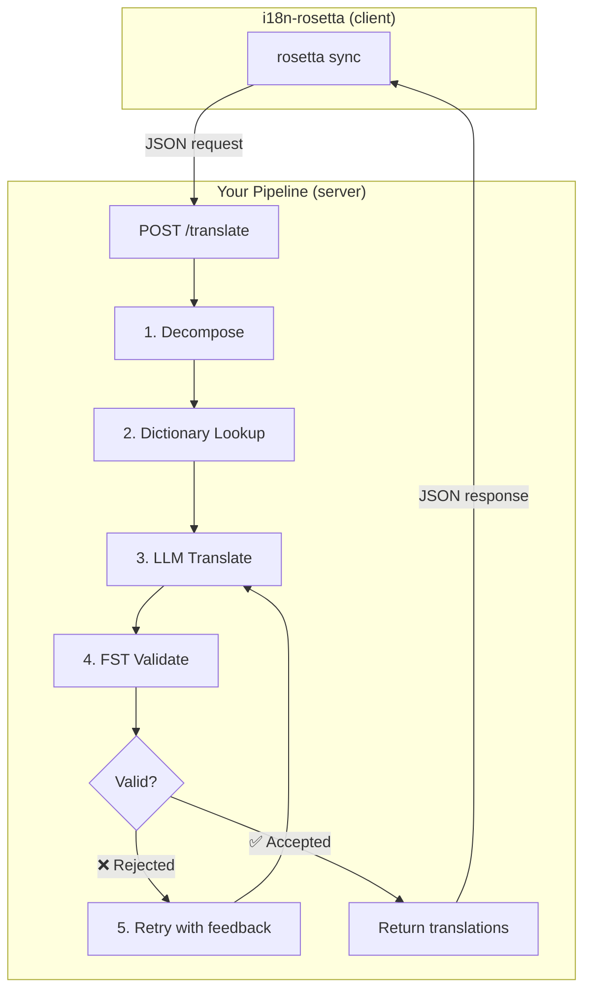
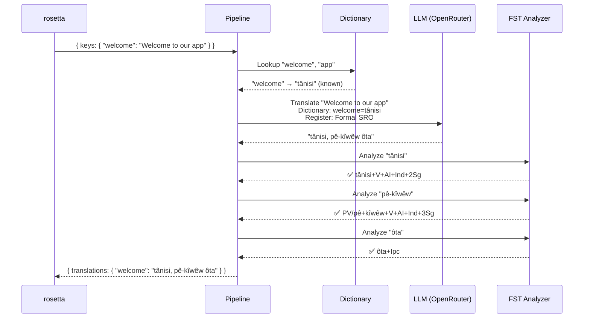
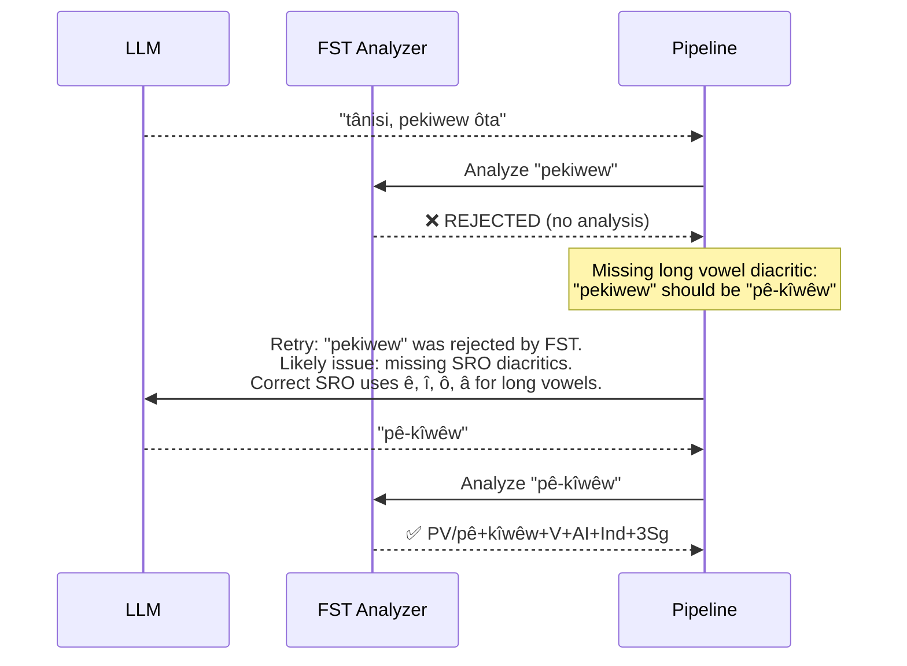
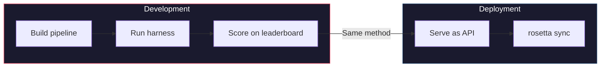

# دليل الوصفات البرمجية: مسار الترجمة المحكم بـ FST

قم ببناء مسار ترجمة متعدد المراحل يقوم بتفكيك النص المصدر، وترجمته عبر LLM، والتحقق من صحة المخرجات باستخدام محول الحالة المحدودة (FST)، وتقديم كل ذلك كنقطة نهاية HTTP يستدعيها rosetta عبر طريقة `api`.

**ما ستقوم ببنائه:** واجهة برمجة تطبيقات (API) للترجمة للغة Plains Cree تلتقط الترجمات غير الصالحة صرفيًا *قبل* وصولها إلى ملفات الترجمة (locale files) الخاصة بك.

:::info المتطلبات الأساسية
- ملف تنفيذي FST قيد التشغيل (على سبيل المثال، من [محلل Plains Cree الخاص بـ ALTLab](https://github.com/UAlbertaALTLab/lang-crk))
- Node.js 20+ أو Python 3.10+
- مفتاح واجهة برمجة تطبيقات OpenRouter لخطوة LLM
:::

---

## البنية

يعمل المسار كخدمة HTTP مستقلة. لا يعرف rosetta ولا يهتم بما يحدث بالداخل — فهو يرسل المفاتيح، ويستقبل الترجمات.



### لماذا هذه البنية

كل مرحلة لها وظيفة محددة:

| المرحلة | ماذا تفعل | لماذا هي مهمة |
|-------|-------------|---------------|
| **التفكيك (Decompose)** | تقسيم السلاسل النصية المركبة لواجهة المستخدم إلى أجزاء قابلة للترجمة | اللغات متعددة التركيب (Polysynthetic) تدمج جملاً كاملة في كلمات مفردة — ويحتاج LLM إلى وحدات أصغر |
| **البحث في القاموس (Dictionary Lookup)** | التحقق من قاموس ثنائي اللغة للبحث عن الترجمات المعروفة | يفرض استخدام المصطلحات الصحيحة للمصطلحات المعروفة بدلاً من الاعتماد على تخمين LLM |
| **ترجمة LLM (LLM Translate)** | إرسال الجزء إلى LLM مع سياق الأسلوب والقواعد | يتعامل مع العبارات الجديدة ويولد مخرجات سلسة |
| **التحقق بواسطة FST (FST Validate)** | تمرير المخرجات عبر محلل صرفي | يلتقط أشكال الكلمات غير الصالحة — إذا رفض FST كلمة ما، فهي غير صالحة في اللغة |
| **إعادة المحاولة (Retry)** | إعادة إرسال الكلمات المرفوضة مع ملاحظات الخطأ من FST | يمنح LLM معلومات محددة حول *سبب* خطأ الكلمة |

---

## تدفق البيانات

إليك ما يحدث لمفتاح واحد (`"welcome": "Welcome to our app"`) أثناء تدفقه عبر المسار:



### عندما يرفض FST



---

## التنفيذ

### الخطوة 1: هيكل الخادم

ينفذ الخادم [عقد طريقة API](/docs/guides/serving-a-method) الخاص بـ rosetta — وهي نقطة نهاية `POST /translate` واحدة.

```javascript title="server.js"
import express from 'express';
import { translateBatch } from './pipeline.js';

const app = express();
app.use(express.json());

/**
 * rosetta API contract:
 *
 * Request:  { source_locale, target_locale, method, keys: { "key": "source" } }
 * Response: { translations: { "key": "translated" }, meta: { ... } }
 */
app.post('/translate', async (req, res) => {
  const { source_locale, target_locale, method, keys } = req.body;

  // Validate request
  if (!keys || typeof keys !== 'object') {
    return res.status(400).json({ error: { message: 'Missing keys object' } });
  }

  try {
    const startTime = Date.now();
    const { translations, stats } = await translateBatch(keys, {
      sourceLang: source_locale,
      targetLang: target_locale,
    });

    res.json({
      translations,
      meta: {
        model: 'custom-pipeline/fst-gated-v1',
        method: 'decompose-lookup-translate-validate',
        elapsed_ms: Date.now() - startTime,
        fst_acceptance_rate: stats.fstAccepted / stats.total,
        retries: stats.retries,
      },
    });
  } catch (err) {
    console.error('[ERR] Pipeline failed:', err.message);
    res.status(500).json({ error: { message: err.message } });
  }
});

// Health check for rosetta connectivity verification
app.get('/health', (req, res) => res.json({ status: 'ok' }));

app.listen(3001, () => {
  console.log('FST-gated pipeline running on http://localhost:3001');
});
```

### الخطوة 2: المسار

كل مرحلة عبارة عن دالة (function). يقوم المسار بربطها معًا.

```javascript title="pipeline.js"
import { lookupDictionary } from './dictionary.js';
import { callLLM } from './llm.js';
import { analyzeWithFST } from './fst.js';

const MAX_RETRIES = 3;

/**
 * Translate a batch of keys through the full pipeline.
 *
 * @param {object} keys - Map of key → source string
 * @param {object} options - { sourceLang, targetLang }
 * @returns {{ translations: object, stats: object }}
 */
export async function translateBatch(keys, options) {
  const translations = {};
  const stats = { total: 0, fstAccepted: 0, retries: 0, dictionaryHits: 0 };

  for (const [key, sourceText] of Object.entries(keys)) {
    stats.total++;
    translations[key] = await translateSingle(sourceText, options, stats);
  }

  return { translations, stats };
}

/**
 * Translate a single string through all pipeline stages.
 */
async function translateSingle(sourceText, options, stats) {

  // ── Stage 1: Decompose ──────────────────────────────────
  // Split compound strings into segments the LLM can handle.
  // For UI strings this is often a no-op, but for longer content
  // it prevents the LLM from losing context in long prompts.
  const segments = decompose(sourceText);

  // ── Stage 2: Dictionary Lookup ──────────────────────────
  // Check each segment against the bilingual dictionary.
  // Known terms are forced — the LLM won't override them.
  const knownTerms = {};
  for (const segment of segments) {
    const entry = lookupDictionary(segment.toLowerCase());
    if (entry) {
      knownTerms[segment] = entry;
      stats.dictionaryHits++;
    }
  }

  // ── Stage 3: LLM Translate ──────────────────────────────
  let translation = await callLLM(sourceText, {
    ...options,
    knownTerms,
    register: 'nêhiyawêwin (Plains Cree). Use SRO orthography. '
            + 'Professional register for educational contexts.',
  });

  // ── Stage 4: FST Validate ──────────────────────────────
  // Split the translation into words and check each one.
  let { accepted, rejected } = await validateWords(translation);

  // ── Stage 5: Retry Loop ─────────────────────────────────
  // If any words were rejected, retry with FST feedback.
  let attempt = 0;
  while (rejected.length > 0 && attempt < MAX_RETRIES) {
    attempt++;
    stats.retries++;

    const feedback = rejected
      .map(w => `"${w}" was rejected by the morphological analyzer`)
      .join('; ');

    translation = await callLLM(sourceText, {
      ...options,
      knownTerms,
      register: 'nêhiyawêwin (Plains Cree). Use SRO orthography.',
      feedback: `Previous attempt had invalid words. ${feedback}. `
              + 'Use correct SRO diacritics (ê, î, ô, â for long vowels). '
              + 'Ensure verb forms match expected conjugation patterns.',
    });

    ({ accepted, rejected } = await validateWords(translation));
  }

  if (rejected.length === 0) stats.fstAccepted++;

  return translation;
}

/**
 * Decompose source text into translatable segments.
 *
 * For simple key-value UI strings, this usually returns the
 * original string as a single segment. For longer content,
 * it splits on sentence boundaries.
 */
function decompose(text) {
  // Simple sentence-boundary split. Replace with your own
  // morphological decomposition for more complex needs.
  return text
    .split(/(?<=[.!?])\s+/)
    .filter(s => s.trim().length > 0);
}

/**
 * Validate each word in a translation against the FST.
 *
 * @returns {{ accepted: string[], rejected: string[] }}
 */
async function validateWords(translation) {
  // Split on whitespace and punctuation, keeping only words
  const words = translation
    .split(/[\s,;:.!?'"()[\]{}]+/)
    .filter(w => w.length > 0);

  const accepted = [];
  const rejected = [];

  for (const word of words) {
    const analyses = await analyzeWithFST(word);
    if (analyses.length > 0) {
      accepted.push(word);
    } else {
      rejected.push(word);
    }
  }

  return { accepted, rejected };
}
```

### الخطوة 3: غلاف FST

قم بتغليف الملف التنفيذي لـ FST كدالة غير متزامنة (async function). يستخدم هذا المثال محلل Plains Cree المعتمد على HFST من ALTLab.

```javascript title="fst.js"
import { execFile } from 'node:child_process';
import { promisify } from 'node:util';

const execFileAsync = promisify(execFile);

// Path to your FST analyzer binary
const FST_PATH = process.env.FST_ANALYZER_PATH || './bin/crk-analyzer';

/**
 * Run a word through the FST morphological analyzer.
 *
 * Returns an array of analyses. Empty array = rejected.
 *
 * Example:
 *   analyzeWithFST("tânisi")
 *   → ["tânisi+V+AI+Ind+2Sg", "tânisi+V+AI+Cnj+2Sg"]
 *
 *   analyzeWithFST("pekiwew")
 *   → []  // rejected — missing diacritics
 *
 * @param {string} word - A single word in SRO orthography
 * @returns {string[]} Array of FST analyses (empty = rejected)
 */
export async function analyzeWithFST(word) {
  try {
    // HFST lookup: pipe the word to stdin, read analyses from stdout
    const { stdout } = await execFileAsync(
      FST_PATH,
      ['--quiet'],
      { input: word + '\n', timeout: 5000 }
    );

    // Parse HFST output: each line is "input\tanalysis\tweight"
    // Lines with "+?" indicate unrecognized forms
    return stdout
      .split('\n')
      .filter(line => line.includes('\t') && !line.includes('+?'))
      .map(line => line.split('\t')[1]);

  } catch (err) {
    // If the FST binary isn't available, log and reject
    console.error(`[WARN] FST analysis failed for "${word}": ${err.message}`);
    return [];
  }
}
```

### الخطوة 4: وحدات القاموس و LLM

```javascript title="dictionary.js"
/**
 * Simple bilingual dictionary backed by a JSON file.
 *
 * In production, you'd load from the coaching data directory
 * or query itwêwina (https://itwewina.altlab.app/) via API.
 */
const DICTIONARY = {
  'hello': 'tânisi',
  'welcome': 'tânisi',
  'thank you': 'kinanâskomitin',
  'home': 'kīwēwin',
  'search': 'nānātawāpahtam',
  'settings': 'isi-nākatohkēwin',
  'help': 'nīsōhkamākēwin',
  'back': 'kīwē',
};

/**
 * @param {string} term - Lowercase English term
 * @returns {string|null} Cree translation or null
 */
export function lookupDictionary(term) {
  return DICTIONARY[term] || null;
}
```

```javascript title="llm.js"
/**
 * Call an LLM via OpenRouter for translation.
 */
const OPENROUTER_API = 'https://openrouter.ai/api/v1/chat/completions';

export async function callLLM(sourceText, options) {
  const { knownTerms = {}, register, feedback } = options;

  // Build the system prompt with register and known terms
  let systemPrompt = `You are translating English to Plains Cree.\n\n`;
  systemPrompt += `Register: ${register}\n\n`;

  if (Object.keys(knownTerms).length > 0) {
    systemPrompt += `Required terminology (use these exact translations):\n`;
    for (const [en, crk] of Object.entries(knownTerms)) {
      systemPrompt += `  "${en}" → "${crk}"\n`;
    }
    systemPrompt += '\n';
  }

  if (feedback) {
    systemPrompt += `IMPORTANT correction from previous attempt:\n${feedback}\n\n`;
  }

  systemPrompt += `Rules:\n`;
  systemPrompt += `- Use Standard Roman Orthography (SRO)\n`;
  systemPrompt += `- Use macron/circumflex for long vowels: ê, î, ô, â\n`;
  systemPrompt += `- Return ONLY the Cree translation, nothing else\n`;

  const response = await fetch(OPENROUTER_API, {
    method: 'POST',
    headers: {
      'Authorization': `Bearer ${process.env.OPENROUTER_API_KEY}`,
      'Content-Type': 'application/json',
    },
    body: JSON.stringify({
      model: 'google/gemini-2.5-pro',
      messages: [
        { role: 'system', content: systemPrompt },
        { role: 'user', content: sourceText },
      ],
      temperature: 0.2,
    }),
  });

  const json = await response.json();
  return json.choices[0].message.content.trim();
}
```

---

## الاتصال بـ rosetta

### تكوين الزوج اللغوي

قم بتوجيه زوجك اللغوي إلى الخدمة قيد التشغيل:

```json title="i18n-rosetta.config.json"
{
  "version": 3,
  "inputLocale": "en",
  "pairs": {
    "en:crk": {
      "method": "api",
      "endpoint": "http://localhost:3001/translate"
    }
  },
  "languages": {
    "crk": {
      "name": "Plains Cree",
      "register": "SRO syllabics with grammatical precision."
    }
  }
}
```

### تعيين مفتاح API

```bash
export ROSETTA_API_KEY="your-service-auth-token"
export OPENROUTER_API_KEY="sk-or-v1-..."  # for the LLM step inside the pipeline
```

### التشغيل

```bash
# Start the pipeline
node server.js

# In another terminal, run rosetta
npx i18n-rosetta sync
```

يرسل rosetta (عبر POST) مفاتيحك الإنجليزية إلى المسار. يقوم المسار بالتفكيك، والبحث، والترجمة، والتحقق، وإعادة المحاولة، ثم يُرجع ترجمات Cree. يكتبها rosetta في `crk.json`.

---

## تقييم مسارك

يمكن تقييم المسار نفسه باستخدام [أداة التقييم (eval harness)](/docs/eval/harness). تستخدم الأداة نفس نمط إدخال/إخراج JSON:

```bash
# Clone the harness
git clone https://github.com/gamedaysuits/gds-mt-eval-harness.git
cd gds-mt-eval-harness

# Run against the EDTeKLA dataset
python eval/baseline_experiment.py \
  --dataset data/edtekla-dev-v1.json \
  --model google/gemini-2.5-pro \
  --fst-analyzer ./bin/crk-analyzer \
  --condition fst-gated-v1 \
  --submit
```

تخبر العلامة `--fst-analyzer` الأداة بتشغيل التحقق من FST على كل مخرج — وهو نفس التحقق الذي يجريه مسارك. يتيح لك هذا مقارنة نتيجة مسارك مع خط الأساس (baseline).



**أثبت كفاءتها، ثم استخدمها.** الطريقة التي تقيس أداءها في أداة التقييم هي نفس الطريقة التي يستدعيها rosetta في بيئة الإنتاج.

---

## التعبئة كمكون إضافي (Plugin)

بمجرد أن يحصل مسارك على نتائج في لوحة المتصدرين (leaderboard)، قم بتعبئته كمكون إضافي لـ rosetta حتى يتمكن الآخرون من استخدامه:

```json title="crk-fst-gated-v1/method.json"
{
  "name": "crk-fst-gated-v1",
  "type": "api",
  "version": "1.0.0",
  "description": "FST-gated Plains Cree translation with morphological validation",
  "author": "Your Name",

  "config": {
    "endpoint": "https://your-server.example.com/translate"
  },

  "locales": ["crk"],

  "benchmarks": {
    "crk": {
      "date": "2026-06-01T00:00:00Z",
      "corpus_size": 124,
      "exact_match_rate": 0.12,
      "corpus_chrf": 48.7,
      "model": "google/gemini-2.5-pro",
      "harness_version": "2.0"
    }
  },

  "provenance": {
    "resources": [
      { "name": "ALTLab CRK Analyzer", "license": "LGPL-3.0", "type": "fst" },
      { "name": "Wolvengrey Dictionary", "license": "CC-BY-NC-SA-4.0", "type": "dictionary" }
    ],
    "commercialReady": false,
    "flags": ["nc-resource"]
  }
}
```

قم بتثبيته:

```bash
i18n-rosetta plugin install ./crk-fst-gated-v1/
```

الآن يمكن لأي شخص لديه وصول إلى خادمك استخدام المكون الإضافي:

```json title="i18n-rosetta.config.json"
{
  "pairs": {
    "en:crk": { "methodPlugin": "crk-fst-gated-v1" }
  }
}
```

---

## توسيع هذا النمط

يوضح دليل الوصفات البرمجية هذا بنية مسار واحدة. يمكنك تكييفها لأي لغة أو طريقة:

| التغيير | ما الذي يتغير |
|-----------|-------------|
| **FST مختلف** | تبديل مسار الملف التنفيذي. يمكنك تنزيل ملفات FST مجمعة مسبقًا (مثل الملفات التنفيذية `.hfstol` أو `lttoolbox`) لأكثر من 100 لغة من [GiellaLT GitHub](https://github.com/giellalt) أو [Apertium GitHub](https://github.com/apertium). |
| **لا يتوفر FST** | إزالة مرحلة تنفيذ FST واستخدام [ملفات النماذج المسطحة لـ UniMorph](https://huggingface.co/datasets/unimorph/universal_morphologies) من Hugging Face لإجراء تحقق من قاعدة بيانات ثابتة للأشكال المُصرّفة. |
| **نماذج LLM متعددة** | ربط النماذج: نموذج سريع للمسودة الأولية، ونموذج استدلالي للتصحيحات. |
| **تدخل بشري (Human-in-the-loop)** | إضافة مرحلة طابور (queue) تحتفظ بالترجمات غير المؤكدة لمراجعة الخبراء قبل إرجاعها. |
| **نموذج مضبوط بدقة (Fine-tuned model)** | استبدال استدعاء OpenRouter بنموذج محلي (Ollama، vLLM، إلخ). |
| **لغة مختلفة** | تغيير القاموس، و FST، والأسلوب. تظل البنية متطابقة. |

المسار هو مجرد نمط. المراحل قابلة للتبديل. قم ببناء ما يناسب لغتك، وأثبت كفاءته في [لوحة المتصدرين](/leaderboard)، ثم انشره.

---

## انظر أيضًا

- **[تقديم طريقة عبر API](/docs/guides/serving-a-method)** — مواصفات عقد واجهة برمجة التطبيقات (API)
- **[مواصفات المكون الإضافي](/docs/reference/plugin-spec)** — تنسيق البيان (manifest) لملف method.json
- **[دعم لغة منخفضة الموارد](/docs/guides/low-resource-languages)** — السياق الأوسع ومبادئ OCAP
- **[تقييم الترجمة الآلية (MT Evaluation)](/docs/eval/)** — الطرق الجيدة مقابل السيئة، وما الذي يتم استبعاده
- **[أداة التقييم (Eval Harness)](/docs/eval/harness)** — كيفية قياس أداء مسارك
- **[لوحة متصدري الطرق (Method Leaderboard)](/leaderboard)** — إرسال نتائجك
- **[ALTLab](https://altlab.artsrn.ualberta.ca/)** — مختبر ألبرتا لتكنولوجيا اللغة (Plains Cree FST)
- **[طرق الترجمة](/docs/guides/translation-methods)** — كيف تعمل كل طريقة مدمجة