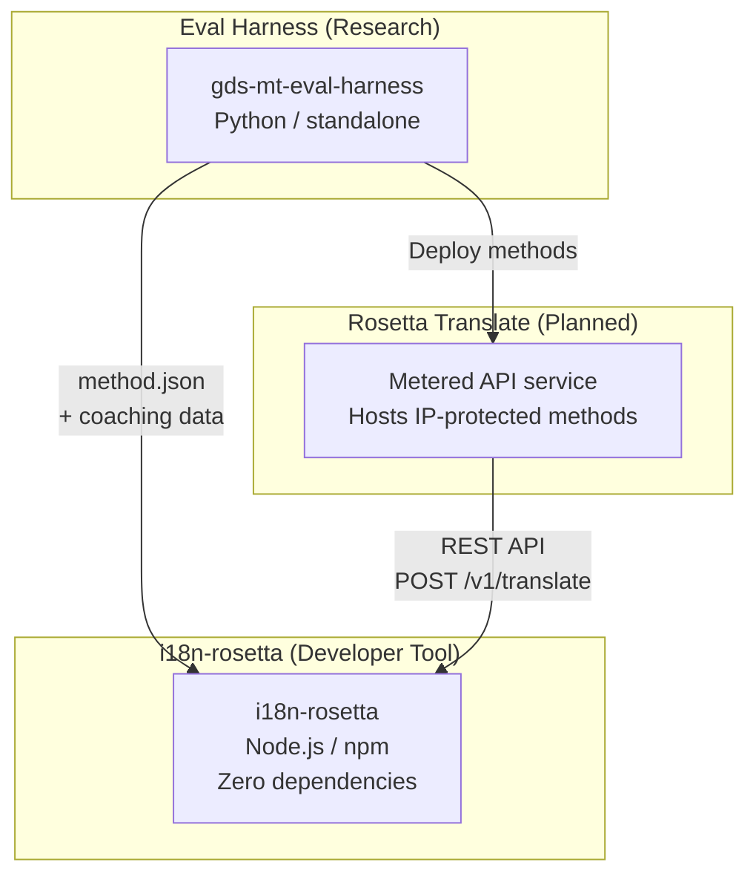
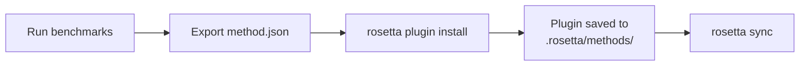
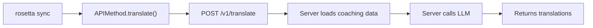

# Architektur

Das Rosetta-Übersetzungsökosystem besteht aus drei unabhängigen Tools, die über klar definierte Verträge zusammenarbeiten. Keines von ihnen ist zur Build-Zeit voneinander abhängig. Sie kommunizieren über ein gemeinsames **Method Plugin Format** und einen **REST API Contract**.

## Die drei Komponenten



### i18n-rosetta (dieses Projekt)

Das Open-Source-Entwicklertool. Übersetzt Locale-Dateien mithilfe von Pluggable Methods. Keine Abhängigkeiten, Konfiguration optional, funktioniert sofort (out of the box).

**Integrierte Methoden:**
- `llm` → OpenRouter / jedes beliebige LLM
- `llm-coached` → LLM + Grammatik-/Wörterbuch-Coaching
- `google-translate` → Google Cloud Translation API
- `api` → Thin Pipe zu jeder beliebigen Remote-API

### Eval Harness (Begleitprojekt)

Ein Forschungstool zur Entwicklung, zum Testen und zum Benchmarking von Übersetzungsmethoden. Wenn eine Methode eine akzeptable Qualität erreicht, exportiert das Harness ein **Method Plugin** – ein `method.json`-Manifest und optionale Coaching-Datendateien.

Das Harness wird niemals innerhalb von rosetta ausgeführt. Es ist ein separates Tool, das statische Ausgaben (JSON-Dateien) erzeugt. Rosetta liest diese Dateien lediglich.

[→ Eval Harness auf GitHub](https://github.com/gamedaysuits/gds-mt-eval-harness)

### Rosetta Translate (geplant)

Ein nutzungsbasierter (metered) API-Service, der proprietäre Übersetzungsmethoden serverseitig hostet – die Prompts, Coaching-Daten und linguistischen Pipelines verlassen den Server niemals.

## Wie sie miteinander verbunden sind

### Eval Harness → i18n-rosetta (Einweg-Export)



**Vertrag**: [Plugin-Spezifikation](/docs/reference/plugin-spec)

### Rosetta Translate → i18n-rosetta (API zur Laufzeit)



Rosettas `APIMethod` ist eine **Dumb Pipe**. Sie sendet Keys nach außen und empfängt Übersetzungen zurück. Sie enthält keinerlei Übersetzungslogik und keine proprietären Inhalte.

## Was jede Komponente über die anderen weiß

| Tool | Kennt rosetta? | Kennt Rosetta Translate? | Kennt Harness? |
|------|---------------------|-------------------------------|---------------------|
| **i18n-rosetta** | *(ist rosetta)* | Ja — `api`-Methode ruft es auf | Nein — liest nur Plugin-Exporte |
| **Rosetta Translate** | Ja — bedient dessen Anfragen | *(ist Rosetta Translate)* | Nein — empfängt bereitgestellte Methoden |
| **Eval Harness** | Ja — exportiert Plugin-Format | Nein — Methoden werden separat bereitgestellt | *(ist das Harness)* |

## Benutzerszenarien

### Szenario 1: Kostenlos, Zero-Config (die meisten Benutzer:innen)

```bash
export OPENROUTER_API_KEY=sk-...
npx i18n-rosetta sync
```

Verwendet die integrierte `llm`-Methode. Keine Plugins, kein Rosetta Translate, kein Harness.

### Szenario 2: Google Translate Baseline

```bash
export GOOGLE_TRANSLATE_API_KEY=AIza...
npx i18n-rosetta sync
```

Verwendet die integrierte `google-translate`-Methode. Keine Plugins erforderlich.

### Szenario 3: Offenes Plugin mit gebündeltem Coaching

```bash
rosetta plugin install ./french-formal-v1/
rosetta sync
```

Plugin hat `type: "llm-coached"` → rosetta verwendet den eigenen OpenRouter-Key der Benutzer:innen. Coaching-Daten sind lokal (kein Serveraufruf).

### Szenario 4: DIY-Coaching (kein Plugin, kein Harness)

```json title="i18n-rosetta.config.json"
{
  "pairs": {
    "en:fr": { "method": "llm-coached" }
  }
}
```

Benutzer:innen pflegen ihre eigenen Grammatikregeln und ihr eigenes Wörterbuch in `.rosetta/coaching/fr.json`.

## Designprinzipien

1. **Keine zirkulären Abhängigkeiten.** Die Brücken sind Einwegverbindungen.
2. **Rosetta ist der leichtgewichtige Kern.** Keine Abhängigkeiten, Konfiguration optional. Plugins und API sind additiv.
3. **IP-Schutz ist architektonisch verankert.** Proprietäre Techniken bleiben serverseitig. Das npm-Paket liefert nichts Proprietäres aus.
4. **Das Plugin-Format ist der Vertrag.** Alles fließt durch `method.json`.
5. **Jedes Tool hat genau eine Aufgabe.** Harness → Methoden entwickeln. Rosetta Translate → Methoden hosten. Rosetta → Dateien übersetzen.