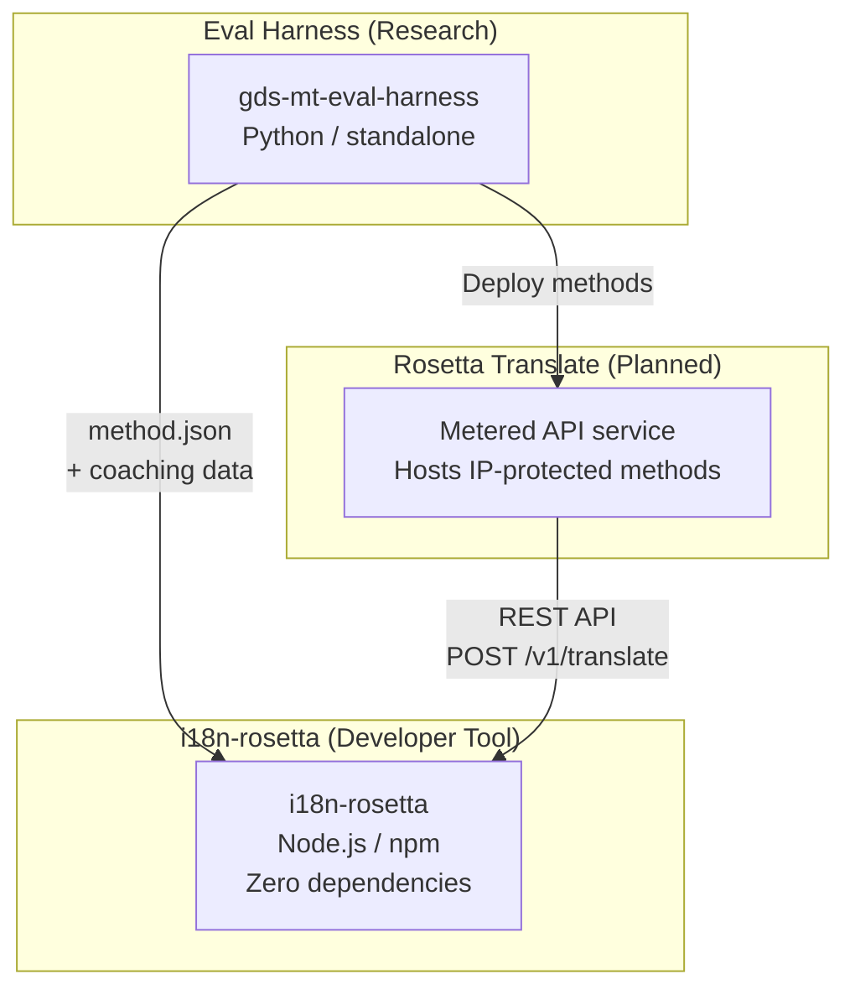
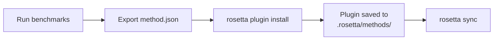
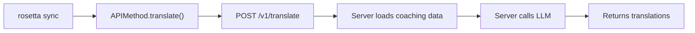

# Architektur

Das Rosetta-Übersetzungs-Ökosystem besteht aus drei unabhängigen Tools, die über klar definierte Verträge zusammenarbeiten. Keines von ihnen ist zur Erstellungszeit voneinander abhängig. Sie kommunizieren über ein gemeinsames **Methoden-Plugin-Format** und einen **REST-API-Vertrag**.

## Die drei Komponenten



### i18n-rosetta (dieses Projekt)

Das Open-Source-Entwicklertool. Es übersetzt Lokalisierungsdateien mithilfe von Plugin-Methoden. Es hat keine Abhängigkeiten, die Konfiguration ist optional und es funktioniert sofort.

**Integrierte Methoden:**
- `llm` → OpenRouter / beliebiges LLM (200+ Modelle)
- `llm-coached` → LLM + Grammatik-/Wörterbuch-Coaching
- `openai` → Direkte OpenAI API (GPT-4o, GPT-4o-mini)
- `anthropic` → Direkte Anthropic API (Claude Sonnet, Haiku, Opus)
- `gemini` → Direkte Google Gemini API (Flash, Pro — kostenloser Tarif verfügbar)
- `google-translate` → Google Cloud Translation API v2
- `deepl` → DeepL API mit Glossar-Unterstützung
- `microsoft-translator` → Azure Cognitive Services Translator
- `libretranslate` → Selbstgehostetes LibreTranslate (AGPL, kostenlos)
- `api` → Schlanke Schnittstelle zu einem beliebigen Remote-REST-Endpunkt

### Eval Harness (Begleitprojekt)

Ein Forschungstool zur Entwicklung, zum Testen und zum Benchmarking von Übersetzungsmethoden. Wenn eine Methode eine akzeptable Qualität erreicht, exportiert das Harness ein **Methoden-Plugin** — ein `method.json`-Manifest und optionale Coaching-Datendateien.

Das Harness läuft niemals innerhalb von rosetta. Es ist ein separates Tool, das eine statische Ausgabe (JSON-Dateien) erzeugt. Rosetta liest diese Dateien lediglich.

[→ Eval Harness auf GitHub](https://github.com/gamedaysuits/gds-mt-eval-harness)

### Rosetta Translate (geplant)

Ein API-Dienst mit nutzungsabhängiger Abrechnung, der proprietäre Übersetzungsmethoden serverseitig hostet — die Prompts, Coaching-Daten und linguistischen Pipelines verlassen den Server niemals.

## Wie sie miteinander verbunden sind

### Eval Harness → i18n-rosetta (Einweg-Export)



**Vertrag**: [Plugin-Spezifikation](/docs/reference/plugin-spec)

### Rosetta Translate → i18n-rosetta (API zur Laufzeit)



Rosettas `APIMethod` ist eine **reine Datenleitung (Dumb Pipe)**. Sie sendet Schlüssel nach außen und empfängt Übersetzungen zurück. Sie enthält keinerlei Übersetzungslogik und keine proprietären Inhalte.

## Was jede Komponente über die anderen weiß

| Tool | Kennt rosetta? | Kennt Rosetta Translate? | Kennt Harness? |
|------|---------------------|-------------------------------|---------------------|
| **i18n-rosetta** | *(ist rosetta)* | Ja — die `api`-Methode ruft es auf | Nein — liest nur Plugin-Exporte |
| **Rosetta Translate** | Ja — bedient dessen Anfragen | *(ist Rosetta Translate)* | Nein — empfängt bereitgestellte Methoden |
| **Eval Harness** | Ja — exportiert das Plugin-Format | Nein — Methoden werden separat bereitgestellt | *(ist das Harness)* |

## Benutzerszenarien

### Szenario 1: Kostenlos, ohne Konfiguration (die meisten Benutzer)

```bash
export OPENROUTER_API_KEY=sk-...
npx i18n-rosetta sync
```

Verwendet die integrierte `llm`-Methode. Keine Plugins, kein Rosetta Translate, kein Harness.

### Szenario 2: Google Translate als Basis

```bash
export GOOGLE_TRANSLATE_API_KEY=AIza...
npx i18n-rosetta sync
```

Verwendet die integrierte `google-translate`-Methode. Keine Plugins erforderlich.

### Szenario 3: Offenes Plugin mit gebündeltem Coaching

```bash
rosetta plugin install ./french-formal-v1/
rosetta sync
```

Das Plugin hat `type: "llm-coached"` → rosetta verwendet den eigenen OpenRouter-Schlüssel des Benutzers. Die Coaching-Daten sind lokal (kein Serveraufruf).

### Szenario 4: Eigenes Coaching (kein Plugin, kein Harness)

```json title="i18n-rosetta.config.json"
{
  "pairs": {
    "en:fr": { "method": "llm-coached" }
  }
}
```

Der Benutzer pflegt seine eigenen Grammatikregeln und sein eigenes Wörterbuch in `.rosetta/coaching/fr.json`.

## Designprinzipien

1. **Keine zirkulären Abhängigkeiten.** Die Verbindungen sind Einwegverbindungen.
2. **Rosetta ist der leichtgewichtige Kern.** Keine Abhängigkeiten, Konfiguration ist optional. Plugins und API sind ergänzend.
3. **Der Schutz des geistigen Eigentums (IP) ist architektonisch verankert.** Proprietäre Techniken bleiben serverseitig. Das npm-Paket enthält keine proprietären Bestandteile.
4. **Das Plugin-Format ist der Vertrag.** Alles fließt durch `method.json`.
5. **Jedes Tool hat genau eine Aufgabe.** Harness → Methoden entwickeln. Rosetta Translate → Methoden hosten. Rosetta → Dateien übersetzen.

---

## Siehe auch

- [Übersetzungsmethoden](/docs/guides/translation-methods) — wie jede integrierte Methode funktioniert
- [Plugin-Spezifikation](/docs/reference/plugin-spec) — das method.json-Manifestformat
- [Eval Harness](/docs/eval/harness) — das begleitende Forschungstool
- [Bereitstellung einer Methode via API](/docs/guides/serving-a-method) — Hosting benutzerdefinierter Übersetzungs-Pipelines
- [Unterstützung einer ressourcenarmen Sprache](/docs/guides/low-resource-languages) — der Anwendungsfall, der diese Architektur vorangetrieben hat