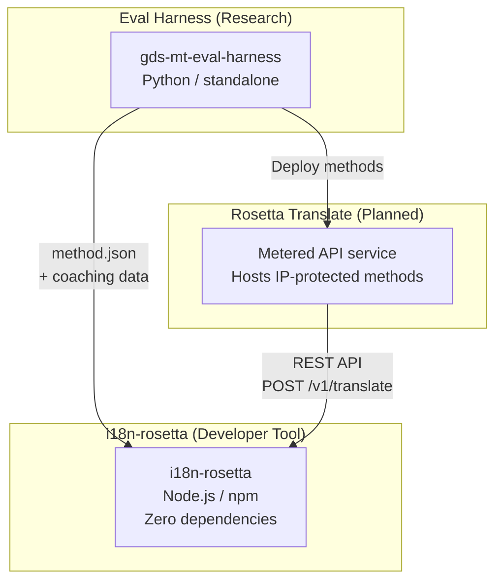
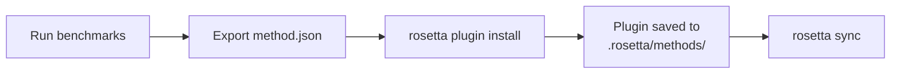
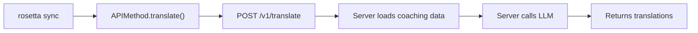
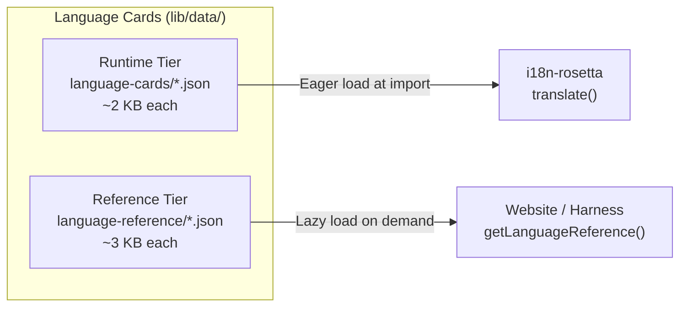

# Architektur

Das Rosetta-Übersetzungsökosystem besteht aus drei unabhängigen Werkzeugen, die über klar definierte Verträge zusammenarbeiten. Keines von ihnen ist zur Build-Zeit voneinander abhängig. Sie kommunizieren über ein gemeinsames **Methoden-Plugin-Format** und einen **REST-API-Vertrag**.

## Die drei Komponenten



### i18n-rosetta (dieses Projekt)

Das Open-Source-Entwicklerwerkzeug. Übersetzt Locale-Dateien unter Verwendung von Plug-in-basierten Methoden. Keine Abhängigkeiten, Konfiguration optional, sofort einsatzbereit.

**Integrierte Methoden:**
- `llm` → OpenRouter / beliebiges LLM (200+ Modelle)
- `llm-coached` → LLM + Grammatik-/Wörterbuch-Coaching
- `openai` → Direkte OpenAI API (GPT-4o, GPT-4o-mini)
- `anthropic` → Direkte Anthropic API (Claude Sonnet, Haiku, Opus)
- `gemini` → Direkte Google Gemini API (Flash, Pro — kostenloser Tarif verfügbar)
- `google-translate` → Google Cloud Translation API v2
- `deepl` → DeepL API mit Glossar-Unterstützung
- `microsoft-translator` → Azure Cognitive Services Translator
- `libretranslate` → Selbstgehostetes LibreTranslate (AGPL, kostenlos)
- `api` → Schlanke Verbindung zu einem beliebigen Remote-REST-Endpunkt

### Eval Harness (Begleitprojekt)

Ein Forschungswerkzeug zur Entwicklung, zum Testen und zum Benchmarking von Übersetzungsmethoden. Wenn eine Methode eine akzeptable Qualität erreicht, exportiert das Harness ein **Methoden-Plugin** — ein `method.json`-Manifest und optionale Coaching-Datendateien.

Das Harness wird niemals innerhalb von rosetta ausgeführt. Es ist ein separates Werkzeug, das statische Ausgaben (JSON-Dateien) erzeugt. Rosetta liest diese Dateien lediglich.

[→ Eval Harness auf GitHub](https://github.com/gamedaysuits/gds-mt-eval-harness)

### Rosetta Translate (geplant)

Ein nutzungsbasierter API-Dienst, der proprietäre Übersetzungsmethoden serverseitig hostet — die Prompts, Coaching-Daten und linguistischen Pipelines verlassen den Server niemals.

## Wie sie miteinander verbunden sind

### Eval Harness → i18n-rosetta (Einweg-Export)



**Vertrag**: [Plugin-Spezifikation](/docs/reference/plugin-spec)

### Rosetta Translate → i18n-rosetta (API zur Laufzeit)



Die `APIMethod` von Rosetta ist eine **reine Durchleitung**. Sie sendet Schlüssel nach außen und empfängt Übersetzungen zurück. Sie enthält keinerlei Übersetzungslogik und keinerlei proprietäre Inhalte.

## Was jede Komponente über die anderen weiß

| Werkzeug | Kennt rosetta? | Kennt Rosetta Translate? | Kennt das Harness? |
|------|---------------------|-------------------------------|---------------------|
| **i18n-rosetta** | *(ist rosetta)* | Ja — die `api`-Methode ruft es auf | Nein — liest nur Plugin-Exporte |
| **Rosetta Translate** | Ja — bedient dessen Anfragen | *(ist Rosetta Translate)* | Nein — empfängt bereitgestellte Methoden |
| **Eval Harness** | Ja — exportiert das Plugin-Format | Nein — Methoden werden separat bereitgestellt | *(ist das Harness)* |

## Benutzerszenarien

### Szenario 1: Kostenlos, ohne Konfiguration (die meisten Benutzer)

```bash
export OPENROUTER_API_KEY=sk-...
npx i18n-rosetta sync
```

Verwendet die integrierte `llm`-Methode. Keine Plugins, kein Rosetta Translate, kein Harness.

### Szenario 2: Google Translate-Basislinie

```bash
export GOOGLE_TRANSLATE_API_KEY=AIza...
npx i18n-rosetta sync
```

Verwendet die integrierte `google-translate`-Methode. Keine Plugins erforderlich.

### Szenario 3: Offenes Plugin mit gebündeltem Coaching

```bash
rosetta plugin install ./french-formal-v1/
rosetta sync
```

Das Plugin verfügt über `type: "llm-coached"` → rosetta verwendet den eigenen OpenRouter-Schlüssel des Benutzers. Coaching-Daten sind lokal (kein Serveraufruf).

### Szenario 4: DIY-Coaching (kein Plugin, kein Harness)

```json title="i18n-rosetta.config.json"
{
  "pairs": {
    "en:fr": { "method": "llm-coached" }
  }
}
```

Der Benutzer pflegt seine eigenen Grammatikregeln und sein eigenes Wörterbuch in `.rosetta/coaching/fr.json`.

## Language Cards

Jede Sprache in rosetta wird über eine **Language Card** konfiguriert — eine JSON-Datei, die Register-Voreinstellungen, Formalitätsregeln, Flags zur Methodenunterstützung und Typografie-Konventionen enthält. Language Cards sind die sprachspezifische Konfiguration, die die registergesteuerte Übersetzung antreibt.



Die Cards sind für eine skalierbare Leistung (mit dem Ziel von über 700 Sprachen) in zwei Ebenen unterteilt:

- **Laufzeitebene** (`language-cards/`): Wird sofort geladen — die Felder, die die Übersetzungs-Engine benötigt (Register, Formalität, Methodenunterstützung, Typografieregeln).
- **Referenzebene** (`language-reference/`): Wird bei Bedarf geladen — Entwicklerdokumentation (linguistische Herausforderungen, Sprachfamilie, NLP-Ressourcen).

Beide Ebenen werden aus maßgeblichen Quellen (IANA, CLDR, Glottolog) unter Verwendung von `scripts/generate-language-card.mjs` generiert und anschließend für linguistische Genauigkeit von Menschen kuratiert.

## Designprinzipien

1. **Keine zirkulären Abhängigkeiten.** Die Verbindungen sind Einwegstraßen.
2. **Rosetta ist der leichtgewichtige Kern.** Keine Abhängigkeiten, Konfiguration optional. Plugins und API sind additiv.
3. **Der Schutz des geistigen Eigentums (IP) ist architektonisch verankert.** Proprietäre Techniken bleiben serverseitig. Das npm-Paket liefert keine proprietären Inhalte aus.
4. **Das Plugin-Format ist der Vertrag.** Alles fließt durch `method.json`.
5. **Jedes Werkzeug hat genau eine Aufgabe.** Harness → Methoden entwickeln. Rosetta Translate → Methoden hosten. Rosetta → Dateien übersetzen.

---

## Siehe auch

- [Übersetzungsmethoden](/docs/guides/translation-methods) — wie jede integrierte Methode funktioniert
- [Plugin-Spezifikation](/docs/reference/plugin-spec) — das method.json-Manifestformat
- [Eval Harness](https://mtevalarena.org/docs/specifications/harness) — das begleitende Forschungswerkzeug
- [Bereitstellen einer Methode via API](/docs/guides/serving-a-method) — Hosting benutzerdefinierter Übersetzungs-Pipelines
- [Unterstützung einer ressourcenarmen Sprache](https://mtevalarena.org/docs/community/low-resource-languages) — der Anwendungsfall, der diese Architektur vorangetrieben hat