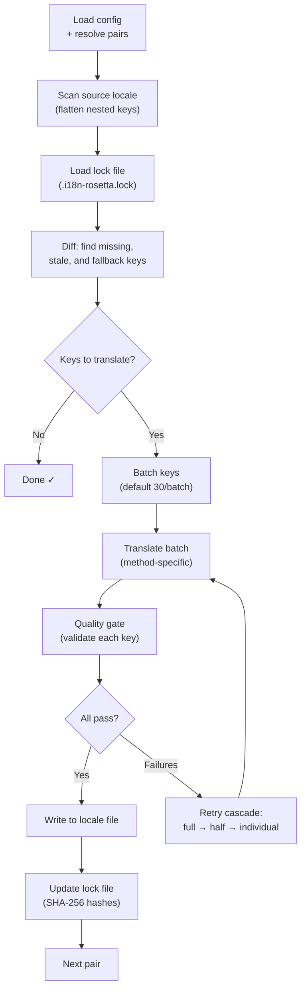

# Wie die Synchronisierung funktioniert

Der Befehl `sync` ist die Kernfunktion von rosetta. Folgendes passiert, wenn Sie `npx i18n-rosetta sync` ausführen.

## Pipeline-Übersicht



## Schritt für Schritt

### 1. Konfigurationsauflösung

Rosetta lädt `i18n-rosetta.config.json` (oder erkennt die Einstellungen automatisch). Dabei wird Folgendes aufgelöst:
- Quell-Locale und Ziel-Locales
- Der Paar-Graph (welche Quelle→Ziel-Kombinationen verarbeitet werden sollen)
- Methoden-, Modell- und Qualitätseinstellungen pro Paar

### 2. Quell-Scan

Die Quell-Locale-Datei wird geladen und in eine Schlüssel→Wert-Zuordnung abgeflacht:

```json
// Input (nested)
{ "hero": { "title": "Welcome", "subtitle": "Build" } }

// Flattened
{ "hero.title": "Welcome", "hero.subtitle": "Build" }
```

### 3. Änderungserkennung

Rosetta liest `.i18n-rosetta.lock`, wo die SHA-256-Hashes der zuvor übersetzten Quellwerte gespeichert sind. Für jeden Schlüssel wird Folgendes geprüft:

| Bedingung | Aktion |
|-----------|--------|
| Schlüssel fehlt im Ziel | **Übersetzen** |
| Quell-Hash hat sich seit der letzten Synchronisierung geändert | **Neu übersetzen** (veraltet) |
| Zielwert beginnt mit `[EN]` | **Neu übersetzen** (Fallback-Platzhalter) |
| Quell-Hash unverändert, Schlüssel existiert | **Überspringen** |

Aus diesem Grund übersetzt rosetta nur das, was sich geändert hat — es wird nicht bei jeder Synchronisierung Ihre gesamte Datei neu übersetzt.

### 4. Stapelverarbeitung

Schlüssel werden in Stapeln (Batches) gruppiert (Standard: 30 Schlüssel/Stapel für LLMs, 128 für Google Translate). Die Stapelverarbeitung reduziert API-Roundtrips und hält die Prompts gleichzeitig handhabbar.

### 5. Übersetzung

Jeder Stapel wird an die konfigurierte Übersetzungsmethode gesendet:

- **`llm`**: Strukturierter Prompt an OpenRouter mit Anweisungen zu Register und geschlechtsspezifischen Vorgaben
- **`llm-coached`**: Identisch, jedoch mit injizierten Grammatikregeln, Wörterbuch und Stilhinweisen
- **`google-translate`**: Stapelanfrage an die Google Cloud Translation API v2
- **`api`**: HTTP-POST an einen Remote-Endpunkt

Die Systemnachricht (Register, geschlechtsspezifische Vorgaben, Regeln) ist für ein bestimmtes Locale über alle Stapel hinweg identisch. Dies ermöglicht **Prompt-Caching** — Anbieter wie Anthropic und Google zwischenspeichern wiederholte Systemnachrichten, was die Token-Kosten senkt.

### 6. Quality Gate

Jede Übersetzung wird validiert, bevor sie auf die Festplatte geschrieben wird. Es werden fünf Prüfungen durchgeführt:

| Prüfung | Was sie erkennt | Beispiel |
|-------|----------------|---------|
| **Leer/Blanko** | Modell hat nichts zurückgegeben | `""` |
| **Quell-Echo** | Modell hat die englische Eingabe zurückgegeben | `"Welcome"` für Japanisch |
| **Halluzinationsschleife** | Wiederholte Trigramme | `"Qo' Qo' Qo' Qo'"` |
| **Längeninflation** | Ausgabe ist 4×+ länger als die Quelle | 10-Zeichen-Quelle → 50-Zeichen-Ausgabe |
| **Schriftzeichen-Konformität** | Falsches Schriftsystem für das Locale | Lateinischer Text für arabisches Locale |

Fehlschläge werden mit einem `[GATE]`-Präfix protokolliert. Es gibt keine stillen Fallbacks.

Weitere Details finden Sie unter [Quality Gate](/docs/concepts/quality-gate).

### 7. Wiederholungskaskade

Bei JSON-Parsing-Fehlern oder Fehlern auf Stapelebene unternimmt rosetta erneute Versuche mit zunehmend kleineren Stapeln:

```
Full batch (30 keys) → Failed
Half batch (15 keys) → Failed
Individual keys (1 each) → Isolates the problem key
```

Das Budget für erneute Versuche wird durch `maxRetries` begrenzt (Standard: 3), um ausufernde Token-Ausgaben zu verhindern.

### 8. Schreiben & Sperren

Erfolgreiche Übersetzungen werden in die Ziel-Locale-Datei geschrieben, wobei die ursprüngliche Verschachtelungsstruktur erhalten bleibt. Die Lock-Datei wird mit den neuen SHA-256-Hashes aktualisiert.

## Teilweiser Erfolg

Ein fehlgeschlagener Stapel blockiert nicht den Rest. Wenn 9 von 10 Stapeln erfolgreich sind, werden diese 9 geschrieben. Der fehlgeschlagene Stapel wird protokolliert, und Sie können `sync` erneut ausführen, um einen neuen Versuch zu starten.

## Testlauf

Zeigen Sie eine Vorschau der Änderungen an, ohne Dateien zu schreiben:

```bash
npx i18n-rosetta sync --dry
```

## Neuübersetzung erzwingen

Erzwingen Sie die Neuübersetzung bestimmter Schlüssel, auch wenn diese unverändert sind:

```bash
npx i18n-rosetta sync --force-keys "hero.title,nav.about"
```

## Kostenschätzung

Vor der Übersetzung generiert rosetta einen **Kostenbericht vor der Synchronisierung**, der die geschätzten Kosten pro Paar anzeigt. Dieser wird bei jedem `sync` automatisch ausgeführt — Sie sehen ihn, bevor API-Aufrufe getätigt werden.

```
╔══════════════════════════════════════════════════════════╗
║  Cost Estimate                                          ║
╠════════════╦═══════╦════════════╦════════════════════════╣
║ Pair       ║ Keys  ║ Est. Cost  ║ Method                 ║
╠════════════╬═══════╬════════════╬════════════════════════╣
║ en → fr    ║   142 ║ $0.07      ║ google-translate       ║
║ en → ja    ║    38 ║   —        ║ llm (model-dependent)  ║
║ en → crk   ║    38 ║   —        ║ llm-coached            ║
╚════════════╩═══════╩════════════╩════════════════════════╝
```

### Was geschätzt wird

Jede Übersetzungsmethode liefert ihre eigene Kostenschätzung:

| Methode | Kostenbasis | Präzision |
|--------|-----------|-----------|
| `google-translate` | Veröffentlichter Tarif von Google (20 $/Million Zeichen) | Genau |
| `llm` | Variiert je nach OpenRouter-Modell | Modellabhängig — siehe [OpenRouter-Preise](https://openrouter.ai/models) |
| `llm-coached` | Wie `llm` zuzüglich Coaching-Kontext-Token | Modellabhängig |
| `api` | Vom Server bestimmt | Unbekannt — kann ohne Abfrage des Endpunkts nicht geschätzt werden |

Wenn eine Methode die Kosten nicht ermitteln kann (LLM-Methoden, Remote-APIs), meldet rosetta `—`, anstatt zu raten. Verwenden Sie `--dry`, um Kostenschätzungen anzuzeigen, ohne tatsächlich zu übersetzen.

---

## Siehe auch

- [CLI-Referenz — sync](/docs/reference/cli#sync) — Befehls-Flags und Optionen
- [Quality Gate](/docs/concepts/quality-gate) — wie Übersetzungen validiert werden
- [Übersetzungsmethoden](/docs/guides/translation-methods) — wie jede Methode funktioniert
- [Konfiguration](/docs/getting-started/configuration) — Konfigurationsreferenz
- [CI/CD-Leitfaden](/docs/guides/ci-cd) — Automatisierung von Synchronisierungen in Ihrer Pipeline