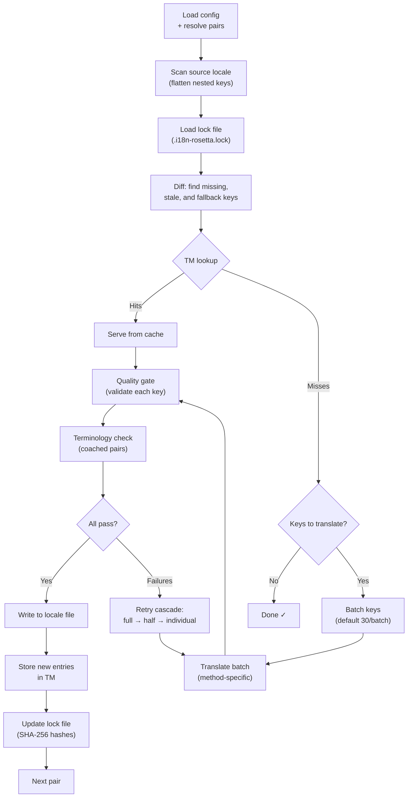

# Wie die Synchronisierung funktioniert

Der Befehl `sync` ist die Kernfunktion von Rosetta. Hier erfahren Sie, was passiert, wenn Sie `npx i18n-rosetta sync` ausführen.

## Pipeline-Übersicht



## Schritt für Schritt

### 1. Konfigurationsauflösung

Rosetta lädt `i18n-rosetta.config.json` (oder erkennt die Einstellungen automatisch). Dabei wird Folgendes aufgelöst:
- Quell-Gebietsschema und Ziel-Gebietsschemata
- Der Paar-Graph (welche Quelle→Ziel-Kombinationen verarbeitet werden sollen)
- Methoden-, Modell- und Qualitätseinstellungen pro Paar

### 2. Quell-Scan

Die Datei des Quell-Gebietsschemas wird geladen und in eine flache Schlüssel→Wert-Zuordnung umgewandelt:

```json
// Input (nested)
{ "hero": { "title": "Welcome", "subtitle": "Build" } }

// Flattened
{ "hero.title": "Welcome", "hero.subtitle": "Build" }
```

### 3. Änderungserkennung

Rosetta liest `.i18n-rosetta.lock`, wo die SHA-256-Hashes der zuvor übersetzten Quellwerte gespeichert sind. Für jeden Schlüssel wird Folgendes geprüft:

| Bedingung | Aktion |
|-----------|--------|
| Schlüssel fehlt im Ziel | **Übersetzen** |
| Quell-Hash hat sich seit der letzten Synchronisierung geändert | **Neu übersetzen** (veraltet) |
| Zielwert beginnt mit `[EN]` | **Neu übersetzen** (Fallback-Platzhalter) |
| Quell-Hash unverändert, Schlüssel existiert | **Überspringen** |

Aus diesem Grund übersetzt Rosetta nur das, was sich geändert hat – es wird nicht bei jeder Synchronisierung Ihre gesamte Datei neu übersetzt.

### 4. Stapelverarbeitung

Schlüssel werden in Stapeln gruppiert (Standard: 30 Schlüssel/Stapel für LLMs, 128 für Google Translate). Die Stapelverarbeitung reduziert die API-Aufrufe und hält die Prompts überschaubar.

### 4b. Translation Memory

Vor der Stapelverarbeitung überprüft Rosetta den Translation-Memory-Cache (`.rosetta/tm.json`). Schlüssel, deren Quelltext + Gebietsschema + Methode mit einer vorherigen Übersetzung übereinstimmen, werden sofort aus dem Cache bereitgestellt – es ist kein API-Aufruf erforderlich.

```
  [TM] 142 key(s) served from cache
  Translating 3 key(s) to French (llm)... [OK]
```

TM (Translation Memory) ist der wichtigste Mechanismus zur Kosteneinsparung. Wenn Sie die Synchronisierung nach der Änderung eines einzelnen Schlüssels erneut ausführen, wird nur dieser eine Schlüssel übersetzt, nicht die gesamte Datei. Weitere Details finden Sie unter [Translation Memory](/docs/concepts/translation-memory).

Um den Cache für einen einzelnen Durchlauf zu umgehen: `i18n-rosetta sync --no-tm`

### 5. Übersetzung

Jeder Stapel wird an die konfigurierte Übersetzungsmethode gesendet:

- **`llm`**: Strukturierter Prompt an OpenRouter mit Anweisungen zu Register und geschlechtersensibler Sprache
- **`llm-coached`**: Wie zuvor, jedoch mit eingefügten Grammatikregeln, Wörterbuch und Stilhinweisen
- **`google-translate`**: Stapelanfrage (Batch Request) an die Google Cloud Translation API v2
- **`api`**: HTTP-POST an einen Remote-Endpunkt

Die Systemnachricht (Register, geschlechtersensible Sprache, Regeln) ist für ein bestimmtes Gebietsschema über alle Stapel hinweg identisch. Dies ermöglicht **Prompt-Caching** – Anbieter wie Anthropic und Google speichern wiederholte Systemnachrichten im Cache, was die Token-Kosten senkt.

### 6. Quality Gate

Jede Übersetzung wird validiert, bevor sie auf die Festplatte geschrieben wird. Es werden fünf Prüfungen durchgeführt:

| Prüfung | Was sie erkennt | Beispiel |
|-------|----------------|---------|
| **Leer/Blank** | Modell hat nichts zurückgegeben | `""` |
| **Quell-Echo** | Modell hat die englische Eingabe zurückgegeben | `"Welcome"` für Japanisch |
| **Halluzinationsschleife** | Wiederholte Trigramme | `"Qo' Qo' Qo' Qo'"` |
| **Längeninflation** | Ausgabe ist mehr als 4-mal länger als die Quelle | 10-Zeichen-Quelle → 50-Zeichen-Ausgabe |
| **Schrift-Konformität** | Falsches Schriftsystem für das Gebietsschema | Lateinischer Text für arabisches Gebietsschema |

Fehler werden mit dem Präfix `[GATE]` protokolliert. Es gibt keine stillen Fallbacks.

Weitere Details finden Sie unter [Quality Gate](/docs/concepts/quality-gate).

### 6b. Terminologie-Überprüfung

Bei gecoachten Paaren mit einem Wörterbuch überprüft Rosetta nach der Übersetzung, ob das LLM die erforderliche Terminologie tatsächlich verwendet hat. Verstöße werden als `[TERM]`-Warnungen protokolliert:

```
[TERM] en→fr: 2 term violation(s)
  • "dashboard" → expected "tableau de bord" but got "panneau"
```

Dies sind Warnungen, keine blockierenden Fehler – die Übersetzung wird dennoch geschrieben.

### 7. Wiederholungskaskade

Bei JSON-Parsing-Fehlern oder Fehlern auf Stapelebene unternimmt Rosetta erneute Versuche mit zunehmend kleineren Stapeln:

```
Full batch (30 keys) → Failed
Half batch (15 keys) → Failed
Individual keys (1 each) → Isolates the problem key
```

Das Budget für erneute Versuche wird durch `maxRetries` begrenzt (Standard: 3), um ausufernde Token-Kosten zu verhindern.

### 8. Schreiben & Sperren

Erfolgreiche Übersetzungen werden in die Datei des Ziel-Gebietsschemas geschrieben, wobei die ursprüngliche Verschachtelungsstruktur erhalten bleibt. Die Lock-Datei wird mit neuen SHA-256-Hashes aktualisiert.

## Inhaltsübersetzung (Phase 2)

Für Docusaurus- und Hugo-Projekte führt `sync` nach der Übersetzung der JSON-Schlüssel eine zweite Phase aus. In dieser Phase werden Markdown- und MDX-Dateien (Dokumentationen, Blogbeiträge, Tutorials) mit denselben Methoden und demselben Quality Gate übersetzt.

### Wie es funktioniert

1. Rosetta ermittelt alle Quell-Inhaltsdateien (`.md`, `.mdx`), indem das content/docs-Verzeichnis durchsucht wird.
2. Für jedes Datei-×-Gebietsschema-Paar wird eine separate Inhalts-Lock-Datei (`.i18n-rosetta-content.lock`) auf Änderungen der SHA-256-Hashes geprüft.
3. Geänderte oder fehlende Dateien werden in einem flachen Arbeitselement-Pool gesammelt.
4. Der Pool wird mit **paralleler Nebenläufigkeit** verarbeitet (Standard: 12 gleichzeitige API-Aufrufe).

```
Phase 2: content (79 translations to process, 341 skipped, concurrency: 12)

    [1/79] (1%)  docs/concepts/security.md → ja [RE-TRANSLATE] (~3328s left)
    [2/79] (3%)  docs/concepts/security.md → th [RE-TRANSLATE] (~1821s left)
    ...
    [79/79] (100%) blog/v3-2-quality.md → de [OK]

  [OK] Created 79 content file(s), 341 unchanged
```

### Flat-Pool-Parallelität

Im Gegensatz zu Phase 1 (JSON-Schlüssel, sequenziell pro Gebietsschema) verarbeitet Phase 2 alle Datei-×-Gebietsschema-Kombinationen als flache Liste. Das bedeutet, dass verschiedene Dateien und verschiedene Gebietsschemata gleichzeitig übersetzt werden:

- `docs/configuration.md → fr` und `docs/cli.md → ja` werden zur selben Zeit ausgeführt.
- Ein Korpus von 420 Übersetzungen wird bei einer Nebenläufigkeit von 12 in etwa 11 Minuten verarbeitet.
- Inkrementelles Schreiben des Manifests nach jeweils 10 abgeschlossenen Vorgängen verhindert, dass Fortschritte verloren gehen, falls der Prozess abgebrochen wird.

Steuern Sie die Parallelität mit `--concurrency` oder dem Konfigurationsfeld `concurrency`:

```bash
# Faster (more parallel calls, higher API load)
npx i18n-rosetta sync --concurrency 20

# Slower (gentler on rate limits)
npx i18n-rosetta sync --concurrency 4
```

### Inhaltsschutz

Während der Übersetzung schützt Rosetta nicht übersetzbare Inhalte:

- **Codeblöcke** (umschlossen und eingerückt) werden durch Platzhalter ersetzt.
- **Frontmatter**-Felder, die nicht in der Liste `translatableFields` stehen, bleiben unverändert erhalten.
- **Links**, Bildpfade und HTML-Tags werden geschützt.
- **Shortcodes** und Interpolationsvariablen (z. B. `{count}`, `{{.Params.title}}`) werden abgeschirmt.

Nach der Übersetzung werden alle Platzhalter wiederhergestellt und validiert. Wenn welche fehlen oder beschädigt sind, wird die Übersetzung abgelehnt und ein erneuter Versuch gestartet.

## Teilweiser Erfolg

Ein fehlgeschlagener Stapel blockiert nicht den Rest. Wenn 9 von 10 Stapeln erfolgreich sind, werden diese 9 geschrieben. Der fehlgeschlagene Stapel wird protokolliert, und Sie können `sync` erneut ausführen, um es noch einmal zu versuchen.

## Probelauf

Zeigen Sie eine Vorschau der Änderungen an, ohne Dateien zu schreiben:

```bash
npx i18n-rosetta sync --dry-run
```

## Neuübersetzung erzwingen

Erzwingen Sie die Neuübersetzung bestimmter Schlüssel, auch wenn diese unverändert sind:

```bash
npx i18n-rosetta sync --force-keys "hero.title,nav.about"
```

## Kostenschätzung

Vor der Übersetzung generiert Rosetta einen **Kostenbericht vor der Synchronisierung**, der die geschätzten Kosten pro Paar anzeigt. Dieser wird bei jedem `sync` automatisch ausgeführt – Sie sehen ihn, bevor API-Aufrufe getätigt werden.

```
╔══════════════════════════════════════════════════════════╗
║  Cost Estimate                                          ║
╠════════════╦═══════╦════════════╦════════════════════════╣
║ Pair       ║ Keys  ║ Est. Cost  ║ Method                 ║
╠════════════╬═══════╬════════════╬════════════════════════╣
║ en → fr    ║   142 ║ $0.07      ║ google-translate       ║
║ en → ja    ║    38 ║   —        ║ llm (model-dependent)  ║
║ en → crk   ║    38 ║   —        ║ llm-coached            ║
╚════════════╩═══════╩════════════╩════════════════════════╝
```

### Was geschätzt wird

Jede Übersetzungsmethode bietet ihre eigene Kostenschätzung:

| Methode | Kostenbasis | Präzision |
|--------|-----------|-----------|
| `google-translate` | Von Google veröffentlichter Tarif (20 $/Million Zeichen) | Genau |
| `llm` | Variiert je nach OpenRouter-Modell | Modellabhängig – siehe [OpenRouter-Preise](https://openrouter.ai/models) |
| `llm-coached` | Wie `llm` zuzüglich Coaching-Kontext-Token | Modellabhängig |
| `api` | Vom Server bestimmt | Unbekannt – kann ohne Abfrage des Endpunkts nicht geschätzt werden |

Wenn eine Methode die Kosten nicht ermitteln kann (LLM-Methoden, Remote-APIs), meldet Rosetta `—`, anstatt zu raten. Verwenden Sie `--dry`, um Kostenschätzungen anzuzeigen, ohne tatsächlich zu übersetzen.

---

## Siehe auch

- [CLI-Referenz — sync](/docs/reference/cli#sync) — Befehls-Flags und Optionen
- [Translation Memory](/docs/concepts/translation-memory) — Caching und Kosteneinsparungen
- [Quality Gate](/docs/concepts/quality-gate) — wie Übersetzungen validiert werden
- [Übersetzungsmethoden](/docs/guides/translation-methods) — wie jede Methode funktioniert
- [Zusammenarbeit mit professionellen Übersetzern](/docs/guides/professional-translators) — XLIFF-Workflow
- [Konfiguration](/docs/getting-started/configuration) — Konfigurationsreferenz
- [CI/CD-Leitfaden](/docs/guides/ci-cd) — Automatisierung von Synchronisierungen in Ihrer Pipeline