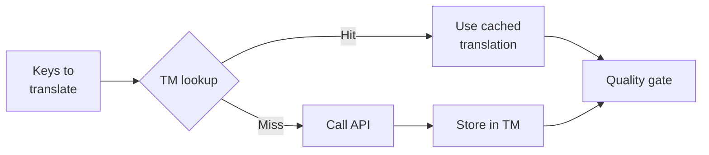

# Translation Memory

Translation Memory (TM) ist die integrierte Caching-Schicht von rosetta. Sie speichert jede Übersetzung indiziert nach Quelltext + Gebietsschema + Methode, sodass ein erneutes Ausführen von `sync` die API nur für Schlüssel aufruft, die sich tatsächlich geändert haben.

## Warum TM existiert

Ohne TM übersetzt jedes `sync` jeden geänderten Schlüssel neu – selbst wenn Sie genau denselben englischen Text für dasselbe Gebietsschema bereits in einem vorherigen Durchlauf übersetzt haben. Häufige Szenarien, in denen dies Geld verschwendet:

| Szenario | Ohne TM | Mit TM |
|----------|-----------|---------|
| Erneute Synchronisierung nach 1 Schlüsseländerung (500 Schlüssel × 10 Gebietsschemata) | 5.000 API-Aufrufe | 10 API-Aufrufe |
| Einen Schlüssel auf einen vorherigen englischen Wert zurücksetzen | Vollständiger API-Aufruf | Sofortiger Cache-Treffer |
| Dieselbe Phrase erscheint in 3 Gebietsschema-Dateien | 3 × API-Aufrufe | 1 API-Aufruf + 2 Cache-Treffer |
| Testlauf → echte Synchronisierung | Vollständige API-Aufrufe bei beiden | Erster Durchlauf speichert im Cache, zweiter verwendet wieder |

TM ist **standardmäßig aktiviert** und erfordert keine Konfiguration. Übersetzungen werden bei jedem `sync` automatisch im Cache gespeichert und bei nachfolgenden Durchläufen bereitgestellt.

## Wie es funktioniert

### Cache-Schlüssel

Jeder TM-Eintrag wird durch einen SHA-256-Hash aus drei Werten indiziert:

```
SHA-256( sourceValue + '\x00' + locale + '\x00' + method )
```

| Komponente | Warum sie im Schlüssel enthalten ist |
|-----------|-------------------|
| `sourceValue` | Anderer englischer Text → andere Übersetzung |
| `locale` | „Hello“ wird ins Französische anders übersetzt als ins Japanische |
| `method` | Ausgabe von Google Translate ≠ Ausgabe von GPT-4o |

Das Null-Byte-Trennzeichen (`\x00`) verhindert Kollisionen zwischen `"ab" + "c"` und `"a" + "bc"`.

### Während der Synchronisierung



1. Bevor die Übersetzungs-API aufgerufen wird, unterteilt rosetta die Schlüssel in **TM-Treffer** und **TM-Fehlschläge**
2. Treffer werden sofort aus dem Cache bereitgestellt – kein API-Aufruf, keine Latenz, keine Kosten
3. Fehlschläge durchlaufen die normale Übersetzungs-Pipeline
4. Neue Übersetzungen von der API werden für zukünftige Durchläufe im TM gespeichert
5. Alle Übersetzungen (aus dem Cache + neu) durchlaufen die Qualitätskontrolle

### Speicherung

TM wird unter `.rosetta/tm.json` im Stammverzeichnis Ihres Projekts gespeichert. Die Datei verwendet kompaktes JSON (ohne Pretty-Printing), um die Größe überschaubar zu halten. Jeder Eintrag speichert:

| Feld | Beschreibung |
|-------|-------------|
| `t` | Der übersetzte Text |
| `ts` | ISO-8601-Zeitstempel der Speicherung im Cache |
| `l` | Ziel-Gebietsschema-Code (für Statistiken/Filterung) |
| `m` | Name der Übersetzungsmethode (für Statistiken/Filterung) |

Bei 50 Sprachen × 500 Schlüsseln = 25.000 Einträgen sollte die Datei ca. 2–3 MB groß sein.

## Verwaltung des Caches

### Statistiken anzeigen

```bash
i18n-rosetta tm stats
```

Zeigt die Anzahl der Einträge, die Dateigröße und eine Aufschlüsselung nach Gebietsschema an:

```
  Translation Memory — .rosetta/tm.json

  Entries:      2,847
  File size:    1.2 MB
  Created:      2026-05-20
  Last entry:   2026-05-24

  By locale:
    fr       482 entries  (llm: 380, llm-coached: 102)
    de       471 entries  (llm: 471)
    ja       465 entries  (llm: 465)
```

### Den Cache leeren

```bash
# Clear everything (with confirmation prompt)
i18n-rosetta tm clear

# Clear without prompt (CI environments)
i18n-rosetta tm clear --yes

# Clear only one locale
i18n-rosetta tm clear --locale fr
```

### TM für einen Durchlauf überspringen

```bash
# Force fresh API calls for all keys (useful when switching providers)
i18n-rosetta sync --no-tm
```

Dies löscht den Cache nicht – er wird für diesen Durchlauf lediglich ignoriert und es werden keine neuen Ergebnisse gespeichert.

## Wann TM nicht hilft

TM liefert keinen Cache-Treffer, wenn:

- **Sich der Quelltext geändert hat** – der Hash ändert sich, also ist es ein Fehlschlag
- **Sich die Methode geändert hat** – ein Wechsel von `llm` zu `google-translate` bedeutet unterschiedliche Cache-Schlüssel
- **Erster Durchlauf** – Kaltstart, noch keine Einträge vorhanden
- **Das Flag `--no-tm`** – umgeht den Cache explizit

## Sollten Sie `.rosetta/tm.json` in die Versionskontrolle übernehmen?

**Im Allgemeinen nicht.** TM ist eine lokale Optimierung für Entwickler. Es wird während der Synchronisierung automatisch gefüllt und hilft nur, wenn die Synchronisierung auf derselben Maschine erneut ausgeführt wird. Sie könnten jedoch in Erwägung ziehen, es in die Versionskontrolle zu übernehmen, wenn:

- Ihr Team einen gemeinsamen CI-Runner verwendet, der Übersetzungen synchronisiert
- Sie reproduzierbare Builds ohne API-Aufrufe wünschen
- Sie Übersetzungen aus Compliance-Gründen archivieren

Fügen Sie für die typische Verwendung `.rosetta/tm.json` zu `.gitignore` hinzu.

---

## Siehe auch

- [Wie die Synchronisierung funktioniert](/docs/concepts/how-sync-works) – wo TM in die Pipeline passt
- [CLI-Referenz – tm](/docs/reference/cli#tm) – Befehlsreferenz
- [CLI-Referenz – sync --no-tm](/docs/reference/cli#sync) – TM umgehen