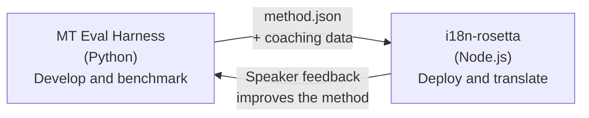

# Die Eval Harness-Brücke

i18n-rosetta und das MT Eval Harness sind zwei separate Werkzeuge, die ein gemeinsames Ökosystem bilden. Das Harness ist der Ort, an dem Übersetzungsmethoden **erprobt** werden. Rosetta ist der Ort, an dem erprobte Methoden **eingesetzt** werden. Sie sind über ein gemeinsames Plugin-Format miteinander verbunden.



## Der Ablauf: Forschung → Produktion

### 1. Eine Methode im Harness erstellen

Jede Python-Klasse, die `async translate(entries, config) → [{id, predicted}]` implementiert, kann in das Harness integriert werden. Für das Harness spielt es keine Rolle, was im Inneren geschieht — ob ein gepromptetes LLM, ein individuell trainiertes Modell, deterministische Regeln oder etwas anderes.

### 2. Benchmarking durchführen

Das Harness bewertet Ihre Methode anhand eines standardisierten Korpus mit reproduzierbaren Metriken: chrF++, FST-Akzeptanz (für morphologisch reiche Sprachen), morphologische Genauigkeit und semantische Bewertung.

### 3. Als Plugin exportieren

Wenn Ihre Methode eine akzeptable Qualität erreicht, verpacken Sie diese als rosetta-Plugin — ein `method.json`-Manifest mit optionalen Coaching-Daten.

:::info Export-CLI ist in Planung
Derzeit erstellen Sie das method.json-Manifest manuell. Der Befehl `mt-eval export` wird dies automatisieren. Weitere Informationen zum vollständigen Plugin-Format finden Sie unter [Method Interface](https://mtevalarena.org/docs/specifications/methods).
:::

### 4. In rosetta installieren

```bash
i18n-rosetta plugin install ./my-method-plugin/
```

### 5. Reale Inhalte übersetzen

```bash
i18n-rosetta sync
```

Ihre bewertete Methode liefert nun echte Übersetzungen im produktiven Einsatz.

## Der Ablauf: Produktion → Forschung

Bereitgestellte Übersetzungen werden von zweisprachigen Sprechern überprüft. Deren Rückmeldungen identifizieren systematische Fehler (falsche Zeitformen, fehlender Wortschatz, unnatürliche Formulierungen). Die forschende Person aktualisiert die Methode im Harness, führt ein erneutes Benchmarking durch, exportiert sie neu und stellt sie wieder bereit. Das System lernt durch die Nutzung.

## Das Plugin-Format

Das `method.json`-Manifest ist der Vertrag zwischen den beiden Werkzeugen:

```json
{
  "name": "crk-coached-v3",
  "type": "llm-coached",
  "version": "3.0.0",
  "description": "Coached LLM translation for Plains Cree",
  "locales": ["crk"],
  "config": {
    "model": "google/gemini-3.5-flash",
    "temperature": 0.3
  },
  "benchmarks": {
    "crk": {
      "composite_score": 0.67,
      "fst_acceptance": 0.82,
      "corpus_size": 150
    }
  }
}
```

Das vollständige Format finden Sie in der [Plugin-Spezifikation](/docs/reference/plugin-spec).

## Umgesetzt vs. Geplant

| Komponente | Status |
|-----------|--------|
| TranslationProcess-Protokoll | ✅ Umgesetzt |
| Harness-Benchmark-Runner | ✅ Umgesetzt |
| method.json-Plugin-Format | ✅ Umgesetzt |
| `rosetta plugin install/remove/list` | ✅ Umgesetzt |
| Laden von Coaching-Daten | ✅ Umgesetzt |
| `mt-eval export` CLI | 🔲 Geplant |
| Schnittstelle für Community-Reviews | 🔲 Geplant |
| Kryptografische Testset-Auswertung | 🔲 Geplant |

## Weiterführende Informationen

- [Übersetzungsmethoden](/docs/guides/translation-methods) — alle verfügbaren Methoden und deren Funktionsweise
- [Plugin-Spezifikation](/docs/reference/plugin-spec) — das method.json-Format
- [Bereitstellung einer Methode via API](/docs/guides/serving-a-method) — serverseitiges Hosting einer Methode
- [Datensouveränität](https://mtevalarena.org/docs/sovereignty/data-sovereignty) — OCAP, CARE und kryptografischer Schutz
- [Für MT-Forscher](https://mtevalarena.org/docs/leaderboard/rules) — die Dokumentation zum Eval Harness