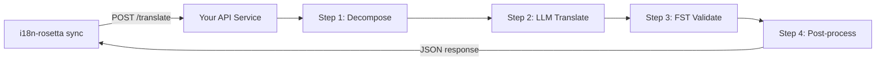

# Bereitstellung einer benutzerdefinierten Methode als API

Die **`api`-Methode** von i18n-rosetta ermöglicht es Ihnen, jedes Übersetzungspaar auf einen externen HTTP-Endpunkt zu verweisen. Auf diese Weise integrieren Sie Pipelines, die für einen einzelnen LLM-Prompt zu komplex sind — morphologische Analysatoren, endliche Automaten (Finite-State Transducers, FSTs), mehrstufige LLM-Ketten oder jede andere von Ihnen entwickelte, benutzerdefinierte Forschungsmethode.

## Warum ein API-Dienst?

Einige Übersetzungspipelines können nicht innerhalb eines einfachen Prompt-Antwort-Zyklus ausgeführt werden:

| Pipeline-Schritt | Beispiel |
|---|---|
| **Morphologische Zerlegung** | Aufteilen polysynthetischer Wörter in Morpheme vor der Übersetzung |
| **FST-Validierung** | Ablehnen von Ausgaben, die gegen phonologische oder morphologische Regeln verstoßen |
| **Mehrstufige LLM-Ketten** | Generieren → Überprüfen → Korrigieren-Zyklen mit verschiedenen Modellen |
| **Wörterbuchabfrage** | Abgleich mit einem kuratierten zweisprachigen Wörterbuch mitten in der Pipeline |
| **Human-in-the-loop** | Einreihen unsicherer Übersetzungen zur Überprüfung durch Experten |

Die `api`-Methode behandelt Ihre Pipeline als Blackbox — i18n-rosetta sendet Quellzeichenfolgen, Ihr Dienst gibt Übersetzungen zurück. Was im Inneren geschieht, bleibt völlig Ihnen überlassen.

## Architektur



## Einrichten Ihres Dienstes

Ihr API-Dienst muss einen einzigen Endpunkt implementieren, der JSON akzeptiert und zurückgibt:

### Anfrageformat

rosetta sendet genau diesen JSON-Body (siehe [api.js](https://github.com/gamedaysuits/i18n-rosetta/blob/main/lib/methods/api.js)):

```json
POST /translate
Content-Type: application/json
Authorization: Bearer <ROSETTA_API_KEY>

{
  "source_locale": "en",
  "target_locale": "crk",
  "method": "crk-coached-v1",
  "keys": {
    "greeting": "Hello, welcome to our app",
    "farewell": "Goodbye and thanks"
  }
}
```

| Feld | Typ | Beschreibung |
|-------|------|-------------|
| `source_locale` | string | BCP 47-Quellsprachcode |
| `target_locale` | string | BCP 47-Zielsprachcode |
| `method` | string | Plugin-Name oder `"default"` |
| `keys` | object | Zuordnung von Schlüssel → zu übersetzender Quellzeichenfolge |
```

### Response Format

Your service must return a `translations` object. An optional `meta` object can include cost and diagnostic info:

```json
{
  "translations": {
    "greeting": "tânisi, pê-kîwêw ôta",
    "farewell": "ekosi mâka, kinanâskomitin"
  },
  "meta": {
    "model": "my-custom-pipeline/v1",
    "cost_usd": 0.0042,
    "method": "decompose-translate-validate"
  }
}
```

| Field | Type | Required | Description |
|-------|------|----------|-------------|
| `translations` | object | ✅ | Map of key → translated string |
| `meta` | object | — | Optional metadata |
| `meta.cost_usd` | number | — | If present, displayed in rosetta's output |
| `errors` | object | — | For partial success (HTTP 207): map of key → `{ message }` |

### Minimal Express Server

```javascript
import express from 'express';

const app = express();
app.use(express.json());

/**
 * rosetta API-Vertrag:
 *
 * Anfrage:  { source_locale, target_locale, method, keys: { "key": "source" } }
 * Antwort: { translations: { "key": "translated" }, meta: { ... } }
 */
app.post('/translate', async (req, res) => {
  const { source_locale, target_locale, method, keys } = req.body;

  const translations = {};

  for (const [key, source] of Object.entries(keys)) {
    // --- Ihre Pipeline wird hier eingefügt ---
    // Schritt 1: Morphologische Zerlegung
    const morphemes = await decompose(source, source_locale);

    // Schritt 2: LLM-Übersetzung mit Kontext
    const draft = await llmTranslate(morphemes, target_locale);

    // Schritt 3: FST-Validierung
    const validated = await fstValidate(draft, target_locale);

    // Schritt 4: Nachbearbeitung (Orthographie-Normalisierung usw.)
    translations[key] = await postProcess(validated);
  }

  res.json({
    translations,
    meta: {
      model: 'my-custom-pipeline/v1',
      method: 'decompose-translate-validate',
    },
  });
});

app.listen(3001, () => {
  console.log('Übersetzungs-API läuft auf http://localhost:3001');
});
```

## Configuring i18n-rosetta

Point a translation pair at your running service in `i18n-rosetta.config.json`:

```json
{
  "inputLocale": "en",
  "pairs": {
    "en:crk": {
      "method": "api",
      "endpoint": "http://localhost:3001/translate",
      "register": "Formal Plains Cree. Use SRO orthography."
    }
  }
}
```

Then run sync as usual:

```bash
npx i18n-rosetta sync
```

i18n-rosetta will POST your source strings to the endpoint and write the returned translations to `crk.json`.

## Case Study: Plains Cree Pipeline

:::info Under Development
The Plains Cree pipeline described below is **under active development** and is not yet running in production. Details here reflect the current design direction and may change as the project evolves.
:::

The **gds-mt-eval-harness** project demonstrates this pattern. Its Plains Cree pipeline uses:

1. **Morphological decomposition** — Break polysynthetic Cree words into translatable morpheme chains
2. **LLM translation** — Context-enriched GPT-4o translation with coaching data (SRO orthography rules, register instructions)
3. **FST validation** — Finite-state transducer checks that outputs conform to Cree phonological rules
4. **Confidence scoring** — Each translation gets a confidence score based on FST pass rate and dictionary coverage

The entire pipeline runs as a single HTTP endpoint that i18n-rosetta calls via the `api` method.

### Running Evaluations

After translating, you can evaluate output quality using the harness directly:

```bash
# Klonen der Testumgebung
git clone https://github.com/gamedaysuits/gds-mt-eval-harness.git
cd gds-mt-eval-harness
pip install -e .

# Führen Sie die Evaluierung mit der Ausgabe Ihrer Methode aus
python eval/baseline_experiment.py --dataset data/edtekla-dev-v1.json --submit
```

This produces structured evaluation records with chrF++, BLEU, and exact match scores that can be used as regression baselines.

## Authentication

If your API requires authentication, set the `apiKey` field or use an environment variable:

```json
{
  "pairs": {
    "en:crk": {
      "method": "api",
      "endpoint": "https://my-mt-service.example.com/translate",
      "apiKey": "${CRK_API_KEY}"
    }
  }
}
```

## Data Sovereignty & OCAP Principles

The `api` method is particularly important for **Indigenous language communities**. By self-hosting the translation pipeline, a community keeps full control over:

- **Proprietary coaching data** — register instructions, orthography rules, and domain glossaries never leave community infrastructure.
- **Linguistic resources** — curated dictionaries, FST grammars, and elder-verified translations remain under community ownership.
- **Access policies** — the community decides who can call the endpoint and under what terms.

This aligns with [OCAP® principles](https://mtevalarena.org/docs/community/low-resource-languages#ocap-principles) (Ownership, Control, Access, Possession), ensuring that sensitive language data is governed by the community rather than a third-party platform.

:::tip
Combine the `api` method with a private deployment (e.g., a community-hosted VM or on-prem server) for the strongest data-sovereignty posture. See [Support a Low-Resource Language](https://mtevalarena.org/docs/community/low-resource-languages) for a full walkthrough.
:::

## Cost Estimation

The `api` method returns `null` for cost estimation by default — your service controls pricing. If you want to provide cost transparency, have your API return a `cost` field in the metadata:

```json
{
  "translations": { "...": "..." },
  "metadata": {
    "cost": {
      "estimatedCost": 0.0042,
      "currency": "USD",
      "source": "my-service-pricing"
    }
  }
}
```

## Best Practices

1. **Geben Sie bei Fehlern leere Zeichenfolgen zurück** — Geben Sie nicht die Quellzeichenfolge als "Übersetzung" zurück. Geben Sie `""` zurück, und das Quality Gate von i18n-rosetta wird dies abfangen. Der Schlüssel wird übersprungen und beim nächsten Synchronisierungsvorgang erneut versucht.
2. **Fügen Sie Konfidenzwerte (Confidence Scores) hinzu** — Wenn Ihre Pipeline die Qualität einschätzen kann, geben Sie diese in den Metadaten zurück. Dies hilft bei der Qualitätsprüfung.
3. **Implementieren Sie Health Checks** — Fügen Sie einen `GET /health`-Endpunkt hinzu, damit i18n-rosetta die Verbindung überprüfen kann, bevor eine umfangreiche Synchronisierung gestartet wird.
4. **Reagieren Sie angemessen auf Ratenbegrenzungen (Rate Limits)** — Wenn Ihre Pipeline Durchsatzbeschränkungen hat, geben Sie `429`-Statuscodes zurück. Das Batch-System von i18n-rosetta wird die Anfragen entsprechend drosseln.
5. **Protokollieren Sie alles** — Mehrstufige Pipelines können unbemerkt fehlschlagen. Protokollieren Sie die Eingabe/Ausgabe jedes Schritts zur Fehlerbehebung (Debugging).

## Lizenzierung

Das `api`-Methodenmuster ist vollständig offen — es gibt keine Lizenzbeschränkungen dafür, Ihre eigene Übersetzungspipeline als HTTP-Dienst zu verpacken. Die `gds-mt-eval-harness` ist unter der MIT-Lizenz für Referenzimplementierungen verfügbar.

## Siehe auch

- [Übersetzungsmethoden](/docs/guides/translation-methods) — Übersicht über alle integrierten Methoden (`openai`, `google`, `api` usw.)
- [Plugin-Spezifikation](/docs/reference/plugin-spec) — vollständiges Schema für `i18n-rosetta.config.json` einschließlich der `api`-Methodenfelder
- [Unterstützung einer ressourcenarmen Sprache](https://mtevalarena.org/docs/community/low-resource-languages) — End-to-End-Leitfaden für ressourcenarme Sprachen, einschließlich OCAP-Prinzipien
- [Architektur](/docs/concepts/architecture) — wie die Synchronisierungsschleife, das Batching und der Methodenversand (Method Dispatch) von i18n-rosetta funktionieren
- [MT-Evaluierung](https://mtevalarena.org/docs/leaderboard/rules) — Evaluierungsmethodik, Metriken und der Einreichungsprozess für die Bestenliste (Leaderboard)
- [Methoden-Bestenliste](/leaderboard) — Live-Qualitätsrankings über Methoden und Sprachpaare hinweg