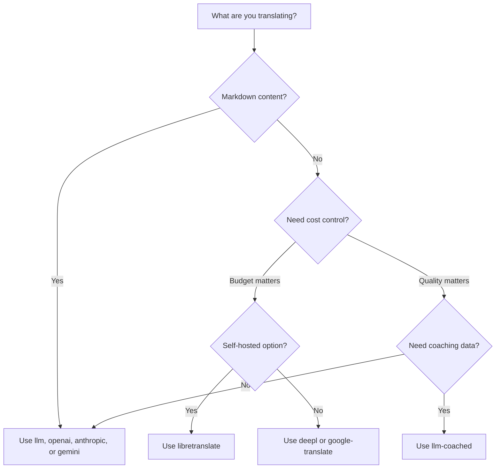

# Übersetzungsmethoden

Rosetta unterstützt zehn Übersetzungsmethoden. Jedes Sprachpaar kann eine andere Methode verwenden – Sie sind nicht auf einen einzigen Ansatz für Ihr gesamtes Projekt festgelegt.

## Methodenvergleich

### LLM-Anbieter

Qualitätsfokussiert, Markdown-kompatibel, Coaching-unterstützend. Am besten für inhaltsschwere Projekte geeignet.

| Methode | Schlüssel | Funktion |
|--------|-----|-------------|
| `llm` (Standard) | `OPENROUTER_API_KEY` | LLM über OpenRouter – 200+ Modelle, Auto-Routing |
| `llm-coached` | `OPENROUTER_API_KEY` | LLM + Grammatikregeln, Wörterbücher, Stilhinweise |
| `openai` | `OPENAI_API_KEY` | Direkte OpenAI-API (gpt-4o, gpt-4o-mini) |
| `anthropic` | `ANTHROPIC_API_KEY` | Direkte Anthropic-API (Claude Sonnet, Haiku, Opus) |
| `gemini` | `GEMINI_API_KEY` | Direkte Google Gemini-API (Flash, Pro) – kostenloses Kontingent |

### Traditionelle maschinelle Übersetzung (MT)

Geschwindigkeits- und kostenfokussiert. Am besten für große Mengen an Schlüssel-Wert-Paaren geeignet.

| Methode | Schlüssel | Funktion |
|--------|-----|-------------|
| `google-translate` | `GOOGLE_TRANSLATE_API_KEY` | Google Cloud Translation API v2 (130+ Sprachen) |
| `deepl` | `DEEPL_API_KEY` | DeepL-API mit Glossar-Unterstützung (30+ Sprachen) |
| `microsoft-translator` | `MICROSOFT_TRANSLATOR_API_KEY` | Azure Cognitive Services Translator (100+ Sprachen) |
| `libretranslate` | *(selbstgehostet)* | Selbstgehostetes LibreTranslate (AGPL, kostenlos) |

### Infrastruktur

| Methode | Schlüssel | Funktion |
|--------|-----|-------------|
| `api` | *(je nach Anbieter)* | Schlanker HTTP-Client für jeden REST-Übersetzungsendpunkt |

## Entscheidungsbaum



---

## `llm` — LLM-Übersetzung (Standard)

Übersetzt über ein beliebiges LLM auf [OpenRouter](https://openrouter.ai). Dies ist die Standardmethode und die vielseitigste.

**Wie es funktioniert:**
1. Fasst Schlüssel in Stapeln zusammen (Standard: 30 pro Stapel) mit Register- und Kontextanweisungen
2. Sendet diese als strukturierten Prompt an OpenRouter
3. Parst die JSON-Antwort
4. Validiert jede Übersetzung durch das [Quality Gate](/docs/concepts/quality-gate)
5. Schreibt erfolgreiche Übersetzungen, wiederholt oder verwirft fehlgeschlagene

**Wann zu verwenden:** Für die meisten Projekte. Insbesondere für inhaltsschwere Websites mit Markdown, bei denen Codeblöcke und Shortcodes geschützt werden müssen.

**Konfiguration:**

```json
{
  "defaultMethod": "llm",
  "model": "google/gemini-3.5-flash"
}
```

## `llm-coached` — Gecoachte LLM-Übersetzung

Identisch mit `llm`, jedoch werden Grammatikregeln, Begriffswörterbücher und Stilhinweise in jeden Prompt eingefügt.

**Wie es funktioniert:**
1. Lädt Coaching-Daten aus `.rosetta/coaching/<locale>.json` oder dem `coaching/`-Verzeichnis eines Plugins
2. Fügt Grammatikregeln, Wörterbuchbegriffe und Stilhinweise in den System-Prompt ein
3. Wörterbuchbegriffe, die mit Quellschlüsseln übereinstimmen, werden als erforderliche Terminologie einbezogen
4. Die Übersetzung verläuft wie bei `llm`, wobei die Coaching-Daten für zusätzliche Präzision sorgen

**Wann zu verwenden:** Bei ressourcenarmen Sprachen, domänenspezifischer Terminologie (rechtlich, medizinisch), formellen Registern oder in jedem Fall, in dem die generische LLM-Ausgabe nicht präzise genug ist.

**Format der Coaching-Daten:**

```json title=".rosetta/coaching/fr.json"
{
  "grammar_rules": [
    "French adjectives agree in gender and number with the noun they modify",
    "Use 'vous' for formal contexts, 'tu' for informal"
  ],
  "dictionary": {
    "dashboard": "tableau de bord",
    "deployment": "déploiement",
    "settings": "paramètres"
  },
  "style_notes": "Prefer active voice. Avoid anglicisms where a native French term exists."
}
```

Siehe auch: [Leitfaden für ressourcenarme Sprachen](https://mtevalarena.org/docs/community/low-resource-languages)

---

## `openai` — Direkte OpenAI-API

Übersetzt direkt über die OpenAI Chat Completions API. Kein OpenRouter-Vermittler – Ihr Schlüssel, Ihr Konto, Ihr Nutzungs-Dashboard.

**Modelle:** `gpt-4o` (Standard), `gpt-4o-mini`

**Funktionen:**
- ✅ Markdown-kompatibel (Inhaltsübersetzung)
- ✅ Coaching-Unterstützung (Grammatikregeln, Wörterbuchüberschreibungen, Stilhinweise)
- ✅ JSON-Modus für strukturierte Schlüssel-Wert-Ausgaben
- ✅ Exponentielles Backoff mit Wiederholungsversuchen

**Konfiguration:**

```json
{
  "pairs": {
    "en:fr": { "method": "openai", "model": "gpt-4o-mini" }
  }
}
```

```bash
export OPENAI_API_KEY=sk-proj-...
```

Holen Sie sich Ihren Schlüssel unter [platform.openai.com/api-keys](https://platform.openai.com/api-keys).

## `anthropic` — Direkte Anthropic-API

Übersetzt direkt über die Anthropic Messages API. Verwendet den Parameter `system` für Coaching-Daten, was das Prompt-Caching von Anthropic ermöglicht.

**Modelle:** `claude-sonnet-4-6` (Standard), `claude-haiku-4-5`, `claude-opus-4-7`

**Funktionen:**
- ✅ Markdown-kompatibel (Inhaltsübersetzung)
- ✅ Coaching-Unterstützung (Grammatikregeln, Wörterbuchüberschreibungen, Stilhinweise)
- ✅ System-Prompt-Caching (amortisiert Coaching-Kosten über Stapel hinweg)
- ✅ Exponentielles Backoff mit Wiederholungsversuchen

**Konfiguration:**

```json
{
  "pairs": {
    "en:ja": { "method": "anthropic", "model": "claude-haiku-4-5" }
  }
}
```

```bash
export ANTHROPIC_API_KEY=sk-ant-...
```

Holen Sie sich Ihren Schlüssel unter [console.anthropic.com](https://console.anthropic.com/settings/keys).

## `gemini` — Direkte Google Gemini-API

Übersetzt direkt über die Google Gemini `generateContent` API. **Kostenloses Kontingent verfügbar** – der beste kostenfreie Einstiegspunkt.

**Modelle:** `gemini-2.5-flash` (Standard), `gemini-2.5-pro`

**Funktionen:**
- ✅ Markdown-kompatibel (Inhaltsübersetzung)
- ✅ Coaching-Unterstützung (Grammatikregeln, Wörterbuchüberschreibungen, Stilhinweise)
- ✅ JSON-Antwortmodus über `responseMimeType`
- ✅ Kostenloses Kontingent (großzügige tägliche Quote)
- ✅ Exponentielles Backoff mit Wiederholungsversuchen

**Konfiguration:**

```json
{
  "pairs": {
    "en:ko": { "method": "gemini", "model": "gemini-2.5-pro" }
  }
}
```

```bash
export GEMINI_API_KEY=AI...
```

Holen Sie sich Ihren Schlüssel unter [aistudio.google.com/apikey](https://aistudio.google.com/apikey).

### Modellvalidierung

Die direkten LLM-Anbieter (`openai`, `anthropic`, `gemini`) validieren Ihre Modellzeichenfolge bei der ersten Verwendung. Dies erfasst drei Kategorien von Fehlern:

**Falsches Methodenformat** – Verwendung eines Modellpfads im OpenRouter-Stil bei einem direkten Anbieter:

```
[WARN] OpenAI: model "google/gemini-3.5-flash" looks like an OpenRouter path.
       Direct providers use bare model names (e.g., "gpt-4o").
       To use OpenRouter models, set method to 'llm' instead.
```

**Falscher Anbieter** – Verwendung eines Modells von einem völlig anderen Anbieter:

```
[WARN] Gemini: model "claude-sonnet-4-6" is an Anthropic model.
       This provider (gemini) cannot serve Anthropic models.
       Use --method anthropic or set "method": "anthropic" in config.
```

**Veraltetes oder falsch geschriebenes Modell** – Beim ersten API-Aufruf ruft Rosetta die Live-Modellliste des Anbieters ab und gleicht Ihr Modell damit ab:

```
[WARN] Gemini: model "gemini-1.5-flash" not found in available models.
       Similar models: gemini-2.0-flash, gemini-2.5-flash, gemini-2.5-pro
       The API call will proceed — the provider will give the final verdict.
```

:::note Dies sind Warnungen, keine Fehler
Die Modellvalidierung protokolliert Warnungen, blockiert jedoch nicht den API-Aufruf. Die Anbieter-API fällt das endgültige Urteil – ein zukünftiger Modellname könnte einem anderen Muster entsprechen, und wir möchten keine Blockaden aufgrund von Heuristiken errichten.
:::

---

## `google-translate` — Google Cloud Translation API

Direkte Integration mit der Google Cloud Translation API v2. Verwendet die REST-API – kein SDK, kein Dienstkonto. Nur der API-Schlüssel.

**Wann zu verwenden:** Bei großen Mengen an Schlüssel-Wert-Zeichenfolgenpaaren, bei denen Geschwindigkeit und Kosten wichtiger sind als Nuancen. Unterstützt standardmäßig über 130 Sprachen.

**Einschränkungen:**
- ⚠️ **Keine Markdown-Kompatibilität.** Codeblöcke, Shortcodes und Interpolationsvariablen werden beschädigt.
- Keine Kontrolle über Register/Tonfall
- Kein Coaching oder Erzwingung von Terminologie

```bash
npx i18n-rosetta sync --method google-translate
```

:::tip Automatische Erkennung
Wenn nur `GOOGLE_TRANSLATE_API_KEY` festgelegt ist (kein OpenRouter-Schlüssel), wechselt Rosetta automatisch zu Google Translate. Keine Konfigurationsänderung erforderlich.
:::

## `deepl` — DeepL-API

Direkte Integration mit der DeepL-Übersetzungs-API. Unterstützt Glossare für eine konsistente Terminologie.

**Wann zu verwenden:** Bei europäischen Sprachen, in denen DeepL hervorragend ist (Deutsch, Französisch, Spanisch, Niederländisch, Polnisch usw.). Die Glossar-Unterstützung erzwingt eine konsistente Terminologie ohne Coaching-Daten.

**Funktionen:**
- ✅ Automatische Erkennung des Free/Pro-Endpunkts (Suffix `:fx` bei kostenlosen Schlüsseln)
- ✅ Erstellung und Verwaltung von Glossaren
- ✅ Kontrolle des Formalitätsgrades
- ⚠️ **Keine Markdown-Kompatibilität** – nur Schlüssel-Wert-Paare

**Konfiguration:**

```json
{
  "pairs": {
    "en:de": { "method": "deepl" }
  }
}
```

```bash
export DEEPL_API_KEY=your-key-here
```

Holen Sie sich Ihren Schlüssel unter [deepl.com/pro-api](https://www.deepl.com/pro-api).

## `microsoft-translator` — Azure Cognitive Services

Direkte Integration mit der Microsoft Translator Text API v3.

**Wann zu verwenden:** In Unternehmensumgebungen mit bestehender Azure-Infrastruktur. Unterstützt über 100 Sprachen, einschließlich vieler, die Google Translate nicht abdeckt.

**Funktionen:**
- ✅ Bis zu 100 Segmente pro Anfrage (hoher Durchsatz)
- ✅ Optionaler Regionsparameter zur Latenzoptimierung
- ⚠️ **Keine Markdown-Kompatibilität** – nur Schlüssel-Wert-Paare
- ⚠️ **Keine Inhaltsübersetzung** – nur Schlüssel-Wert-Paare

**Konfiguration:**

```json
{
  "pairs": {
    "en:ar": { "method": "microsoft-translator" }
  }
}
```

```bash
export MICROSOFT_TRANSLATOR_API_KEY=your-key
export MICROSOFT_TRANSLATOR_REGION=global  # optional
```

Holen Sie sich Ihren Schlüssel über das [Azure-Portal](https://portal.azure.com) → Cognitive Services → Translator.

## `libretranslate` — Selbstgehostete Übersetzung

Selbstgehostete Open-Source-Übersetzung mit LibreTranslate. Läuft lokal oder auf Ihrer eigenen Infrastruktur – keine API-Kosten, volle Datensouveränität.

**Wann zu verwenden:** Für Projekte, die Offline-Übersetzung, Datenschutzkonformität (DSGVO) oder einen kostenlosen Betrieb erfordern. Besonders nützlich für CI-Pipelines, die nicht von externen APIs abhängig sein sollten.

**Funktionen:**
- ✅ Selbstgehostet – keine externen API-Aufrufe
- ✅ Kostenlos und Open Source (AGPL-3.0)
- ✅ Docker-Bereitstellung verfügbar
- ⚠️ **Keine Markdown-Kompatibilität** – nur Schlüssel-Wert-Paare
- ⚠️ **Keine Inhaltsübersetzung** – nur Schlüssel-Wert-Paare
- ⚠️ Qualität variiert je nach Sprachpaar

**Einrichtung:**

```bash
# Run LibreTranslate locally with Docker
docker run -d -p 5000:5000 libretranslate/libretranslate

# Configure (optional — defaults to localhost:5000)
export LIBRETRANSLATE_API_URL=http://localhost:5000/translate
```

```json
{
  "pairs": {
    "en:es": { "method": "libretranslate" }
  }
}
```

---

## `api` — Remote-Übersetzungs-API

Ein schlanker HTTP-Client für von der Community gehostete oder IP-geschützte Übersetzungsendpunkte. Rosetta sendet Schlüssel nach außen und empfängt Übersetzungen zurück – es enthält keinerlei Übersetzungslogik.

**Wann zu verwenden:** Wenn Übersetzungsmethoden serverseitig gehostet werden (z. B. proprietäre Coaching-Daten, feinabgestimmte Modelle, FST-Pipelines, die nicht verteilt werden können).

```json
{
  "pairs": {
    "en:crk": {
      "method": "api",
      "endpoint": "https://api.example.com/v1/translate",
      "apiKey": "your-key"
    }
  }
}
```

:::note OCAP-kompatible Community-Übersetzung
Die Methode `api` ist die Brücke zur **OCAP-kompatiblen, von der Community gehosteten Übersetzung**. Indigene und Minderheitensprachgemeinschaften können ihre eigenen Übersetzungsendpunkte hosten – wodurch Coaching-Daten, feinabgestimmte Modelle und linguistisches geistiges Eigentum (IP) unter der Kontrolle der Community bleiben –, während Rosetta als schlanker Client eine Verbindung zu ihnen herstellt.

Siehe [Unterstützung einer ressourcenarmen Sprache](https://mtevalarena.org/docs/community/low-resource-languages) für die vollständige Anleitung zum Community-Hosting und [Bereitstellung einer Methode über API](/docs/guides/serving-a-method) für die Endpunktanforderungen.
:::

---

## Konfiguration pro Sprachpaar

Die wahre Stärke liegt in der Kombination von Methoden pro Sprachpaar:

```json title="i18n-rosetta.config.json"
{
  "version": 3,
  "pairs": {
    "en:fr": { "method": "deepl" },
    "en:ja": { "method": "openai", "model": "gpt-4o" },
    "en:ko": { "method": "gemini" },
    "en:ar": { "method": "microsoft-translator" },
    "en:crk": { "methodPlugin": "crk-coached-v1" }
  }
}
```

Dies übersetzt Französisch über DeepL (Glossar-Unterstützung), Japanisch über OpenAI (Qualität), Koreanisch über Gemini (kostenloses Kontingent), Arabisch über Microsoft Translator (Abdeckung) und Plains Cree über ein gecoachtes Plugin (spezialisiert).

## Plugins

Plugins sind vorgefertigte Übersetzungsrezepte für bestimmte Sprachpaare. Es handelt sich um JSON-Manifeste – keinen Code –, die Rosetta mitteilen, welche Methode mit welchen Einstellungen verwendet werden soll und welche Qualität als Benchmark ermittelt wurde.

:::tip Vom Evaluierungs-Harness zur Produktion mit einem Befehl
Plugins, die im [Evaluierungs-Harness](https://mtevalarena.org/docs/specifications/harness) entwickelt und erprobt wurden, können direkt installiert werden – die Methode, die Sie dort validieren, wird hier mit einem einzigen `plugin install`-Befehl bereitgestellt. Siehe [MT-Evaluierung](https://mtevalarena.org/docs/leaderboard/rules) für den vollständigen Evaluierungs-Workflow.
:::

```bash
i18n-rosetta plugin install ./french-formal-v1/
i18n-rosetta plugin list
i18n-rosetta plugin remove french-formal-v1
```

Siehe die [Plugin-Spezifikation](/docs/reference/plugin-spec) für das vollständige Manifestformat.

---

## Anbieter wechseln

Wechseln Sie zwischen Methoden? Das Modellformat und die Umgebungsvariablen ändern sich – hier ist die Übersicht:

### OpenRouter → Direkter Anbieter

```diff title="i18n-rosetta.config.json"
 {
   "pairs": {
     "en:fr": {
-      "method": "llm",
-      "model": "openai/gpt-4o"
+      "method": "openai",
+      "model": "gpt-4o"
     }
   }
 }
```

```diff title="Environment variables"
- export OPENROUTER_API_KEY=sk-or-v1-...
+ export OPENAI_API_KEY=sk-proj-...
```

**Hauptunterschiede:**
- OpenRouter verwendet das Format `provider/model` (z. B. `openai/gpt-4o`). Direkte Anbieter verwenden reine Modellnamen (z. B. `gpt-4o`).
- Jeder direkte Anbieter hat seine eigene Umgebungsvariable (`OPENAI_API_KEY`, `ANTHROPIC_API_KEY`, `GEMINI_API_KEY`).
- Wenn Sie das falsche Modellformat verwenden, wird Rosetta Sie warnen – siehe [Modellvalidierung](#model-validation).

### Direkter Anbieter → OpenRouter

```diff title="i18n-rosetta.config.json"
 {
   "pairs": {
     "en:ja": {
-      "method": "anthropic",
-      "model": "claude-sonnet-4-6"
+      "method": "llm",
+      "model": "anthropic/claude-sonnet-4-6"
     }
   }
 }
```

:::tip Wann OpenRouter vs. Direkt verwendet werden sollte
**Verwenden Sie OpenRouter**, wenn Sie zwischen Modellen wechseln möchten, ohne Umgebungsvariablen zu ändern, oder wenn Sie mit einem einzigen Schlüssel Zugriff auf über 200 Modelle haben möchten. **Verwenden Sie direkte Anbieter**, wenn Sie eine einfachere Abrechnung, geringere Latenz (kein Vermittler) oder Zugriff auf anbieterspezifische Funktionen wie das Prompt-Caching von Anthropic wünschen.
:::

---

## Kostenvergleich

Ungefähre Kosten pro 1.000 übersetzte Schlüssel (geht von ~10 Token pro Schlüssel und 30 Schlüsseln pro Stapel aus):

| Methode | Kosten / 1K Schlüssel | Geschwindigkeit | Qualität | Am besten für |
|--------|----------------|-------|---------|----------|
| `gemini` (Flash) | **Kostenlos** (innerhalb des Kontingents) | Schnell | Gut | Einstieg, persönliche Projekte |
| `google-translate` | ~$0.02 | Am schnellsten | Ausreichend | Großes Volumen, europäische Sprachen |
| `deepl` | ~$0.02 | Schnell | Gut | Europäische Sprachen, Terminologie |
| `microsoft-translator` | ~$0.01 | Schnell | Ausreichend | Azure-Umgebungen, breite Sprachabdeckung |
| `libretranslate` | **Kostenlos** (selbstgehostet) | Variiert | Akzeptabel | Air-Gapped, DSGVO, CI-Pipelines |
| `gemini` (Pro) | ~$0.07 | Mittel | Sehr gut | Qualitätsbewusst, kostenloses Kontingent |
| `openai` (GPT-4o-mini) | ~$0.01 | Schnell | Gut | Budget-LLM |
| `openai` (GPT-4o) | ~$0.10 | Mittel | Sehr gut | Qualitätsbewusst |
| `anthropic` (Haiku) | ~$0.01 | Schnell | Gut | Budget-LLM |
| `anthropic` (Sonnet) | ~$0.10 | Mittel | Sehr gut | Qualitätsbewusst |
| `anthropic` (Opus) | ~$0.50 | Langsam | Exzellent | Maximale Qualität |
| `llm` (OpenRouter) | Variiert je nach Modell | Variiert | Variiert | Modellvergleich, Experimente |

:::note Dies sind Schätzungen
Die tatsächlichen Kosten hängen von der Länge Ihres Quelltextes, der Stapelgröße und Preisänderungen der Anbieter ab. Überprüfen Sie die aktuelle Preisseite jedes Anbieters für genaue Tarife.
:::

---

## Siehe auch

- [Unterstützte Sprachen](/docs/reference/supported-languages)
- [Coaching-Daten](/docs/concepts/coaching-data)
- [Unterstützung einer ressourcenarmen Sprache](https://mtevalarena.org/docs/community/low-resource-languages)
- [Plugin-Spezifikation](/docs/reference/plugin-spec)
- [Bereitstellung einer Methode über API](/docs/guides/serving-a-method)
- [Quality Gate](/docs/concepts/quality-gate)
- [Architektur](/docs/concepts/architecture)
- [Fehlerbehebung](/docs/guides/troubleshooting) – Modellfehler, API-Probleme