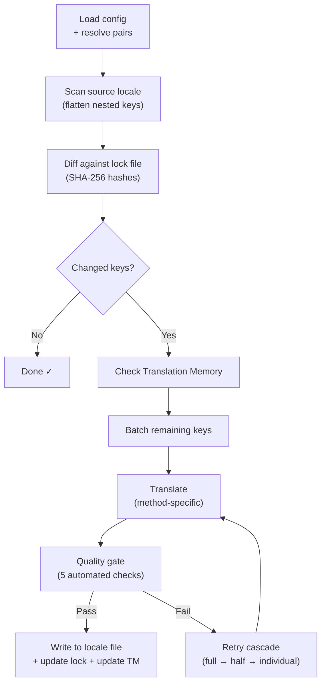

# Wie i18n-rosetta funktioniert

i18n-rosetta übersetzt die Locale-Dateien Ihrer App mit einem einzigen Befehl. Hier erfahren Sie, was im Hintergrund passiert.

## Die Pipeline

Wenn Sie `npx i18n-rosetta sync` ausführen, durchläuft rosetta eine sechsphasige Pipeline:



**Wichtige Designentscheidungen:**

- **Änderungserkennung über SHA-256-Hashes.** Rosetta verfolgt jeden Quellwert mit einem Hash in `.i18n-rosetta.lock`. Wenn Sie eine englische Zeichenfolge aktualisieren, wird nur dieser Schlüssel neu übersetzt. Aus diesem Grund ist `sync` bei wiederholten Ausführungen schnell — es verrichtet nur minimale Arbeit.

- **Translation Memory Caching.** Bevor ein API-Aufruf getätigt wird, überprüft rosetta `.rosetta/tm.json` auf zwischengespeicherte Übersetzungen (indiziert nach Quelltext + Locale + Methode). Bei einer typischen erneuten Synchronisierung nach der Änderung eines Schlüssels stammen 142 Schlüssel aus dem Cache und 1 Schlüssel greift auf die API zu.

- **Quality Gate vor dem Schreibvorgang.** Jede Übersetzung durchläuft fünf automatisierte Prüfungen (leer, Quelltext-Echo, Halluzinationsschleife, Längeninflation, Schriftzeichenkonformität), bevor sie in Ihre Dateien geschrieben wird. Fehler werden protokolliert und niemals stillschweigend akzeptiert.

- **Wiederholungskaskade bei Fehlern.** Wenn ein Batch fehlschlägt (JSON-Parsing-Fehler, API-Zeitüberschreitung), unternimmt rosetta erneute Versuche mit zunehmend kleineren Batches: vollständig → halb → einzeln. Dadurch wird der problematische Schlüssel isoliert, ohne den Rest zu blockieren.

## Übersetzungsmethoden

Rosetta unterstützt vier Übersetzungsmethoden, die jeweils für unterschiedliche Szenarien geeignet sind:

| Methode | Funktionsweise | Am besten geeignet für |
|--------|-------------|----------|
| **`llm`** | Strukturierter Prompt an ein beliebiges OpenRouter-Modell | Ressourcenstarke Sprachen |
| **`llm-coached`** | Gleicher Prompt + Grammatikregeln, Wörterbuch und Stilhinweise | Sprachen, bei denen LLMs vorhersehbare Fehler machen |
| **`google-translate`** | Batch-Anfrage an die Google Cloud Translation API | Ressourcenstarke Sprachen mit guter GT-Unterstützung |
| **`api`** | HTTP-POST an Ihren eigenen Endpunkt | Benutzerdefinierte Pipelines, von der Community kontrollierte Modelle |

Methoden werden pro Sprachpaar konfiguriert. Sie könnten `google-translate` für Französisch verwenden, aber `llm-coached` für Plains Cree — jedes Paar erhält die Methode, die am besten dafür funktioniert.

## Coaching-Daten

Für `llm-coached`-Paare vermitteln Coaching-Daten dem LLM explizites linguistisches Wissen: Grammatikregeln, erzwungene Terminologie und Stilpräferenzen. Dies wird als strukturierter Kontext in jeden Prompt eingefügt.

```json title="coaching/crk.json"
{
  "grammar_rules": ["Animate nouns take different plural forms than inanimate nouns"],
  "dictionary": {"welcome": "ᑕᓂᓯ", "settings": "ᐃᑕᐢᑌᐘᐃᓇ"},
  "style_notes": "Use Standard Roman Orthography (SRO) unless explicitly configured otherwise."
}
```

Coaching-Daten sind der primäre Mechanismus zur Verbesserung der Übersetzungsqualität, ohne ein Modell feinabstimmen zu müssen. Ändern Sie die Regeln → führen Sie die Synchronisierung erneut aus → prüfen Sie, ob es hilft. Die Iteration erfolgt sofort.

## Plugins

Plugins sind vorgefertigte Übersetzungsrezepte für bestimmte Sprachpaare. Es handelt sich um JSON-Manifeste — nicht um Code —, die rosetta mitteilen, welche Methode verwendet werden soll, mit welchen Einstellungen und welche Qualität im Benchmark ermittelt wurde.

```bash
i18n-rosetta plugin install ./crk-coached-v3/
i18n-rosetta sync   # uses the installed plugin for en→crk
```

Plugins schließen die Lücke zwischen Forschung und Produktion: Eine Methode, die in der [MT Eval Arena](https://mtevalarena.org) gut abschneidet, kann als Plugin verpackt und hier bereitgestellt werden.

## Das Gesamtbild

i18n-rosetta ist die eine Hälfte eines zweiteiligen Ökosystems:

- **[MT Eval Arena](https://mtevalarena.org)** — wo Übersetzungsmethoden mit reproduzierbarem Benchmarking **entwickelt und erprobt** werden
- **i18n-rosetta** — wo erprobte Methoden **bereitgestellt** werden, um echte Inhalte zu übersetzen

Die [Eval Harness Bridge](/docs/guides/bridge) verbindet die beiden. Eine Methode, die sich in der Arena bewährt, wird hier bereitgestellt. Das Feedback von Sprechern aus der Produktion verbessert die nächste Version.

---

## Weiterführende Informationen

- [Wie die Synchronisierung funktioniert](/docs/concepts/how-sync-works) — detaillierter, schrittweiser Durchlauf der Pipeline
- [Quality Gate](/docs/concepts/quality-gate) — die fünf automatisierten Prüfungen
- [Translation Memory](/docs/concepts/translation-memory) — Caching und Kosteneinsparungen
- [Übersetzungsmethoden](/docs/guides/translation-methods) — detaillierter Methodenvergleich
- [Architektur](/docs/concepts/architecture) — Übersicht über das Systemdesign