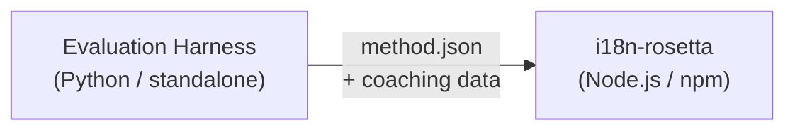

# Spezifikation für Methoden-Plugins

> **Version**: 1.1  
> **Zielgruppe**: Plugin-Entwickler  
> **Kanonisches Schema**: [`schemas/rosetta-plugin.schema.json`](https://github.com/gamedaysuits/i18n-rosetta/blob/main/schemas/rosetta-plugin.schema.json)

## Übersicht

i18n-rosetta verwendet ein **Plugin-basiertes Methodensystem**. Jedes Sprachpaar kann eine andere Übersetzungsmethode verwenden (LLM, gecoacht, Skript-Konverter usw.). Methoden werden in `lib/translate.js` registriert und pro Paar über `lib/pairs.js` aufgelöst.

Die Aufgabe des Eval-Harness besteht darin, Übersetzungsmethoden zu **entwickeln, zu testen und zu exportieren**. Die Aufgabe von i18n-rosetta ist es, diese zu **verwenden und auszuführen**. Das Harness wird niemals innerhalb von rosetta ausgeführt.

### Datenfluss



---

## Format des Methoden-Plugins

Ein Methoden-Plugin ist eine einzelne JSON-Datei (`method.json`) mit optionalen Coaching-Datendateien.

### `method.json` — Erforderlich

```json
{
  "name": "french-formal-v1",
  "type": "llm-coached",
  "version": "1.0.0",
  "description": "Formally-tuned French with terminology enforcement and grammar coaching",
  "author": "Plugin Author",

  "config": {
    "model": "google/gemini-3.5-flash",
    "register": "formal",
    "batchSize": 30,
    "temperature": 0.2
  },

  "locales": ["fr"],

  "benchmarks": {
    "fr": {
      "date": "2026-05-11T00:00:00Z",
      "corpus_size": 500,
      "exact_match_rate": 0.42,
      "corpus_chrf": 72.3,
      "corpus_bleu": 45.1,
      "model": "google/gemini-3.5-flash",
      "harness_version": "1.0.0"
    }
  },

  "provenance": {
    "resources": [],
    "commercialReady": false,
    "flags": ["license-unclear"]
  },

  "coaching": {
    "dir": "coaching"
  }
}
```

### Feldreferenz

| Feld | Typ | Erforderlich | Beschreibung |
|-------|------|----------|-------------|
| `name` | string | ✅ | Eindeutige Methodenkennung (kebab-case) |
| `type` | string | ✅ | Rosetta-Methodentyp: `llm`, `llm-coached`, `api`, `google-translate`, `deepl`, `microsoft-translator`, `libretranslate`, `openai`, `anthropic`, `gemini` |
| `version` | string | ✅ | Semver-Version (z. B. `1.0.0`) |
| `locales` | string[] | ✅ | Auf welche Gebietsschemacodes (Locale-Codes) diese Methode abzielt (mindestens 1) |
| `description` | string | — | Für Menschen lesbare Beschreibung |
| `author` | string | — | Wer diese Methode entwickelt/getestet hat |
| `config.model` | string | — | OpenRouter-Modellkennung |
| `config.register` | string | — | Register/Tonfall der Zielsprache |
| `config.batchSize` | number | — | Schlüssel pro API-Batch (1–200, Standard: 30) |
| `config.temperature` | number | — | LLM-Temperatur (0.0–2.0, Standard: 0.3) |
| `benchmarks` | object | — | Benchmark-Ergebnisse pro Gebietsschema |
| `provenance` | object | — | Lizenzierung und Ressourcenabhängigkeiten |
| `coaching.dir` | string | — | Relativer Pfad zum Verzeichnis der Coaching-Daten |

### Benchmark-Objekt (pro Gebietsschema)

| Feld | Typ | Erforderlich | Beschreibung |
|-------|------|----------|-------------|
| `date` | string | ✅ | ISO 8601-Zeitstempel des Benchmark-Durchlaufs |
| `corpus_size` | number | ✅ | Anzahl der ausgewerteten Einträge |
| `exact_match_rate` | number | ✅ | 0.0–1.0, Anteil der exakten Übereinstimmungen |
| `corpus_chrf` | number | — | chrF++-Wertung (0–100) |
| `corpus_bleu` | number | — | BLEU-Wertung (0–100) |
| `model` | string | ✅ | Während der Auswertung (Eval) verwendetes Modell |
| `harness_version` | string | ✅ | Version des verwendeten Evaluation-Harness |

:::info Welche Metriken werden angezeigt?
Der Befehl `rosetta status` zeigt **chrF++** und die **Rate der exakten Übereinstimmungen** (exact match rate) aus dem Benchmark-Block an. `corpus_bleu` wird im Manifest akzeptiert, wird aber derzeit von keinem rosetta-Befehl angezeigt oder verwendet. Die [Methoden-Rangliste](/leaderboard) verfolgt chrF++, exakte Übereinstimmungen und die FST-Akzeptanzrate.
:::

---

### Provenienz-Objekt

Der Provenienz-Block kommuniziert den Lizenzstatus der im Plugin gebündelten Ressourcen.

| Feld | Typ | Standard | Beschreibung |
|-------|------|---------|-------------|
| `resources` | object[] | `[]` | Liste der gebündelten Ressourcen mit `name`, `license` und `type` |
| `commercialReady` | boolean | `false` | Ob das Plugin für den kommerziellen Vertrieb freigegeben ist |
| `flags` | string[] | `["license-unclear"]` | Maschinenlesbare Status-Flags |

**Standardzustand** — exportierte Plugins werden mit `commercialReady: false` und `flags: ["license-unclear"]` ausgeliefert.

**Freigegebener Zustand** — wenn die Lizenzierung überprüft wurde: Setzen Sie `commercialReady: true` und löschen Sie die Flags.

---

## Format der Coaching-Daten

Wenn `type` auf `llm-coached` gesetzt ist, sollte das Plugin Coaching-Datendateien im Unterverzeichnis `coaching/` enthalten.

### `coaching/<locale>.json`

```json
{
  "grammar_rules": [
    "French adjectives agree in gender and number with the noun they modify",
    "Use 'vous' for formal contexts, 'tu' for informal"
  ],
  "dictionary": {
    "dashboard": "tableau de bord",
    "deployment": "déploiement",
    "settings": "paramètres"
  },
  "style_notes": "Prefer active voice. Avoid anglicisms where a native French term exists."
}
```

| Feld | Typ | Erforderlich | Beschreibung |
|-------|------|----------|-------------|
| `grammar_rules` | string[] | — | Regeln, die in jeden LLM-Prompt für dieses Gebietsschema eingefügt werden |
| `dictionary` | object | — | Zuordnung von Begriff → Übersetzung. Übereinstimmende Begriffe werden als erforderliche Terminologie eingefügt. |
| `style_notes` | string | — | Freiform-Stilanweisungen, die an den Prompt angehängt werden |

---

## Verzeichnisstruktur

```
french-formal-v1/
  method.json                 # Method manifest with benchmarks
  coaching/
    fr.json                   # Coaching data for French
```

Für Methoden mit mehreren Gebietsschemata (Multi-Locale):

```
european-formal-v2/
  method.json                 # locales: ["fr", "de", "es", "it"]
  coaching/
    fr.json
    de.json
    es.json
    it.json
```

---

## Wie Rosetta Plugins verwendet

### Installation

```bash
i18n-rosetta plugin install ./french-formal-v1/
```

Speichert unter `.rosetta/methods/french-formal-v1/`.

### Konfiguration

```json title="i18n-rosetta.config.json"
{
  "pairs": {
    "en:fr": {
      "methodPlugin": "french-formal-v1"
    }
  }
}
```

:::info Merge-Semantik
Das Plugin definiert, *welche* Methode verwendet werden soll (`type`). Die Paar-Konfiguration stimmt ab, *wie* sie ausgeführt wird (`model`, `register`, `batchSize`). Wenn das Paar `model` festlegt, überschreibt dies den Standardwert des Plugins.
:::

### Laufzeit

1. Rosetta liest `method.json` aus `.rosetta/methods/french-formal-v1/`
2. Das Feld `type` des Plugins legt die Übersetzungsmethode fest (z. B. `llm-coached`)
3. Lädt Coaching-Daten aus dem Verzeichnis `coaching/` des Plugins
4. Verwendet den Block `config`, um Lücken bei Modell/Register/Temperatur zu füllen
5. Der Block `benchmarks` wird in der Ausgabe von `rosetta status` angezeigt
6. Der Block `provenance` wird von `rosetta provenance` auf Lizenzierungs-Flags überprüft

---

## Schema-Validierung

Plugin-Manifeste werden bei der Installation gegen [`schemas/rosetta-plugin.schema.json`](https://github.com/gamedaysuits/i18n-rosetta/blob/main/schemas/rosetta-plugin.schema.json) validiert.

Referenzieren Sie das Schema in Ihrer `method.json` für die IDE-Autovervollständigung:

```json
{
  "$schema": "./node_modules/i18n-rosetta/schemas/rosetta-plugin.schema.json",
  "name": "my-method-v1"
}
```

---

## Was NICHT enthalten sein sollte

- ❌ Kein Python-Code oder Harness-Abhängigkeiten
- ❌ Keine rohen Korpusdaten oder Ausführungsprotokolle
- ❌ Keine API-Schlüssel oder Anmeldeinformationen
- ❌ Keine Harness-Konfiguration
- ❌ Keine internen Prompt-Vorlagen (diese befinden sich in den Methodenimplementierungen von rosetta)

Das Plugin besteht **nur aus Daten**: Konfiguration, Coaching-Inhalten und Benchmark-Ergebnissen.

---

## Siehe auch

- [Übersetzungsmethoden](/docs/guides/translation-methods) — wie jede integrierte Methode funktioniert
- [Konfiguration](/docs/getting-started/configuration) — Konfiguration pro Paar und pro Sprache
- [Bereitstellen einer Methode via API](/docs/guides/serving-a-method) — Hosting von Methoden als HTTP-Dienste
- [Kochbuch: FST-Gated Pipeline](https://mtevalarena.org/docs/tutorials/fst-gated-pipeline) — Erstellen und Paketieren einer Pipeline
- [MT-Evaluation](https://mtevalarena.org/docs/leaderboard/rules) — Benchmarking von Methoden für die Einreichung in die Rangliste
- [Unterstützung einer ressourcenarmen Sprache](https://mtevalarena.org/docs/community/low-resource-languages) — der Anwendungsfall für Community-Plugins