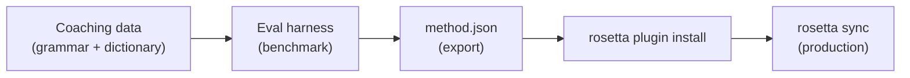

# Tutorial: Ein Übersetzungs-Plugin erstellen

Erstellen Sie eine benutzerdefinierte Übersetzungsmethode von Grund auf, führen Sie Benchmarks durch und stellen Sie sie als rosetta-Plugin bereit. Dies ist der vollständige Arbeitsablauf zum Hinzufügen eines neuen Sprachpaares, das von keiner Standard-API unterstützt wird.

**Was Sie erstellen werden:** Ein Plugin für angeleitete Übersetzungen für formelles Französisch mit verbindlicher Terminologie, Grammatikregeln und Benchmark-Ergebnissen.

**Dauer:** 30–45 Minuten

**Voraussetzungen:**
- i18n-rosetta ist installiert (`npm install --save-dev i18n-rosetta`)
- Ein OpenRouter-API-Schlüssel (`OPENROUTER_API_KEY`)
- Python 3.10+ (für die Evaluierungsumgebung)

---

## Schritt 1: Das Problem identifizieren

Sie übersetzen ein SaaS-Dashboard ins Französische. Die Standardmethode `llm` liefert korrekte, aber inkonsistente Übersetzungen:

- Manchmal wird „dashboard“ zu „tableau de bord“, ein andermal zu „panneau de contrôle“
- Der Tonfall wechselt zwischen den Formen `tu` und `vous`
- Fachbegriffe werden inkonsistent anglisiert

Sie benötigen **verbindliche Terminologie** und **Registerkontrolle**, die der generische LLM-Prompt nicht bietet.

## Schritt 2: Coaching-Daten erstellen

Erstellen Sie eine Coaching-Datei, die Ihre linguistischen Anforderungen kodiert:

```bash
mkdir -p .rosetta/coaching
```

```json title=".rosetta/coaching/fr.json"
{
  "grammar_rules": [
    "Always use the 'vous' form for formal register",
    "French adjectives agree in gender and number with their noun",
    "Use the present tense for UI instructions, not the imperative",
    "Preserve sentence-final punctuation style from the source"
  ],
  "dictionary": {
    "dashboard": "tableau de bord",
    "deployment": "déploiement",
    "settings": "paramètres",
    "environment variable": "variable d'environnement",
    "webhook": "webhook",
    "API key": "clé API",
    "sign in": "se connecter",
    "sign out": "se déconnecter",
    "repository": "dépôt",
    "pull request": "demande de tirage"
  },
  "style_notes": "Formal technical French. Prefer native French terms over anglicisms where established equivalents exist. Keep UI labels concise — 3 words maximum where possible."
}
```

**Was jedes Feld bewirkt:**
- **`grammar_rules`** — Wird als explizite Einschränkung in den LLM-System-Prompt eingefügt
- **`dictionary`** — Wird mit den Quellschlüsseln abgeglichen; wenn ein Wörterbuchbegriff auftaucht, wird er als „erforderliche Terminologie“ in den Prompt eingefügt
- **`style_notes`** — Wird dem System-Prompt als allgemeine Stilrichtlinie angehängt

## Schritt 3: Das Sprachpaar konfigurieren

Weisen Sie rosetta an, `llm-coached` für Französisch zu verwenden:

```json title="i18n-rosetta.config.json"
{
  "version": 3,
  "inputLocale": "en",
  "localesDir": "./locales",
  "pairs": {
    "en:fr": {
      "method": "llm-coached",
      "model": "google/gemini-3.5-flash"
    }
  },
  "languages": {
    "fr": {
      "register": "Formal technical French (vous-form)",
      "name": "French"
    }
  }
}
```

## Schritt 4: Testen

```bash
npx i18n-rosetta sync --dry
```

Überprüfen Sie die Ausgabe des Probelaufs. Stellen Sie sicher, dass:
- ✅ Wörterbuchbegriffe konsistent verwendet werden („tableau de bord“, nicht „panneau de contrôle“)
- ✅ Die Form `vous` durchgängig verwendet wird
- ✅ Fachbegriffe mit Ihrem Wörterbuch übereinstimmen

Führen Sie dann die eigentliche Synchronisation aus:

```bash
npx i18n-rosetta sync
```

## Schritt 5: Benchmark mit der Evaluierungsumgebung (Optional)

Wenn Sie Qualitätsbewertungen wünschen – und das sollten Sie, da Plugins mit Benchmark-Daten ausgeliefert werden –, verwenden Sie die zugehörige Evaluierungsumgebung.

### Die Evaluierungsumgebung installieren

```bash
git clone https://github.com/gamedaysuits/gds-mt-eval-harness.git
cd gds-mt-eval-harness
pip install -r requirements.txt
```

### Einen Referenzkorpus erstellen

Erstellen Sie eine Datei mit Quellzeichenfolgen und als gut bekannten Übersetzungen:

```json title="corpus/french-formal.json"
[
  {
    "source": "Dashboard",
    "reference": "Tableau de bord"
  },
  {
    "source": "Sign in to your account",
    "reference": "Connectez-vous à votre compte"
  },
  {
    "source": "Your deployment is ready",
    "reference": "Votre déploiement est prêt"
  },
  {
    "source": "Environment variables",
    "reference": "Variables d'environnement"
  }
]
```

### Den Benchmark ausführen

```bash
python harness.py eval \
  --corpus corpus/french-formal.json \
  --source en \
  --target fr \
  --method llm-coached \
  --model google/gemini-3.5-flash
```

Die Evaluierungsumgebung gibt Folgendes aus:
- **chrF++** — F-Score auf Zeichenebene (0–100). Ein Wert über 70 ist stark.
- **BLEU** — N-Gramm-Überlappung (0–100). Ein Wert über 40 ist für angeleitete Übersetzungen solide.
- **Exakte Übereinstimmungsrate** — Anteil der Übersetzungen, die exakt mit der Referenz übereinstimmen.

### Das Plugin exportieren

Sobald Sie mit den Ergebnissen zufrieden sind:

```bash
python harness.py export \
  --name french-formal-v1 \
  --output ./french-formal-v1/
```

Dies erstellt:

```
french-formal-v1/
├── method.json          # Manifest with config + benchmarks
└── coaching/
    └── fr.json          # Your coaching data
```

## Schritt 6: Das Plugin in Rosetta installieren

```bash
npx i18n-rosetta plugin install ./french-formal-v1/
```

Dies kopiert das Plugin nach `.rosetta/methods/french-formal-v1/`.

Aktualisieren Sie Ihre Konfiguration, um es zu verwenden:

```json title="i18n-rosetta.config.json"
{
  "pairs": {
    "en:fr": {
      "methodPlugin": "french-formal-v1"
    }
  }
}
```

## Schritt 7: Überprüfen

```bash
# Check plugin is installed and shows benchmark scores
npx i18n-rosetta status

# Run a sync with the plugin
npx i18n-rosetta sync

# Audit licensing status
npx i18n-rosetta provenance
```

Die Ausgabe von `status` wird Folgendes anzeigen:

```
en → fr
  Method:    french-formal-v1 (llm-coached)
  Model:     google/gemini-3.5-flash
  Quality:   high
  chrF++:    74.2
  BLEU:      46.8
  Exact:     42%
```

## Was Sie erstellt haben



Sie verfügen nun über:
1. **Coaching-Daten** — Grammatikregeln und Terminologie, die Konsistenz erzwingen
2. **Benchmark-Ergebnisse** — Quantifizierte Qualität, die mit dem Plugin ausgeliefert wird
3. **Ein portables Plugin** — `method.json` + Coaching-Daten, installierbar auf jedem Rechner
4. **Produktionsbereitstellung** — Integriert in Ihre Synchronisations-Pipeline

## Nächste Schritte

- **[Plugin-Spezifikation](/docs/reference/plugin-spec)** — Vollständige Referenz des Manifest-Formats
- **[Übersetzungsmethoden](/docs/guides/translation-methods)** — Vergleichen Sie alle vier Methoden
- **[Ressourcenarme Sprachen](https://mtevalarena.org/docs/community/low-resource-languages)** — Wenden Sie dieses Muster auf Sprachen ohne API-Abdeckung an
- **[30 Sprachen übersetzen](/docs/tutorials/translate-30-languages)** — Skalieren Sie Ihr Projekt für ein globales Publikum