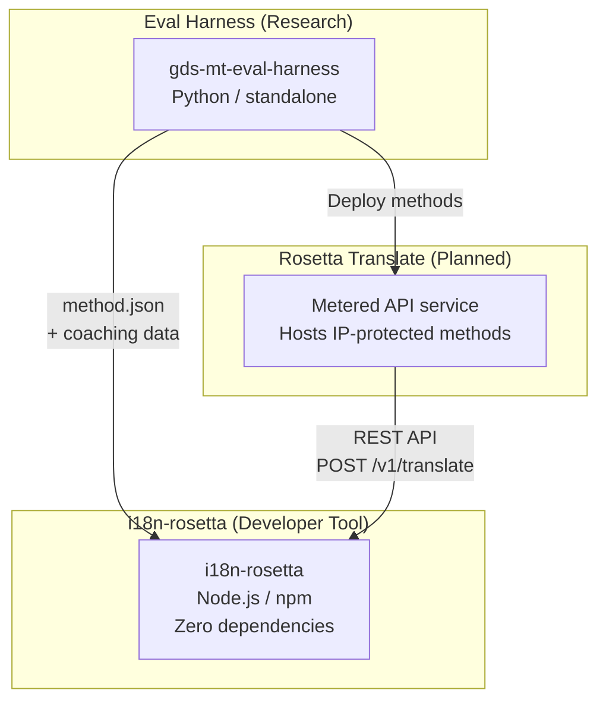
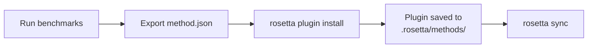
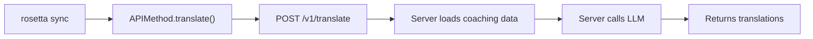

# Arquitectura

El ecosistema de traducción de Rosetta consta de tres herramientas independientes que trabajan juntas a través de contratos bien definidos. Ninguna de ellas depende de las demás en el momento de la compilación. Se comunican a través de un **formato de plugin de método** compartido y un **contrato de API REST**.

## Las tres piezas



### i18n-rosetta (este proyecto)

La herramienta de código abierto para desarrolladores. Traduce archivos de configuración regional utilizando métodos conectables. Cero dependencias, configuración opcional, funciona de forma inmediata.

**Métodos integrados:**
- `llm` → OpenRouter / cualquier LLM
- `llm-coached` → LLM + entrenamiento de gramática/diccionario
- `google-translate` → Google Cloud Translation API
- `api` → Conducto ligero hacia cualquier API remota

### Eval Harness (proyecto complementario)

Una herramienta de investigación para desarrollar, probar y evaluar métodos de traducción. Cuando un método alcanza una calidad aceptable, el harness exporta un **plugin de método**: un manifiesto `method.json` y archivos opcionales de datos de entrenamiento.

El harness nunca se ejecuta dentro de rosetta. Es una herramienta separada que produce resultados estáticos (archivos JSON). Rosetta simplemente lee esos archivos.

[→ Eval Harness en GitHub](https://github.com/gamedaysuits/gds-mt-eval-harness)

### Rosetta Translate (planificado)

Un servicio de API medido que aloja métodos de traducción propietarios en el lado del servidor: los prompts, los datos de entrenamiento y los pipelines lingüísticos nunca abandonan el servidor.

## Cómo se conectan

### Eval Harness → i18n-rosetta (exportación unidireccional)



**Contrato**: [Especificación del plugin](/docs/reference/plugin-spec)

### Rosetta Translate → i18n-rosetta (API en tiempo de ejecución)



El `APIMethod` de Rosetta es un **conducto pasivo**. Envía claves y recibe traducciones. Contiene cero lógica de traducción y cero contenido propietario.

## Qué sabe cada pieza sobre las demás

| Herramienta | ¿Conoce a rosetta? | ¿Conoce a Rosetta Translate? | ¿Conoce al harness? |
|------|---------------------|-------------------------------|---------------------|
| **i18n-rosetta** | *(es rosetta)* | Sí — el método `api` lo llama | No — solo lee las exportaciones de plugins |
| **Rosetta Translate** | Sí — atiende sus solicitudes | *(es Rosetta Translate)* | No — recibe métodos implementados |
| **Eval Harness** | Sí — exporta el formato de plugin | No — los métodos se implementan por separado | *(es el harness)* |

## Escenarios de uso

### Escenario 1: Gratuito, sin configuración (la mayoría de los usuarios)

```bash
export OPENROUTER_API_KEY=sk-...
npx i18n-rosetta sync
```

Utiliza el método `llm` integrado. Sin plugins, sin Rosetta Translate, sin harness.

### Escenario 2: Línea base de Google Translate

```bash
export GOOGLE_TRANSLATE_API_KEY=AIza...
npx i18n-rosetta sync
```

Utiliza el método `google-translate` integrado. No se necesitan plugins.

### Escenario 3: Plugin abierto con entrenamiento incluido

```bash
rosetta plugin install ./french-formal-v1/
rosetta sync
```

El plugin tiene `type: "llm-coached"` → rosetta utiliza la propia clave de OpenRouter del usuario. Los datos de entrenamiento son locales (sin llamada al servidor).

### Escenario 4: Entrenamiento DIY (sin plugin, sin harness)

```json title="i18n-rosetta.config.json"
{
  "pairs": {
    "en:fr": { "method": "llm-coached" }
  }
}
```

El usuario mantiene sus propias reglas gramaticales y diccionario en `.rosetta/coaching/fr.json`.

## Principios de diseño

1. **Sin dependencias circulares.** Los puentes son unidireccionales.
2. **Rosetta es el núcleo ligero.** Cero dependencias, configuración opcional. Los plugins y la API son aditivos.
3. **La protección de la propiedad intelectual es arquitectónica.** Las técnicas propietarias se mantienen en el lado del servidor. El paquete npm no incluye nada propietario.
4. **El formato del plugin es el contrato.** Todo fluye a través de `method.json`.
5. **Cada herramienta tiene un solo trabajo.** Harness → desarrolla métodos. Rosetta Translate → aloja métodos. Rosetta → traduce archivos.