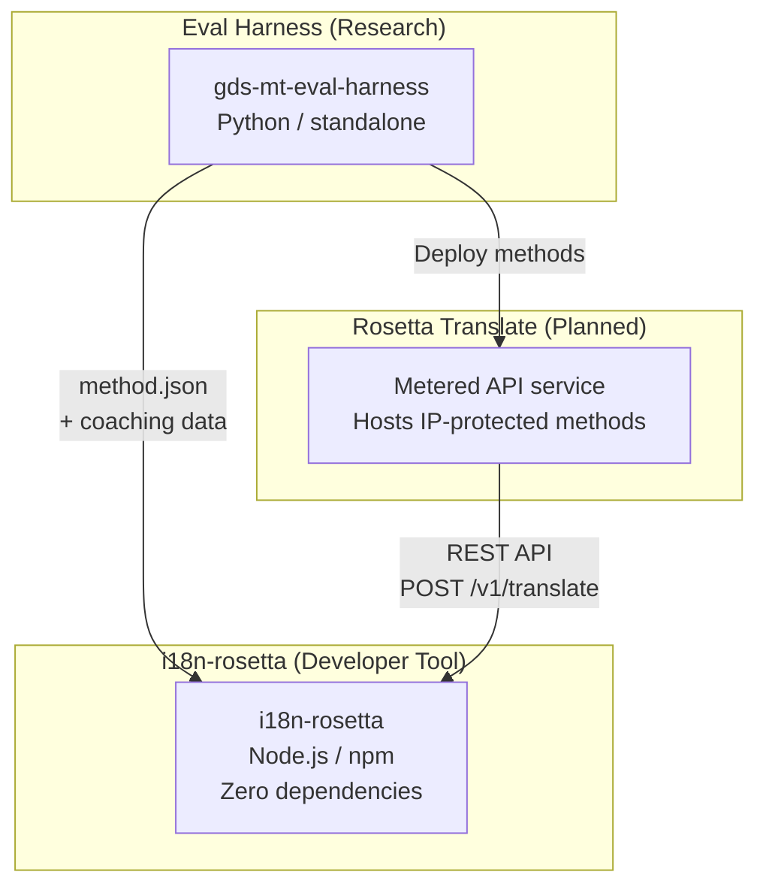
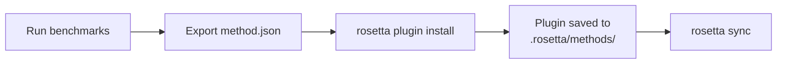
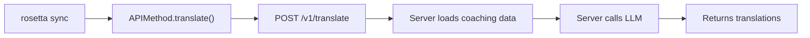
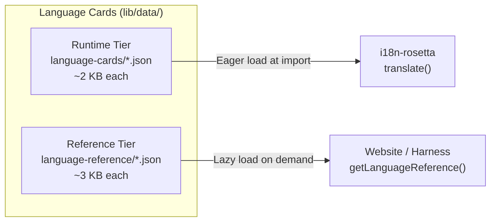

# Arquitectura

El ecosistema de traducción de Rosetta consiste en tres herramientas independientes que trabajan juntas a través de contratos bien definidos. Ninguna de ellas depende de las otras en el momento de compilación. Se comunican a través de un **formato de plugin de método** compartido y un **contrato de API REST**.

## Las tres piezas



### i18n-rosetta (este proyecto)

La herramienta de código abierto para desarrolladores. Traduce archivos de localización utilizando métodos conectables (pluggable). Cero dependencias, configuración opcional, funciona de inmediato.

**Métodos integrados:**
- `llm` → OpenRouter / cualquier LLM (más de 200 modelos)
- `llm-coached` → LLM + entrenamiento de gramática/diccionario
- `openai` → API directa de OpenAI (GPT-4o, GPT-4o-mini)
- `anthropic` → API directa de Anthropic (Claude Sonnet, Haiku, Opus)
- `gemini` → API directa de Google Gemini (Flash, Pro — nivel gratuito disponible)
- `google-translate` → Google Cloud Translation API v2
- `deepl` → API de DeepL con soporte para glosarios
- `microsoft-translator` → Azure Cognitive Services Translator
- `libretranslate` → LibreTranslate autoalojado (AGPL, gratuito)
- `api` → Conducto ligero (thin pipe) a cualquier endpoint REST remoto

### Eval Harness (proyecto complementario)

Una herramienta de investigación para desarrollar, probar y evaluar (benchmarking) métodos de traducción. Cuando un método alcanza una calidad aceptable, el harness exporta un **plugin de método**: un manifiesto `method.json` y archivos opcionales de datos de entrenamiento.

El harness nunca se ejecuta dentro de rosetta. Es una herramienta separada que produce resultados estáticos (archivos JSON). Rosetta simplemente lee esos archivos.

[→ Eval Harness en GitHub](https://github.com/gamedaysuits/gds-mt-eval-harness)

### Rosetta Translate (planificado)

Un servicio de API de uso medido que aloja métodos de traducción patentados en el lado del servidor: los prompts, los datos de entrenamiento y los pipelines lingüísticos nunca abandonan el servidor.

## Cómo se conectan

### Eval Harness → i18n-rosetta (exportación unidireccional)



**Contrato**: [Especificación del plugin](/docs/reference/plugin-spec)

### Rosetta Translate → i18n-rosetta (API en tiempo de ejecución)



El `APIMethod` de Rosetta es un **conducto pasivo** (dumb pipe). Envía claves y recibe traducciones. No contiene ninguna lógica de traducción ni contenido patentado.

## Qué sabe cada pieza sobre las demás

| Herramienta | ¿Conoce a rosetta? | ¿Conoce a Rosetta Translate? | ¿Conoce al harness? |
|------|---------------------|-------------------------------|---------------------|
| **i18n-rosetta** | *(es rosetta)* | Sí — el método `api` lo llama | No — solo lee las exportaciones de plugins |
| **Rosetta Translate** | Sí — atiende sus solicitudes | *(es Rosetta Translate)* | No — recibe los métodos implementados |
| **Eval Harness** | Sí — exporta el formato de plugin | No — los métodos se implementan por separado | *(es el harness)* |

## Escenarios de usuario

### Escenario 1: Gratuito, sin configuración (la mayoría de los usuarios)

```bash
export OPENROUTER_API_KEY=sk-...
npx i18n-rosetta sync
```

Utiliza el método integrado `llm`. Sin plugins, sin Rosetta Translate, sin harness.

### Escenario 2: Línea base de Google Translate

```bash
export GOOGLE_TRANSLATE_API_KEY=AIza...
npx i18n-rosetta sync
```

Utiliza el método integrado `google-translate`. No se necesitan plugins.

### Escenario 3: Plugin abierto con entrenamiento incluido

```bash
rosetta plugin install ./french-formal-v1/
rosetta sync
```

El plugin tiene `type: "llm-coached"` → rosetta utiliza la propia clave de OpenRouter del usuario. Los datos de entrenamiento son locales (sin llamadas al servidor).

### Escenario 4: Entrenamiento DIY (sin plugin, sin harness)

```json title="i18n-rosetta.config.json"
{
  "pairs": {
    "en:fr": { "method": "llm-coached" }
  }
}
```

El usuario mantiene sus propias reglas gramaticales y diccionario en `.rosetta/coaching/fr.json`.

## Language Cards

Cada idioma en rosetta se configura a través de una **Language Card** (tarjeta de idioma): un archivo JSON que contiene ajustes preestablecidos de registro, reglas de formalidad, indicadores de soporte de métodos y convenciones tipográficas. Las Language Cards son la configuración por idioma que impulsa la traducción guiada por el registro.



Las tarjetas se dividen en dos niveles para un mejor rendimiento a escala (con el objetivo de abarcar más de 700 idiomas):

- **Nivel de tiempo de ejecución (Runtime tier)** (`language-cards/`): Se carga de forma anticipada (eagerly); contiene los campos que necesita el motor de traducción (registros, formalidad, soporte de métodos, reglas tipográficas).
- **Nivel de referencia (Reference tier)** (`language-reference/`): Se carga de forma diferida (lazily); contiene documentación para desarrolladores (desafíos lingüísticos, familia de idiomas, recursos de PNL).

Ambos niveles se generan a partir de fuentes autorizadas (IANA, CLDR, Glottolog) utilizando `scripts/generate-language-card.mjs`, y luego son curados por humanos para garantizar la precisión lingüística.

## Principios de diseño

1. **Sin dependencias circulares.** Los puentes son unidireccionales.
2. **Rosetta es el núcleo ligero.** Cero dependencias, configuración opcional. Los plugins y la API son aditivos.
3. **La protección de la propiedad intelectual es arquitectónica.** Las técnicas patentadas permanecen en el lado del servidor. El paquete npm no incluye nada patentado.
4. **El formato del plugin es el contrato.** Todo fluye a través de `method.json`.
5. **Cada herramienta tiene un solo trabajo.** Harness → desarrollar métodos. Rosetta Translate → alojar métodos. Rosetta → traducir archivos.

---

## Consulte también

- [Métodos de traducción](/docs/guides/translation-methods) — cómo funciona cada método integrado
- [Especificación del plugin](/docs/reference/plugin-spec) — el formato del manifiesto method.json
- [Eval Harness](https://mtevalarena.org/docs/specifications/harness) — la herramienta de investigación complementaria
- [Servir un método a través de API](/docs/guides/serving-a-method) — alojamiento de pipelines de traducción personalizados
- [Soporte para un idioma de bajos recursos](https://mtevalarena.org/docs/community/low-resource-languages) — el caso de uso que impulsó esta arquitectura