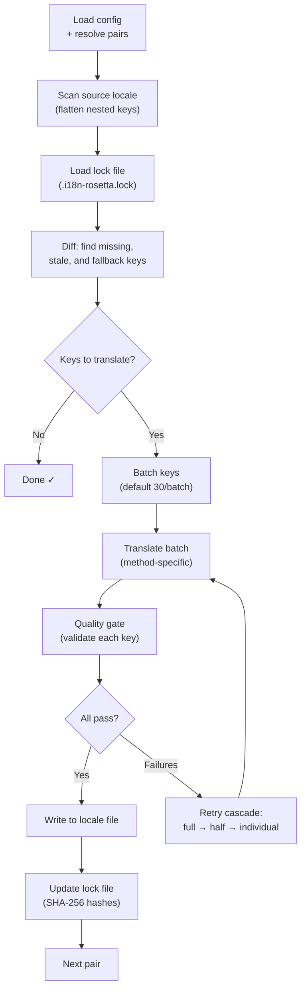

# Cómo funciona la sincronización

El comando `sync` es la operación principal de rosetta. Esto es lo que sucede cuando usted ejecuta `npx i18n-rosetta sync`.

## Descripción general del pipeline



## Paso a paso

### 1. Resolución de la configuración

Rosetta carga `i18n-rosetta.config.json` (o detecta automáticamente la configuración). Resuelve lo siguiente:
- La configuración regional de origen y las configuraciones regionales de destino
- El gráfico de pares (qué combinaciones de origen→destino procesar)
- La configuración de método, modelo y calidad por par

### 2. Escaneo del origen

El archivo de configuración regional de origen se carga y se aplana en un mapa de clave→valor:

```json
// Input (nested)
{ "hero": { "title": "Welcome", "subtitle": "Build" } }

// Flattened
{ "hero.title": "Welcome", "hero.subtitle": "Build" }
```

### 3. Detección de cambios

Rosetta lee `.i18n-rosetta.lock`, que almacena los hashes SHA-256 de los valores de origen traducidos previamente. Para cada clave, verifica lo siguiente:

| Condición | Acción |
|-----------|--------|
| Clave faltante en el destino | **Traducir** |
| El hash de origen cambió desde la última sincronización | **Volver a traducir** (obsoleto) |
| El valor de destino comienza con `[EN]` | **Volver a traducir** (marcador de posición de respaldo) |
| El hash de origen no cambió, la clave existe | **Omitir** |

Esta es la razón por la que rosetta solo traduce lo que cambió: no vuelve a traducir todo su archivo en cada sincronización.

### 4. Procesamiento por lotes

Las claves se agrupan en lotes (predeterminado: 30 claves/lote para LLM, 128 para Google Translate). El procesamiento por lotes reduce las idas y vueltas de la API mientras mantiene los prompts manejables.

### 5. Traducción

Cada lote se envía al método de traducción configurado:

- **`llm`**: Prompt estructurado hacia OpenRouter con instrucciones de registro y guía de género
- **`llm-coached`**: Igual, pero con reglas gramaticales, diccionario y notas de estilo inyectadas
- **`google-translate`**: Solicitud por lotes a Google Cloud Translation API v2
- **`api`**: HTTP POST a un endpoint remoto

El mensaje del sistema (registro, guía de género, reglas) es idéntico en todos los lotes para una configuración regional determinada, lo que permite el **almacenamiento en caché de prompts** (prompt caching): proveedores como Anthropic y Google almacenan en caché los mensajes del sistema repetidos, reduciendo los costos de tokens.

### 6. Filtro de calidad

Cada traducción se valida antes de escribirse en el disco. Se ejecutan cinco comprobaciones:

| Comprobación | Qué detecta | Ejemplo |
|-------|----------------|---------|
| **Vacío/en blanco** | El modelo no devolvió nada | `""` |
| **Eco del origen** | El modelo devolvió la entrada en inglés | `"Welcome"` para japonés |
| **Bucle de alucinación** | Trigramas repetidos | `"Qo' Qo' Qo' Qo'"` |
| **Inflación de longitud** | La salida es más de 4 veces más larga que el origen | Origen de 10 caracteres → salida de 50 caracteres |
| **Cumplimiento de escritura** | Sistema de escritura incorrecto para la configuración regional | Texto latino para configuración regional en árabe |

Las fallas se registran con un prefijo `[GATE]`. No hay respaldos silenciosos.

Consulte [Filtro de calidad](/docs/concepts/quality-gate) para obtener más detalles.

### 7. Cascada de reintentos

En caso de falla de análisis JSON o errores a nivel de lote, rosetta vuelve a intentar con lotes progresivamente más pequeños:

```
Full batch (30 keys) → Failed
Half batch (15 keys) → Failed
Individual keys (1 each) → Isolates the problem key
```

El presupuesto de reintentos está limitado por `maxRetries` (predeterminado: 3) para evitar un gasto descontrolado de tokens.

### 8. Escritura y bloqueo

Las traducciones aprobadas se escriben en el archivo de configuración regional de destino, preservando la estructura de anidamiento original. El archivo de bloqueo se actualiza con los nuevos hashes SHA-256.

## Éxito parcial

Un lote fallido no bloquea el resto. Si 9 de cada 10 lotes tienen éxito, esos 9 se escriben. El lote fallido se registra y usted puede volver a ejecutar `sync` para reintentar.

## Ejecución de prueba

Obtenga una vista previa de lo que cambiaría sin escribir ningún archivo:

```bash
npx i18n-rosetta sync --dry
```

## Forzar nueva traducción

Fuerce que claves específicas se vuelvan a traducir incluso si no han cambiado:

```bash
npx i18n-rosetta sync --force-keys "hero.title,nav.about"
```

## Estimación de costos

Antes de traducir, rosetta genera un **informe de costos previo a la sincronización** que muestra los costos estimados por par. Esto se ejecuta automáticamente durante cada `sync`; usted lo ve antes de que se realice cualquier llamada a la API.

```
╔══════════════════════════════════════════════════════════╗
║  Cost Estimate                                          ║
╠════════════╦═══════╦════════════╦════════════════════════╣
║ Pair       ║ Keys  ║ Est. Cost  ║ Method                 ║
╠════════════╬═══════╬════════════╬════════════════════════╣
║ en → fr    ║   142 ║ $0.07      ║ google-translate       ║
║ en → ja    ║    38 ║   —        ║ llm (model-dependent)  ║
║ en → crk   ║    38 ║   —        ║ llm-coached            ║
╚════════════╩═══════╩════════════╩════════════════════════╝
```

### Qué se estima

Cada método de traducción proporciona su propia estimación de costos:

| Método | Base de costo | Precisión |
|--------|-----------|-----------|
| `google-translate` | Tarifa publicada por Google ($20/millón de caracteres) | Exacta |
| `llm` | Varía según el modelo de OpenRouter | Depende del modelo — consulte los [precios de OpenRouter](https://openrouter.ai/models) |
| `llm-coached` | Igual que `llm` más tokens de contexto de entrenamiento | Depende del modelo |
| `api` | Determinado por el servidor | Desconocida — no se puede estimar sin consultar el endpoint |

Cuando un método no puede determinar el costo (métodos LLM, API remotas), rosetta informa `—` en lugar de adivinar. Use `--dry` para ver las estimaciones de costos sin traducir realmente.

---

## Consulte también

- [Referencia de la CLI — sync](/docs/reference/cli#sync) — opciones y banderas del comando
- [Filtro de calidad](/docs/concepts/quality-gate) — cómo se validan las traducciones
- [Métodos de traducción](/docs/guides/translation-methods) — cómo funciona cada método
- [Configuración](/docs/getting-started/configuration) — referencia de configuración
- [Guía de CI/CD](/docs/guides/ci-cd) — automatización de sincronizaciones en su pipeline