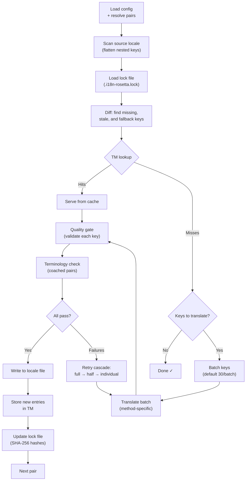

# Cómo funciona la sincronización

El comando `sync` es la operación principal de rosetta. Esto es lo que sucede cuando usted ejecuta `npx i18n-rosetta sync`.

## Descripción general del pipeline



## Paso a paso

### 1. Resolución de la configuración

Rosetta carga `i18n-rosetta.config.json` (o detecta automáticamente los ajustes). Resuelve lo siguiente:
- El locale de origen y los locales de destino
- El gráfico de pares (qué combinaciones de origen→destino procesar)
- Los ajustes de método, modelo y calidad por cada par

### 2. Escaneo del origen

El archivo del locale de origen se carga y se aplana en un mapa de clave→valor:

```json
// Input (nested)
{ "hero": { "title": "Welcome", "subtitle": "Build" } }

// Flattened
{ "hero.title": "Welcome", "hero.subtitle": "Build" }
```

### 3. Detección de cambios

Rosetta lee `.i18n-rosetta.lock`, el cual almacena los hashes SHA-256 de los valores de origen traducidos previamente. Para cada clave, verifica lo siguiente:

| Condición | Acción |
|-----------|--------|
| La clave falta en el destino | **Traducir** |
| El hash de origen cambió desde la última sincronización | **Volver a traducir** (obsoleto) |
| El valor de destino comienza con `[EN]` | **Volver a traducir** (marcador de posición de respaldo) |
| El hash de origen no cambió, la clave existe | **Omitir** |

Esta es la razón por la que rosetta solo traduce lo que cambió: no vuelve a traducir todo su archivo en cada sincronización.

### 4. Procesamiento por lotes

Las claves se agrupan en lotes (por defecto: 30 claves/lote para LLM, 128 para Google Translate). El procesamiento por lotes reduce las idas y vueltas de la API mientras mantiene los prompts manejables.

### 4b. Translation Memory

Antes de agrupar en lotes, rosetta verifica la caché de la Translation Memory (`.rosetta/tm.json`). Las claves cuyo texto de origen + locale + método coinciden con una traducción anterior se sirven instantáneamente desde la caché, sin necesidad de llamar a la API.

```
  [TM] 142 key(s) served from cache
  Translating 3 key(s) to French (llm)... [OK]
```

La TM es el principal mecanismo de ahorro de costos. Volver a ejecutar la sincronización después del cambio de una sola clave solo traduce esa clave, no todo el archivo. Consulte [Translation Memory](/docs/concepts/translation-memory) para obtener más detalles.

Para omitir la caché en una sola ejecución: `i18n-rosetta sync --no-tm`

### 5. Traducción

Cada lote se envía al método de traducción configurado:

- **`llm`**: Prompt estructurado hacia OpenRouter con instrucciones de registro y guía de género
- **`llm-coached`**: Igual que el anterior, pero con reglas gramaticales, diccionario y notas de estilo inyectadas
- **`google-translate`**: Solicitud por lotes a la Google Cloud Translation API v2
- **`api`**: HTTP POST a un endpoint remoto

El mensaje del sistema (registro, guía de género, reglas) es idéntico en todos los lotes para un locale determinado, lo que permite el **prompt caching**; proveedores como Anthropic y Google almacenan en caché los mensajes del sistema repetidos, reduciendo los costos de tokens.

### 6. Quality Gate

Cada traducción se valida antes de escribirse en el disco. Se ejecutan cinco comprobaciones:

| Comprobación | Qué detecta | Ejemplo |
|-------|----------------|---------|
| **Vacío/en blanco** | El modelo no devolvió nada | `""` |
| **Eco del origen** | El modelo devolvió la entrada en inglés | `"Welcome"` para japonés |
| **Bucle de alucinación** | Trigramas repetidos | `"Qo' Qo' Qo' Qo'"` |
| **Inflación de longitud** | La salida es 4 veces o más larga que el origen | Origen de 10 caracteres → salida de 50 caracteres |
| **Cumplimiento de escritura** | Sistema de escritura incorrecto para el locale | Texto latino para un locale árabe |

Los fallos se registran con un prefijo `[GATE]`. No hay respaldos silenciosos.

Consulte [Quality Gate](/docs/concepts/quality-gate) para obtener más detalles.

### 6b. Verificación de terminología

Para los pares coached con un diccionario, rosetta verifica si el LLM realmente usó la terminología requerida después de la traducción. Las infracciones se registran como advertencias `[TERM]`:

```
[TERM] en→fr: 2 term violation(s)
  • "dashboard" → expected "tableau de bord" but got "panneau"
```

Estas son advertencias, no errores de bloqueo: la traducción se escribe de todos modos.

### 7. Cascada de reintentos

En caso de fallo de análisis de JSON o errores a nivel de lote, rosetta vuelve a intentarlo con lotes progresivamente más pequeños:

```
Full batch (30 keys) → Failed
Half batch (15 keys) → Failed
Individual keys (1 each) → Isolates the problem key
```

El presupuesto de reintentos está limitado por `maxRetries` (por defecto: 3) para evitar un gasto descontrolado de tokens.

### 8. Escritura y bloqueo

Las traducciones aprobadas se escriben en el archivo del locale de destino, preservando la estructura de anidación original. El archivo de bloqueo se actualiza con los nuevos hashes SHA-256.

## Traducción de contenido (Fase 2)

Para los proyectos de Docusaurus y Hugo, `sync` ejecuta una segunda fase después de la traducción de claves JSON. Esta fase traduce archivos Markdown y MDX (documentación, publicaciones de blog, tutoriales) utilizando los mismos métodos y el Quality Gate.

### Cómo funciona

1. Rosetta descubre todos los archivos de contenido de origen (`.md`, `.mdx`) recorriendo el directorio content/docs
2. Para cada par de archivo × locale, verifica un archivo de bloqueo de contenido separado (`.i18n-rosetta-content.lock`) en busca de cambios en el hash SHA-256
3. Los archivos modificados o faltantes se recopilan en un grupo de elementos de trabajo plano (flat pool)
4. El grupo se procesa con **concurrencia paralela** (por defecto: 12 llamadas simultáneas a la API)

```
Phase 2: content (79 translations to process, 341 skipped, concurrency: 12)

    [1/79] (1%)  docs/concepts/security.md → ja [RE-TRANSLATE] (~3328s left)
    [2/79] (3%)  docs/concepts/security.md → th [RE-TRANSLATE] (~1821s left)
    ...
    [79/79] (100%) blog/v3-2-quality.md → de [OK]

  [OK] Created 79 content file(s), 341 unchanged
```

### Paralelismo de grupo plano (Flat-pool)

A diferencia de la Fase 1 (claves JSON, secuencial por locale), la Fase 2 procesa todas las combinaciones de archivo × locale como una lista plana. Esto significa que diferentes archivos y diferentes locales se traducen simultáneamente:

- `docs/configuration.md → fr` y `docs/cli.md → ja` se ejecutan al mismo tiempo
- Un corpus de 420 traducciones se completa en ~11 minutos con una concurrencia de 12
- Las escrituras incrementales del manifiesto cada 10 finalizaciones evitan la pérdida de progreso si se interrumpe el proceso

Controle el paralelismo con `--concurrency` o el campo de configuración `concurrency`:

```bash
# Faster (more parallel calls, higher API load)
npx i18n-rosetta sync --concurrency 20

# Slower (gentler on rate limits)
npx i18n-rosetta sync --concurrency 4
```

### Protección de contenido

Durante la traducción, rosetta protege el contenido no traducible:

- Los **bloques de código** (delimitados y con sangría) se reemplazan con marcadores de posición
- Los campos del **frontmatter** que no están en la lista `translatableFields` se conservan tal cual
- Los **enlaces**, las rutas de imágenes y las etiquetas HTML están protegidos
- Los **shortcodes** y las variables de interpolación (por ejemplo, `{count}`, `{{.Params.title}}`) están protegidos

Después de la traducción, todos los marcadores de posición se restauran y validan. Si falta alguno o está dañado, la traducción se rechaza y se vuelve a intentar.

## Éxito parcial

Un lote fallido no bloquea al resto. Si 9 de cada 10 lotes tienen éxito, esos 9 se escriben. El lote fallido se registra y usted puede volver a ejecutar `sync` para reintentarlo.

## Ejecución de prueba (Dry Run)

Obtenga una vista previa de lo que cambiaría sin escribir ningún archivo:

```bash
npx i18n-rosetta sync --dry-run
```

## Forzar retraducción

Fuerce la retraducción de claves específicas incluso si no han cambiado:

```bash
npx i18n-rosetta sync --force-keys "hero.title,nav.about"
```

## Estimación de costos

Antes de traducir, rosetta genera un **informe de costos previo a la sincronización** que muestra los costos estimados por par. Esto se ejecuta automáticamente durante cada `sync`; usted lo verá antes de que se realice cualquier llamada a la API.

```
╔══════════════════════════════════════════════════════════╗
║  Cost Estimate                                          ║
╠════════════╦═══════╦════════════╦════════════════════════╣
║ Pair       ║ Keys  ║ Est. Cost  ║ Method                 ║
╠════════════╬═══════╬════════════╬════════════════════════╣
║ en → fr    ║   142 ║ $0.07      ║ google-translate       ║
║ en → ja    ║    38 ║   —        ║ llm (model-dependent)  ║
║ en → crk   ║    38 ║   —        ║ llm-coached            ║
╚════════════╩═══════╩════════════╩════════════════════════╝
```

### Qué se estima

Cada método de traducción proporciona su propia estimación de costos:

| Método | Base de costo | Precisión |
|--------|-----------|-----------|
| `google-translate` | Tarifa publicada por Google ($20/millón de caracteres) | Exacta |
| `llm` | Varía según el modelo de OpenRouter | Depende del modelo — consulte los [precios de OpenRouter](https://openrouter.ai/models) |
| `llm-coached` | Igual que `llm` más los tokens de contexto de coaching | Depende del modelo |
| `api` | Determinado por el servidor | Desconocida — no se puede estimar sin consultar el endpoint |

Cuando un método no puede determinar el costo (métodos LLM, API remotas), rosetta informa `—` en lugar de adivinar. Utilice `--dry` para ver las estimaciones de costos sin traducir realmente.

---

## Consulte también

- [Referencia de la CLI — sync](/docs/reference/cli#sync) — opciones y flags del comando
- [Translation Memory](/docs/concepts/translation-memory) — almacenamiento en caché y ahorro de costos
- [Quality Gate](/docs/concepts/quality-gate) — cómo se validan las traducciones
- [Métodos de traducción](/docs/guides/translation-methods) — cómo funciona cada método
- [Trabajar con traductores profesionales](/docs/guides/professional-translators) — flujo de trabajo con XLIFF
- [Configuración](/docs/getting-started/configuration) — referencia de configuración
- [Guía de CI/CD](/docs/guides/ci-cd) — automatización de sincronizaciones en su pipeline