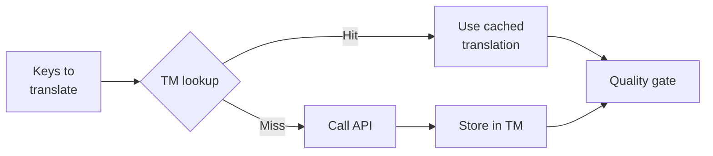

# Translation Memory

Translation Memory (TM) es la capa de almacenamiento en caché incorporada de rosetta. Almacena cada traducción indexada por texto de origen + configuración regional + método, por lo que volver a ejecutar `sync` solo llama a la API para las claves que realmente han cambiado.

## Por qué existe TM

Sin TM, cada `sync` vuelve a traducir cada clave modificada, incluso si usted ya ha traducido exactamente el mismo texto en inglés para la misma configuración regional en una ejecución anterior. Escenarios comunes donde esto desperdicia dinero:

| Escenario | Sin TM | Con TM |
|----------|-----------|---------|
| Volver a ejecutar la sincronización después de 1 cambio de clave (500 claves × 10 configuraciones regionales) | 5,000 llamadas a la API | 10 llamadas a la API |
| Revertir una clave a un valor anterior en inglés | Llamada completa a la API | Acierto de caché instantáneo |
| La misma frase aparece en 3 archivos de configuración regional | 3 × llamadas a la API | 1 llamada a la API + 2 aciertos de caché |
| Ejecución de prueba (dry-run) → sincronización real | Llamadas completas a la API en ambas | La primera ejecución almacena en caché, la segunda reutiliza |

TM está **habilitada de forma predeterminada** y no requiere configuración. Las traducciones se almacenan en caché automáticamente durante cada `sync` y se sirven en ejecuciones posteriores.

## Cómo funciona

### Clave de caché

Cada entrada de TM está indexada por un hash SHA-256 de tres valores:

```
SHA-256( sourceValue + '\x00' + locale + '\x00' + method )
```

| Componente | Por qué está en la clave |
|-----------|-------------------|
| `sourceValue` | Diferente texto en inglés → diferente traducción |
| `locale` | "Hello" se traduce de manera diferente al francés que al japonés |
| `method` | Salida de Google Translate ≠ salida de GPT-4o |

El separador de byte nulo (`\x00`) evita la colisión entre `"ab" + "c"` y `"a" + "bc"`.

### Durante la sincronización



1. Antes de llamar a la API de traducción, rosetta divide las claves en **aciertos de TM** (TM hits) y **fallos de TM** (TM misses)
2. Los aciertos se sirven instantáneamente desde la caché: sin llamada a la API, sin latencia, sin costo
3. Los fallos pasan por el flujo de traducción normal
4. Las nuevas traducciones de la API se almacenan en TM para futuras ejecuciones
5. Todas las traducciones (en caché + nuevas) pasan por el control de calidad

### Almacenamiento

TM se almacena en `.rosetta/tm.json` en la raíz de su proyecto. El archivo utiliza JSON compacto (sin pretty-printing) para mantener un tamaño manejable. Cada entrada almacena:

| Campo | Descripción |
|-------|-------------|
| `t` | El texto traducido |
| `ts` | Marca de tiempo ISO-8601 de cuándo se almacenó en caché |
| `l` | Código de configuración regional de destino (para estadísticas/filtrado) |
| `m` | Nombre del método de traducción (para estadísticas/filtrado) |

Con 50 idiomas × 500 claves = 25,000 entradas, el archivo debería tener un tamaño de ~2-3 MB.

## Administración de la caché

### Ver estadísticas

```bash
i18n-rosetta tm stats
```

Muestra el recuento de entradas, el tamaño del archivo y un desglose por configuración regional:

```
  Translation Memory — .rosetta/tm.json

  Entries:      2,847
  File size:    1.2 MB
  Created:      2026-05-20
  Last entry:   2026-05-24

  By locale:
    fr       482 entries  (llm: 380, llm-coached: 102)
    de       471 entries  (llm: 471)
    ja       465 entries  (llm: 465)
```

### Borrar la caché

```bash
# Clear everything (with confirmation prompt)
i18n-rosetta tm clear

# Clear without prompt (CI environments)
i18n-rosetta tm clear --yes

# Clear only one locale
i18n-rosetta tm clear --locale fr
```

### Omitir TM para una ejecución

```bash
# Force fresh API calls for all keys (useful when switching providers)
i18n-rosetta sync --no-tm
```

Esto no elimina la caché; simplemente la ignora para esta ejecución y no almacena resultados nuevos.

## Cuándo no ayuda TM

TM no producirá un acierto de caché cuando:

- **El texto de origen cambió**: el hash cambia, por lo que es un fallo
- **El método cambió**: cambiar de `llm` a `google-translate` significa diferentes claves de caché
- **Primera ejecución**: inicio en frío, aún no hay entradas
- **Indicador `--no-tm`**: omite explícitamente la caché

## ¿Debería hacer commit de `.rosetta/tm.json`?

**Generalmente no.** TM es una optimización local para el desarrollador. Se completa automáticamente durante la sincronización y solo ayuda cuando se vuelve a ejecutar la sincronización en la misma máquina. Sin embargo, usted podría considerar hacer commit si:

- Su equipo comparte un único CI runner que sincroniza las traducciones
- Usted desea compilaciones reproducibles sin llamadas a la API
- Usted está archivando traducciones por motivos de cumplimiento

Agregue `.rosetta/tm.json` a `.gitignore` para un uso típico.

---

## Consulte también

- [Cómo funciona la sincronización](/docs/concepts/how-sync-works): dónde encaja TM en el flujo de trabajo
- [Referencia de la CLI — tm](/docs/reference/cli#tm): referencia de comandos
- [Referencia de la CLI — sync --no-tm](/docs/reference/cli#sync): cómo omitir TM