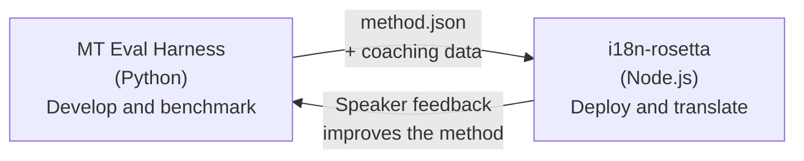

# El puente de Eval Harness

i18n-rosetta y el MT Eval Harness son dos herramientas separadas que forman un ecosistema. El harness es donde los métodos de traducción son **comprobados**. Rosetta es donde los métodos comprobados son **desplegados**. Se conectan a través de un formato de plugin compartido.



## El flujo: Investigación → Producción

### 1. Construir un método en el harness

Cualquier clase de Python que implemente `async translate(entries, config) → [{id, predicted}]` puede integrarse en el harness. Al harness no le importa lo que suceda en su interior: un LLM con prompts, un modelo entrenado a medida, reglas deterministas, cualquier cosa.

### 2. Realizar un benchmark

El harness califica su método frente a un corpus estandarizado con métricas reproducibles: chrF++, aceptación FST (para idiomas morfológicamente ricos), precisión morfológica y puntuación semántica.

### 3. Exportar como plugin

Cuando su método alcance una calidad aceptable, empaquételo como un plugin de rosetta: un manifiesto `method.json` con datos de coaching opcionales.

:::info La CLI de exportación está planeada
Actualmente, usted crea el manifiesto method.json de forma manual. El comando `mt-eval export` automatizará esto. Consulte la [Interfaz del método](https://mtevalarena.org/docs/specifications/methods) para ver el formato completo del plugin.
:::

### 4. Instalar en rosetta

```bash
i18n-rosetta plugin install ./my-method-plugin/
```

### 5. Traducir contenido real

```bash
i18n-rosetta sync
```

Su método sometido a benchmark ahora está produciendo traducciones reales en producción.

## El flujo: Producción → Investigación

Las traducciones desplegadas son revisadas por hablantes bilingües. Sus comentarios identifican errores sistemáticos (patrones de tiempos verbales incorrectos, vocabulario faltante, frases poco naturales). El investigador actualiza el método en el harness, vuelve a realizar el benchmark, lo vuelve a exportar y lo vuelve a desplegar. El sistema aprende del uso.

## El formato del plugin

El manifiesto `method.json` es el contrato entre las dos herramientas:

```json
{
  "name": "crk-coached-v3",
  "type": "llm-coached",
  "version": "3.0.0",
  "description": "Coached LLM translation for Plains Cree",
  "locales": ["crk"],
  "config": {
    "model": "google/gemini-3.5-flash",
    "temperature": 0.3
  },
  "benchmarks": {
    "crk": {
      "composite_score": 0.67,
      "fst_acceptance": 0.82,
      "corpus_size": 150
    }
  }
}
```

Consulte la [Especificación del plugin](/docs/reference/plugin-spec) para ver el formato completo.

## Construido vs. Planeado

| Componente | Estado |
|-----------|--------|
| Protocolo TranslationProcess | ✅ Construido |
| Ejecutor de benchmark del harness | ✅ Construido |
| Formato de plugin method.json | ✅ Construido |
| `rosetta plugin install/remove/list` | ✅ Construido |
| Carga de datos de coaching | ✅ Construido |
| CLI `mt-eval export` | 🔲 Planeado |
| Interfaz de revisión comunitaria | 🔲 Planeado |
| Evaluación de conjunto de pruebas criptográficas | 🔲 Planeado |

## Lecturas adicionales

- [Métodos de traducción](/docs/guides/translation-methods) — todos los métodos disponibles y cómo funcionan
- [Especificación del plugin](/docs/reference/plugin-spec) — el formato method.json
- [Servir un método a través de API](/docs/guides/serving-a-method) — alojar un método en el lado del servidor
- [Soberanía de datos](https://mtevalarena.org/docs/sovereignty/data-sovereignty) — OCAP, CARE y protección criptográfica
- [Para investigadores de MT](https://mtevalarena.org/docs/leaderboard/rules) — la documentación del eval harness