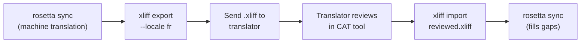

# Trabajar con traductores profesionales

Rosetta genera traducciones automáticas, pero algunos proyectos necesitan revisión humana: contenido regulatorio, textos sensibles para la marca o interfaces de usuario (UI) críticas. El flujo de trabajo de XLIFF le permite exportar traducciones para su revisión profesional e importarlas de vuelta sin problemas.

## ¿Qué es XLIFF?

XLIFF (XML Localization Interchange File Format) es el formato de intercambio estándar de la industria para herramientas de traducción. Todas las herramientas profesionales CAT (Computer-Assisted Translation) lo admiten:

- **memoQ** — importar XLIFF, revisar en contexto, exportar archivo revisado
- **SDL Trados Studio** — soporte nativo para XLIFF
- **Phrase (Memsource)** — cargar trabajos XLIFF para equipos de traductores
- **Smartling** — pipeline de ingesta de XLIFF
- **OmegaT** — herramienta CAT gratuita/de código abierto con soporte para XLIFF

Rosetta genera XLIFF 1.2 (la versión compatible universalmente) en lugar de 2.0+ para obtener la máxima compatibilidad con las herramientas.

## El flujo de trabajo



### Paso 1: Generar traducciones automáticas

Ejecute `sync` primero para obtener una traducción automática base:

```bash
i18n-rosetta sync
```

### Paso 2: Exportar XLIFF

Exporte el par de origen + destino como XLIFF:

```bash
i18n-rosetta xliff export --locale fr
```

Esto genera `.rosetta/xliff/fr.xliff`, que contiene:
- Cada clave de origen con su valor en inglés
- La traducción automática actual (si la hay) como `<target>`
- Las claves sin traducción marcadas como `state="new"`

```xml
<trans-unit id="hero.title" xml:space="preserve">
  <source>Welcome to our platform</source>
  <target state="translated">Bienvenue sur notre plateforme</target>
</trans-unit>
```

### Paso 3: Enviar al traductor

Envíe el archivo `.xliff` a su traductor o cárguelo en su plataforma CAT. El traductor ve el origen y el destino lado a lado, y puede:

- Editar las traducciones automáticas
- Completar las traducciones faltantes
- Marcar problemas de calidad
- Aplicar su propia memoria de traducción y bases terminológicas

### Paso 4: Importar el archivo revisado

Cuando el traductor devuelva el `.xliff` revisado, impórtelo:

```bash
# Preview what will change
i18n-rosetta xliff import .rosetta/xliff/fr.xliff --dry

# Apply changes
i18n-rosetta xliff import .rosetta/xliff/fr.xliff
```

Salida:
```
  ✓ Imported 142 translations for fr
    Updated:    23 (changed from existing)
    Added:      0 (new keys)
    Unchanged:  119
    Written to: locales/fr.json
```

### Paso 5: Completar faltantes

Si se agregaron nuevas claves después de exportar el XLIFF, ejecute `sync` para traducirlas:

```bash
i18n-rosetta sync
```

Rosetta solo traduce las claves que aún faltan; las traducciones revisadas de la importación del XLIFF se conservan.

## Consejos

### Exportar rutas personalizadas

```bash
# Export to a specific directory
i18n-rosetta xliff export --locale ja --out ./for-review/

# Export with a specific filename
i18n-rosetta xliff export --locale de --out ./review/german.xliff
```

### Múltiples locales

Exporte cada locale por separado:

```bash
for locale in fr de ja ko; do
  i18n-rosetta xliff export --locale $locale
done
```

### Control de versiones

Agregue `.rosetta/xliff/` a `.gitignore`; los archivos XLIFF son artefactos transitorios, no código fuente del proyecto:

```gitignore
.rosetta/xliff/
```

### Cuándo usar XLIFF en lugar de solo `sync`

| Escenario | Recomendación |
|----------|---------------|
| Aplicación interna, calidad del 90%+ aceptable | Solo `sync`: la traducción automática es suficiente |
| Textos de marketing dirigidos al usuario | Exportar XLIFF para revisión humana |
| Contenido legal/regulatorio | Exportar XLIFF: se requiere revisión humana |
| Más de 50 locales, plazo ajustado | `sync` primero, exportación XLIFF solo para los 5 locales principales |
| El traductor ya usa una herramienta CAT | XLIFF es el formato de entrega natural |

---

## Ver también

- [Referencia de la CLI — xliff](/docs/reference/cli#xliff) — referencia de comandos
- [Memoria de traducción](/docs/concepts/translation-memory) — almacenamiento en caché de traducciones revisadas
- [Métodos de traducción](/docs/guides/translation-methods) — opciones de traducción automática