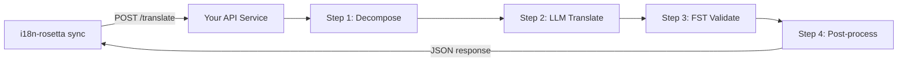

# Servir un método personalizado como una API

El **método `api`** de i18n-rosetta le permite apuntar cualquier par de traducción a un endpoint HTTP externo. Así es como usted integra pipelines que son demasiado complejos para un solo prompt de LLM: analizadores morfológicos, transductores de estados finitos (FSTs), cadenas de LLM de múltiples pasos o cualquier método de investigación personalizado que haya construido.

## ¿Por qué un servicio de API?

Algunos pipelines de traducción no pueden ejecutarse dentro de un simple ciclo de prompt-respuesta:

| Paso del pipeline | Ejemplo |
|---|---|
| **Descomposición morfológica** | Dividir palabras polisintéticas en morfemas antes de la traducción |
| **Validación FST** | Rechazar salidas que violen reglas fonológicas o morfológicas |
| **Cadenas de LLM de múltiples pasos** | Ciclos de generar → verificar → corregir con diferentes modelos |
| **Búsqueda en diccionario** | Consultar un diccionario bilingüe curado a mitad del pipeline |
| **Human-in-the-loop** | Poner en cola traducciones inciertas para la revisión de expertos |

El método `api` trata su pipeline como una caja negra: i18n-rosetta envía las cadenas de origen, su servicio devuelve las traducciones. Lo que sucede adentro depende completamente de usted.

## Arquitectura



## Configuración de su servicio

Su servicio de API debe implementar un único endpoint que acepte y devuelva JSON:

### Formato de solicitud

rosetta envía este cuerpo JSON exacto (consulte [api.js](https://github.com/gamedaysuits/i18n-rosetta/blob/main/lib/methods/api.js)):

```json
POST /translate
Content-Type: application/json
Authorization: Bearer <ROSETTA_API_KEY>

{
  "source_locale": "en",
  "target_locale": "crk",
  "method": "crk-coached-v1",
  "keys": {
    "greeting": "Hello, welcome to our app",
    "farewell": "Goodbye and thanks"
  }
}
```

| Campo | Tipo | Descripción |
|-------|------|-------------|
| `source_locale` | string | Código de idioma de origen BCP 47 |
| `target_locale` | string | Código de idioma de destino BCP 47 |
| `method` | string | Nombre del plugin o `"default"` |
| `keys` | object | Mapa de clave → cadena de origen a traducir |
```

### Response Format

Your service must return a `translations` object. An optional `meta` object can include cost and diagnostic info:

```json
{
  "translations": {
    "greeting": "tânisi, pê-kîwêw ôta",
    "farewell": "ekosi mâka, kinanâskomitin"
  },
  "meta": {
    "model": "my-custom-pipeline/v1",
    "cost_usd": 0.0042,
    "method": "decompose-translate-validate"
  }
}
```

| Field | Type | Required | Description |
|-------|------|----------|-------------|
| `translations` | object | ✅ | Map of key → translated string |
| `meta` | object | — | Optional metadata |
| `meta.cost_usd` | number | — | If present, displayed in rosetta's output |
| `errors` | object | — | For partial success (HTTP 207): map of key → `{ message }` |

### Minimal Express Server

```javascript
import express from 'express';

const app = express();
app.use(express.json());

/**
 * rosetta API contract:
 *
 * Request:  { source_locale, target_locale, method, keys: { "key": "source" } }
 * Response: { translations: { "key": "translated" }, meta: { ... } }
 */
app.post('/translate', async (req, res) => {
  const { source_locale, target_locale, method, keys } = req.body;

  const translations = {};

  for (const [key, source] of Object.entries(keys)) {
    // --- Your pipeline goes here ---
    // Step 1: Morphological decomposition
    const morphemes = await decompose(source, source_locale);

    // Step 2: LLM translation with context
    const draft = await llmTranslate(morphemes, target_locale);

    // Step 3: FST validation
    const validated = await fstValidate(draft, target_locale);

    // Step 4: Post-processing (orthography normalization, etc.)
    translations[key] = await postProcess(validated);
  }

  res.json({
    translations,
    meta: {
      model: 'my-custom-pipeline/v1',
      method: 'decompose-translate-validate',
    },
  });
});

app.listen(3001, () => {
  console.log('Translation API running on http://localhost:3001');
});
```

## Configuring i18n-rosetta

Point a translation pair at your running service in `i18n-rosetta.config.json`:

```json
{
  "inputLocale": "en",
  "pairs": {
    "en:crk": {
      "method": "api",
      "endpoint": "http://localhost:3001/translate",
      "register": "Formal Plains Cree. Use SRO orthography."
    }
  }
}
```

Then run sync as usual:

```bash
npx i18n-rosetta sync
```

i18n-rosetta will POST your source strings to the endpoint and write the returned translations to `crk.json`.

## Case Study: Plains Cree Pipeline

:::info Under Development
The Plains Cree pipeline described below is **under active development** and is not yet running in production. Details here reflect the current design direction and may change as the project evolves.
:::

The **gds-mt-eval-harness** project demonstrates this pattern. Its Plains Cree pipeline uses:

1. **Morphological decomposition** — Break polysynthetic Cree words into translatable morpheme chains
2. **LLM translation** — Context-enriched GPT-4o translation with coaching data (SRO orthography rules, register instructions)
3. **FST validation** — Finite-state transducer checks that outputs conform to Cree phonological rules
4. **Confidence scoring** — Each translation gets a confidence score based on FST pass rate and dictionary coverage

The entire pipeline runs as a single HTTP endpoint that i18n-rosetta calls via the `api` method.

### Running Evaluations

After translating, you can evaluate output quality using the harness directly:

```bash
# Clone the harness
git clone https://github.com/gamedaysuits/gds-mt-eval-harness.git
cd gds-mt-eval-harness
pip install -e .

# Run the evaluation against your method's output
python eval/baseline_experiment.py --dataset data/edtekla-dev-v1.json --submit
```

This produces structured evaluation records with chrF++, BLEU, and exact match scores that can be used as regression baselines.

## Authentication

If your API requires authentication, set the `apiKey` field or use an environment variable:

```json
{
  "pairs": {
    "en:crk": {
      "method": "api",
      "endpoint": "https://my-mt-service.example.com/translate",
      "apiKey": "${CRK_API_KEY}"
    }
  }
}
```

## Data Sovereignty & OCAP Principles

The `api` method is particularly important for **Indigenous language communities**. By self-hosting the translation pipeline, a community keeps full control over:

- **Proprietary coaching data** — register instructions, orthography rules, and domain glossaries never leave community infrastructure.
- **Linguistic resources** — curated dictionaries, FST grammars, and elder-verified translations remain under community ownership.
- **Access policies** — the community decides who can call the endpoint and under what terms.

This aligns with [OCAP® principles](https://mtevalarena.org/docs/community/low-resource-languages#ocap-principles) (Ownership, Control, Access, Possession), ensuring that sensitive language data is governed by the community rather than a third-party platform.

:::tip
Combine the `api` method with a private deployment (e.g., a community-hosted VM or on-prem server) for the strongest data-sovereignty posture. See [Support a Low-Resource Language](https://mtevalarena.org/docs/community/low-resource-languages) for a full walkthrough.
:::

## Cost Estimation

The `api` method returns `null` for cost estimation by default — your service controls pricing. If you want to provide cost transparency, have your API return a `cost` field in the metadata:

```json
{
  "translations": { "...": "..." },
  "metadata": {
    "cost": {
      "estimatedCost": 0.0042,
      "currency": "USD",
      "source": "my-service-pricing"
    }
  }
}
```

## Mejores prácticas

1. **Devuelva cadenas vacías en caso de fallas**: no devuelva la cadena de origen como una "traducción". Devuelva `""` y deje que el mecanismo de prefijo de respaldo (fallback) de i18n-rosetta lo maneje.
2. **Incluya puntuaciones de confianza**: si su pipeline puede estimar la calidad, devuélvala en los metadatos. Esto ayuda con la auditoría de calidad.
3. **Implemente comprobaciones de estado (health checks)**: agregue un endpoint `GET /health` para que i18n-rosetta pueda verificar la conectividad antes de iniciar una sincronización grande.
4. **Maneje los límites de tasa (rate limit) con elegancia**: si su pipeline tiene límites de rendimiento, devuelva códigos de estado `429`. El sistema por lotes (batch) de i18n-rosetta reducirá la velocidad (back off).
5. **Registre todo (log)**: los pipelines de múltiples pasos pueden fallar silenciosamente. Registre la entrada/salida de cada paso para la depuración.

## Licencias

El patrón del método `api` es completamente abierto: no hay restricciones de licencia para envolver su propio pipeline de traducción como un servicio HTTP. El `gds-mt-eval-harness` está disponible bajo la licencia MIT para implementaciones de referencia.

## Consulte también

- [Métodos de traducción](/docs/guides/translation-methods): descripción general de cada método integrado (`openai`, `google`, `api`, etc.)
- [Especificación de plugins](/docs/reference/plugin-spec): esquema completo para `i18n-rosetta.config.json`, incluyendo los campos del método `api`
- [Apoyar a un idioma de bajos recursos](https://mtevalarena.org/docs/community/low-resource-languages): guía integral para idiomas con pocos recursos, incluyendo los principios OCAP
- [Arquitectura](/docs/concepts/architecture): cómo funcionan el bucle de sincronización, el procesamiento por lotes y el despacho de métodos de i18n-rosetta
- [Evaluación de MT](https://mtevalarena.org/docs/leaderboard/rules): metodología de evaluación, métricas y el proceso de envío a la tabla de clasificación
- [Tabla de clasificación de métodos](/leaderboard): clasificaciones de calidad en vivo en todos los métodos y pares de idiomas