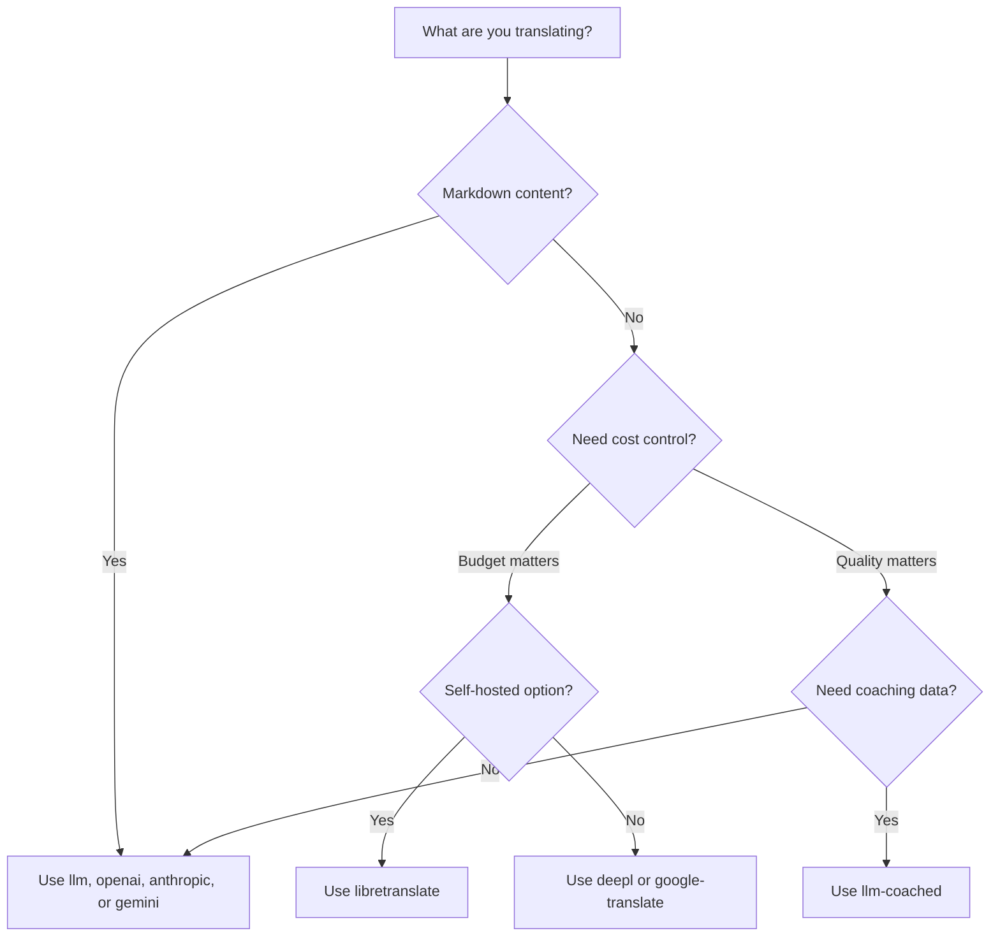

# Métodos de traducción

Rosetta es compatible con diez métodos de traducción. Cada par de idiomas puede usar un método diferente; usted no está limitado a un solo enfoque para todo su proyecto.

## Comparación de métodos

### Proveedores de LLM

Enfocados en la calidad, compatibles con Markdown y con el entrenamiento (coaching). Ideales para proyectos con mucho contenido.

| Método | Clave | Qué hace |
|--------|-----|-------------|
| `llm` (predeterminado) | `OPENROUTER_API_KEY` | LLM a través de OpenRouter: más de 200 modelos, enrutamiento automático |
| `llm-coached` | `OPENROUTER_API_KEY` | LLM + reglas gramaticales, diccionarios, notas de estilo |
| `openai` | `OPENAI_API_KEY` | API directa de OpenAI (gpt-4o, gpt-4o-mini) |
| `anthropic` | `ANTHROPIC_API_KEY` | API directa de Anthropic (Claude Sonnet, Haiku, Opus) |
| `gemini` | `GEMINI_API_KEY` | API directa de Google Gemini (Flash, Pro): nivel gratuito |

### Traducción automática (MT) tradicional

Enfocados en la velocidad y el costo. Ideales para grandes volúmenes de pares clave-valor.

| Método | Clave | Qué hace |
|--------|-----|-------------|
| `google-translate` | `GOOGLE_TRANSLATE_API_KEY` | Google Cloud Translation API v2 (más de 130 idiomas) |
| `deepl` | `DEEPL_API_KEY` | API de DeepL con soporte para glosarios (más de 30 idiomas) |
| `microsoft-translator` | `MICROSOFT_TRANSLATOR_API_KEY` | Azure Cognitive Services Translator (más de 100 idiomas) |
| `libretranslate` | *(autohospedado)* | LibreTranslate autohospedado (AGPL, gratuito) |

### Infraestructura

| Método | Clave | Qué hace |
|--------|-----|-------------|
| `api` | *(por proveedor)* | Cliente HTTP ligero para cualquier endpoint de traducción REST |

## Árbol de decisiones



---

## `llm` — Traducción por LLM (Predeterminado)

Traduce a través de cualquier LLM en [OpenRouter](https://openrouter.ai). Este es el método predeterminado y el más versátil.

**Cómo funciona:**
1. Agrupa las claves en lotes (80 por lote de forma predeterminada) con instrucciones de registro y contexto
2. Las envía a OpenRouter como un prompt estructurado
3. Analiza la respuesta en JSON
4. Valida cada traducción a través del [control de calidad](/docs/concepts/quality-gate)
5. Escribe las traducciones aprobadas, reintenta o rechaza las fallidas

**Cuándo usarlo:** En la mayoría de los proyectos. Especialmente en sitios con mucho contenido en Markdown, donde los bloques de código y los shortcodes necesitan ser protegidos.

**Configuración:**

```json
{
  "defaultMethod": "llm",
  "model": "google/gemini-3.5-flash"
}
```

## `llm-coached` — Traducción por LLM con entrenamiento (Coached)

Igual que `llm`, pero con reglas gramaticales, diccionarios de términos y notas de estilo inyectadas en cada prompt.

**Cómo funciona:**
1. Carga los datos de entrenamiento (coaching) desde `.rosetta/coaching/<locale>.json` o desde el directorio `coaching/` de un plugin
2. Inyecta reglas gramaticales, términos de diccionario y notas de estilo en el prompt del sistema
3. Los términos del diccionario que coinciden con las claves de origen se incluyen como terminología requerida
4. La traducción procede igual que con `llm`, pero los datos de entrenamiento añaden precisión

**Cuándo usarlo:** Idiomas de bajos recursos, terminología de dominios específicos (legal, médico), registros formales, o cualquier caso donde la salida genérica del LLM no sea lo suficientemente precisa.

**Formato de los datos de entrenamiento:**

```json title=".rosetta/coaching/fr.json"
{
  "grammar_rules": [
    "French adjectives agree in gender and number with the noun they modify",
    "Use 'vous' for formal contexts, 'tu' for informal"
  ],
  "dictionary": {
    "dashboard": "tableau de bord",
    "deployment": "déploiement",
    "settings": "paramètres"
  },
  "style_notes": "Prefer active voice. Avoid anglicisms where a native French term exists."
}
```

Consulte también: [Guía de idiomas de bajos recursos](https://mtevalarena.org/docs/community/low-resource-languages)

---

## `openai` — API directa de OpenAI

Traduce directamente a través de la API Chat Completions de OpenAI. Sin intermediarios de OpenRouter: su clave, su cuenta, su panel de uso.

**Modelos:** `gpt-4o` (predeterminado), `gpt-4o-mini`

**Características:**
- ✅ Compatible con Markdown (traducción de contenido)
- ✅ Soporte para entrenamiento (reglas gramaticales, anulaciones de diccionario, notas de estilo)
- ✅ Modo JSON para salida estructurada de clave-valor
- ✅ Retroceso exponencial (exponential backoff) con reintentos

**Configuración:**

```json
{
  "pairs": {
    "en:fr": { "method": "openai", "model": "gpt-4o-mini" }
  }
}
```

```bash
export OPENAI_API_KEY=sk-proj-...
```

Obtenga su clave en [platform.openai.com/api-keys](https://platform.openai.com/api-keys).

## `anthropic` — API directa de Anthropic

Traduce directamente a través de la API Messages de Anthropic. Utiliza el parámetro `system` para los datos de entrenamiento, lo que habilita el almacenamiento en caché de prompts de Anthropic.

**Modelos:** `claude-sonnet-4-6` (predeterminado), `claude-haiku-4-5`, `claude-opus-4-7`

**Características:**
- ✅ Compatible con Markdown (traducción de contenido)
- ✅ Soporte para entrenamiento (reglas gramaticales, anulaciones de diccionario, notas de estilo)
- ✅ Almacenamiento en caché del prompt del sistema (amortiza el costo del entrenamiento entre lotes)
- ✅ Retroceso exponencial con reintentos

**Configuración:**

```json
{
  "pairs": {
    "en:ja": { "method": "anthropic", "model": "claude-haiku-4-5" }
  }
}
```

```bash
export ANTHROPIC_API_KEY=sk-ant-...
```

Obtenga su clave en [console.anthropic.com](https://console.anthropic.com/settings/keys).

## `gemini` — API directa de Google Gemini

Traduce directamente a través de la API `generateContent` de Google Gemini. **Nivel gratuito disponible**: el mejor punto de partida sin costo.

**Modelos:** `gemini-2.5-flash` (predeterminado), `gemini-2.5-pro`

**Características:**
- ✅ Compatible con Markdown (traducción de contenido)
- ✅ Soporte para entrenamiento (reglas gramaticales, anulaciones de diccionario, notas de estilo)
- ✅ Modo de respuesta JSON a través de `responseMimeType`
- ✅ Nivel gratuito (cuota diaria generosa)
- ✅ Retroceso exponencial con reintentos

**Configuración:**

```json
{
  "pairs": {
    "en:ko": { "method": "gemini", "model": "gemini-2.5-pro" }
  }
}
```

```bash
export GEMINI_API_KEY=AI...
```

Obtenga su clave en [aistudio.google.com/apikey](https://aistudio.google.com/apikey).

### Validación de modelos

Los proveedores directos de LLM (`openai`, `anthropic`, `gemini`) validan su cadena de modelo en el primer uso. Esto detecta tres categorías de errores:

**Formato de método incorrecto**: usar una ruta de modelo al estilo de OpenRouter con un proveedor directo:

```
[WARN] OpenAI: model "google/gemini-3.5-flash" looks like an OpenRouter path.
       Direct providers use bare model names (e.g., "gpt-4o").
       To use OpenRouter models, set method to 'llm' instead.
```

**Proveedor incorrecto**: usar un modelo de un proveedor completamente diferente:

```
[WARN] Gemini: model "claude-sonnet-4-6" is an Anthropic model.
       This provider (gemini) cannot serve Anthropic models.
       Use --method anthropic or set "method": "anthropic" in config.
```

**Modelo obsoleto o mal escrito**: en la primera llamada a la API, rosetta obtiene la lista de modelos en vivo del proveedor y verifica su modelo con ella:

```
[WARN] Gemini: model "gemini-1.5-flash" not found in available models.
       Similar models: gemini-2.0-flash, gemini-2.5-flash, gemini-2.5-pro
       The API call will proceed — the provider will give the final verdict.
```

:::note Estas son advertencias, no errores
La validación de modelos registra advertencias pero no bloquea la llamada a la API. La API del proveedor da el veredicto final: un nombre de modelo futuro podría coincidir con un patrón diferente, y no queremos restringir basándonos en heurísticas.
:::

---

## `google-translate` — Google Cloud Translation API

Integración directa con Google Cloud Translation API v2. Utiliza la API REST: sin SDK, sin cuenta de servicio. Solo la clave de API.

**Cuándo usarlo:** Pares de cadenas clave-valor de alto volumen donde la velocidad y el costo importan más que los matices. Soporta más de 130 idiomas de forma nativa.

**Limitaciones:**
- ⚠️ **No es compatible con Markdown.** Corromperá los bloques de código, los shortcodes y las variables de interpolación.
- Sin control de registro/tono
- Sin entrenamiento ni aplicación de terminología

```bash
npx i18n-rosetta sync --method google-translate
```

:::tip Detección automática
Si solo se configura `GOOGLE_TRANSLATE_API_KEY` (sin clave de OpenRouter), rosetta cambia automáticamente a Google Translate. No se necesita ningún cambio de configuración.
:::

## `deepl` — API de DeepL

Integración directa con la API de traducción de DeepL. Soporta glosarios para una terminología consistente.

**Cuándo usarlo:** Idiomas europeos donde DeepL destaca (alemán, francés, español, holandés, polaco, etc.). El soporte para glosarios aplica una terminología consistente sin necesidad de datos de entrenamiento.

**Características:**
- ✅ Detección automática del endpoint gratuito/pro (sufijo `:fx` en claves gratuitas)
- ✅ Creación y gestión de glosarios
- ✅ Control del nivel de formalidad
- ⚠️ **No es compatible con Markdown**: solo pares clave-valor

**Configuración:**

```json
{
  "pairs": {
    "en:de": { "method": "deepl" }
  }
}
```

```bash
export DEEPL_API_KEY=your-key-here
```

Obtenga su clave en [deepl.com/pro-api](https://www.deepl.com/pro-api).

## `microsoft-translator` — Azure Cognitive Services

Integración directa con Microsoft Translator Text API v3.

**Cuándo usarlo:** Entornos empresariales con infraestructura de Azure existente. Soporta más de 100 idiomas, incluyendo muchos que Google Translate no cubre.

**Características:**
- ✅ Hasta 100 segmentos por solicitud (alto rendimiento)
- ✅ Parámetro de región opcional para optimización de latencia
- ⚠️ **No es compatible con Markdown**: solo pares clave-valor
- ⚠️ **Sin traducción de contenido**: solo pares clave-valor

**Configuración:**

```json
{
  "pairs": {
    "en:ar": { "method": "microsoft-translator" }
  }
}
```

```bash
export MICROSOFT_TRANSLATOR_API_KEY=your-key
export MICROSOFT_TRANSLATOR_REGION=global  # optional
```

Obtenga su clave desde el [Portal de Azure](https://portal.azure.com) → Cognitive Services → Translator.

## `libretranslate` — Traducción autohospedada

Traducción de código abierto autohospedada utilizando LibreTranslate. Se ejecuta localmente o en su propia infraestructura: cero costos de API, soberanía total de los datos.

**Cuándo usarlo:** Proyectos que requieren traducción sin conexión, cumplimiento de privacidad de datos (GDPR) u operación sin costo. Especialmente útil para pipelines de CI que no deberían depender de API externas.

**Características:**
- ✅ Autohospedado: sin llamadas a API externas
- ✅ Gratuito y de código abierto (AGPL-3.0)
- ✅ Implementación en Docker disponible
- ⚠️ **No es compatible con Markdown**: solo pares clave-valor
- ⚠️ **Sin traducción de contenido**: solo pares clave-valor
- ⚠️ La calidad varía según el par de idiomas

**Configuración:**

```bash
# Run LibreTranslate locally with Docker
docker run -d -p 5000:5000 libretranslate/libretranslate

# Configure (optional — defaults to localhost:5000)
export LIBRETRANSLATE_API_URL=http://localhost:5000/translate
```

```json
{
  "pairs": {
    "en:es": { "method": "libretranslate" }
  }
}
```

---

## `api` — API de traducción remota

Un cliente HTTP ligero para endpoints de traducción alojados por la comunidad o protegidos por propiedad intelectual (IP). Rosetta envía las claves y recibe las traducciones: no contiene ninguna lógica de traducción.

**Cuándo usarlo:** Cuando los métodos de traducción están alojados del lado del servidor (por ejemplo, datos de entrenamiento patentados, modelos ajustados, pipelines FST que no se pueden distribuir).

```json
{
  "pairs": {
    "en:crk": {
      "method": "api",
      "endpoint": "https://api.example.com/v1/translate",
      "apiKey": "your-key"
    }
  }
}
```

:::note Traducción comunitaria compatible con OCAP
El método `api` es el puente hacia la **traducción alojada por la comunidad compatible con OCAP**. Las comunidades indígenas y de idiomas minoritarios pueden alojar sus propios endpoints de traducción (manteniendo los datos de entrenamiento, los modelos ajustados y la propiedad intelectual lingüística bajo el control de la comunidad), mientras que Rosetta se conecta a ellos como un cliente ligero.

Consulte [Apoyar un idioma de bajos recursos](https://mtevalarena.org/docs/community/low-resource-languages) para ver el tutorial completo de alojamiento comunitario, y [Servir un método a través de API](/docs/guides/serving-a-method) para conocer los requisitos del endpoint.
:::

---

## Configuración por par de idiomas

El verdadero poder radica en mezclar métodos por par de idiomas:

```json title="i18n-rosetta.config.json"
{
  "version": 3,
  "pairs": {
    "en:fr": { "method": "deepl" },
    "en:ja": { "method": "openai", "model": "gpt-4o" },
    "en:ko": { "method": "gemini" },
    "en:ar": { "method": "microsoft-translator" },
    "en:crk": { "methodPlugin": "crk-coached-v1" }
  }
}
```

Esto traduce el francés a través de DeepL (soporte de glosario), el japonés a través de OpenAI (calidad), el coreano a través de Gemini (nivel gratuito), el árabe a través de Microsoft Translator (cobertura) y el cree de las llanuras a través de un plugin con entrenamiento (especializado).

## Plugins

Los plugins son recetas de traducción preempaquetadas para pares de idiomas específicos. Son manifiestos JSON (no código) que le indican a rosetta qué método usar, con qué configuraciones y qué calidad se ha evaluado.

:::tip Del entorno de evaluación a producción en un solo comando
Los plugins desarrollados y probados en el [entorno de evaluación (eval harness)](https://mtevalarena.org/docs/specifications/harness) se pueden instalar directamente: el método que usted valide allí se implementa aquí con un solo comando `plugin install`. Consulte [Evaluación de MT](https://mtevalarena.org/docs/leaderboard/rules) para ver el flujo de trabajo de evaluación completo.
:::

```bash
i18n-rosetta plugin install ./french-formal-v1/
i18n-rosetta plugin list
i18n-rosetta plugin remove french-formal-v1
```

Consulte la [Especificación de plugins](/docs/reference/plugin-spec) para ver el formato completo del manifiesto.

---

## Cambio de proveedores

¿Se está moviendo entre métodos? El formato del modelo y la variable de entorno cambian; aquí tiene el mapa:

### OpenRouter → Proveedor directo

```diff title="i18n-rosetta.config.json"
 {
   "pairs": {
     "en:fr": {
-      "method": "llm",
-      "model": "openai/gpt-4o"
+      "method": "openai",
+      "model": "gpt-4o"
     }
   }
 }
```

```diff title="Environment variables"
- export OPENROUTER_API_KEY=sk-or-v1-...
+ export OPENAI_API_KEY=sk-proj-...
```

**Diferencias clave:**
- OpenRouter usa el formato `provider/model` (por ejemplo, `openai/gpt-4o`). Los proveedores directos usan nombres de modelos simples (por ejemplo, `gpt-4o`).
- Cada proveedor directo tiene su propia variable de entorno (`OPENAI_API_KEY`, `ANTHROPIC_API_KEY`, `GEMINI_API_KEY`).
- Si usted usa el formato de modelo incorrecto, rosetta le advertirá; consulte [Validación de modelos](#model-validation).

### Proveedor directo → OpenRouter

```diff title="i18n-rosetta.config.json"
 {
   "pairs": {
     "en:ja": {
-      "method": "anthropic",
-      "model": "claude-sonnet-4-6"
+      "method": "llm",
+      "model": "anthropic/claude-sonnet-4-6"
     }
   }
 }
```

:::tip Cuándo usar OpenRouter vs. Proveedor directo
**Use OpenRouter** cuando desee cambiar entre modelos sin modificar las variables de entorno, o cuando desee acceder a más de 200 modelos con una sola clave. **Use proveedores directos** cuando desee una facturación más simple, menor latencia (sin intermediarios) o acceso a características específicas del proveedor, como el almacenamiento en caché de prompts de Anthropic.
:::

---

## Comparación de costos

Costo aproximado por cada 1000 claves traducidas (asume ~10 tokens por clave, 80 claves por lote):

| Método | Costo / 1K claves | Velocidad | Calidad | Ideal para |
|--------|----------------|-------|---------|----------|
| `gemini` (Flash) | **Gratis** (dentro del nivel) | Rápida | Buena | Primeros pasos, proyectos personales |
| `google-translate` | ~$0.02 | Muy rápida | Adecuada | Alto volumen, idiomas europeos |
| `deepl` | ~$0.02 | Rápida | Buena | Idiomas europeos, terminología |
| `microsoft-translator` | ~$0.01 | Rápida | Adecuada | Entornos Azure, amplia cobertura de idiomas |
| `libretranslate` | **Gratis** (autohospedado) | Variable | Aceptable | Entornos aislados (air-gapped), GDPR, pipelines de CI |
| `gemini` (Pro) | ~$0.07 | Media | Muy buena | Sensible a la calidad, cuota gratuita |
| `openai` (GPT-4o-mini) | ~$0.01 | Rápida | Buena | LLM económico |
| `openai` (GPT-4o) | ~$0.10 | Media | Muy buena | Sensible a la calidad |
| `anthropic` (Haiku) | ~$0.01 | Rápida | Buena | LLM económico |
| `anthropic` (Sonnet) | ~$0.10 | Media | Muy buena | Sensible a la calidad |
| `anthropic` (Opus) | ~$0.50 | Lenta | Excelente | Máxima calidad |
| `llm` (OpenRouter) | Varía según el modelo | Variable | Variable | Comparación de modelos, experimentación |

:::note Estas son estimaciones
Los costos reales dependen de la longitud de su texto de origen, el tamaño del lote y los cambios de precios del proveedor. Consulte la página de precios actual de cada proveedor para conocer las tarifas exactas.
:::

---

## Consulte también

- [Idiomas compatibles](/docs/reference/supported-languages)
- [Datos de entrenamiento (Coaching)](/docs/concepts/coaching-data)
- [Apoyar un idioma de bajos recursos](https://mtevalarena.org/docs/community/low-resource-languages)
- [Especificación de plugins](/docs/reference/plugin-spec)
- [Servir un método a través de API](/docs/guides/serving-a-method)
- [Control de calidad](/docs/concepts/quality-gate)
- [Arquitectura](/docs/concepts/architecture)
- [Solución de problemas](/docs/guides/troubleshooting): errores de modelo, problemas de API